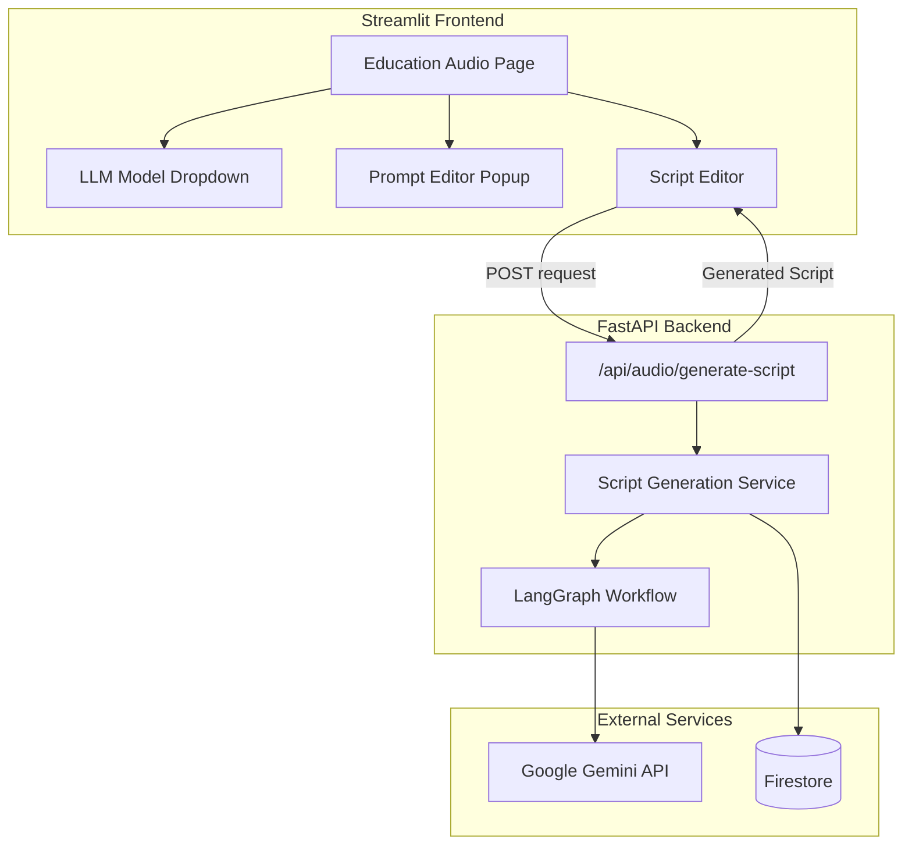

# Design Document: AI Script Generation

## Overview

This design implements AI-powered script generation for the Education Audio page using LangGraph and Google Gemini models. The system enables doctors to generate voice-optimized patient education scripts from knowledge documents, with customizable prompts and model selection.

The architecture follows the existing ElevenDops patterns: Streamlit handles UI only, while the backend manages all LLM interactions through a new LangGraph-based service.

## Architecture



## Components and Interfaces

### Frontend Components

#### LLM_Selector Component
Location: `streamlit_app/pages/3_Education_Audio.py`

```python
def render_llm_selector() -> str:
    """Render LLM model selection dropdown.
    
    Returns:
        str: Selected model name (e.g., "gemini-2.5-flash")
    """
    pass
```

Session state keys:
- `selected_llm_model`: Currently selected Gemini model name

Model options:
- `gemini-2.5-pro` - Gemini 2.5 Pro (highest quality, slower)
- `gemini-2.5-flash` - Gemini 2.5 Flash (balanced, default)
- `gemini-2.0-flash` - Gemini 2.0 Flash (fastest)

#### Prompt_Editor Component
Location: `streamlit_app/pages/3_Education_Audio.py`

```python
def render_prompt_editor() -> str:
    """Render prompt editor popup with edit and reset functionality.
    
    Returns:
        str: Current prompt text (default or customized)
    """
    pass
```

Session state keys:
- `custom_prompt`: User's customized prompt (None if using default)
- `show_prompt_editor`: Boolean to control popup visibility

### Backend Components

#### Script Generation API Endpoint
Location: `backend/api/routes/audio.py`

```python
@router.post("/generate-script")
async def generate_script_with_ai(
    request: ScriptGenerationRequest
) -> ScriptGenerationResponse:
    """Generate script using LangGraph and Gemini.
    
    Args:
        request: Contains knowledge_id, model_name, custom_prompt
        
    Returns:
        ScriptGenerationResponse with generated script and metadata
    """
    pass
```

#### Script Generation Service
Location: `backend/services/script_generation_service.py`

```python
class ScriptGenerationService:
    """Service for AI-powered script generation using LangGraph."""
    
    async def generate_script(
        self,
        knowledge_content: str,
        model_name: str,
        prompt: str
    ) -> ScriptGenerationResult:
        """Generate voice-optimized script using LangGraph workflow.
        
        Args:
            knowledge_content: Raw content from knowledge document
            model_name: Gemini model to use
            prompt: System prompt for generation
            
        Returns:
            ScriptGenerationResult with script and metadata
        """
        pass
```

#### LangGraph Workflow
Location: `backend/services/langgraph_workflow.py`

```python
def create_script_generation_graph() -> StateGraph:
    """Create LangGraph workflow for script generation.
    
    Workflow nodes:
    1. prepare_context - Format knowledge content for LLM
    2. generate_script - Call Gemini to generate script
    3. post_process - Add pacing markers and format output
    
    Returns:
        Compiled StateGraph
    """
    pass
```

## Data Models

### Request/Response Schemas
Location: `backend/models/schemas.py`

```python
class ScriptGenerationRequest(BaseModel):
    """Request for AI script generation."""
    knowledge_id: str
    model_name: str = "gemini-2.5-flash"
    custom_prompt: Optional[str] = None

class ScriptGenerationResponse(BaseModel):
    """Response from AI script generation."""
    script: str
    model_used: str
    generated_at: datetime
    knowledge_id: str
```

### LangGraph State
Location: `backend/services/langgraph_workflow.py`

```python
class ScriptGenerationState(TypedDict):
    """State for LangGraph script generation workflow."""
    knowledge_content: str
    prompt: str
    model_name: str
    generated_script: str
    error: Optional[str]
```

### Configuration
Location: `backend/config.py`

```python
# Gemini model configurations
GEMINI_MODELS = {
    "gemini-2.5-pro": "gemini-2.5-pro-preview-06-05",
    "gemini-2.5-flash": "gemini-2.5-flash-preview-05-20", 
    "gemini-2.0-flash": "gemini-2.0-flash"
}

DEFAULT_SCRIPT_PROMPT: str  # Loaded from config file
```

## Default Prompt Configuration

The default prompt is stored in `backend/config/default_script_prompt.txt` and follows ElevenLabs voice optimization best practices:

```text
# Role
You are a medical education script writer specializing in creating voice-optimized content for text-to-speech systems.

# Goal
Generate a patient education script from the provided medical knowledge document. The script should be natural, clear, and optimized for ElevenLabs voice synthesis.

# Guidelines

## Voice Optimization
- Write in a conversational, warm tone suitable for spoken delivery
- Use short, clear sentences (under 20 words when possible)
- Include natural pauses using punctuation (commas, periods)
- Avoid complex medical jargon; use patient-friendly language
- Spell out abbreviations on first use

## Structure
- Start with a friendly greeting and topic introduction
- Organize content into logical sections
- Use transitional phrases between topics
- End with a supportive closing message

## Pacing
- Add "..." for longer pauses between sections
- Use commas for natural breathing points
- Keep paragraphs short (2-3 sentences)

## Language
- Support Traditional Chinese (繁體中文) when the source document is in Chinese
- Maintain consistent language throughout the script
- Use culturally appropriate expressions

# Output Format
Generate only the script content, ready for voice synthesis. Do not include section headers or formatting markers.
```

## Correctness Properties

*A property is a characteristic or behavior that should hold true across all valid executions of a system—essentially, a formal statement about what the system should do. Properties serve as the bridge between human-readable specifications and machine-verifiable correctness guarantees.*

### Property 1: Configuration Persistence
*For any* user configuration change (model selection or custom prompt), the setting should persist in session state and be retrievable after simulated page interactions.

**Validates: Requirements 1.3, 2.5**

### Property 2: Configuration Passthrough
*For any* script generation request with a selected model and custom prompt, both values should be passed to the LangGraph workflow unchanged.

**Validates: Requirements 1.2, 2.4, 3.1, 3.2, 4.3**

### Property 3: Successful Response Format
*For any* successful script generation, the response should include a non-empty script string, the model name used, and a valid timestamp.

**Validates: Requirements 3.3, 4.4**

### Property 4: Error Propagation
*For any* LangGraph workflow failure, the service should return an error response with appropriate HTTP status code and error details.

**Validates: Requirements 3.4, 4.6**

### Property 5: Prompt Reset Round-Trip
*For any* customized prompt state, invoking the reset action should restore the prompt to exactly match the default prompt.

**Validates: Requirements 2.3**

### Property 6: Document Validation
*For any* script generation request with a non-existent knowledge_id, the backend should return a 404 error before attempting LLM invocation.

**Validates: Requirements 4.2, 4.5**

## Error Handling

### Frontend Error Handling
- Display user-friendly error messages in Traditional Chinese
- Show loading spinner during generation
- Disable generate button while request is in progress
- Handle network timeouts gracefully

### Backend Error Handling

| Error Condition | HTTP Status | Response |
|----------------|-------------|----------|
| Knowledge document not found | 404 | `{"detail": "Knowledge document not found"}` |
| Invalid model name | 400 | `{"detail": "Invalid model name"}` |
| Gemini API failure | 502 | `{"detail": "Script generation failed", "error": "..."}` |
| Gemini rate limit | 429 | `{"detail": "Rate limit exceeded, please retry"}` |
| Internal error | 500 | `{"detail": "Internal server error"}` |

### LangGraph Error Recovery
- Retry Gemini API calls up to 2 times on transient failures
- Log all errors with request context for debugging
- Return partial results if post-processing fails

## Testing Strategy

### Unit Tests
- Test LLM_Selector renders correct model options
- Test Prompt_Editor popup open/close behavior
- Test default prompt content contains required elements
- Test API endpoint parameter validation
- Test error response formatting

### Property-Based Tests
Using Hypothesis for Python property-based testing:

1. **Configuration Persistence Property**: Generate random model selections and custom prompts, verify session state persistence
2. **Configuration Passthrough Property**: Generate random configurations, verify they reach the LangGraph workflow
3. **Response Format Property**: Generate successful responses, verify all required fields present
4. **Error Propagation Property**: Simulate various failures, verify appropriate error responses
5. **Prompt Reset Property**: Generate random custom prompts, verify reset restores default
6. **Document Validation Property**: Generate random knowledge_ids, verify 404 for non-existent

### Integration Tests
- End-to-end script generation with mock Gemini responses
- Frontend-backend communication flow
- Session state persistence across page reloads

### Test Configuration
- Minimum 100 iterations per property test
- Tag format: `**Feature: ai-script-generation, Property {N}: {description}**`
- Use `pytest-asyncio` for async test support
