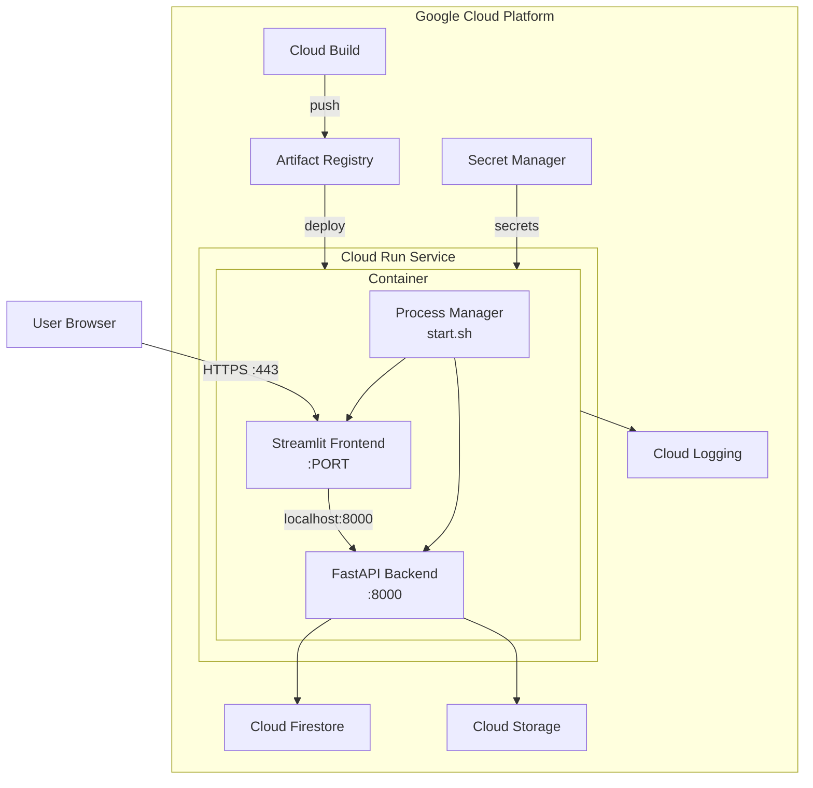

# Design Document: Cloud Run Deployment

## Overview

This design describes the deployment architecture for ElevenDops on Google Cloud Run using a single-container approach. Both the FastAPI backend and Streamlit frontend run within the same container, managed by a process supervisor script. This simplifies deployment while maintaining the existing application architecture.

## Architecture



### Request Flow

1. User accesses the application via Cloud Run's HTTPS URL
2. Cloud Run routes traffic to the container's PORT (Streamlit)
3. Streamlit serves the UI and makes API calls to localhost:8000
4. FastAPI processes requests, interacting with Firestore/GCS
5. Responses flow back through the same path

## Components and Interfaces

### 1. Process Manager (start.sh)

A shell script that manages both processes within the container.

```bash
#!/bin/bash
set -e

# Start FastAPI backend in background
uvicorn backend.main:app --host 0.0.0.0 --port 8000 &
BACKEND_PID=$!

# Wait for backend to be ready
echo "Waiting for backend to start..."
for i in {1..30}; do
    if curl -s http://localhost:8000/api/health > /dev/null 2>&1; then
        echo "Backend is ready"
        break
    fi
    sleep 1
done

# Start Streamlit on Cloud Run's PORT
streamlit run streamlit_app/app.py \
    --server.port=${PORT:-8501} \
    --server.address=0.0.0.0 \
    --server.headless=true \
    --browser.gatherUsageStats=false &
FRONTEND_PID=$!

# Trap SIGTERM for graceful shutdown
trap 'kill $BACKEND_PID $FRONTEND_PID 2>/dev/null; exit 0' SIGTERM SIGINT

# Monitor processes
while true; do
    if ! kill -0 $BACKEND_PID 2>/dev/null; then
        echo "Backend process died, restarting..."
        uvicorn backend.main:app --host 0.0.0.0 --port 8000 &
        BACKEND_PID=$!
    fi
    if ! kill -0 $FRONTEND_PID 2>/dev/null; then
        echo "Frontend process died, restarting..."
        streamlit run streamlit_app/app.py \
            --server.port=${PORT:-8501} \
            --server.address=0.0.0.0 \
            --server.headless=true \
            --browser.gatherUsageStats=false &
        FRONTEND_PID=$!
    fi
    sleep 5
done
```

### 2. Production Dockerfile

```dockerfile
# ElevenDops Cloud Run Dockerfile
# Single container with both FastAPI and Streamlit

FROM python:3.11-slim AS builder

ENV PYTHONDONTWRITEBYTECODE=1 \
    PYTHONUNBUFFERED=1 \
    PIP_NO_CACHE_DIR=1

RUN pip install poetry==1.7.1

WORKDIR /app
COPY pyproject.toml poetry.lock* ./
RUN poetry config virtualenvs.create false \
    && poetry install --only=main --no-interaction --no-ansi

# Production stage
FROM python:3.11-slim AS production

ENV PYTHONDONTWRITEBYTECODE=1 \
    PYTHONUNBUFFERED=1 \
    APP_ENV=production \
    USE_FIRESTORE_EMULATOR=false \
    USE_GCS_EMULATOR=false \
    USE_MOCK_DATA=false \
    USE_MOCK_STORAGE=false \
    BACKEND_API_URL=http://localhost:8000

# Install curl for health checks
RUN apt-get update && apt-get install -y --no-install-recommends curl \
    && rm -rf /var/lib/apt/lists/*

# Create non-root user
RUN useradd --create-home --shell /bin/bash appuser

WORKDIR /app

# Copy installed packages
COPY --from=builder /usr/local/lib/python3.11/site-packages /usr/local/lib/python3.11/site-packages
COPY --from=builder /usr/local/bin /usr/local/bin

# Copy application code
COPY --chown=appuser:appuser backend/ ./backend/
COPY --chown=appuser:appuser streamlit_app/ ./streamlit_app/
COPY --chown=appuser:appuser scripts/start.sh ./start.sh

RUN chmod +x ./start.sh

USER appuser

# Cloud Run sets PORT dynamically
EXPOSE 8080

# Health check via backend
HEALTHCHECK --interval=30s --timeout=10s --start-period=60s --retries=3 \
    CMD curl -f http://localhost:8000/api/health || exit 1

CMD ["./start.sh"]
```

### 3. Cloud Run Service Configuration

```yaml
# service.yaml
apiVersion: serving.knative.dev/v1
kind: Service
metadata:
  name: elevendops
  labels:
    cloud.googleapis.com/location: asia-east1
spec:
  template:
    metadata:
      annotations:
        autoscaling.knative.dev/minScale: "0"
        autoscaling.knative.dev/maxScale: "10"
        run.googleapis.com/cpu-throttling: "false"
        run.googleapis.com/startup-cpu-boost: "true"
    spec:
      containerConcurrency: 80
      timeoutSeconds: 300
      serviceAccountName: elevendops-sa@PROJECT_ID.iam.gserviceaccount.com
      containers:
        - image: REGION-docker.pkg.dev/PROJECT_ID/elevendops/app:latest
          ports:
            - containerPort: 8080
          resources:
            limits:
              cpu: "2"
              memory: "1Gi"
          env:
            - name: APP_ENV
              value: "production"
            - name: GOOGLE_CLOUD_PROJECT
              value: "PROJECT_ID"
            - name: GCS_BUCKET_NAME
              value: "elevendops-audio"
            - name: CORS_ORIGINS
              value: "https://elevendops-HASH-REGION.a.run.app"
            - name: LANGSMITH_PROJECT
              value: "elevendops-production"
            - name: LANGSMITH_TRACING_ENABLED
              value: "true"
            - name: ELEVENLABS_API_KEY
              valueFrom:
                secretKeyRef:
                  name: elevenlabs-api-key
                  key: latest
            - name: GOOGLE_API_KEY
              valueFrom:
                secretKeyRef:
                  name: google-api-key
                  key: latest
            - name: LANGSMITH_API_KEY
              valueFrom:
                secretKeyRef:
                  name: langsmith-api-key
                  key: latest
          startupProbe:
            httpGet:
              path: /api/health
              port: 8000
            initialDelaySeconds: 10
            periodSeconds: 5
            failureThreshold: 12
          livenessProbe:
            httpGet:
              path: /api/health
              port: 8000
            periodSeconds: 30
            failureThreshold: 3
```

### 4. Cloud Build Configuration

```yaml
# cloudbuild.yaml
steps:
  # Build the container image
  - name: 'gcr.io/cloud-builders/docker'
    args:
      - 'build'
      - '-t'
      - '${_REGION}-docker.pkg.dev/${PROJECT_ID}/elevendops/app:${SHORT_SHA}'
      - '-t'
      - '${_REGION}-docker.pkg.dev/${PROJECT_ID}/elevendops/app:latest'
      - '-f'
      - 'Dockerfile.cloudrun'
      - '.'

  # Push to Artifact Registry
  - name: 'gcr.io/cloud-builders/docker'
    args:
      - 'push'
      - '--all-tags'
      - '${_REGION}-docker.pkg.dev/${PROJECT_ID}/elevendops/app'

  # Deploy to Cloud Run
  - name: 'gcr.io/google.com/cloudsdktool/cloud-sdk'
    entrypoint: gcloud
    args:
      - 'run'
      - 'deploy'
      - 'elevendops'
      - '--image'
      - '${_REGION}-docker.pkg.dev/${PROJECT_ID}/elevendops/app:${SHORT_SHA}'
      - '--region'
      - '${_REGION}'
      - '--platform'
      - 'managed'
      - '--allow-unauthenticated'

substitutions:
  _REGION: asia-east1

options:
  logging: CLOUD_LOGGING_ONLY

images:
  - '${_REGION}-docker.pkg.dev/${PROJECT_ID}/elevendops/app:${SHORT_SHA}'
  - '${_REGION}-docker.pkg.dev/${PROJECT_ID}/elevendops/app:latest'
```

### 5. Service Account and IAM

```yaml
# Required IAM roles for elevendops-sa service account:
roles:
  - roles/datastore.user          # Firestore read/write
  - roles/storage.objectAdmin     # GCS bucket access
  - roles/secretmanager.secretAccessor  # Secret Manager access
  - roles/logging.logWriter       # Cloud Logging
```

## Data Models

### Environment Variables (Production)

| Variable | Description | Source |
|----------|-------------|--------|
| `PORT` | Cloud Run assigned port | Cloud Run |
| `APP_ENV` | Set to "production" | service.yaml |
| `GOOGLE_CLOUD_PROJECT` | GCP project ID | service.yaml |
| `GCS_BUCKET_NAME` | Storage bucket name | service.yaml |
| `CORS_ORIGINS` | Allowed CORS origins | service.yaml |
| `ELEVENLABS_API_KEY` | ElevenLabs API key | Secret Manager |
| `GOOGLE_API_KEY` | Google AI API key | Secret Manager |
| `LANGSMITH_API_KEY` | LangSmith API key | Secret Manager |
| `USE_FIRESTORE_EMULATOR` | Set to "false" | Dockerfile |
| `USE_GCS_EMULATOR` | Set to "false" | Dockerfile |
| `BACKEND_API_URL` | Internal backend URL | Dockerfile (localhost:8000) |

### Secret Manager Secrets

| Secret Name | Description |
|-------------|-------------|
| `elevenlabs-api-key` | ElevenLabs API key for voice AI |
| `google-api-key` | Google Gemini API key for LLM |
| `langsmith-api-key` | LangSmith API key for tracing |


## Correctness Properties

*A property is a characteristic or behavior that should hold true across all valid executions of a system—essentially, a formal statement about what the system should do. Properties serve as the bridge between human-readable specifications and machine-verifiable correctness guarantees.*

### Property 1: Production Configuration Disables Emulators

*For any* Settings instance where `app_env` is "production", the `use_firestore_emulator` and `use_gcs_emulator` settings SHALL be `false`.

**Validates: Requirements 2.2, 8.1, 8.2**

### Property 2: Production Configuration Requires Critical API Keys

*For any* Settings instance where `app_env` is "production", calling `validate_critical_config` without `elevenlabs_api_key` or `google_cloud_project` SHALL raise `ConfigurationError`.

**Validates: Requirements 2.3, 3.4**

### Property 3: Production Configuration Uses Localhost for Backend

*For any* production deployment configuration, the `BACKEND_API_URL` environment variable SHALL be set to a localhost URL (http://localhost:8000).

**Validates: Requirements 1.5, 1.7, 2.4**

### Property 4: Health Endpoint Returns Valid Response

*For any* request to `/api/health`, the response SHALL contain `status`, `timestamp`, and `version` fields with valid values.

**Validates: Requirements 4.5**

### Property 5: External API Calls Use HTTPS

*For any* external API URL configured in the application (ElevenLabs, Google AI, LangSmith), the URL scheme SHALL be "https".

**Validates: Requirements 6.3**

### Property 6: Configuration Reads From Environment

*For any* environment variable set in the system, the Settings class SHALL read and apply that value correctly, overriding defaults.

**Validates: Requirements 2.1, 8.5**

## Error Handling

### Container Startup Errors

| Error Condition | Handling |
|-----------------|----------|
| Backend fails to start | Process manager retries up to 3 times, then exits with error |
| Frontend fails to start | Process manager retries up to 3 times, then exits with error |
| Missing required secrets | Backend raises ConfigurationError with clear message |
| Health check fails | Cloud Run marks container unhealthy, triggers restart |

### Runtime Errors

| Error Condition | Handling |
|-----------------|----------|
| Backend process crash | Process manager detects and restarts automatically |
| Frontend process crash | Process manager detects and restarts automatically |
| Firestore connection error | Backend returns 503 with retry-after header |
| ElevenLabs API error | Backend returns appropriate error code with details |

### Graceful Shutdown

1. Cloud Run sends SIGTERM to container
2. Process manager catches signal
3. Process manager sends SIGTERM to both child processes
4. Processes complete in-flight requests (up to 10s)
5. Container exits cleanly

## Testing Strategy

### Unit Tests

Unit tests focus on configuration validation and health endpoint behavior:

1. **Configuration Tests**
   - Verify Settings class reads environment variables correctly
   - Verify production mode requires critical API keys
   - Verify emulator settings are disabled in production
   - Verify CORS origins parsing

2. **Health Endpoint Tests**
   - Verify /api/health returns expected schema
   - Verify response includes version and timestamp

### Property-Based Tests

Property tests use Hypothesis to verify properties across many configurations:

1. **Property 1 Test**: Generate random Settings with app_env="production", verify emulators disabled
2. **Property 2 Test**: Generate production Settings without API keys, verify ConfigurationError raised
3. **Property 4 Test**: Call health endpoint, verify response schema
4. **Property 6 Test**: Set random environment variables, verify Settings reads them

### Integration Tests (Manual)

These tests require actual Cloud Run deployment:

1. **Deployment Test**: Deploy to Cloud Run, verify service starts
2. **Health Check Test**: Verify Cloud Run health probes succeed
3. **End-to-End Test**: Access Streamlit UI, verify backend communication works
4. **Secret Access Test**: Verify secrets are accessible from Secret Manager

### Configuration File Validation

Static validation of deployment files:

1. **Dockerfile Validation**: Verify multi-stage build, non-root user, health check
2. **service.yaml Validation**: Verify resource limits, secret references, probes
3. **cloudbuild.yaml Validation**: Verify build steps, image tags, deployment

## Deployment Checklist

### Prerequisites

- [ ] GCP project created with billing enabled
- [ ] Artifact Registry repository created
- [ ] Cloud Run API enabled
- [ ] Secret Manager API enabled
- [ ] Firestore database created
- [ ] GCS bucket created

### Secret Setup

```bash
# Create secrets in Secret Manager
gcloud secrets create elevenlabs-api-key --replication-policy="automatic"
echo -n "YOUR_ELEVENLABS_KEY" | gcloud secrets versions add elevenlabs-api-key --data-file=-

gcloud secrets create google-api-key --replication-policy="automatic"
echo -n "YOUR_GOOGLE_KEY" | gcloud secrets versions add google-api-key --data-file=-

gcloud secrets create langsmith-api-key --replication-policy="automatic"
echo -n "YOUR_LANGSMITH_KEY" | gcloud secrets versions add langsmith-api-key --data-file=-
```

### Service Account Setup

```bash
# Create service account
gcloud iam service-accounts create elevendops-sa \
    --display-name="ElevenDops Service Account"

# Grant roles
gcloud projects add-iam-policy-binding PROJECT_ID \
    --member="serviceAccount:elevendops-sa@PROJECT_ID.iam.gserviceaccount.com" \
    --role="roles/datastore.user"

gcloud projects add-iam-policy-binding PROJECT_ID \
    --member="serviceAccount:elevendops-sa@PROJECT_ID.iam.gserviceaccount.com" \
    --role="roles/storage.objectAdmin"

gcloud projects add-iam-policy-binding PROJECT_ID \
    --member="serviceAccount:elevendops-sa@PROJECT_ID.iam.gserviceaccount.com" \
    --role="roles/secretmanager.secretAccessor"
```

### Manual Deployment

```bash
# Build and push image
docker build -t asia-east1-docker.pkg.dev/PROJECT_ID/elevendops/app:latest -f Dockerfile.cloudrun .
docker push asia-east1-docker.pkg.dev/PROJECT_ID/elevendops/app:latest

# Deploy to Cloud Run
gcloud run deploy elevendops \
    --image=asia-east1-docker.pkg.dev/PROJECT_ID/elevendops/app:latest \
    --region=asia-east1 \
    --platform=managed \
    --allow-unauthenticated \
    --service-account=elevendops-sa@PROJECT_ID.iam.gserviceaccount.com \
    --set-secrets=ELEVENLABS_API_KEY=elevenlabs-api-key:latest,GOOGLE_API_KEY=google-api-key:latest,LANGSMITH_API_KEY=langsmith-api-key:latest \
    --set-env-vars=APP_ENV=production,GOOGLE_CLOUD_PROJECT=PROJECT_ID,GCS_BUCKET_NAME=elevendops-audio
```
