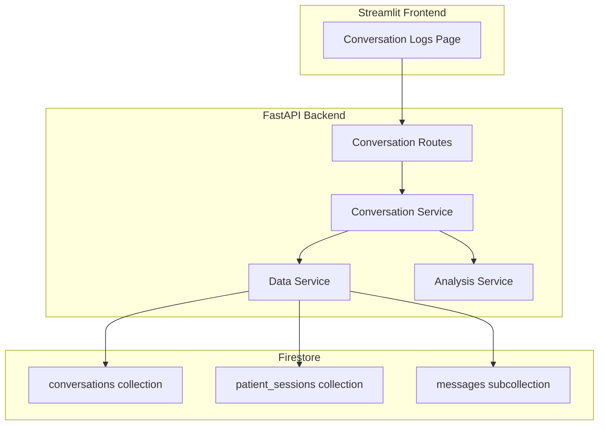

# Design Document: Conversation Logs Integration

## Overview

The Conversation Logs Integration feature connects the existing Conversation Logs page UI to real Firestore data, enabling doctors to view, filter, and analyze actual patient conversations. The system provides comprehensive conversation analytics including question categorization, attention flagging, and detailed transcript review capabilities.

This feature builds upon the existing patient conversation infrastructure and focuses on:
- **Real-time data integration** with Firestore conversation records
- **Conversation analysis** for answered/unanswered question categorization
- **Doctor-focused UI** for efficient conversation review
- **Statistical insights** for patient engagement patterns

## Architecture



### Data Flow

1. **List Conversations**: Frontend → Backend → Firestore (query conversations) → Backend (format response) → Frontend
2. **Filter Conversations**: Frontend (filter criteria) → Backend → Firestore (filtered query) → Backend → Frontend
3. **View Details**: Frontend (conversation_id) → Backend → Firestore (get messages) → Backend (format transcript) → Frontend
4. **Get Statistics**: Frontend → Backend → Firestore (aggregate queries) → Backend (calculate stats) → Frontend

## Components and Interfaces

### 1. Conversation Routes (`backend/api/routes/conversation.py`)

REST API endpoints for conversation log operations.

```python
# Endpoints
GET /api/conversations                    # List all conversations
GET /api/conversations?filter=attention  # Filter conversations
GET /api/conversations/{id}              # Get conversation details
GET /api/conversations/statistics        # Get conversation statistics
```

### 2. Conversation Service (`backend/services/conversation_service.py`)

Core business logic for conversation log management and analysis.

```python
class ConversationService:
    async def get_conversations(filter_type: Optional[str] = None) -> List[ConversationSummary]
    async def get_conversation_details(conversation_id: str) -> ConversationDetail
    async def get_conversation_statistics() -> ConversationStatistics
    async def analyze_conversation(messages: List[ConversationMessage]) -> ConversationAnalysis
```

### 3. Analysis Service (`backend/services/analysis_service.py`)

Handles conversation analysis and question categorization.

```python
class AnalysisService:
    def categorize_questions(messages: List[ConversationMessage]) -> Tuple[List[str], List[str]]
    def extract_main_concerns(messages: List[ConversationMessage]) -> List[str]
    def calculate_requires_attention(unanswered_questions: List[str]) -> bool
    def format_duration(duration_seconds: int) -> str
```

### 4. Data Service Interface (`backend/services/data_service.py`)

Extended interface for conversation log data operations.

```python
class DataServiceInterface:
    # Existing methods...
    
    # New methods for conversation logs
    async def get_all_conversations(filter_attention: Optional[bool] = None) -> List[ConversationRecord]
    async def get_conversation_by_id(conversation_id: str) -> Optional[ConversationRecord]
    async def get_conversation_messages(conversation_id: str) -> List[ConversationMessage]
    async def get_conversation_count() -> int
    async def get_average_duration() -> float
    async def get_attention_percentage() -> float
```

## Data Models

### Conversation Summary (API Response)

```python
class ConversationSummary:
    conversation_id: str      # Unique conversation identifier
    patient_id: str           # Patient identifier
    agent_name: str           # Name of the AI agent used
    duration_formatted: str   # Human-readable duration (e.g., "5m 30s")
    created_at: datetime      # Conversation timestamp
    requires_attention: bool  # True if unanswered questions exist
    question_count: int       # Total number of questions asked
    answered_count: int       # Number of answered questions
```

### Conversation Detail (API Response)

```python
class ConversationDetail:
    conversation_id: str
    patient_id: str
    agent_name: str
    duration_formatted: str
    created_at: datetime
    requires_attention: bool
    main_concerns: List[str]
    answered_questions: List[str]
    unanswered_questions: List[str]
    messages: List[ConversationMessage]
    
class ConversationMessage:
    role: str                 # "patient" or "agent"
    content: str              # Message text
    timestamp: datetime       # Message timestamp
    has_audio: bool          # True if audio_data exists
    audio_data: Optional[str] # Base64 encoded audio (agent only)
```

### Conversation Statistics (API Response)

```python
class ConversationStatistics:
    total_conversations: int
    average_duration_formatted: str  # e.g., "4m 15s"
    attention_percentage: float      # Percentage requiring attention
    total_questions: int
    answered_percentage: float       # Percentage of questions answered
```

### Conversation Analysis (Internal)

```python
class ConversationAnalysis:
    answered_questions: List[str]
    unanswered_questions: List[str]
    main_concerns: List[str]
    requires_attention: bool
    question_count: int
    answered_count: int
```

## Correctness Properties

*A property is a characteristic or behavior that should hold true across all valid executions of a system-essentially, a formal statement about what the system should do. Properties serve as the bridge between human-readable specifications and machine-verifiable correctness guarantees.*
### Property 1: Conversation list ordering
*For any* set of conversation records, when retrieved from the system, they SHALL be ordered by creation date in descending order (newest first).
**Validates: Requirements 1.1**

### Property 2: Conversation record completeness
*For any* conversation record in the response, it SHALL contain all required fields: patient_id, agent_name, duration_formatted, created_at, and requires_attention flag.
**Validates: Requirements 1.2**

### Property 3: Attention filter accuracy
*For any* set of conversations with mixed attention flags, when filtered by "Requires Attention", all returned conversations SHALL have requires_attention set to true.
**Validates: Requirements 2.1**

### Property 4: All conversations filter completeness
*For any* set of conversations, when "All Conversations" filter is applied, the result count SHALL equal the total conversation count regardless of attention status.
**Validates: Requirements 2.2**

### Property 5: Filter ordering preservation
*For any* filtered conversation results, they SHALL maintain descending creation date order regardless of the filter applied.
**Validates: Requirements 2.3**

### Property 6: Message history completeness
*For any* conversation with stored messages, retrieving conversation details SHALL return all messages with matching content, roles, and timestamps.
**Validates: Requirements 3.1**

### Property 7: Message chronological ordering
*For any* conversation details response, messages SHALL be ordered chronologically by timestamp (earliest first).
**Validates: Requirements 3.2**

### Property 8: Audio availability indication
*For any* message with audio_data, the response SHALL indicate audio availability through the has_audio field set to true.
**Validates: Requirements 3.3**

### Property 9: Question categorization accuracy
*For any* conversation containing messages with question marks, a message SHALL be categorized as "answered" if and only if it is immediately followed by an agent response.
**Validates: Requirements 4.1**

### Property 10: Question count accuracy
*For any* conversation analysis, the sum of answered_count and unanswered_count SHALL equal the total number of messages containing question marks.
**Validates: Requirements 4.2**

### Property 11: Main concerns extraction
*For any* conversation with patient messages, the main_concerns list SHALL contain non-empty strings extracted from patient message content.
**Validates: Requirements 4.3**

### Property 12: Statistics calculation accuracy
*For any* set of conversations, the total_conversations count SHALL equal the actual number of conversation records, and attention_percentage SHALL equal (conversations with requires_attention=true / total_conversations) * 100.
**Validates: Requirements 5.1**

### Property 13: Valid duration filtering
*For any* statistical calculation, only conversations with duration_seconds > 0 SHALL be included in average duration calculations.
**Validates: Requirements 5.2**

### Property 14: Duration formatting consistency
*For any* duration in seconds, the formatted output SHALL follow the pattern "Xm Ys" where X is minutes and Y is remaining seconds.
**Validates: Requirements 5.3**

### Property 15: Automatic analysis execution
*For any* conversation that ends, the system SHALL automatically execute question analysis and update the conversation record with analysis results.
**Validates: Requirements 6.1**

### Property 16: Question identification accuracy
*For any* message content, it SHALL be identified as a question if and only if it contains a question mark character.
**Validates: Requirements 6.2**

### Property 17: Question-answer pairing logic
*For any* sequence of messages, a question message SHALL be marked as answered if and only if the immediately following message has role "agent".
**Validates: Requirements 6.3**

### Property 18: Analysis persistence
*For any* completed conversation analysis, the analysis results SHALL be persisted to Firestore and retrievable in subsequent queries.
**Validates: Requirements 6.4**

## Error Handling

### Firestore Query Errors

| Error Type | HTTP Status | Behavior |
|------------|-------------|----------|
| Connection timeout | 503 | Return service unavailable with retry guidance |
| Query failure | 500 | Retry once, log error, return generic error |
| Permission denied | 403 | Return forbidden error |
| Document not found | 404 | Return not found for specific conversation |

### Data Integrity Issues

| Issue Type | Behavior |
|------------|----------|
| Missing required fields | Display available data, indicate missing fields |
| Corrupted message data | Skip corrupted messages, display remaining |
| Invalid timestamps | Use fallback ordering, log warning |
| Missing audio data | Set has_audio to false, continue processing |

### Analysis Errors

| Error Type | Behavior |
|------------|----------|
| Question parsing failure | Log error, return empty question lists |
| Concern extraction failure | Return empty concerns list, log warning |
| Statistics calculation error | Return zero values, log error |

## Testing Strategy

### Property-Based Testing Framework

- **Library**: Hypothesis (Python)
- **Minimum iterations**: 100 per property test
- **Test file**: `tests/properties/test_conversation_logs_props.py`

### Test Annotation Format

Each property-based test MUST include a comment in this format:
```python
# **Feature: conversation-logs-integration, Property {number}: {property_text}**
```

### Unit Tests

Unit tests cover specific examples and edge cases:

1. **Conversation Listing**
   - Empty conversation list returns appropriate message
   - Filter with no matches returns filtered empty state
   - Invalid filter parameter returns all conversations

2. **Conversation Details**
   - Valid conversation_id returns complete details
   - Invalid conversation_id returns 404
   - Conversation with no messages returns empty message list

3. **Statistics Calculation**
   - No conversations returns zero statistics
   - Single conversation calculates correct percentages
   - Mixed duration data excludes invalid durations

### Integration Tests

Integration tests verify end-to-end flows:

1. Complete conversation review flow: list → filter → view details
2. Firestore data persistence and retrieval
3. Real-time analysis after conversation completion

### Test Data Generators (Hypothesis)

```python
# Conversation generator: realistic conversation data
conversations = st.builds(
    ConversationRecord,
    conversation_id=st.text(min_size=1, max_size=50),
    patient_id=st.text(min_size=1, max_size=20),
    agent_name=st.text(min_size=1, max_size=30),
    duration_seconds=st.integers(min_value=0, max_value=3600),
    requires_attention=st.booleans(),
    created_at=st.datetimes()
)

# Message generator: patient and agent messages
messages = st.builds(
    ConversationMessage,
    role=st.sampled_from(["patient", "agent"]),
    content=st.text(min_size=1, max_size=500),
    timestamp=st.datetimes(),
    has_audio=st.booleans()
)

# Question generator: messages with question marks
questions = st.text(min_size=1, max_size=200).map(lambda s: s + "?")
```