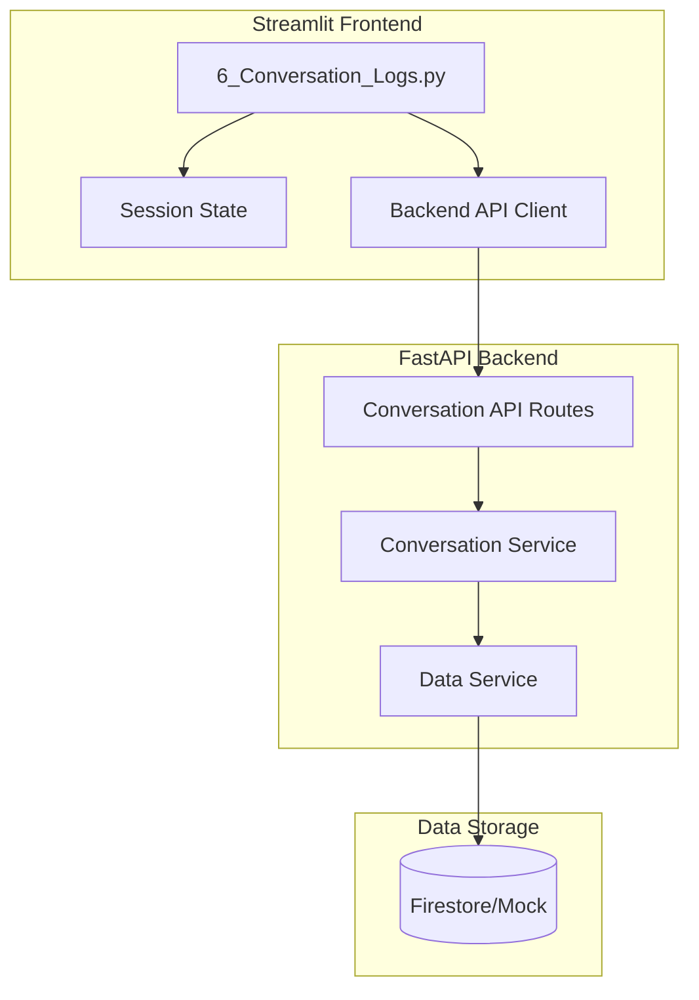
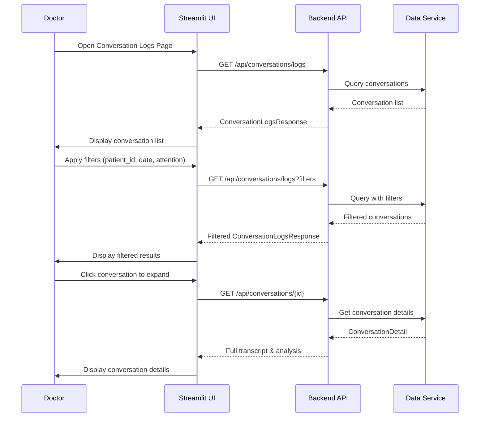
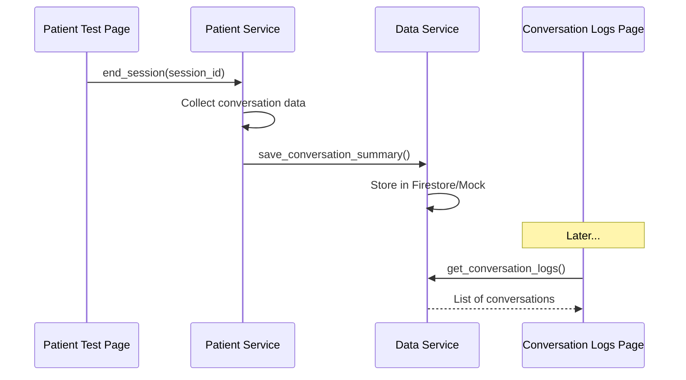

# Design Document: Conversation Logs Page

## Overview

The Conversation Logs Page is a Streamlit-based interface that enables doctors to review and analyze patient conversation history with AI medical assistants. This page is critical for the ElevenDops system's value proposition, allowing doctors to:

1. View a list of patient conversations with filtering capabilities
2. Identify conversations requiring doctor attention
3. Distinguish between answered and unanswered patient questions
4. Review detailed conversation transcripts
5. Understand patient concerns before appointments

The page adheres to the system's separation of concerns principle: Streamlit handles UI rendering only, while all data retrieval and business logic are routed through the FastAPI backend.

## Architecture



### Data Flow



## Components and Interfaces

### Frontend Components

#### 1. ConversationLogsPage (6_Conversation_Logs.py)

Main Streamlit page component with the following sections:

```python
# Page Structure
- Page Config (title="對話記錄查詢", icon="📋", layout="wide")
- Filter Section
  - Patient ID text input
  - Date range pickers (start_date, end_date)
  - Attention required checkbox
  - Apply/Clear filter buttons
- Statistics Section
  - Total conversations metric
  - Attention required metric
  - Questions answered/unanswered metrics
- Conversation List Section
  - Expandable conversation cards
  - Each card shows: patient_id, date, agent_name, attention_badge
- Conversation Detail Section (expanded view)
  - Main concerns list
  - Full transcript with role distinction
  - Answered/unanswered question breakdown
  - Audio playback (if available)
```

#### 2. Session State Management

```python
# Session State Keys
st.session_state.conversation_logs: List[ConversationSummary]
st.session_state.selected_conversation_id: str | None
st.session_state.filter_patient_id: str | None
st.session_state.filter_start_date: date | None
st.session_state.filter_end_date: date | None
st.session_state.filter_attention_only: bool
st.session_state.logs_loading: bool
st.session_state.logs_error: str | None
```

### Backend API Endpoints

#### New Endpoints Required

```python
# Conversation Logs Management
GET /api/conversations/logs
    Query Params: 
        patient_id: Optional[str]
        start_date: Optional[datetime]
        end_date: Optional[datetime]
        requires_attention_only: Optional[bool] = False
    Response: ConversationLogsResponse

GET /api/conversations/{conversation_id}
    Response: ConversationDetail
```

### Backend Services

#### ConversationService

```python
class ConversationService:
    """Service for managing conversation logs."""
    
    async def get_conversation_logs(
        self,
        patient_id: Optional[str] = None,
        start_date: Optional[datetime] = None,
        end_date: Optional[datetime] = None,
        requires_attention_only: bool = False
    ) -> ConversationLogsResponse
    
    async def get_conversation_detail(
        self, conversation_id: str
    ) -> ConversationDetail
    
    async def save_conversation(
        self, conversation: ConversationSummary
    ) -> ConversationSummary
```

## Data Models

### Frontend Models (streamlit_app/services/models.py)

```python
@dataclass
class ConversationMessage:
    """A single message in the conversation."""
    role: str  # "patient" or "agent"
    content: str
    timestamp: datetime
    is_answered: Optional[bool] = None  # For patient questions

@dataclass
class ConversationSummary:
    """Summary view of a conversation for list display."""
    conversation_id: str
    patient_id: str
    agent_id: str
    agent_name: str
    requires_attention: bool
    main_concerns: List[str]
    total_messages: int
    answered_count: int
    unanswered_count: int
    duration_seconds: int
    created_at: datetime

@dataclass
class ConversationDetail:
    """Detailed view of a conversation."""
    conversation_id: str
    patient_id: str
    agent_id: str
    agent_name: str
    requires_attention: bool
    main_concerns: List[str]
    messages: List[ConversationMessage]
    answered_questions: List[str]
    unanswered_questions: List[str]
    duration_seconds: int
    created_at: datetime

@dataclass
class ConversationLogsResponse:
    """Response for conversation logs query."""
    conversations: List[ConversationSummary]
    total_count: int
    attention_required_count: int
    total_answered: int
    total_unanswered: int
```

### Backend Models (backend/models/schemas.py)

```python
class ConversationMessageSchema(BaseModel):
    """Schema for a conversation message."""
    role: Literal["patient", "agent"]
    content: str
    timestamp: datetime
    is_answered: Optional[bool] = None

class ConversationSummarySchema(BaseModel):
    """Schema for conversation summary."""
    conversation_id: str
    patient_id: str
    agent_id: str
    agent_name: str
    requires_attention: bool = False
    main_concerns: List[str] = Field(default_factory=list)
    total_messages: int = 0
    answered_count: int = 0
    unanswered_count: int = 0
    duration_seconds: int = 0
    created_at: datetime

class ConversationDetailSchema(BaseModel):
    """Schema for detailed conversation view."""
    conversation_id: str
    patient_id: str
    agent_id: str
    agent_name: str
    requires_attention: bool = False
    main_concerns: List[str] = Field(default_factory=list)
    messages: List[ConversationMessageSchema] = Field(default_factory=list)
    answered_questions: List[str] = Field(default_factory=list)
    unanswered_questions: List[str] = Field(default_factory=list)
    duration_seconds: int = 0
    created_at: datetime

class ConversationLogsResponseSchema(BaseModel):
    """Schema for conversation logs response."""
    conversations: List[ConversationSummarySchema]
    total_count: int
    attention_required_count: int
    total_answered: int
    total_unanswered: int

class ConversationLogsQueryParams(BaseModel):
    """Query parameters for filtering conversation logs."""
    patient_id: Optional[str] = None
    start_date: Optional[datetime] = None
    end_date: Optional[datetime] = None
    requires_attention_only: bool = False
```

## UI Layout Design

```
┌─────────────────────────────────────────────────────────────────┐
│  📋 對話記錄查詢                                                  │
├─────────────────────────────────────────────────────────────────┤
│  ┌─────────────────────────────────────────────────────────────┐│
│  │ 篩選條件                                                     ││
│  │ ┌──────────────┐ ┌──────────────┐ ┌──────────────┐          ││
│  │ │ 病患ID       │ │ 開始日期     │ │ 結束日期     │          ││
│  │ │ [________]   │ │ [________]   │ │ [________]   │          ││
│  │ └──────────────┘ └──────────────┘ └──────────────┘          ││
│  │ ☐ 僅顯示需關注                    [套用篩選] [清除篩選]      ││
│  └─────────────────────────────────────────────────────────────┘│
├─────────────────────────────────────────────────────────────────┤
│  ┌────────────┐ ┌────────────┐ ┌────────────┐ ┌────────────┐   │
│  │ 總對話數   │ │ 需關注     │ │ 已回答問題 │ │ 未回答問題 │   │
│  │    25      │ │    3       │ │    45      │ │    8       │   │
│  └────────────┘ └────────────┘ └────────────┘ └────────────┘   │
├─────────────────────────────────────────────────────────────────┤
│  對話列表                                                        │
│  ┌─────────────────────────────────────────────────────────────┐│
│  │ ▶ 病患: P001 | 2024-01-15 14:30 | 白內障助理 | ⚠️ 需關注    ││
│  ├─────────────────────────────────────────────────────────────┤│
│  │ ▼ 病患: P002 | 2024-01-15 10:15 | 糖尿病助理                ││
│  │   ┌─────────────────────────────────────────────────────┐   ││
│  │   │ 主要關切: 藥物副作用、飲食控制                        │   ││
│  │   ├─────────────────────────────────────────────────────┤   ││
│  │   │ 對話內容:                                            │   ││
│  │   │ 🧑 病患: 請問這個藥有什麼副作用？                     │   ││
│  │   │ 🤖 助理: 這個藥物常見的副作用包括...                  │   ││
│  │   │ 🧑 病患: 我可以吃甜食嗎？                            │   ││
│  │   │ 🤖 助理: 建議您控制糖分攝取...                       │   ││
│  │   ├─────────────────────────────────────────────────────┤   ││
│  │   │ ✓ 已回答: 2 題  ✗ 未回答: 0 題                       │   ││
│  │   └─────────────────────────────────────────────────────┘   ││
│  ├─────────────────────────────────────────────────────────────┤│
│  │ ▶ 病患: P003 | 2024-01-14 16:45 | 白內障助理                ││
│  └─────────────────────────────────────────────────────────────┘│
└─────────────────────────────────────────────────────────────────┘
```

## Correctness Properties

### Property 1: Conversation List Display

*For any* non-empty list of conversations returned from the backend, each conversation should be rendered with patient_id, date/time, agent name, and attention status visible.

**Validates: Requirements 1.3, 1.5**

### Property 2: Patient ID Filter Correctness

*For any* patient_id filter value, the displayed conversations should only include those where the patient_id matches (case-insensitive partial match or exact match based on implementation).

**Validates: Requirements 2.2, 2.4**

### Property 3: Date Range Filter Correctness

*For any* valid date range (start_date <= end_date), the displayed conversations should only include those with created_at within the specified range (inclusive).

**Validates: Requirements 3.2, 3.3, 3.4**

### Property 4: Attention Filter Correctness

*For any* activation of the attention-only filter, the displayed conversations should only include those where requires_attention is true.

**Validates: Requirements 4.2**

### Property 5: Statistics Accuracy

*For any* set of displayed conversations, the statistics (total_count, attention_required_count, answered_count, unanswered_count) should accurately reflect the aggregated values of the displayed data.

**Validates: Requirements 5.2, 5.3**

### Property 6: Conversation Detail Completeness

*For any* expanded conversation, the detail view should contain all messages in chronological order with correct role attribution and the complete lists of answered and unanswered questions.

**Validates: Requirements 6.2, 6.3, 7.1, 7.2**

### Property 7: Question Categorization Consistency

*For any* conversation, the sum of answered_count and unanswered_count should equal the total number of patient questions in the conversation.

**Validates: Requirements 7.3, 7.4**

### Property 8: Error State Display

*For any* API error, the UI should display a user-friendly error message in Traditional Chinese without exposing technical details.

**Validates: Requirements 8.1, 8.2, 8.3**

## Error Handling

### Error Categories

1. **Connection Errors**: Backend API unreachable
   - Display: "無法連接伺服器，請稍後再試" (Cannot connect to server, please try again later)
   - Action: Log error, show retry button

2. **Data Loading Errors**: Failed to fetch conversation logs
   - Display: "載入對話記錄時發生錯誤，請稍後再試" (Error loading conversation logs, please try again later)
   - Action: Log error, show empty state with retry option

3. **Filter Errors**: Invalid filter parameters
   - Display: "篩選條件無效，請檢查輸入" (Invalid filter parameters, please check input)
   - Action: Highlight invalid field, prevent filter application

4. **Detail Loading Errors**: Failed to load conversation details
   - Display: "無法載入對話詳情" (Cannot load conversation details)
   - Action: Log error, collapse expanded section

### Error Handling Pattern

```python
try:
    result = await backend_api.get_conversation_logs(filters)
    st.session_state.conversation_logs = result.conversations
    st.session_state.logs_error = None
except APIConnectionError as e:
    logging.error(f"Connection error: {e}")
    st.session_state.logs_error = "無法連接伺服器，請稍後再試"
except APIError as e:
    logging.error(f"API error: {e.message}")
    st.session_state.logs_error = "載入對話記錄時發生錯誤，請稍後再試"
except Exception as e:
    logging.error(f"Unexpected error: {e}")
    st.session_state.logs_error = "發生未預期的錯誤"
```

## Integration with Patient Test Page

The Conversation Logs page depends on data generated by the Patient Test Page (5_Patient_Test.py). The integration points are:

### Data Flow from Patient Test to Conversation Logs



### Required Updates to Patient Service

The `PatientService.end_session()` method needs to be enhanced to:
1. Collect all conversation messages from the session
2. Analyze questions for answered/unanswered status
3. Extract main concerns using data collection schema
4. Determine if doctor attention is required
5. Save the complete conversation summary to data service

## Testing Strategy

### Property-Based Testing Framework

- **Library**: Hypothesis (Python)
- **Minimum Iterations**: 100 per property test
- **Test File**: `tests/test_conversation_logs_props.py`

### Test Categories

#### 1. Filter Tests (Property-Based)
- Patient ID filter across various input patterns
- Date range filter with edge cases
- Attention filter toggle behavior
- Combined filter interactions

#### 2. Data Display Tests (Property-Based)
- Conversation list rendering completeness
- Statistics calculation accuracy
- Detail view data integrity

#### 3. Integration Tests (Unit)
- Backend API client methods
- Error handling scenarios
- Session state management

#### 4. UI Component Tests (Unit)
- Page rendering with various states
- Component visibility based on data availability
- Filter control interactions

### Test Annotation Format

Each property-based test must be annotated with:
```python
# **Feature: conversation-logs-page, Property {number}: {property_text}**
# **Validates: Requirements X.Y**
```

## Implementation Dependencies

### Prerequisites
1. Patient Test Page (5_Patient_Test.py) must save conversation data on session end
2. Data Service must support conversation storage and retrieval
3. Backend API routes for conversation logs must be implemented

### New Files Required
1. `backend/api/routes/conversation.py` - API routes
2. `backend/services/conversation_service.py` - Business logic
3. `streamlit_app/pages/6_Conversation_Logs.py` - UI page
4. `tests/test_conversation_logs_props.py` - Property tests

### Files to Modify
1. `backend/models/schemas.py` - Add conversation schemas
2. `backend/services/data_service.py` - Add conversation storage methods
3. `backend/services/patient_service.py` - Enhance end_session to save conversations
4. `backend/main.py` - Register conversation routes
5. `streamlit_app/services/backend_api.py` - Add conversation API methods
6. `streamlit_app/services/models.py` - Add frontend data models
