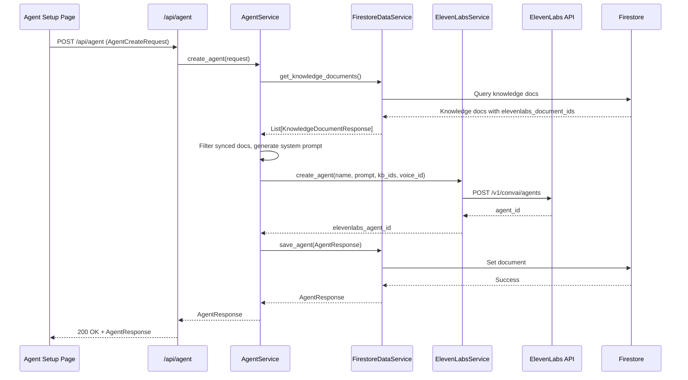

# Design Document: ElevenLabs Agent Creation

## Overview

This design document describes the implementation of real ElevenLabs Agent creation functionality for the ElevenDops medical assistant system. The feature replaces the current mock/in-memory implementation with actual ElevenLabs API integration and Firestore persistence.

The implementation follows the existing architecture patterns established in the codebase:
- Backend services handle all ElevenLabs API interactions
- Firestore serves as the persistent data store
- FastAPI routes expose the functionality to the Streamlit frontend
- Pydantic schemas define data contracts

## Architecture

```mermaid
flowchart TD
    subgraph Frontend
        UI[Agent Setup Page]
    end
    
    subgraph Backend API
        API[/api/agent routes]
    end
    
    subgraph Services
        AS[AgentService]
        ELS[ElevenLabsService]
        FDS[FirestoreDataService]
    end
    
    subgraph External
        EL[ElevenLabs API]
        FS[(Firestore)]
    end
    
    UI --> API
    API --> AS
    AS --> ELS
    AS --> FDS
    ELS --> EL
    FDS --> FS
```

### Data Flow: Agent Creation



## Components and Interfaces

### 1. System Prompt Templates

New constant definitions for Traditional Chinese system prompts:

```python
# backend/services/agent_service.py

SYSTEM_PROMPTS = {
    AnswerStyle.PROFESSIONAL: (
        "你是一位專業的醫療助理。請以準確、客觀的方式回答病患問題。"
        "請使用正式的語言，避免使用俚語或過於隨意的表達。"
        "優先考慮醫療準確性和清晰的溝通。請使用繁體中文回答。"
    ),
    AnswerStyle.FRIENDLY: (
        "你是一位親切友善的醫療助理。請以溫暖、易懂的方式協助病患。"
        "使用簡單的語言和令人安心的語調。"
        "讓病患感到被傾聽和關心。請使用繁體中文回答。"
    ),
    AnswerStyle.EDUCATIONAL: (
        "你是一位衛教專員。請專注於教導病患了解他們的健康狀況。"
        "用簡單的方式解釋醫學術語，並確認病患的理解。"
        "適當時使用類比來幫助說明。請使用繁體中文回答。"
    ),
}
```

### 2. AgentService Interface Updates

```python
class AgentService:
    def __init__(
        self,
        elevenlabs_service: ElevenLabsService = None,
        data_service: DataServiceInterface = None
    ):
        """Initialize with dependency injection."""
        self.elevenlabs = elevenlabs_service or get_elevenlabs_service()
        self.data_service = data_service or get_data_service()

    def _get_system_prompt(self, style: AnswerStyle) -> str:
        """Get Traditional Chinese system prompt for answer style."""
        return SYSTEM_PROMPTS.get(style, SYSTEM_PROMPTS[AnswerStyle.PROFESSIONAL])

    async def _get_synced_knowledge_ids(
        self, knowledge_ids: List[str]
    ) -> List[str]:
        """Filter knowledge IDs to only include synced documents."""
        # Returns only elevenlabs_document_ids for docs with sync_status == COMPLETED

    async def create_agent(self, request: AgentCreateRequest) -> AgentResponse:
        """Create agent in ElevenLabs and persist to Firestore."""

    async def get_agents(self, doctor_id: Optional[str] = None) -> AgentListResponse:
        """List agents from Firestore."""

    async def get_agent(self, agent_id: str) -> Optional[AgentResponse]:
        """Get single agent from Firestore."""

    async def delete_agent(self, agent_id: str) -> bool:
        """Delete agent from ElevenLabs and Firestore."""
```

### 3. ElevenLabsService Updates

The existing `create_agent` method needs refinement for the actual API structure:

```python
def create_agent(
    self,
    name: str,
    system_prompt: str,
    knowledge_base_ids: List[str],
    voice_id: str,
    first_message: str = "您好，我是您的醫療助手。請問有什麼我可以幫您的？"
) -> str:
    """Create agent in ElevenLabs.
    
    Args:
        name: Agent display name
        system_prompt: System instructions for agent behavior
        knowledge_base_ids: List of ElevenLabs knowledge base document IDs
        voice_id: ElevenLabs voice ID
        first_message: Initial greeting message
        
    Returns:
        str: ElevenLabs agent ID
        
    Raises:
        ElevenLabsAgentError: If creation fails
    """
```

### 4. Data Service Interface

The existing `FirestoreDataService` already has the required methods:
- `save_agent(agent: AgentResponse) -> AgentResponse`
- `get_agents(doctor_id: Optional[str]) -> List[AgentResponse]`
- `get_agent(agent_id: str) -> Optional[AgentResponse]`
- `delete_agent(agent_id: str) -> bool`

## Data Models

### Firestore Collection: `agents`

```
/agents/{agent_id}
  - agent_id: string (UUID)
  - name: string
  - knowledge_ids: array<string> (local knowledge IDs)
  - voice_id: string
  - answer_style: string ("professional" | "friendly" | "educational")
  - elevenlabs_agent_id: string
  - doctor_id: string
  - created_at: timestamp
```

### ElevenLabs Agent Configuration

Based on the ElevenLabs API documentation, the agent creation payload:

```python
{
    "name": "Agent Name",
    "conversation_config": {
        "agent": {
            "prompt": {
                "prompt": "System prompt text...",
                "knowledge_base": [
                    {"type": "file", "id": "kb_doc_id_1", "name": "Doc 1"},
                    {"type": "file", "id": "kb_doc_id_2", "name": "Doc 2"}
                ]
            },
            "first_message": "您好，我是您的醫療助手。請問有什麼我可以幫您的？",
            "language": "zh"
        },
        "tts": {
            "voice_id": "voice_id_here"
        }
    }
}
```

## Correctness Properties

*A property is a characteristic or behavior that should hold true across all valid executions of a system-essentially, a formal statement about what the system should do. Properties serve as the bridge between human-readable specifications and machine-verifiable correctness guarantees.*

Based on the prework analysis, the following properties have been identified:

### Property 1: System Prompt Language Consistency
*For any* valid answer style, the generated system prompt SHALL contain Traditional Chinese text and include instructions to respond in Traditional Chinese.
**Validates: Requirements 1.1, 1.2**

### Property 2: Knowledge Base Filtering by Sync Status
*For any* set of knowledge documents with mixed sync statuses, only documents with sync_status "completed" SHALL have their elevenlabs_document_id included in the agent configuration.
**Validates: Requirements 2.1, 2.2, 2.3**

### Property 3: Voice ID Passthrough
*For any* valid voice ID provided during agent creation, the ElevenLabs agent configuration SHALL contain that exact voice ID.
**Validates: Requirements 3.1**

### Property 4: Agent Metadata Persistence Completeness
*For any* successfully created agent, the Firestore document SHALL contain all required fields: agent_id, name, knowledge_ids, voice_id, answer_style, elevenlabs_agent_id, doctor_id, and created_at.
**Validates: Requirements 4.1, 4.2**

### Property 5: Agent Retrieval from Firestore
*For any* agent that was saved to Firestore, retrieving agents SHALL return that agent with all its original field values preserved.
**Validates: Requirements 4.4**

### Property 6: Deletion Order Consistency
*For any* agent deletion request, the system SHALL attempt ElevenLabs deletion before Firestore deletion.
**Validates: Requirements 5.1, 5.2**

### Property 7: Enum Serialization for Firestore
*For any* agent saved to Firestore, the answer_style field SHALL be stored as a string value, not an enum object.
**Validates: Requirements 7.4**

## Error Handling

### Error Classification

| Error Type | HTTP Status | Retryable | Action |
|------------|-------------|-----------|--------|
| Rate Limit (429) | 502 | Yes (3x) | Exponential backoff |
| Auth Error (401/403) | 502 | No | Return error immediately |
| Validation Error (400) | 400 | No | Return validation details |
| Server Error (5xx) | 502 | Yes (3x) | Exponential backoff |
| Network Error | 502 | Yes (3x) | Exponential backoff |
| Firestore Error | 500 | No | Rollback ElevenLabs agent |

### Rollback Strategy

When ElevenLabs agent creation succeeds but Firestore save fails:

```python
try:
    elevenlabs_agent_id = self.elevenlabs.create_agent(...)
    agent = AgentResponse(...)
    await self.data_service.save_agent(agent)
    return agent
except Exception as db_error:
    # Attempt rollback
    try:
        self.elevenlabs.delete_agent(elevenlabs_agent_id)
    except Exception as rollback_error:
        logging.error(f"Rollback failed: {rollback_error}")
    raise db_error
```

## Testing Strategy

### Property-Based Testing Framework

- **Library**: Hypothesis (Python)
- **Minimum iterations**: 100 per property test
- **Test file location**: `tests/test_agent_creation_props.py`

### Unit Tests

Unit tests will cover:
- System prompt generation for each answer style
- Knowledge ID filtering logic
- Agent creation request validation
- Error handling scenarios

### Property-Based Tests

Each correctness property will be implemented as a property-based test:

1. **Property 1**: Generate random answer styles, verify prompt contains Chinese characters and language instruction
2. **Property 2**: Generate documents with random sync statuses, verify filtering
3. **Property 3**: Generate random voice IDs, verify passthrough
4. **Property 4**: Generate random agent data, verify all fields persisted
5. **Property 5**: Generate agents, save and retrieve, verify equality
6. **Property 6**: Mock services, verify deletion call order
7. **Property 7**: Generate agents with enum styles, verify string serialization

### Test Annotations

All property-based tests will be annotated with:
```python
# **Feature: elevenlabs-agent-creation, Property {N}: {property_text}**
# **Validates: Requirements X.Y**
```

### Integration Tests

Integration tests will verify:
- End-to-end agent creation flow with mocked ElevenLabs
- Firestore persistence and retrieval
- Error handling and rollback behavior
