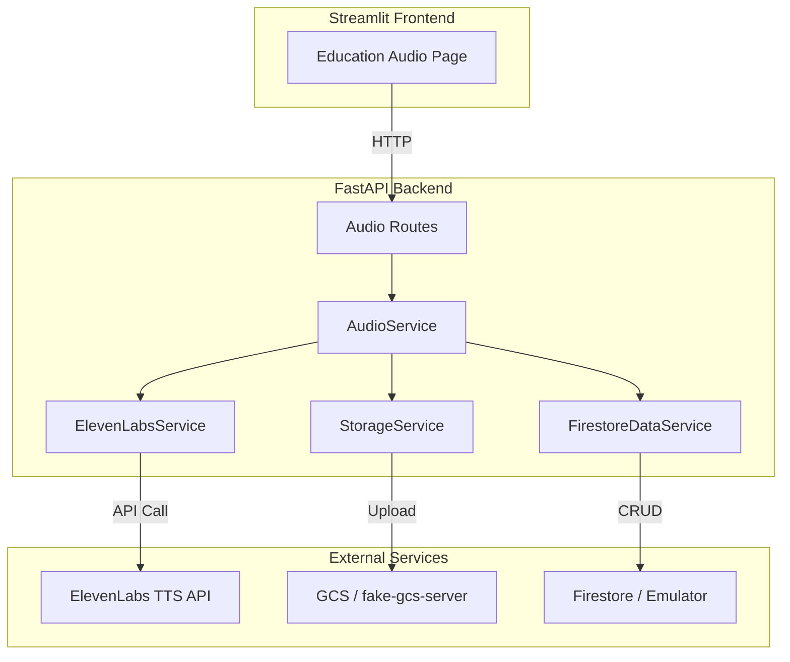
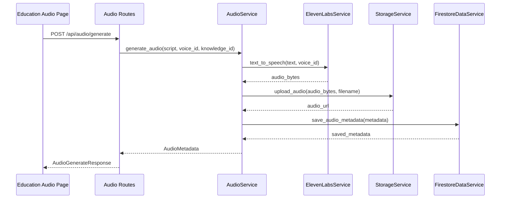

# Design Document: ElevenLabs TTS Audio Generation

## Overview

This design document describes the implementation of real audio generation using ElevenLabs Text-to-Speech (TTS) API with persistent storage in Google Cloud Storage (GCS) and metadata tracking in Firestore. The feature enables doctors to convert medical education scripts into audio files that patients can listen to.

The implementation follows the existing architecture patterns established in the ElevenDops system:
- **Backend services** handle all ElevenLabs API interactions and business logic
- **StorageService** manages file uploads to GCS (or fake-gcs-server in development)
- **FirestoreDataService** handles data persistence
- **Streamlit frontend** provides the user interface without direct API calls

## Architecture



### Data Flow for Audio Generation



## Components and Interfaces

### 1. ElevenLabsService (Enhanced)

**File:** `backend/services/elevenlabs_service.py`

The existing `text_to_speech()` and `get_voices()` methods are already implemented. No changes needed to the ElevenLabsService interface.

```python
class ElevenLabsService:
    def text_to_speech(self, text: str, voice_id: str) -> bytes:
        """Convert text to speech using ElevenLabs API.
        
        Args:
            text: The text to convert (max 50,000 characters)
            voice_id: The ElevenLabs voice ID
            
        Returns:
            bytes: Audio data in MP3 format
            
        Raises:
            ElevenLabsTTSError: If conversion fails
        """
        
    def get_voices(self) -> list[dict]:
        """Get available voices from ElevenLabs.
        
        Returns:
            list[dict]: Voice dictionaries with voice_id, name, description, preview_url
            
        Raises:
            ElevenLabsTTSError: If fetching fails
        """
```

### 2. AudioService (Enhanced)

**File:** `backend/services/audio_service.py`

The AudioService needs to be enhanced to:
1. Use StorageService for audio file persistence
2. Use FirestoreDataService for metadata persistence
3. Remove in-memory storage

```python
class AudioService:
    def __init__(
        self,
        elevenlabs_service: ElevenLabsService = None,
        storage_service: StorageService = None,
        data_service: FirestoreDataService = None
    ):
        """Initialize with injected dependencies for testability."""
        
    def generate_audio(
        self, 
        script: str, 
        voice_id: str, 
        knowledge_id: str
    ) -> AudioMetadata:
        """Generate audio from script and persist to storage.
        
        1. Call ElevenLabs TTS API
        2. Upload audio to StorageService
        3. Save metadata to FirestoreDataService
        
        Returns:
            AudioMetadata with audio_url pointing to GCS
        """
        
    def get_audio_files(self, knowledge_id: str) -> List[AudioMetadata]:
        """Get audio files from Firestore by knowledge_id."""
        
    def get_available_voices(self) -> List[VoiceOption]:
        """Get voices from ElevenLabs API."""
        
    def generate_script(self, knowledge_id: str) -> str:
        """Generate script from knowledge document (template-based for MVP)."""
```

### 3. StorageService (Existing)

**File:** `backend/services/storage_service.py`

The StorageService is already implemented with the required interface:

```python
class StorageService:
    def upload_audio(self, audio_data: bytes, filename: str) -> str:
        """Upload audio file and return URL.
        
        Args:
            audio_data: Audio bytes to upload
            filename: Filename without path prefix
            
        Returns:
            str: Public URL to access the audio
        """
```

### 4. FirestoreDataService (Existing)

**File:** `backend/services/firestore_data_service.py`

The FirestoreDataService already has the required methods:

```python
class FirestoreDataService:
    async def save_audio_metadata(self, audio: AudioMetadata) -> AudioMetadata:
        """Save audio metadata to Firestore."""
        
    async def get_audio_files(
        self, knowledge_id: Optional[str] = None
    ) -> List[AudioMetadata]:
        """Get audio files, optionally filtered by knowledge_id."""
```

### 5. Audio API Routes (Existing)

**File:** `backend/api/routes/audio.py`

The routes are already defined. The implementation will work with the enhanced AudioService.

## Data Models

### AudioMetadata (Existing)

```python
class AudioMetadata(BaseModel):
    audio_id: str           # UUID for the audio file
    audio_url: str          # GCS URL for playback
    knowledge_id: str       # Source knowledge document
    voice_id: str           # ElevenLabs voice used
    duration_seconds: Optional[float]  # Audio duration (if available)
    script: str             # Script text used for generation
    created_at: datetime    # Generation timestamp
```

### Firestore Collection: audio_files

```
/audio_files/{audio_id}
  - audio_id: string
  - knowledge_id: string
  - voice_id: string
  - script: string
  - audio_url: string
  - duration_seconds: number (nullable)
  - created_at: timestamp
```

### VoiceOption (Existing)

```python
class VoiceOption(BaseModel):
    voice_id: str           # ElevenLabs voice ID
    name: str               # Display name
    description: Optional[str]  # Voice description
    preview_url: Optional[str]  # Preview audio URL
```

## Correctness Properties

*A property is a characteristic or behavior that should hold true across all valid executions of a system-essentially, a formal statement about what the system should do. Properties serve as the bridge between human-readable specifications and machine-verifiable correctness guarantees.*

### Property 1: Audio generation produces complete metadata

*For any* valid script (non-empty, within character limit) and valid voice_id, when audio generation succeeds, the returned AudioMetadata SHALL contain non-empty audio_id, audio_url, knowledge_id, voice_id, script, and created_at fields.

**Validates: Requirements 1.4**

### Property 2: Voice list contains required fields

*For any* successful voice fetch from ElevenLabs, each VoiceOption in the returned list SHALL contain non-empty voice_id and name fields.

**Validates: Requirements 2.2**

### Property 3: Storage upload returns valid URL

*For any* audio bytes uploaded to StorageService, the returned URL SHALL be a non-empty string that starts with either the GCS emulator host (in development) or "https://storage.googleapis.com" (in production).

**Validates: Requirements 3.1, 3.2**

### Property 4: Audio metadata persistence round trip

*For any* AudioMetadata saved to FirestoreDataService, querying by the same audio_id SHALL return an AudioMetadata with identical audio_id, knowledge_id, voice_id, script, and audio_url fields.

**Validates: Requirements 3.3**

### Property 5: Audio query by knowledge_id returns all matching records

*For any* set of AudioMetadata records saved with the same knowledge_id, querying by that knowledge_id SHALL return all saved records (count matches).

**Validates: Requirements 3.4**

### Property 6: Script generation response structure

*For any* valid knowledge_id, script generation SHALL return a ScriptGenerateResponse with non-empty script field, matching knowledge_id, and valid generated_at timestamp.

**Validates: Requirements 4.1, 4.2**

### Property 7: Upload failure prevents metadata persistence

*For any* audio generation where StorageService upload fails, the system SHALL NOT persist any AudioMetadata to Firestore for that generation attempt.

**Validates: Requirements 6.2**

## Error Handling

### ElevenLabs API Errors

| Error Type | HTTP Status | User Message |
|------------|-------------|--------------|
| Rate Limit (429) | 502 Bad Gateway | Voice service is temporarily busy, please try again later |
| Auth Error (401/403) | 502 Bad Gateway | Voice service authentication failed, please contact administrator |
| Validation Error (400) | 400 Bad Request | Invalid input content, please check text length |
| Server Error (5xx) | 502 Bad Gateway | Voice service is temporarily unavailable |

### Storage Errors

| Error Type | HTTP Status | User Message |
|------------|-------------|--------------|
| Upload Failed | 500 Internal Server Error | Audio file storage failed, please try again later |
| Bucket Not Found | 500 Internal Server Error | Storage service configuration error |

### Error Handling Flow

```python
def generate_audio(self, script: str, voice_id: str, knowledge_id: str) -> AudioMetadata:
    try:
        # Step 1: Generate audio bytes
        audio_bytes = self.elevenlabs_service.text_to_speech(script, voice_id)
    except ElevenLabsTTSError as e:
        logging.error(f"TTS generation failed: {e}")
        raise  # Propagate to route handler
    
    try:
        # Step 2: Upload to storage
        filename = f"{uuid.uuid4()}.mp3"
        audio_url = self.storage_service.upload_audio(audio_bytes, filename)
    except Exception as e:
        logging.error(f"Storage upload failed: {e}")
        raise  # Don't save metadata if upload fails
    
    # Step 3: Save metadata (only if upload succeeded)
    metadata = AudioMetadata(...)
    await self.data_service.save_audio_metadata(metadata)
    
    return metadata
```

## Testing Strategy

### Dual Testing Approach

This implementation uses both unit tests and property-based tests:

1. **Unit Tests**: Verify specific examples, edge cases, and integration points
2. **Property-Based Tests**: Verify universal properties across many random inputs

### Property-Based Testing Framework

**Framework:** Hypothesis (Python)

**Configuration:**
- Minimum 100 iterations per property test
- Use `@settings(max_examples=100)` decorator

### Test File Structure

```
tests/
  test_audio_service_props.py      # Property tests for AudioService
  test_elevenlabs_tts_props.py     # Property tests for TTS (existing)
  test_storage_service_props.py    # Property tests for StorageService (existing)
```

### Property Test Annotations

Each property-based test MUST include a comment referencing the correctness property:

```python
# **Feature: elevenlabs-tts-audio, Property 1: Audio generation produces complete metadata**
# **Validates: Requirements 1.4**
@given(script=st.text(min_size=1, max_size=1000), voice_id=st.text(min_size=1))
@settings(max_examples=100)
def test_audio_generation_produces_complete_metadata(script, voice_id):
    ...
```

### Mocking Strategy

For property tests, mock external dependencies:
- **ElevenLabsService**: Mock `text_to_speech()` to return deterministic bytes
- **StorageService**: Mock `upload_audio()` to return predictable URLs
- **FirestoreDataService**: Use in-memory implementation or mock

### Test Coverage Requirements

| Component | Unit Tests | Property Tests |
|-----------|------------|----------------|
| AudioService.generate_audio | Integration test | Property 1, 7 |
| AudioService.get_audio_files | Query test | Property 5 |
| AudioService.get_available_voices | Mock test | Property 2 |
| AudioService.generate_script | Template test | Property 6 |
| StorageService.upload_audio | Upload test | Property 3 |
| FirestoreDataService.save_audio_metadata | CRUD test | Property 4 |

