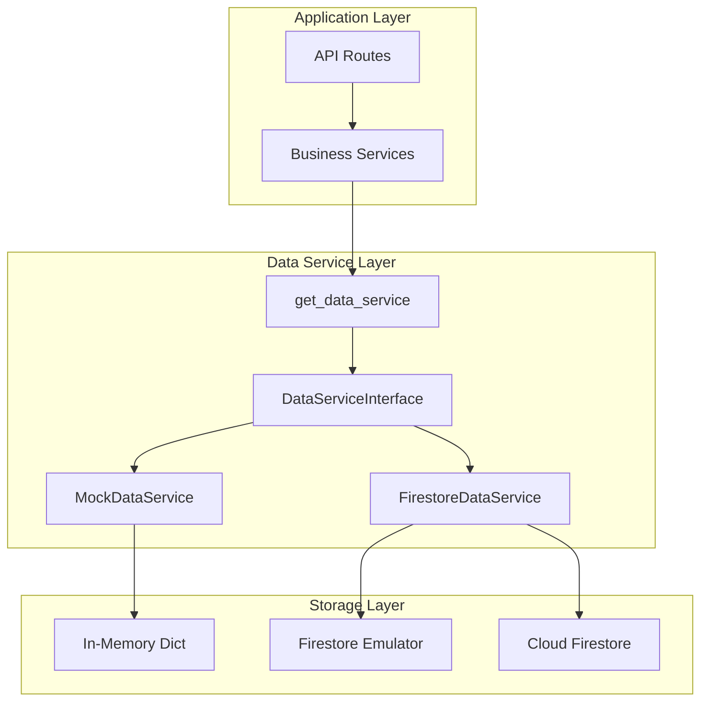
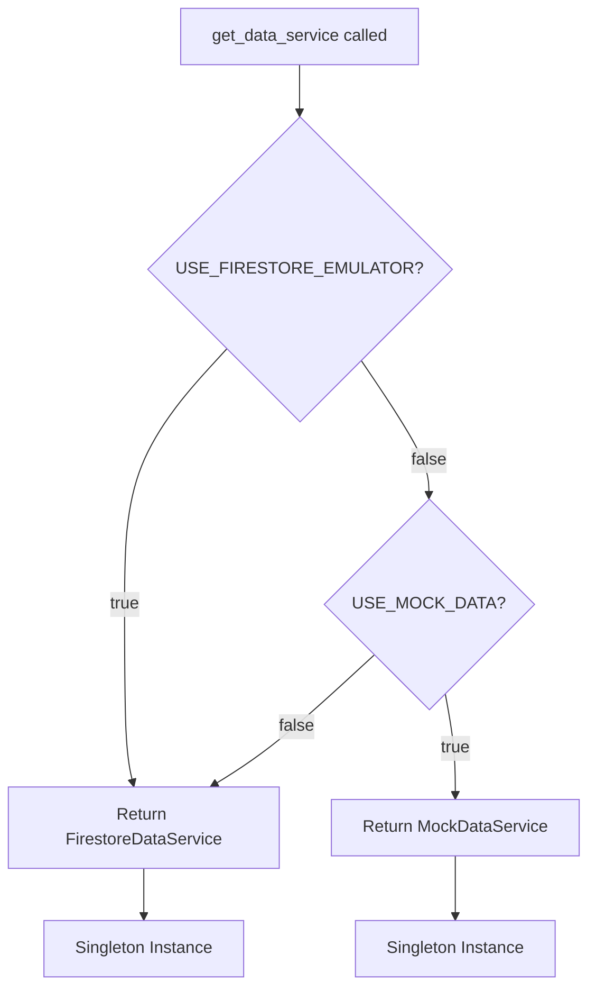

# Design Document: Firestore Data Service

## Overview

This specification replaces the in-memory MockDataService with a production-ready FirestoreDataService. The design follows the **Interface Segregation Principle** by defining an abstract DataServiceInterface that both MockDataService and FirestoreDataService implement.

Key design decisions:
1. **Abstract Interface**: Defines contract for all data operations
2. **Factory Pattern**: `get_data_service()` returns appropriate implementation based on config
3. **Singleton Pattern**: Single instance per service type for connection reuse
4. **Zero Code Changes**: Application code uses interface, not concrete implementations

## Architecture




### Factory Decision Flow



## Components and Interfaces

### 1. DataServiceInterface (Abstract Base Class)

**File**: `backend/services/data_service.py`

```python
from abc import ABC, abstractmethod
from datetime import datetime
from typing import List, Optional

from backend.models.schemas import (
    DashboardStatsResponse,
    KnowledgeDocumentCreate,
    KnowledgeDocumentResponse,
    PatientSessionResponse,
    SyncStatus,
    ConversationSummarySchema,
    ConversationDetailSchema,
    ConversationMessageSchema,
    AudioMetadata,
    AgentResponse,
)


class DataServiceInterface(ABC):
    """Abstract interface for data service implementations."""

    # ==================== Dashboard ====================
    @abstractmethod
    async def get_dashboard_stats(self) -> DashboardStatsResponse:
        """Get dashboard statistics."""
        pass

    # ==================== Knowledge Documents ====================
    @abstractmethod
    async def create_knowledge_document(
        self, doc: KnowledgeDocumentCreate
    ) -> KnowledgeDocumentResponse:
        """Create a new knowledge document."""
        pass

    @abstractmethod
    async def get_knowledge_documents(
        self, doctor_id: Optional[str] = None
    ) -> List[KnowledgeDocumentResponse]:
        """Get all knowledge documents, optionally filtered by doctor."""
        pass

    @abstractmethod
    async def get_knowledge_document(
        self, knowledge_id: str
    ) -> Optional[KnowledgeDocumentResponse]:
        """Get a specific knowledge document by ID."""
        pass

    @abstractmethod
    async def update_knowledge_sync_status(
        self, knowledge_id: str, status: SyncStatus, elevenlabs_id: Optional[str] = None
    ) -> bool:
        """Update the sync status of a knowledge document."""
        pass

    @abstractmethod
    async def delete_knowledge_document(self, knowledge_id: str) -> bool:
        """Delete a knowledge document."""
        pass

    # ==================== Audio Files ====================
    @abstractmethod
    async def save_audio_metadata(self, audio: AudioMetadata) -> AudioMetadata:
        """Save audio file metadata."""
        pass

    @abstractmethod
    async def get_audio_files(
        self, knowledge_id: Optional[str] = None
    ) -> List[AudioMetadata]:
        """Get audio files, optionally filtered by knowledge_id."""
        pass

    @abstractmethod
    async def get_audio_file(self, audio_id: str) -> Optional[AudioMetadata]:
        """Get a specific audio file by ID."""
        pass

    @abstractmethod
    async def delete_audio_file(self, audio_id: str) -> bool:
        """Delete an audio file metadata."""
        pass

    # ==================== Agents ====================
    @abstractmethod
    async def save_agent(self, agent: AgentResponse) -> AgentResponse:
        """Save an agent."""
        pass

    @abstractmethod
    async def get_agents(
        self, doctor_id: Optional[str] = None
    ) -> List[AgentResponse]:
        """Get all agents, optionally filtered by doctor."""
        pass

    @abstractmethod
    async def get_agent(self, agent_id: str) -> Optional[AgentResponse]:
        """Get a specific agent by ID."""
        pass

    @abstractmethod
    async def delete_agent(self, agent_id: str) -> bool:
        """Delete an agent."""
        pass

    # ==================== Patient Sessions ====================
    @abstractmethod
    async def create_patient_session(
        self, session: PatientSessionResponse
    ) -> PatientSessionResponse:
        """Create a new patient session."""
        pass

    @abstractmethod
    async def get_patient_session(
        self, session_id: str
    ) -> Optional[PatientSessionResponse]:
        """Get a patient session by ID."""
        pass

    @abstractmethod
    async def add_session_message(
        self, session_id: str, message: ConversationMessageSchema
    ) -> None:
        """Add a message to a session."""
        pass

    @abstractmethod
    async def get_session_messages(
        self, session_id: str
    ) -> List[ConversationMessageSchema]:
        """Get messages for a session."""
        pass

    # ==================== Conversations ====================
    @abstractmethod
    async def save_conversation(
        self, conversation: ConversationDetailSchema
    ) -> ConversationDetailSchema:
        """Save a conversation."""
        pass

    @abstractmethod
    async def get_conversation_logs(
        self,
        patient_id: Optional[str] = None,
        start_date: Optional[datetime] = None,
        end_date: Optional[datetime] = None,
        requires_attention_only: bool = False,
    ) -> List[ConversationSummarySchema]:
        """Get conversation logs with filters."""
        pass

    @abstractmethod
    async def get_conversation_detail(
        self, conversation_id: str
    ) -> Optional[ConversationDetailSchema]:
        """Get a specific conversation by ID."""
        pass
```


### 2. FirestoreDataService Implementation

**File**: `backend/services/firestore_data_service.py`

```python
import logging
from datetime import datetime
from typing import List, Optional
import uuid

from google.cloud import firestore
from google.cloud.firestore import SERVER_TIMESTAMP

from backend.services.data_service import DataServiceInterface
from backend.services.firestore_service import get_firestore_service
from backend.models.schemas import (
    DashboardStatsResponse,
    KnowledgeDocumentCreate,
    KnowledgeDocumentResponse,
    PatientSessionResponse,
    SyncStatus,
    DocumentType,
    ConversationSummarySchema,
    ConversationDetailSchema,
    ConversationMessageSchema,
    AudioMetadata,
    AgentResponse,
    AnswerStyle,
)

logger = logging.getLogger(__name__)


# Collection names as constants
KNOWLEDGE_DOCUMENTS = "knowledge_documents"
AUDIO_FILES = "audio_files"
AGENTS = "agents"
CONVERSATIONS = "conversations"
PATIENT_SESSIONS = "patient_sessions"


class FirestoreDataService(DataServiceInterface):
    """Firestore implementation of the data service interface."""

    _instance = None

    def __new__(cls):
        if cls._instance is None:
            cls._instance = super().__new__(cls)
            cls._instance._initialized = False
        return cls._instance

    def __init__(self):
        if self._initialized:
            return
        
        self._firestore = get_firestore_service()
        self._db = self._firestore.db
        self._initialized = True
        logger.info("FirestoreDataService initialized")

    # ==================== Helper Methods ====================
    
    def _doc_to_knowledge_response(self, doc_dict: dict) -> KnowledgeDocumentResponse:
        """Convert Firestore document to KnowledgeDocumentResponse."""
        return KnowledgeDocumentResponse(
            knowledge_id=doc_dict["knowledge_id"],
            doctor_id=doc_dict["doctor_id"],
            disease_name=doc_dict["disease_name"],
            document_type=DocumentType(doc_dict["document_type"]),
            raw_content=doc_dict["raw_content"],
            sync_status=SyncStatus(doc_dict["sync_status"]),
            elevenlabs_document_id=doc_dict.get("elevenlabs_document_id"),
            structured_sections=doc_dict.get("structured_sections"),
            created_at=doc_dict["created_at"],
        )

    def _doc_to_audio_metadata(self, doc_dict: dict) -> AudioMetadata:
        """Convert Firestore document to AudioMetadata."""
        return AudioMetadata(
            audio_id=doc_dict["audio_id"],
            knowledge_id=doc_dict["knowledge_id"],
            voice_id=doc_dict["voice_id"],
            script=doc_dict["script"],
            audio_url=doc_dict["audio_url"],
            duration_seconds=doc_dict.get("duration_seconds"),
            created_at=doc_dict["created_at"],
        )

    def _doc_to_agent_response(self, doc_dict: dict) -> AgentResponse:
        """Convert Firestore document to AgentResponse."""
        return AgentResponse(
            agent_id=doc_dict["agent_id"],
            name=doc_dict["name"],
            knowledge_ids=doc_dict.get("knowledge_ids", []),
            voice_id=doc_dict["voice_id"],
            answer_style=AnswerStyle(doc_dict["answer_style"]),
            elevenlabs_agent_id=doc_dict["elevenlabs_agent_id"],
            doctor_id=doc_dict["doctor_id"],
            created_at=doc_dict["created_at"],
        )

    def _doc_to_conversation_detail(self, doc_dict: dict) -> ConversationDetailSchema:
        """Convert Firestore document to ConversationDetailSchema."""
        messages = [
            ConversationMessageSchema(
                role=m["role"],
                content=m["content"],
                timestamp=m["timestamp"],
                is_answered=m.get("is_answered"),
            )
            for m in doc_dict.get("messages", [])
        ]
        return ConversationDetailSchema(
            conversation_id=doc_dict["conversation_id"],
            patient_id=doc_dict["patient_id"],
            agent_id=doc_dict["agent_id"],
            agent_name=doc_dict["agent_name"],
            requires_attention=doc_dict.get("requires_attention", False),
            main_concerns=doc_dict.get("main_concerns", []),
            messages=messages,
            answered_questions=doc_dict.get("answered_questions", []),
            unanswered_questions=doc_dict.get("unanswered_questions", []),
            duration_seconds=doc_dict.get("duration_seconds", 0),
            created_at=doc_dict["created_at"],
        )

    # Implementation methods continue in the actual file...
```


### 3. Factory Function Update

**File**: `backend/services/data_service.py` (update)

```python
from backend.config import get_settings

# Singleton instances
_mock_instance = None
_firestore_instance = None


def get_data_service() -> DataServiceInterface:
    """Factory function - returns appropriate service based on config.
    
    Returns FirestoreDataService when:
    - USE_FIRESTORE_EMULATOR is true (local development with emulator)
    - USE_MOCK_DATA is false (production mode)
    
    Returns MockDataService when:
    - USE_MOCK_DATA is true AND USE_FIRESTORE_EMULATOR is false
    """
    global _mock_instance, _firestore_instance
    
    settings = get_settings()
    
    # Use Firestore if emulator is enabled OR if not using mock data
    use_firestore = settings.use_firestore_emulator or not getattr(settings, 'use_mock_data', True)
    
    if use_firestore:
        if _firestore_instance is None:
            from backend.services.firestore_data_service import FirestoreDataService
            _firestore_instance = FirestoreDataService()
        return _firestore_instance
    else:
        if _mock_instance is None:
            _mock_instance = MockDataService()
        return _mock_instance
```

### 4. Configuration Update

**File**: `backend/config.py` (add new setting)

```python
class Settings(BaseSettings):
    # ... existing settings ...
    
    # Data Service Configuration
    use_mock_data: bool = Field(
        default=False,
        description="Use MockDataService instead of Firestore (for testing without emulator)",
    )
```

## Data Models

### Firestore Document Schemas

All documents use the same field names as the Pydantic models to ensure seamless conversion.

#### Knowledge Document
```python
{
    "knowledge_id": "uuid-string",
    "doctor_id": "default_doctor",
    "disease_name": "白內障",
    "document_type": "faq",  # enum value as string
    "raw_content": "# 白內障常見問題...",
    "sync_status": "pending",  # enum value as string
    "elevenlabs_document_id": null,  # or "el_doc_xxx"
    "structured_sections": {"Introduction": "...", "FAQ": "..."},
    "created_at": Timestamp  # Firestore timestamp
}
```

#### Audio File
```python
{
    "audio_id": "uuid-string",
    "knowledge_id": "uuid-string",
    "voice_id": "voice_xxx",
    "script": "衛教講稿內容...",
    "audio_url": "http://localhost:4443/storage/v1/b/...",
    "duration_seconds": 120.5,
    "created_at": Timestamp
}
```

#### Agent
```python
{
    "agent_id": "uuid-string",
    "name": "白內障衛教助理",
    "knowledge_ids": ["uuid-1", "uuid-2"],
    "voice_id": "voice_xxx",
    "answer_style": "professional",  # enum value as string
    "elevenlabs_agent_id": "el_agent_xxx",
    "doctor_id": "default_doctor",
    "created_at": Timestamp
}
```

#### Conversation
```python
{
    "conversation_id": "uuid-string",
    "patient_id": "patient123",
    "agent_id": "uuid-string",
    "agent_name": "白內障衛教助理",
    "requires_attention": true,
    "main_concerns": ["術後照護", "用藥問題"],
    "messages": [
        {
            "role": "patient",
            "content": "手術後多久可以洗臉？",
            "timestamp": Timestamp,
            "is_answered": true
        },
        {
            "role": "agent",
            "content": "一般建議術後一週...",
            "timestamp": Timestamp,
            "is_answered": null
        }
    ],
    "answered_questions": ["手術後多久可以洗臉？"],
    "unanswered_questions": ["可以開車嗎？"],
    "duration_seconds": 180,
    "created_at": Timestamp
}
```

#### Patient Session
```python
{
    "session_id": "uuid-string",
    "patient_id": "patient123",
    "agent_id": "uuid-string",
    "signed_url": "wss://...",
    "created_at": Timestamp,
    "messages": []  # Accumulated during session
}
```


## Correctness Properties

### Property 1: Interface Implementation Completeness

*For any* class implementing DataServiceInterface, all abstract methods SHALL be implemented and callable without raising NotImplementedError.

**Validates: Requirements 1.1, 1.2**

### Property 2: Factory Singleton Consistency

*For any* sequence of calls to get_data_service() with the same configuration, the function SHALL return the same instance (object identity).

**Validates: Requirements 2.4**

### Property 3: Knowledge Document Persistence

*For any* knowledge document created via create_knowledge_document(), a subsequent call to get_knowledge_document() with the same knowledge_id SHALL return an equivalent document.

**Validates: Requirements 3.1, 3.2, 3.3**

### Property 4: Conversation Query Filtering

*For any* set of conversations stored in Firestore, get_conversation_logs() with filters SHALL return only conversations matching ALL specified filter criteria.

**Validates: Requirements 6.3, 6.5**

### Property 5: Dashboard Statistics Accuracy

*For any* state of the database, get_dashboard_stats() SHALL return counts that exactly match the number of documents in each respective collection.

**Validates: Requirements 7.1, 7.2, 7.3**

### Property 6: Delete Operation Completeness

*For any* document deleted via delete_* methods, subsequent get_* calls for that document SHALL return None.

**Validates: Requirements 3.5, 4.3, 5.5**

## Error Handling

### Error Categories

1. **Document Not Found**
   - Return: `None` for single document queries
   - Return: Empty list for collection queries
   - Log: Debug level message

2. **Write Operation Failed**
   - Raise: `FirestoreWriteError` with details
   - Log: Error level with full context

3. **Connection Lost**
   - Behavior: Next operation attempts reconnection
   - Log: Warning level message

4. **Invalid Data Format**
   - Raise: `ValueError` with field details
   - Log: Error level with document ID

### Error Handling Pattern

```python
async def get_knowledge_document(self, knowledge_id: str) -> Optional[KnowledgeDocumentResponse]:
    try:
        doc_ref = self._db.collection(KNOWLEDGE_DOCUMENTS).document(knowledge_id)
        doc = doc_ref.get()
        
        if not doc.exists:
            logger.debug(f"Knowledge document not found: {knowledge_id}")
            return None
        
        return self._doc_to_knowledge_response(doc.to_dict())
    
    except Exception as e:
        logger.error(f"Failed to get knowledge document {knowledge_id}: {e}")
        return None
```

## Testing Strategy

### Property-Based Testing

- **Library**: Hypothesis
- **Test File**: `tests/test_firestore_data_service_props.py`
- **Minimum Iterations**: 100 per property

### Test Categories

#### 1. Interface Compliance Tests
- Verify FirestoreDataService implements all DataServiceInterface methods
- Verify MockDataService implements all DataServiceInterface methods
- Test method signatures match interface

#### 2. CRUD Operation Tests (Property-Based)
- Create → Read consistency for all entity types
- Update → Read consistency
- Delete → Read returns None

#### 3. Query Filter Tests (Property-Based)
- Conversation filtering by patient_id
- Conversation filtering by date range
- Conversation filtering by requires_attention

#### 4. Factory Tests
- Singleton behavior verification
- Configuration-based switching

### Test Annotation Format

```python
# **Feature: firestore-data-service, Property {number}: {property_text}**
# **Validates: Requirements X.Y**
```

## Implementation Dependencies

### Prerequisites
- Spec 1: Local Development Infrastructure Setup (completed)
- Firestore Emulator running (via docker-compose)
- google-cloud-firestore package installed

### Files to Create
1. `backend/services/firestore_data_service.py` - Main implementation

### Files to Modify
1. `backend/services/data_service.py` - Add interface, update factory
2. `backend/config.py` - Add use_mock_data setting

### Integration Points
- `backend/api/routes/*.py` - All routes use get_data_service()
- `backend/services/firestore_service.py` - Provides Firestore client (from Spec 1)
