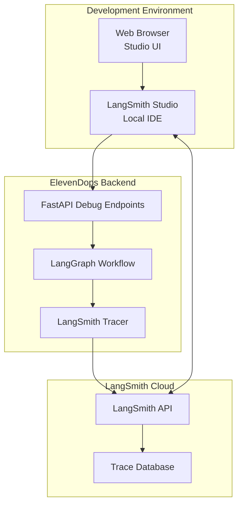

# Design Document: LangSmith Debug Integration

## Overview

This design implements LangSmith IDE debugging capabilities for the ElevenDops LangGraph agent workflow. The solution provides comprehensive tracing, visualization, and debugging tools for the script generation process while maintaining the existing architecture and performance characteristics.

## Architecture

### High-Level Architecture



### Component Integration

The LangSmith integration follows a non-invasive approach that enhances the existing LangGraph workflow without modifying core business logic:

1. **Tracing Layer**: Wraps existing workflow nodes with LangSmith tracing
2. **Debug API**: Provides dedicated endpoints for debugging workflow execution
3. **Local Studio**: Runs as a separate Node.js application for real-time debugging
4. **Configuration Management**: Environment-based setup for different deployment contexts

## Components and Interfaces

### 1. LangSmith Tracer Service

**Purpose**: Manages LangSmith tracing integration and configuration

**Key Methods**:
```python
class LangSmithTracer:
    def initialize_tracing(self) -> bool
    def create_traced_workflow(self, workflow: StateGraph) -> CompiledGraph
    def start_trace_session(self, session_name: str) -> str
    def end_trace_session(self, session_id: str) -> TraceMetadata
```

**Configuration**:
- Environment-based API key management
- Project and session naming conventions
- Trace level configuration (debug, info, error)
- Graceful degradation when LangSmith is unavailable

### 2. Enhanced LangGraph Workflow

**Purpose**: Extends existing workflow with tracing capabilities

**Tracing Integration Points**:
- Node entry/exit logging
- State transition tracking
- Error capture and context preservation
- Performance timing collection

**Modified Workflow Structure**:
```python
def create_traced_script_generation_graph():
    workflow = StateGraph(ScriptGenerationState)
    
    # Wrap nodes with tracing
    workflow.add_node("prepare_context", trace_node(prepare_context_node))
    workflow.add_node("generate_script", trace_node(generate_script_node))
    workflow.add_node("post_process", trace_node(post_process_node))
    
    # Add debug checkpoints
    workflow.add_node("debug_checkpoint", debug_checkpoint_node)
```

### 3. Debug API Endpoints

**Purpose**: Provides debugging-specific API endpoints

**Endpoints**:
```python
# Debug workflow execution
POST /api/debug/script-generation
GET /api/debug/traces/{trace_id}
GET /api/debug/sessions
POST /api/debug/sessions/{session_id}/replay

# Workflow introspection
GET /api/debug/workflow/graph
GET /api/debug/workflow/state-schema
```

**Request/Response Schemas**:
```python
class DebugExecutionRequest(BaseModel):
    knowledge_content: str
    prompt: str
    model_name: str
    debug_level: str = "info"
    session_name: Optional[str] = None

class DebugExecutionResponse(BaseModel):
    trace_id: str
    session_id: str
    execution_status: str
    generated_script: Optional[str]
    error_details: Optional[dict]
    langsmith_url: str
```

### 4. Local Studio Setup

**Purpose**: Provides local development environment for LangGraph debugging

**Technology Stack**:
- Node.js with pnpm package management
- LangGraph Studio (@langchain/langgraph-studio)
- React-based web interface
- WebSocket connection to backend

**Studio Configuration**:
```typescript
// langsmith-studio/studio.config.ts
export const studioConfig = {
  backend: {
    url: 'http://localhost:8000',
    debugEndpoint: '/api/debug'
  },
  langsmith: {
    apiKey: process.env.LANGCHAIN_API_KEY,
    project: 'elevendops-langgraph-debug'
  },
  ui: {
    port: 3001,
    autoRefresh: true
  }
}
```

## Data Models

### Trace Data Structure

```python
class WorkflowTrace(BaseModel):
    trace_id: str
    session_id: str
    workflow_name: str
    start_time: datetime
    end_time: Optional[datetime]
    status: TraceStatus
    input_data: dict
    output_data: Optional[dict]
    steps: List[TraceStep]
    metadata: dict

class TraceStep(BaseModel):
    step_id: str
    node_name: str
    start_time: datetime
    end_time: Optional[datetime]
    input_state: dict
    output_state: Optional[dict]
    error: Optional[str]
    duration_ms: Optional[int]
```

### Debug Session Management

```python
class DebugSession(BaseModel):
    session_id: str
    name: str
    created_at: datetime
    traces: List[str]  # trace_ids
    status: SessionStatus
    configuration: dict
```

## Correctness Properties

*A property is a characteristic or behavior that should hold true across all valid executions of a system-essentially, a formal statement about what the system should do. Properties serve as the bridge between human-readable specifications and machine-verifiable correctness guarantees.*

<function_calls>
<invoke name="prework">
<parameter name="featureName">langsmith-debug-integration

### Property Reflection

After reviewing the prework analysis, I identified several properties that can be consolidated:
- Properties 1.1, 1.4, and 3.1 all relate to trace data completeness and can be combined
- Properties 4.1, 4.2, and 4.5 all relate to configuration-based behavior and can be consolidated
- Properties 1.3 and 3.2 both relate to error handling and metadata capture

### Correctness Properties

**Property 1: Trace Data Completeness**
*For any* workflow execution with LangSmith enabled, all workflow steps should be recorded in the trace with complete input/output state data and the trace should be tagged with "elevendops-langgraph-debug"
**Validates: Requirements 1.1, 1.4, 1.5**

**Property 2: Configuration-Based Tracing**
*For any* environment configuration, when LangSmith API key is provided the system should enable tracing, and when tracing is disabled the system should still execute workflows successfully
**Validates: Requirements 4.1, 4.2, 4.5**

**Property 3: Error Capture Completeness**
*For any* workflow execution that encounters an error, the trace should contain detailed error information including stack traces, context, and additional debug metadata when debug mode is enabled
**Validates: Requirements 1.3, 3.2**

**Property 4: Graceful Degradation**
*For any* workflow execution, when LangSmith API is unavailable the workflow should complete successfully without tracing, maintaining the same output quality
**Validates: Requirements 4.3**

**Property 5: Debug API Trace ID Return**
*For any* debug endpoint execution, the response should contain a valid trace ID that can be used to retrieve trace data from LangSmith
**Validates: Requirements 3.3**

**Property 6: Input Validation Consistency**
*For any* debug API request, invalid inputs should be rejected with appropriate error messages, and valid inputs should be processed successfully
**Validates: Requirements 3.4**

**Property 7: Session Persistence**
*For any* debug session created, the session data should persist across application restarts and be retrievable by session ID
**Validates: Requirements 2.5**

**Property 8: Performance Timing Collection**
*For any* workflow execution, timing information should be captured for each workflow step with millisecond precision
**Validates: Requirements 5.3**

**Property 9: Trace Level Configuration**
*For any* configured trace level (debug, info, error), the system should capture trace data appropriate to that level, with debug level capturing the most detail
**Validates: Requirements 4.4**

## Error Handling

### LangSmith API Failures
- **Connection Timeout**: Gracefully degrade to local logging, continue workflow execution
- **Authentication Failure**: Log warning, disable tracing for session, maintain workflow functionality
- **Rate Limiting**: Implement exponential backoff, queue traces for retry
- **Service Unavailable**: Switch to offline mode, cache traces locally for later upload

### Workflow Tracing Errors
- **Serialization Failures**: Log error, continue with partial trace data
- **State Corruption**: Isolate corrupted state, continue tracing remaining steps
- **Memory Pressure**: Implement trace data compression and streaming

### Studio Connection Issues
- **Backend Unavailable**: Display connection status, provide offline mode
- **WebSocket Failures**: Implement automatic reconnection with exponential backoff
- **Version Mismatch**: Display compatibility warnings, graceful feature degradation

## Testing Strategy

### Unit Testing Approach
- **Tracer Service**: Test configuration loading, API connection, graceful degradation
- **Debug Endpoints**: Test request validation, response formatting, error handling
- **Workflow Integration**: Test trace data capture, state serialization, timing collection

### Property-Based Testing Configuration
- **Framework**: Hypothesis for Python backend, fast-check for Node.js studio
- **Test Iterations**: Minimum 100 iterations per property test
- **Test Data Generation**: 
  - Random workflow states and configurations
  - Various error conditions and API failures
  - Different trace levels and session configurations

### Integration Testing
- **End-to-End Workflow**: Test complete workflow execution with LangSmith integration
- **Studio Connectivity**: Test real-time trace visualization and debugging features
- **Multi-Environment**: Test configuration behavior across development, testing, and production environments

### Property Test Tags
Each property-based test will be tagged with:
**Feature: langsmith-debug-integration, Property {number}: {property_text}**

### Test Environment Setup
- **Mock LangSmith API**: For testing graceful degradation and error conditions
- **Local LangSmith Instance**: For integration testing with real API
- **Test Data Fixtures**: Predefined workflow states and trace data for consistent testing

## Implementation Notes

### Development Workflow
1. **Backend Integration**: Implement LangSmith tracer service and debug endpoints
2. **Workflow Enhancement**: Add tracing to existing LangGraph workflow
3. **Studio Setup**: Configure local Node.js environment with LangGraph Studio
4. **Testing Implementation**: Create comprehensive test suite with property-based tests
5. **Documentation**: Update development guides with debugging procedures

### Performance Considerations
- **Trace Data Size**: Implement configurable trace data limits and compression
- **Network Overhead**: Use asynchronous trace submission to avoid blocking workflow execution
- **Memory Usage**: Stream large trace data to avoid memory pressure
- **Local Caching**: Cache traces locally when LangSmith API is unavailable

### Security Considerations
- **API Key Management**: Secure storage and rotation of LangSmith API keys
- **Trace Data Privacy**: Ensure sensitive data is not included in traces
- **Network Security**: Use HTTPS for all LangSmith API communications
- **Access Control**: Implement proper authentication for debug endpoints