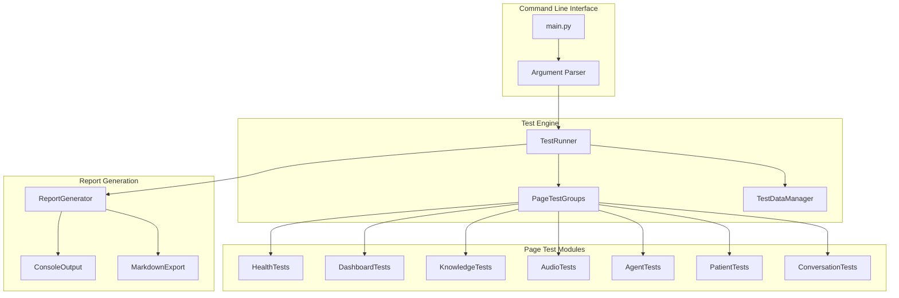

# Design Document: Page-Based API Testing Script

## Overview

This design describes a Python testing script that validates all backend API endpoints organized by Streamlit page. The script uses `httpx` for async HTTP requests, provides a CLI interface via `argparse`, and generates structured reports in console and Markdown formats.

## Architecture



## Components and Interfaces

### 1. Data Classes

```python
from dataclasses import dataclass, field
from datetime import datetime
from enum import Enum
from typing import Optional, List, Dict, Any

class TestStatus(Enum):
    PASSED = "passed"
    FAILED = "failed"
    SKIPPED = "skipped"

@dataclass
class TestResult:
    """Result of a single API test."""
    endpoint: str
    method: str
    status: TestStatus
    status_code: Optional[int] = None
    response_time_ms: Optional[float] = None
    error_message: Optional[str] = None
    response_data: Optional[Dict[str, Any]] = None

@dataclass
class PageTestResults:
    """Results for all tests in a page group."""
    page_name: str
    results: List[TestResult] = field(default_factory=list)
    
    @property
    def passed_count(self) -> int:
        return sum(1 for r in self.results if r.status == TestStatus.PASSED)
    
    @property
    def failed_count(self) -> int:
        return sum(1 for r in self.results if r.status == TestStatus.FAILED)
    
    @property
    def skipped_count(self) -> int:
        return sum(1 for r in self.results if r.status == TestStatus.SKIPPED)

@dataclass
class TestReport:
    """Complete test report."""
    timestamp: datetime
    duration_seconds: float
    backend_url: str
    page_results: List[PageTestResults] = field(default_factory=list)
    
    @property
    def total_tests(self) -> int:
        return sum(len(p.results) for p in self.page_results)
    
    @property
    def total_passed(self) -> int:
        return sum(p.passed_count for p in self.page_results)
    
    @property
    def total_failed(self) -> int:
        return sum(p.failed_count for p in self.page_results)
    
    @property
    def total_skipped(self) -> int:
        return sum(p.skipped_count for p in self.page_results)
    
    @property
    def pass_rate(self) -> float:
        executed = self.total_passed + self.total_failed
        return (self.total_passed / executed * 100) if executed > 0 else 0.0

@dataclass
class TestContext:
    """Shared context for test execution."""
    base_url: str
    timeout: float
    verbose: bool
    created_resources: Dict[str, List[str]] = field(default_factory=dict)
```

### 2. TestDataManager

Manages creation and cleanup of test data.

```python
class TestDataManager:
    """Manages test data lifecycle."""
    
    TEST_PREFIX = "TEST_API_"
    
    def __init__(self, context: TestContext):
        self.context = context
        self.client: Optional[httpx.AsyncClient] = None
    
    async def setup(self) -> None:
        """Initialize HTTP client."""
        self.client = httpx.AsyncClient(
            base_url=self.context.base_url,
            timeout=httpx.Timeout(self.context.timeout)
        )
    
    async def teardown(self) -> None:
        """Close HTTP client."""
        if self.client:
            await self.client.aclose()
    
    async def create_knowledge_document(self) -> Optional[str]:
        """Create a test knowledge document, return ID."""
        # Implementation creates document with TEST_PREFIX
        pass
    
    async def create_agent(self, knowledge_id: str) -> Optional[str]:
        """Create a test agent, return ID."""
        pass
    
    async def cleanup_all(self) -> None:
        """Delete all created test resources."""
        pass
```

### 3. BasePageTests

Abstract base class for page test groups.

```python
from abc import ABC, abstractmethod

class BasePageTests(ABC):
    """Base class for page-specific tests."""
    
    def __init__(self, context: TestContext, data_manager: TestDataManager):
        self.context = context
        self.data_manager = data_manager
        self.client: Optional[httpx.AsyncClient] = None
    
    @property
    @abstractmethod
    def page_name(self) -> str:
        """Return the page name for this test group."""
        pass
    
    @abstractmethod
    async def run_tests(self) -> PageTestResults:
        """Execute all tests for this page."""
        pass
    
    async def _make_request(
        self,
        method: str,
        endpoint: str,
        **kwargs
    ) -> TestResult:
        """Execute HTTP request and return TestResult."""
        start_time = time.time()
        try:
            response = await self.client.request(method, endpoint, **kwargs)
            elapsed_ms = (time.time() - start_time) * 1000
            
            status = TestStatus.PASSED if response.is_success else TestStatus.FAILED
            error_msg = None if response.is_success else response.text
            
            return TestResult(
                endpoint=endpoint,
                method=method,
                status=status,
                status_code=response.status_code,
                response_time_ms=elapsed_ms,
                error_message=error_msg,
                response_data=response.json() if response.is_success else None
            )
        except httpx.ConnectError as e:
            return TestResult(
                endpoint=endpoint,
                method=method,
                status=TestStatus.FAILED,
                error_message=f"Connection error: {e}"
            )
        except httpx.TimeoutException as e:
            elapsed_ms = (time.time() - start_time) * 1000
            return TestResult(
                endpoint=endpoint,
                method=method,
                status=TestStatus.FAILED,
                response_time_ms=elapsed_ms,
                error_message=f"Timeout: {e}"
            )
```

### 4. Page Test Implementations

#### HealthTests (Shared)
```python
class HealthTests(BasePageTests):
    page_name = "Health/Shared"
    
    async def run_tests(self) -> PageTestResults:
        results = PageTestResults(page_name=self.page_name)
        
        # GET /api/health
        results.results.append(
            await self._make_request("GET", "/api/health")
        )
        
        # GET /api/health/ready
        results.results.append(
            await self._make_request("GET", "/api/health/ready")
        )
        
        return results
```

#### DashboardTests
```python
class DashboardTests(BasePageTests):
    page_name = "1. Doctor Dashboard"
    
    async def run_tests(self) -> PageTestResults:
        results = PageTestResults(page_name=self.page_name)
        
        # GET /api/dashboard/stats
        results.results.append(
            await self._make_request("GET", "/api/dashboard/stats")
        )
        
        return results
```

#### KnowledgeTests
```python
class KnowledgeTests(BasePageTests):
    page_name = "2. Upload Knowledge"
    
    async def run_tests(self) -> PageTestResults:
        results = PageTestResults(page_name=self.page_name)
        
        # POST /api/knowledge - Create
        create_result = await self._make_request(
            "POST", "/api/knowledge",
            json={
                "disease_name": f"{TestDataManager.TEST_PREFIX}Disease",
                "document_type": "overview",
                "raw_content": "Test content for API testing"
            }
        )
        results.results.append(create_result)
        
        knowledge_id = None
        if create_result.status == TestStatus.PASSED:
            knowledge_id = create_result.response_data.get("knowledge_id")
            self.data_manager.context.created_resources.setdefault(
                "knowledge", []
            ).append(knowledge_id)
        
        # GET /api/knowledge - List
        results.results.append(
            await self._make_request("GET", "/api/knowledge")
        )
        
        # GET /api/knowledge/{id} - Get single
        if knowledge_id:
            results.results.append(
                await self._make_request("GET", f"/api/knowledge/{knowledge_id}")
            )
        else:
            results.results.append(TestResult(
                endpoint="/api/knowledge/{id}",
                method="GET",
                status=TestStatus.SKIPPED,
                error_message="Skipped: No knowledge_id from create"
            ))
        
        # POST /api/knowledge/{id}/retry-sync
        if knowledge_id:
            results.results.append(
                await self._make_request("POST", f"/api/knowledge/{knowledge_id}/retry-sync")
            )
        else:
            results.results.append(TestResult(
                endpoint="/api/knowledge/{id}/retry-sync",
                method="POST",
                status=TestStatus.SKIPPED,
                error_message="Skipped: No knowledge_id from create"
            ))
        
        # DELETE /api/knowledge/{id} - tested in cleanup
        # We'll test delete with a separate document to not break other tests
        
        return results
```

#### AudioTests
```python
class AudioTests(BasePageTests):
    page_name = "3. Education Audio"
    
    async def run_tests(self) -> PageTestResults:
        results = PageTestResults(page_name=self.page_name)
        
        # Need a knowledge_id for audio tests
        knowledge_id = await self.data_manager.create_knowledge_document()
        
        # GET /api/audio/voices/list
        results.results.append(
            await self._make_request("GET", "/api/audio/voices/list")
        )
        
        # POST /api/audio/generate-script
        if knowledge_id:
            results.results.append(
                await self._make_request(
                    "POST", "/api/audio/generate-script",
                    json={"knowledge_id": knowledge_id}
                )
            )
        else:
            results.results.append(TestResult(
                endpoint="/api/audio/generate-script",
                method="POST",
                status=TestStatus.SKIPPED,
                error_message="Skipped: No knowledge document available"
            ))
        
        # POST /api/audio/generate (requires voice_id and script)
        # This test may be skipped if voices aren't available
        
        # GET /api/audio/{knowledge_id}
        if knowledge_id:
            results.results.append(
                await self._make_request("GET", f"/api/audio/{knowledge_id}")
            )
        else:
            results.results.append(TestResult(
                endpoint="/api/audio/{knowledge_id}",
                method="GET",
                status=TestStatus.SKIPPED,
                error_message="Skipped: No knowledge document available"
            ))
        
        return results
```

#### AgentTests
```python
class AgentTests(BasePageTests):
    page_name = "4. Agent Setup"
    
    async def run_tests(self) -> PageTestResults:
        results = PageTestResults(page_name=self.page_name)
        
        # Need knowledge for agent creation
        knowledge_id = await self.data_manager.create_knowledge_document()
        
        # POST /api/agent - Create
        agent_id = None
        if knowledge_id:
            create_result = await self._make_request(
                "POST", "/api/agent",
                json={
                    "name": f"{TestDataManager.TEST_PREFIX}Agent",
                    "knowledge_ids": [knowledge_id],
                    "voice_id": "test_voice",
                    "answer_style": "professional",
                    "doctor_id": "test_doctor"
                }
            )
            results.results.append(create_result)
            
            if create_result.status == TestStatus.PASSED:
                agent_id = create_result.response_data.get("agent_id")
                self.data_manager.context.created_resources.setdefault(
                    "agent", []
                ).append(agent_id)
        else:
            results.results.append(TestResult(
                endpoint="/api/agent",
                method="POST",
                status=TestStatus.SKIPPED,
                error_message="Skipped: No knowledge document available"
            ))
        
        # GET /api/agent - List
        results.results.append(
            await self._make_request("GET", "/api/agent")
        )
        
        # DELETE /api/agent/{id} - tested separately
        
        return results
```

#### PatientTests
```python
class PatientTests(BasePageTests):
    page_name = "5. Patient Test"
    
    async def run_tests(self) -> PageTestResults:
        results = PageTestResults(page_name=self.page_name)
        
        # Need an agent for patient session
        knowledge_id = await self.data_manager.create_knowledge_document()
        agent_id = await self.data_manager.create_agent(knowledge_id) if knowledge_id else None
        
        # POST /api/patient/session - Create session
        session_id = None
        if agent_id:
            create_result = await self._make_request(
                "POST", "/api/patient/session",
                json={
                    "patient_id": f"{TestDataManager.TEST_PREFIX}Patient",
                    "agent_id": agent_id
                }
            )
            results.results.append(create_result)
            
            if create_result.status == TestStatus.PASSED:
                session_id = create_result.response_data.get("session_id")
        else:
            results.results.append(TestResult(
                endpoint="/api/patient/session",
                method="POST",
                status=TestStatus.SKIPPED,
                error_message="Skipped: No agent available"
            ))
        
        # POST /api/patient/session/{id}/message
        if session_id:
            results.results.append(
                await self._make_request(
                    "POST", f"/api/patient/session/{session_id}/message",
                    json={"message": "Test message"}
                )
            )
        else:
            results.results.append(TestResult(
                endpoint="/api/patient/session/{id}/message",
                method="POST",
                status=TestStatus.SKIPPED,
                error_message="Skipped: No session available"
            ))
        
        # POST /api/patient/session/{id}/end
        if session_id:
            results.results.append(
                await self._make_request(
                    "POST", f"/api/patient/session/{session_id}/end"
                )
            )
        else:
            results.results.append(TestResult(
                endpoint="/api/patient/session/{id}/end",
                method="POST",
                status=TestStatus.SKIPPED,
                error_message="Skipped: No session available"
            ))
        
        return results
```

#### ConversationTests
```python
class ConversationTests(BasePageTests):
    page_name = "6. Conversation Logs"
    
    async def run_tests(self) -> PageTestResults:
        results = PageTestResults(page_name=self.page_name)
        
        # GET /api/conversations - List
        list_result = await self._make_request("GET", "/api/conversations")
        results.results.append(list_result)
        
        # GET /api/conversations/statistics
        results.results.append(
            await self._make_request("GET", "/api/conversations/statistics")
        )
        
        # GET /api/conversations/{id} - Get detail
        # Try to get a conversation_id from the list
        conversation_id = None
        if list_result.status == TestStatus.PASSED:
            conversations = list_result.response_data.get("conversations", [])
            if conversations:
                conversation_id = conversations[0].get("conversation_id")
        
        if conversation_id:
            results.results.append(
                await self._make_request("GET", f"/api/conversations/{conversation_id}")
            )
        else:
            results.results.append(TestResult(
                endpoint="/api/conversations/{id}",
                method="GET",
                status=TestStatus.SKIPPED,
                error_message="Skipped: No conversations available"
            ))
        
        return results
```

### 5. TestRunner

Orchestrates test execution.

```python
class TestRunner:
    """Orchestrates test execution across all page groups."""
    
    PAGE_ORDER = [
        "Health/Shared",
        "1. Doctor Dashboard",
        "2. Upload Knowledge",
        "3. Education Audio",
        "4. Agent Setup",
        "5. Patient Test",
        "6. Conversation Logs"
    ]
    
    def __init__(self, context: TestContext):
        self.context = context
        self.data_manager = TestDataManager(context)
        self.test_classes = {
            "Health/Shared": HealthTests,
            "1. Doctor Dashboard": DashboardTests,
            "2. Upload Knowledge": KnowledgeTests,
            "3. Education Audio": AudioTests,
            "4. Agent Setup": AgentTests,
            "5. Patient Test": PatientTests,
            "6. Conversation Logs": ConversationTests,
        }
    
    async def run(self, page_filter: Optional[str] = None) -> TestReport:
        """Run all tests and return report."""
        start_time = time.time()
        
        await self.data_manager.setup()
        
        try:
            page_results = []
            pages_to_run = [page_filter] if page_filter else self.PAGE_ORDER
            
            for page_name in pages_to_run:
                if page_name not in self.test_classes:
                    continue
                    
                if self.context.verbose:
                    print(f"\n{'='*50}")
                    print(f"Testing: {page_name}")
                    print('='*50)
                
                test_class = self.test_classes[page_name]
                test_instance = test_class(self.context, self.data_manager)
                
                async with httpx.AsyncClient(
                    base_url=self.context.base_url,
                    timeout=httpx.Timeout(self.context.timeout)
                ) as client:
                    test_instance.client = client
                    results = await test_instance.run_tests()
                    page_results.append(results)
                    
                    if self.context.verbose:
                        for r in results.results:
                            status_icon = "✓" if r.status == TestStatus.PASSED else "✗" if r.status == TestStatus.FAILED else "○"
                            print(f"  {status_icon} {r.method} {r.endpoint}")
            
            return TestReport(
                timestamp=datetime.now(),
                duration_seconds=time.time() - start_time,
                backend_url=self.context.base_url,
                page_results=page_results
            )
        finally:
            await self.data_manager.cleanup_all()
            await self.data_manager.teardown()
```

### 6. ReportGenerator

Generates console and file output.

```python
class ReportGenerator:
    """Generates test reports in various formats."""
    
    @staticmethod
    def print_console(report: TestReport) -> None:
        """Print report to console with colors."""
        print("\n" + "="*60)
        print("API TEST REPORT")
        print("="*60)
        print(f"Timestamp: {report.timestamp.isoformat()}")
        print(f"Backend URL: {report.backend_url}")
        print(f"Duration: {report.duration_seconds:.2f}s")
        print()
        
        # Summary
        print("SUMMARY")
        print("-"*40)
        print(f"Total Tests: {report.total_tests}")
        print(f"Passed: {report.total_passed}")
        print(f"Failed: {report.total_failed}")
        print(f"Skipped: {report.total_skipped}")
        print(f"Pass Rate: {report.pass_rate:.1f}%")
        print()
        
        # Per-page results
        for page in report.page_results:
            status = "✓" if page.failed_count == 0 else "✗"
            print(f"\n{status} {page.page_name}")
            print(f"  Passed: {page.passed_count}, Failed: {page.failed_count}, Skipped: {page.skipped_count}")
            
            for result in page.results:
                if result.status == TestStatus.FAILED:
                    print(f"    ✗ {result.method} {result.endpoint}")
                    print(f"      Error: {result.error_message}")
    
    @staticmethod
    def export_markdown(report: TestReport, filepath: str) -> None:
        """Export report to Markdown file."""
        lines = [
            "# API Test Report",
            "",
            f"**Timestamp:** {report.timestamp.isoformat()}",
            f"**Backend URL:** {report.backend_url}",
            f"**Duration:** {report.duration_seconds:.2f}s",
            "",
            "## Summary",
            "",
            f"| Metric | Value |",
            f"|--------|-------|",
            f"| Total Tests | {report.total_tests} |",
            f"| Passed | {report.total_passed} |",
            f"| Failed | {report.total_failed} |",
            f"| Skipped | {report.total_skipped} |",
            f"| Pass Rate | {report.pass_rate:.1f}% |",
            "",
            "## Results by Page",
            ""
        ]
        
        for page in report.page_results:
            status = "✅" if page.failed_count == 0 else "❌"
            lines.append(f"### {status} {page.page_name}")
            lines.append("")
            lines.append(f"Passed: {page.passed_count} | Failed: {page.failed_count} | Skipped: {page.skipped_count}")
            lines.append("")
            lines.append("| Method | Endpoint | Status | Time (ms) | Error |")
            lines.append("|--------|----------|--------|-----------|-------|")
            
            for r in page.results:
                status_icon = "✅" if r.status == TestStatus.PASSED else "❌" if r.status == TestStatus.FAILED else "⏭️"
                time_str = f"{r.response_time_ms:.0f}" if r.response_time_ms else "-"
                error_str = r.error_message[:50] + "..." if r.error_message and len(r.error_message) > 50 else (r.error_message or "-")
                lines.append(f"| {r.method} | {r.endpoint} | {status_icon} | {time_str} | {error_str} |")
            
            lines.append("")
        
        with open(filepath, "w", encoding="utf-8") as f:
            f.write("\n".join(lines))
```

## Data Models

### API to Page Mapping

| Page | APIs Used |
|------|-----------|
| Health/Shared | GET /api/health, GET /api/health/ready |
| 1. Doctor Dashboard | GET /api/dashboard/stats |
| 2. Upload Knowledge | POST /api/knowledge, GET /api/knowledge, GET /api/knowledge/{id}, DELETE /api/knowledge/{id}, POST /api/knowledge/{id}/retry-sync |
| 3. Education Audio | GET /api/audio/voices/list, POST /api/audio/generate-script, POST /api/audio/generate, GET /api/audio/{knowledge_id} |
| 4. Agent Setup | POST /api/agent, GET /api/agent, DELETE /api/agent/{id} |
| 5. Patient Test | POST /api/patient/session, POST /api/patient/session/{id}/message, POST /api/patient/session/{id}/end |
| 6. Conversation Logs | GET /api/conversations, GET /api/conversations/statistics, GET /api/conversations/{id} |


## Correctness Properties

*A property is a characteristic or behavior that should hold true across all valid executions of a system—essentially, a formal statement about what the system should do. Properties serve as the bridge between human-readable specifications and machine-verifiable correctness guarantees.*

### Property 1: API-to-Page Mapping Completeness

*For any* API endpoint defined in the backend, it SHALL be mapped to exactly one page group, and the mapping SHALL include all endpoints from the BackendAPIClient.

**Validates: Requirements 1.1, 1.3, 2.1-2.7**

### Property 2: Test Execution Order Preservation

*For any* test run, the page results SHALL appear in the defined PAGE_ORDER sequence (Health/Shared → Dashboard → Knowledge → Audio → Agent → Patient → Conversation).

**Validates: Requirements 1.2**

### Property 3: TestResult Field Completeness

*For any* TestResult object:
- If status is PASSED: endpoint, method, status_code, response_time_ms SHALL be non-null
- If status is FAILED: endpoint, method, error_message SHALL be non-null
- If status is SKIPPED: endpoint, method, error_message SHALL be non-null

**Validates: Requirements 3.1, 3.2**

### Property 4: Connection Error Graceful Handling

*For any* API request that encounters a connection error, the Test_Script SHALL return a TestResult with status=FAILED and a descriptive error_message, rather than raising an unhandled exception.

**Validates: Requirements 3.3**

### Property 5: TestReport Structure Completeness

*For any* TestReport object:
- timestamp SHALL be a valid datetime
- duration_seconds SHALL be a positive number
- page_results SHALL contain results for all tested pages
- Each PageTestResults SHALL have page_name and results list
- total_tests SHALL equal sum of all page result counts

**Validates: Requirements 4.1, 4.2, 4.4**

### Property 6: Failed Test Error Visibility

*For any* TestResult with status=FAILED in a TestReport, the error_message SHALL be included in both console output and Markdown export.

**Validates: Requirements 4.3**

### Property 7: Test Data Prefix Consistency

*For any* test data created by TestDataManager, the name/identifier SHALL contain the TEST_PREFIX ("TEST_API_").

**Validates: Requirements 5.1, 5.3**

### Property 8: Page Filter Isolation

*For any* test run with --page filter specified, the TestReport.page_results SHALL contain exactly one PageTestResults matching the filter, and no results from other pages.

**Validates: Requirements 6.2**

### Property 9: Dependency Skip Propagation

*For any* test that depends on a prerequisite test, IF the prerequisite has status=FAILED, THEN the dependent test SHALL have status=SKIPPED with an error_message explaining the skip reason.

**Validates: Requirements 7.1, 7.2**

### Property 10: Skipped Test Distinct Reporting

*For any* TestReport, skipped tests SHALL be counted separately from passed and failed tests, and total_skipped SHALL equal the count of results with status=SKIPPED.

**Validates: Requirements 7.3**

## Error Handling

### Connection Errors
- Catch `httpx.ConnectError` and return TestResult with FAILED status
- Include connection error details in error_message
- Continue testing other endpoints

### Timeout Errors
- Catch `httpx.TimeoutException` and return TestResult with FAILED status
- Include timeout duration in error_message
- Record partial response_time_ms if available

### HTTP Errors (4xx, 5xx)
- Record actual status_code in TestResult
- Set status to FAILED for non-2xx responses
- Include response body in error_message (truncated if too long)

### Test Data Cleanup Errors
- Log warning but don't fail the test run
- Continue with remaining cleanup operations
- Report cleanup failures in verbose mode

### Invalid Response Format
- Catch JSON decode errors
- Set status to FAILED with descriptive error
- Include raw response snippet in error_message

## Testing Strategy

### Property-Based Testing

Use **Hypothesis** for property-based testing with minimum 100 iterations per property.

```python
from hypothesis import given, strategies as st, settings

@settings(max_examples=100)
@given(st.lists(st.sampled_from(["PASSED", "FAILED", "SKIPPED"])))
def test_report_counts_consistency(statuses):
    """Property 5: TestReport counts are consistent."""
    # Create TestResults with given statuses
    # Verify total_tests == passed + failed + skipped
```

### Unit Tests

Focus on:
- CLI argument parsing
- Individual page test execution
- Report generation formats
- Test data creation/cleanup

### Integration Tests

- Full test run against mock backend
- Verify end-to-end report generation
- Test cleanup behavior

### Test File Structure

```
tests/
  test_api_testing_script_props.py  # Property-based tests
  test_api_testing_script_unit.py   # Unit tests
```

### Test Annotations

Each property test must be annotated with:
```python
# Feature: page-based-api-testing, Property 1: API-to-Page Mapping Completeness
# Validates: Requirements 1.1, 1.3, 2.1-2.7
```
