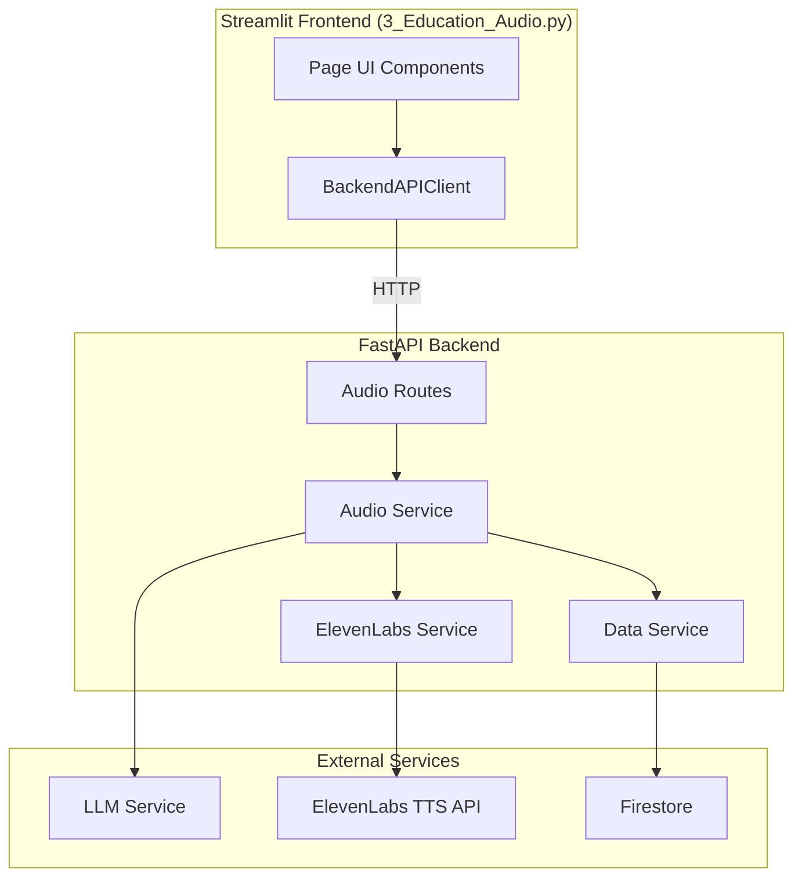
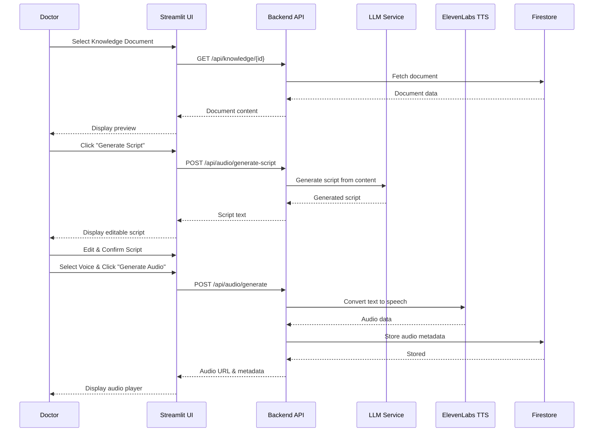

# Education Audio Page Design Document

## Overview

The Education Audio page (3_Education_Audio.py) provides doctors with a workflow to transform uploaded knowledge documents into patient education audio files. The system follows a multi-step process: document selection → script generation → doctor review → audio generation → playback/management.

The architecture maintains strict separation of concerns where Streamlit handles only UI presentation and user interactions, while all business logic (LLM script generation, TTS conversion, storage) is handled by the FastAPI backend. This design ensures future compatibility with Next.js/TypeScript frontend migration.

## Architecture



### Data Flow



## Components and Interfaces

### Frontend Components (Streamlit)

#### 3_Education_Audio.py

Main page component with the following UI sections:

1. **Document Selection Section**
   - Dropdown for knowledge document selection
   - Read-only text area for content preview
   - Info message when no documents available

2. **Script Generation Section**
   - "Generate Script Preview" button
   - Loading spinner during generation
   - Editable text area for script content
   - "Reset Script" button

3. **Confirmation Section**
   - Checkbox for doctor confirmation
   - Confirmation status indicator

4. **Voice Selection Section**
   - Dropdown for voice model selection
   - Voice preview capability (future enhancement)

5. **Audio Generation Section**
   - "Generate Audio" button (enabled only after confirmation)
   - Loading spinner during generation
   - Audio player component
   - Audio URL display

6. **Audio History Section**
   - List of previously generated audio files
   - Selection to load into player

#### BackendAPIClient Extensions

New methods to add to `streamlit_app/services/backend_api.py`:

```python
async def generate_script(self, knowledge_id: str) -> ScriptResponse
async def generate_audio(self, request: AudioGenerateRequest) -> AudioResponse
async def get_audio_files(self, knowledge_id: str) -> List[AudioMetadata]
async def get_available_voices(self) -> List[VoiceOption]
```

### Backend Components (FastAPI)

#### Audio Routes (`backend/api/routes/audio.py`)

| Endpoint | Method | Description |
|----------|--------|-------------|
| `/api/audio/generate-script` | POST | Generate script from knowledge document |
| `/api/audio/generate` | POST | Generate audio from script |
| `/api/audio/{knowledge_id}` | GET | Get audio files for a document |
| `/api/audio/voices` | GET | Get available voice options |

#### Audio Service (`backend/services/audio_service.py`)

Handles business logic for script and audio generation:

- `generate_script(knowledge_id: str) -> str`: Fetches document and generates audio-optimized script
- `generate_audio(script: str, voice_id: str, knowledge_id: str) -> AudioMetadata`: Converts script to audio
- `get_audio_files(knowledge_id: str) -> List[AudioMetadata]`: Retrieves audio history
- `get_available_voices() -> List[VoiceOption]`: Returns configured voice options

#### ElevenLabs Service Extensions

New methods to add to `backend/services/elevenlabs_service.py`:

```python
def text_to_speech(self, text: str, voice_id: str) -> bytes
def get_voices(self) -> List[dict]
```

## Data Models

### Request/Response Models (`backend/models/schemas.py`)

```python
class ScriptGenerateRequest(BaseModel):
    knowledge_id: str = Field(..., description="ID of the knowledge document")

class ScriptGenerateResponse(BaseModel):
    script: str = Field(..., description="Generated script text")
    knowledge_id: str = Field(..., description="Source document ID")
    generated_at: datetime = Field(..., description="Generation timestamp")

class AudioGenerateRequest(BaseModel):
    knowledge_id: str = Field(..., description="Source document ID")
    script: str = Field(..., min_length=1, max_length=50000, description="Script to convert")
    voice_id: str = Field(..., description="ElevenLabs voice ID")

class AudioGenerateResponse(BaseModel):
    audio_id: str = Field(..., description="Unique audio file ID")
    audio_url: str = Field(..., description="URL to access the audio")
    knowledge_id: str = Field(..., description="Source document ID")
    voice_id: str = Field(..., description="Voice used for generation")
    duration_seconds: Optional[float] = Field(None, description="Audio duration")
    script: str = Field(..., description="Script used for generation")
    created_at: datetime = Field(..., description="Creation timestamp")

class AudioMetadata(BaseModel):
    audio_id: str
    audio_url: str
    knowledge_id: str
    voice_id: str
    duration_seconds: Optional[float]
    script: str
    created_at: datetime

class AudioListResponse(BaseModel):
    audio_files: List[AudioMetadata]
    total_count: int

class VoiceOption(BaseModel):
    voice_id: str = Field(..., description="ElevenLabs voice ID")
    name: str = Field(..., description="Display name")
    description: Optional[str] = Field(None, description="Voice description")
    preview_url: Optional[str] = Field(None, description="Voice preview audio URL")
```

### Frontend Models (`streamlit_app/services/models.py`)

```python
@dataclass
class ScriptResponse:
    script: str
    knowledge_id: str
    generated_at: datetime

@dataclass
class AudioResponse:
    audio_id: str
    audio_url: str
    knowledge_id: str
    voice_id: str
    duration_seconds: Optional[float]
    script: str
    created_at: datetime

@dataclass
class VoiceOption:
    voice_id: str
    name: str
    description: Optional[str] = None
    preview_url: Optional[str] = None
```


## Correctness Properties

*A property is a characteristic or behavior that should hold true across all valid executions of a system-essentially, a formal statement about what the system should do. Properties serve as the bridge between human-readable specifications and machine-verifiable correctness guarantees.*

Based on the prework analysis, the following properties have been identified. After reflection to eliminate redundancy:

- Properties 1.1 and 4.1 (dropdown displays items from API) can be combined into a general "API data display" property
- Properties 2.3, 5.3, 5.4 (successful response displays result) follow the same pattern
- Properties 2.4 and 5.5 (error handling) can be combined
- Properties 8.1, 8.2, 8.3 (confirmation workflow) are related but test distinct state transitions

### Property 1: Document Selection Displays All Available Documents

*For any* list of knowledge documents returned by the backend API, the document selection dropdown SHALL contain exactly those documents with their disease names and document types displayed.

**Validates: Requirements 1.1**

### Property 2: Selected Document Content Display

*For any* knowledge document selected from the dropdown, the content preview area SHALL display the exact content of that document as returned by the API.

**Validates: Requirements 1.2**

### Property 3: Script Generation API Call Correctness

*For any* selected knowledge document, when script generation is triggered, the backend API SHALL be called with the correct knowledge_id parameter.

**Validates: Requirements 2.1**

### Property 4: Successful Response Display

*For any* successful API response (script generation or audio generation), the system SHALL display the returned data (script text or audio URL) in the appropriate UI component.

**Validates: Requirements 2.3, 5.3, 5.4**

### Property 5: Error Response Display

*For any* failed API response (script generation or audio generation), the system SHALL display an error message containing the failure reason from the response.

**Validates: Requirements 2.4, 5.5**

### Property 6: Script Edit Preservation

*For any* script modification made by the doctor, the edited content SHALL be the exact content sent to the audio generation API.

**Validates: Requirements 3.2**

### Property 7: Script Reset Restoration

*For any* script that has been edited, clicking reset SHALL restore the script content to exactly match the original generated script.

**Validates: Requirements 3.3**

### Property 8: Voice Selection Propagation

*For any* voice selected from the dropdown, the audio generation API request SHALL contain that exact voice_id.

**Validates: Requirements 4.1, 4.2**

### Property 9: Audio History Display

*For any* list of audio files returned by the backend API for a knowledge document, the audio history section SHALL display exactly those audio files.

**Validates: Requirements 6.2**

### Property 10: Audio Selection Loads Player

*For any* audio file selected from the history list, the audio player SHALL be configured with that audio file's URL.

**Validates: Requirements 6.3**

### Property 11: Confirmation Required for Audio Generation

*For any* state where the script has not been confirmed, the audio generation button SHALL be disabled.

**Validates: Requirements 8.1, 8.2**

### Property 12: Edit Invalidates Confirmation

*For any* confirmed script, if the script content is modified, the confirmation state SHALL be reset to unconfirmed.

**Validates: Requirements 8.3**

## Error Handling

### Frontend Error Handling

| Error Type | Handling Strategy |
|------------|-------------------|
| API Connection Error | Display "Unable to connect to server" message with retry option |
| API Timeout | Display "Request timed out" message with retry option |
| Script Generation Failure | Display error message from API, allow retry |
| Audio Generation Failure | Display error message from API, allow retry |
| Invalid Voice Selection | Prevent submission, show validation message |

### Backend Error Handling

| Error Type | HTTP Status | Response |
|------------|-------------|----------|
| Knowledge document not found | 404 | `{"detail": "Document not found", "error_code": "DOCUMENT_NOT_FOUND"}` |
| LLM service unavailable | 503 | `{"detail": "Script generation service unavailable", "error_code": "LLM_UNAVAILABLE"}` |
| ElevenLabs API error | 502 | `{"detail": "Audio generation failed: {reason}", "error_code": "TTS_ERROR"}` |
| Invalid voice ID | 400 | `{"detail": "Invalid voice ID", "error_code": "INVALID_VOICE"}` |
| Script too long | 400 | `{"detail": "Script exceeds maximum length", "error_code": "SCRIPT_TOO_LONG"}` |

### Retry Mechanism

The backend implements exponential backoff retry for ElevenLabs API calls:
- Maximum 3 retries
- Initial delay: 1 second
- Backoff multiplier: 2

## Testing Strategy

### Property-Based Testing Framework

The project uses **Hypothesis** for property-based testing in Python, as established in the existing test suite.

### Unit Tests

Unit tests cover:
- API client methods for correct request/response handling
- Schema validation for request/response models
- Service layer business logic
- Error handling paths

### Property-Based Tests

Each correctness property is implemented as a property-based test using Hypothesis:

1. **Property tests for API client** (`tests/test_audio_api_props.py`):
   - Test that API responses are correctly parsed into models
   - Test that requests contain correct parameters

2. **Property tests for schemas** (`tests/test_audio_schemas_props.py`):
   - Test model validation rules
   - Test serialization/deserialization round-trips

3. **Property tests for service layer** (`tests/test_audio_service_props.py`):
   - Test business logic correctness
   - Test state management

### Test Configuration

- Minimum 100 iterations per property test
- Each property test tagged with format: `**Feature: education-audio-page, Property {number}: {property_text}**`

### Test File Structure

```
tests/
├── test_audio_api_props.py      # Property tests for API client
├── test_audio_schemas_props.py  # Property tests for schemas
├── test_audio_service_props.py  # Property tests for service layer
└── test_audio_unit.py           # Unit tests for edge cases
```
