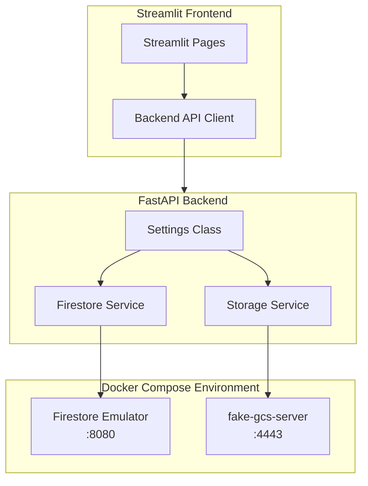
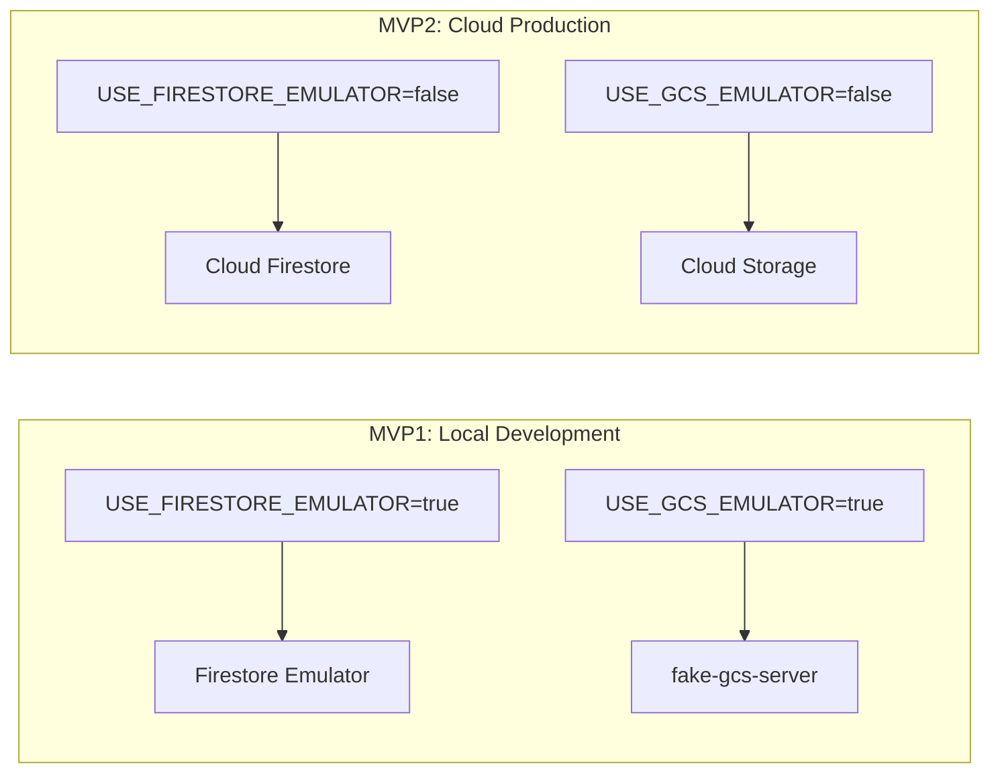

# Design Document: Local Development Infrastructure Setup

## Overview

This specification establishes the local development infrastructure for the ElevenDops medical assistant system. The infrastructure consists of:

1. **Firestore Emulator** - Local database that mirrors Google Cloud Firestore
2. **fake-gcs-server** - Local storage that mirrors Google Cloud Storage
3. **Configuration System** - Environment-based settings for seamless local/production switching

The key design principle is **zero code changes** between MVP1 (local) and MVP2 (cloud). Only configuration values change.

## Architecture



### Environment Switching



## Components and Interfaces

### 1. Docker Compose Configuration

**File**: `docker-compose.dev.yml`

```yaml
version: '3.8'

services:
  firestore-emulator:
    image: google/cloud-sdk:emulators
    command: >
      gcloud emulators firestore start
      --host-port=0.0.0.0:8080
      --project=elevenlabs-local
    ports:
      - "8080:8080"
    healthcheck:
      test: ["CMD", "curl", "-f", "http://localhost:8080/"]
      interval: 10s
      timeout: 5s
      retries: 5

  gcs-emulator:
    image: fsouza/fake-gcs-server
    ports:
      - "4443:4443"
    command: -scheme http -port 4443 -backend memory
    healthcheck:
      test: ["CMD", "curl", "-f", "http://localhost:4443/storage/v1/b"]
      interval: 10s
      timeout: 5s
      retries: 5
```

### 2. Settings Class

**File**: `backend/config.py`

```python
import os
from functools import lru_cache
from pydantic_settings import BaseSettings


class Settings(BaseSettings):
    """Application settings with environment variable support."""
    
    # Firestore Configuration
    USE_FIRESTORE_EMULATOR: bool = True
    FIRESTORE_EMULATOR_HOST: str = "localhost:8080"
    GOOGLE_CLOUD_PROJECT: str = "elevenlabs-local"
    
    # GCS Configuration
    USE_GCS_EMULATOR: bool = True
    GCS_EMULATOR_HOST: str = "http://localhost:4443"
    GCS_BUCKET_NAME: str = "elevenlabs-audio"
    
    # ElevenLabs Configuration (always real API)
    ELEVENLABS_API_KEY: str = ""
    
    # Application Configuration
    DEBUG: bool = True
    LOG_LEVEL: str = "INFO"
    
    class Config:
        env_file = ".env"
        env_file_encoding = "utf-8"


@lru_cache()
def get_settings() -> Settings:
    """Get cached settings instance."""
    return Settings()
```

### 3. Firestore Service

**File**: `backend/services/firestore_service.py`

```python
import os
import logging
from google.cloud import firestore
from backend.config import get_settings

logger = logging.getLogger(__name__)


class FirestoreService:
    """Firestore client that works with both emulator and production."""
    
    _instance = None
    _db = None
    
    def __new__(cls):
        if cls._instance is None:
            cls._instance = super().__new__(cls)
        return cls._instance
    
    def __init__(self):
        if self._db is not None:
            return
            
        settings = get_settings()
        
        if settings.USE_FIRESTORE_EMULATOR:
            # Set emulator host before creating client
            os.environ["FIRESTORE_EMULATOR_HOST"] = settings.FIRESTORE_EMULATOR_HOST
            logger.info(f"Connecting to Firestore Emulator at {settings.FIRESTORE_EMULATOR_HOST}")
        else:
            # Remove emulator host if set (for production)
            os.environ.pop("FIRESTORE_EMULATOR_HOST", None)
            logger.info("Connecting to production Firestore")
        
        try:
            self._db = firestore.Client(project=settings.GOOGLE_CLOUD_PROJECT)
            logger.info("Firestore client initialized successfully")
        except Exception as e:
            logger.error(f"Failed to initialize Firestore client: {e}")
            raise
    
    @property
    def db(self) -> firestore.Client:
        """Get the Firestore client instance."""
        return self._db
    
    def health_check(self) -> bool:
        """Check if Firestore is accessible."""
        try:
            # Try to access a collection (doesn't need to exist)
            self._db.collection("_health_check").limit(1).get()
            return True
        except Exception as e:
            logger.error(f"Firestore health check failed: {e}")
            return False


def get_firestore_service() -> FirestoreService:
    """Get the Firestore service instance."""
    return FirestoreService()
```

### 4. Storage Service

**File**: `backend/services/storage_service.py`

```python
import logging
from google.cloud import storage
from google.auth.credentials import AnonymousCredentials
from backend.config import get_settings

logger = logging.getLogger(__name__)


class StorageService:
    """GCS client that works with both fake-gcs-server and production."""
    
    _instance = None
    _client = None
    _bucket = None
    
    def __new__(cls):
        if cls._instance is None:
            cls._instance = super().__new__(cls)
        return cls._instance
    
    def __init__(self):
        if self._client is not None:
            return
            
        settings = get_settings()
        self._bucket_name = settings.GCS_BUCKET_NAME
        
        try:
            if settings.USE_GCS_EMULATOR:
                logger.info(f"Connecting to GCS Emulator at {settings.GCS_EMULATOR_HOST}")
                self._client = storage.Client(
                    credentials=AnonymousCredentials(),
                    project=settings.GOOGLE_CLOUD_PROJECT,
                )
                # Override the API endpoint for emulator
                self._client._http._base_url = settings.GCS_EMULATOR_HOST
            else:
                logger.info("Connecting to production GCS")
                self._client = storage.Client()
            
            self._ensure_bucket_exists()
            logger.info("Storage client initialized successfully")
            
        except Exception as e:
            logger.error(f"Failed to initialize Storage client: {e}")
            raise
    
    def _ensure_bucket_exists(self):
        """Create bucket if it doesn't exist (for emulator)."""
        settings = get_settings()
        try:
            self._bucket = self._client.get_bucket(self._bucket_name)
            logger.info(f"Bucket '{self._bucket_name}' exists")
        except Exception:
            if settings.USE_GCS_EMULATOR:
                logger.info(f"Creating bucket '{self._bucket_name}' in emulator")
                self._bucket = self._client.create_bucket(self._bucket_name)
            else:
                raise
    
    def upload_file(self, data: bytes, filename: str, content_type: str = "application/octet-stream") -> str:
        """Upload file and return public URL."""
        settings = get_settings()
        
        blob = self._bucket.blob(filename)
        blob.upload_from_string(data, content_type=content_type)
        
        # Generate URL based on environment
        if settings.USE_GCS_EMULATOR:
            # URL format for fake-gcs-server
            encoded_filename = filename.replace("/", "%2F")
            return f"{settings.GCS_EMULATOR_HOST}/storage/v1/b/{self._bucket_name}/o/{encoded_filename}?alt=media"
        else:
            # Production GCS URL
            return f"https://storage.googleapis.com/{self._bucket_name}/{filename}"
    
    def upload_audio(self, audio_data: bytes, filename: str) -> str:
        """Upload audio file and return URL."""
        return self.upload_file(audio_data, f"audio/{filename}", content_type="audio/mpeg")
    
    def delete_file(self, filename: str) -> bool:
        """Delete a file from storage."""
        try:
            blob = self._bucket.blob(filename)
            blob.delete()
            return True
        except Exception as e:
            logger.error(f"Failed to delete file {filename}: {e}")
            return False
    
    def health_check(self) -> bool:
        """Check if storage is accessible."""
        try:
            list(self._client.list_buckets(max_results=1))
            return True
        except Exception as e:
            logger.error(f"Storage health check failed: {e}")
            return False


def get_storage_service() -> StorageService:
    """Get the Storage service instance."""
    return StorageService()
```

### 5. Environment Template

**File**: `.env.example`

```bash
# ===========================================
# ElevenDops Local Development Configuration
# ===========================================
# Copy this file to .env and update values as needed

# ----- Firestore Configuration -----
# Set to "true" for local development with emulator
# Set to "false" for production Cloud Firestore
USE_FIRESTORE_EMULATOR=true
FIRESTORE_EMULATOR_HOST=localhost:8080
GOOGLE_CLOUD_PROJECT=elevenlabs-local

# ----- GCS Configuration -----
# Set to "true" for local development with fake-gcs-server
# Set to "false" for production Cloud Storage
USE_GCS_EMULATOR=true
GCS_EMULATOR_HOST=http://localhost:4443
GCS_BUCKET_NAME=elevenlabs-audio

# ----- ElevenLabs Configuration -----
# Required: Get your API key from https://elevenlabs.io
ELEVENLABS_API_KEY=your_api_key_here

# ----- Application Configuration -----
DEBUG=true
LOG_LEVEL=INFO
```

### 6. Startup Scripts

**File**: `scripts/start_emulators.bat` (Windows)

```batch
@echo off
echo Starting ElevenDops Development Emulators...
echo.

REM Check if Docker is running
docker info >nul 2>&1
if errorlevel 1 (
    echo ERROR: Docker is not running. Please start Docker Desktop first.
    pause
    exit /b 1
)

REM Start emulators with Docker Compose
echo Starting Firestore Emulator and GCS Emulator...
docker-compose -f docker-compose.dev.yml up -d

REM Wait for services to be healthy
echo Waiting for services to be ready...
timeout /t 10 /nobreak >nul

REM Check service health
echo.
echo Checking service status...
docker-compose -f docker-compose.dev.yml ps

echo.
echo Emulators are running!
echo - Firestore Emulator: http://localhost:8080
echo - GCS Emulator: http://localhost:4443
echo.
echo To stop emulators, run: docker-compose -f docker-compose.dev.yml down
pause
```

**File**: `scripts/start_emulators.sh` (Linux/Mac)

```bash
#!/bin/bash
set -e

echo "Starting ElevenDops Development Emulators..."
echo

# Check if Docker is running
if ! docker info > /dev/null 2>&1; then
    echo "ERROR: Docker is not running. Please start Docker first."
    exit 1
fi

# Start emulators with Docker Compose
echo "Starting Firestore Emulator and GCS Emulator..."
docker-compose -f docker-compose.dev.yml up -d

# Wait for services to be healthy
echo "Waiting for services to be ready..."
sleep 10

# Check service health
echo
echo "Checking service status..."
docker-compose -f docker-compose.dev.yml ps

echo
echo "Emulators are running!"
echo "- Firestore Emulator: http://localhost:8080"
echo "- GCS Emulator: http://localhost:4443"
echo
echo "To stop emulators, run: docker-compose -f docker-compose.dev.yml down"
```

### 7. Health Check Endpoint Enhancement

**File**: `backend/api/health.py` (enhancement)

```python
from fastapi import APIRouter
from backend.services.firestore_service import get_firestore_service
from backend.services.storage_service import get_storage_service
from backend.config import get_settings

router = APIRouter(tags=["health"])


@router.get("/health")
async def health_check():
    """Comprehensive health check for all services."""
    settings = get_settings()
    
    # Check Firestore
    firestore_healthy = False
    firestore_error = None
    try:
        firestore_service = get_firestore_service()
        firestore_healthy = firestore_service.health_check()
    except Exception as e:
        firestore_error = str(e)
    
    # Check Storage
    storage_healthy = False
    storage_error = None
    try:
        storage_service = get_storage_service()
        storage_healthy = storage_service.health_check()
    except Exception as e:
        storage_error = str(e)
    
    # Overall status
    all_healthy = firestore_healthy and storage_healthy
    
    return {
        "status": "healthy" if all_healthy else "unhealthy",
        "services": {
            "firestore": {
                "status": "healthy" if firestore_healthy else "unhealthy",
                "emulator": settings.USE_FIRESTORE_EMULATOR,
                "error": firestore_error
            },
            "storage": {
                "status": "healthy" if storage_healthy else "unhealthy",
                "emulator": settings.USE_GCS_EMULATOR,
                "error": storage_error
            }
        },
        "config": {
            "project": settings.GOOGLE_CLOUD_PROJECT,
            "debug": settings.DEBUG
        }
    }


@router.get("/health/ready")
async def readiness_check():
    """Simple readiness check for container orchestration."""
    return {"status": "ready"}
```

## Data Models

No new data models are required for this specification. The infrastructure setup provides the foundation for data storage, but the actual data models are defined in subsequent specifications (Spec 2: Firestore Data Service).

## Correctness Properties

*A property is a characteristic or behavior that should hold true across all valid executions of a system-essentially, a formal statement about what the system should do. Properties serve as the bridge between human-readable specifications and machine-verifiable correctness guarantees.*

### Property 1: Emulator Connection Consistency

*For any* configuration where USE_FIRESTORE_EMULATOR is true, the Firestore client SHALL connect to the emulator host specified in FIRESTORE_EMULATOR_HOST, and all database operations SHALL execute against the emulator.

**Validates: Requirements 1.3, 3.1**

### Property 2: Storage URL Format Correctness

*For any* file uploaded to storage, the returned URL SHALL be accessible and return the correct file content when requested via HTTP GET.

**Validates: Requirements 6.1, 6.2, 6.3, 6.4**

### Property 3: Configuration Default Values

*For any* missing environment variable, the Settings class SHALL provide a default value that enables local development with emulators.

**Validates: Requirements 3.5, 5.2**

### Property 4: Health Check Accuracy

*For any* service state (healthy or unhealthy), the health check endpoint SHALL accurately report the current status of both Firestore and Storage services.

**Validates: Requirements 7.3**

### Property 5: Docker Compose Service Availability

*For any* successful Docker Compose startup, both Firestore Emulator and fake-gcs-server SHALL be accessible within 60 seconds.

**Validates: Requirements 4.1, 4.2**

## Error Handling

### Error Categories

1. **Docker Not Running**
   - Display: "ERROR: Docker is not running. Please start Docker first."
   - Action: Exit startup script with error code

2. **Emulator Connection Failed**
   - Display: "Failed to connect to Firestore Emulator at localhost:8080"
   - Action: Log error, health endpoint returns unhealthy

3. **Bucket Creation Failed**
   - Display: "Failed to create bucket in GCS emulator"
   - Action: Log error, raise exception

4. **Missing API Key**
   - Display: "WARNING: ELEVENLABS_API_KEY not set. ElevenLabs features will not work."
   - Action: Log warning, continue startup

### Error Handling Pattern

```python
try:
    service = get_firestore_service()
except Exception as e:
    logger.error(f"Service initialization failed: {e}")
    # Return appropriate error response
```

## Testing Strategy

### Property-Based Testing Framework

- **Library**: Hypothesis (Python)
- **Minimum Iterations**: 100 per property test
- **Test File**: `tests/test_infrastructure_props.py`

### Test Categories

#### 1. Configuration Tests (Property-Based)
- Settings class default values
- Environment variable parsing
- Emulator flag behavior

#### 2. Connection Tests (Integration)
- Firestore emulator connectivity
- GCS emulator connectivity
- Health check accuracy

#### 3. URL Generation Tests (Property-Based)
- Emulator URL format
- Production URL format
- URL accessibility

### Test Annotation Format

Each property-based test must be annotated with:
```python
# **Feature: local-dev-infrastructure, Property {number}: {property_text}**
# **Validates: Requirements X.Y**
```

## Implementation Dependencies

### Prerequisites
- Docker Desktop installed and running
- Python 3.10+ with poetry
- pnpm (optional, for firebase-tools manual setup)

### Python Dependencies (add to pyproject.toml)
```toml
[tool.poetry.dependencies]
google-cloud-firestore = "^2.16.0"
google-cloud-storage = "^2.14.0"
pydantic-settings = "^2.1.0"
```

### New Files Required
1. `docker-compose.dev.yml` - Docker Compose configuration
2. `backend/config.py` - Settings class (update existing)
3. `backend/services/firestore_service.py` - Firestore client wrapper
4. `backend/services/storage_service.py` - Storage client wrapper
5. `scripts/start_emulators.bat` - Windows startup script
6. `scripts/start_emulators.sh` - Linux/Mac startup script
7. `.env.example` - Environment template (update existing)

### Files to Modify
1. `backend/api/health.py` - Add comprehensive health checks
2. `pyproject.toml` - Add new dependencies
3. `.gitignore` - Add .env to ignore list
