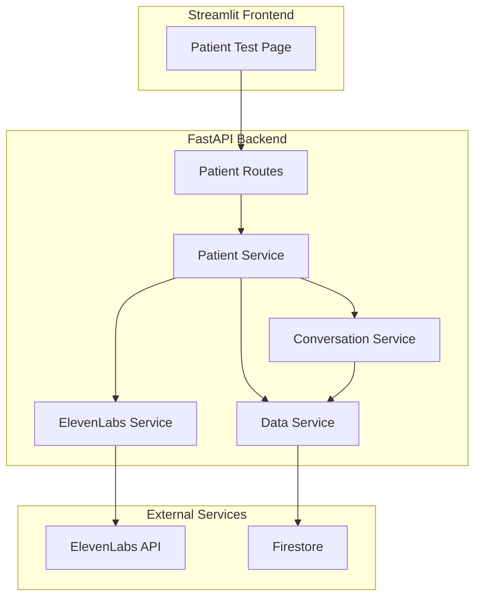

# Design Document: Patient Conversation (Text Mode)

## Overview

The Patient Conversation (Text Mode) feature enables patients to have text-based conversations with AI medical assistants powered by ElevenLabs Conversational AI. Patients input questions via text and receive responses as both text and audio (generated via ElevenLabs TTS). All conversations are stored in Firestore for doctor review.

This is a Phase 1 implementation with the following scope:
- **Text input only** (no voice input)
- **Audio output** for agent responses
- **Firestore persistence** for all conversation data
- **Question analysis** to identify answered/unanswered questions for doctor review

## Architecture



### Request Flow

1. **Session Creation**: Patient → Backend → ElevenLabs (signed URL) → Firestore (persist session)
2. **Send Message**: Patient → Backend → ElevenLabs (AI response) → ElevenLabs (TTS) → Firestore (persist messages) → Patient (text + audio)
3. **End Session**: Patient → Backend → Analyze conversation → Firestore (persist log) → Patient (summary)

## Components and Interfaces

### 1. Patient Routes (`backend/api/routes/patient.py`)

REST API endpoints for patient conversation operations.

```python
# Endpoints
POST /api/patient/session          # Create new session
POST /api/patient/session/{id}/message  # Send message
POST /api/patient/session/{id}/end      # End session
```

### 2. Patient Service (`backend/services/patient_service.py`)

Core business logic for patient conversations.

```python
class PatientService:
    async def create_session(request: PatientSessionCreate) -> PatientSessionResponse
    async def send_message(session_id: str, message: str) -> PatientMessageResponse
    async def end_session(session_id: str) -> SessionEndResponse
```

### 3. ElevenLabs Service (`backend/services/elevenlabs_service.py`)

Integration with ElevenLabs APIs.

```python
class ElevenLabsService:
    def get_signed_url(agent_id: str) -> str
    def send_text_message(agent_id: str, text: str) -> tuple[str, bytes]
    def text_to_speech(text: str, voice_id: str) -> bytes
```

### 4. Conversation Service (`backend/services/conversation_service.py`)

Handles conversation analysis and persistence.

```python
class ConversationService:
    async def save_conversation(detail: ConversationDetailSchema) -> None
    def analyze_questions(messages: list) -> tuple[list, list]  # (answered, unanswered)
```

### 5. Data Service Interface (`backend/services/data_service.py`)

Abstract interface for data persistence (Firestore implementation).

```python
class DataServiceInterface:
    async def create_patient_session(session: PatientSessionResponse) -> None
    async def get_patient_session(session_id: str) -> Optional[PatientSessionResponse]
    async def add_session_message(session_id: str, message: ConversationMessageSchema) -> None
    async def get_session_messages(session_id: str) -> list[ConversationMessageSchema]
```

## Data Models

### Session Data (Firestore: `/patient_sessions/{session_id}`)

```python
class PatientSessionResponse:
    session_id: str           # Unique session identifier
    patient_id: str           # Patient identifier
    agent_id: str             # ElevenLabs agent ID
    signed_url: str           # WebSocket URL for ElevenLabs
    created_at: datetime      # Session creation timestamp
```

### Message Data (Firestore: `/patient_sessions/{session_id}/messages/{msg_id}`)

```python
class ConversationMessageSchema:
    role: str                 # "patient" or "agent"
    content: str              # Message text
    timestamp: datetime       # Message timestamp
    is_answered: Optional[bool]  # For questions: was it answered?
    audio_data: Optional[str]    # Base64 encoded audio (agent only)
```

### Conversation Log (Firestore: `/conversations/{conversation_id}`)

```python
class ConversationDetailSchema:
    conversation_id: str      # Same as session_id
    patient_id: str
    agent_id: str
    agent_name: str
    requires_attention: bool  # True if unanswered questions exist
    main_concerns: list[str]
    messages: list[ConversationMessageSchema]
    answered_questions: list[str]
    unanswered_questions: list[str]
    duration_seconds: int
    created_at: datetime
```

### API Response Models

```python
class PatientMessageResponse:
    response_text: str        # Agent's text response
    audio_data: Optional[str] # Base64 encoded audio
    timestamp: datetime

class SessionEndResponse:
    success: bool
    conversation_summary: dict  # {session_id, patient_id, duration, message_count}
```

## Correctness Properties

*A property is a characteristic or behavior that should hold true across all valid executions of a system-essentially, a formal statement about what the system should do. Properties serve as the bridge between human-readable specifications and machine-verifiable correctness guarantees.*

### Property 1: Session creation returns unique session_id
*For any* valid patient_id and agent_id combination, creating a session SHALL return a response with a non-empty, unique session_id that differs from all previously created session_ids.
**Validates: Requirements 1.1**

### Property 2: Session creation includes signed_url
*For any* successfully created session, the response SHALL contain a non-empty signed_url field that starts with "wss://" (WebSocket secure protocol).
**Validates: Requirements 1.2**

### Property 3: Session data round-trip to Firestore
*For any* created session, querying Firestore with the session_id SHALL return a session object with matching patient_id, agent_id, session_id, and a valid created_at timestamp.
**Validates: Requirements 1.3**

### Property 4: Message response contains text and audio
*For any* text message sent to an active session, the response SHALL contain a non-empty response_text and non-empty base64-encoded audio_data.
**Validates: Requirements 2.2, 2.3**

### Property 5: Message exchange round-trip to Firestore
*For any* message sent in a session, querying Firestore for session messages SHALL return both the patient message and the agent response with matching content and timestamps.
**Validates: Requirements 2.4**

### Property 6: Question categorization correctness
*For any* conversation containing messages with question marks, a message is categorized as "answered" if and only if it is immediately followed by an agent response; otherwise it is categorized as "unanswered".
**Validates: Requirements 3.1, 4.2**

### Property 7: Requires attention flag correctness
*For any* ended session, the requires_attention flag SHALL be true if and only if the unanswered_questions list is non-empty.
**Validates: Requirements 4.1**

### Property 8: Duration calculation correctness
*For any* session with at least two messages, the duration_seconds SHALL equal the difference in seconds between the last message timestamp and the first message timestamp.
**Validates: Requirements 3.2**

### Property 9: End session summary completeness
*For any* ended session, the conversation_summary SHALL contain session_id, patient_id, duration (as string with "s" suffix), and message_count (as integer).
**Validates: Requirements 3.4**

### Property 10: Conversation log round-trip
*For any* ended session, querying Firestore for the conversation log SHALL return a complete record with all original messages preserved (same content, roles, and timestamps).
**Validates: Requirements 3.3, 4.3**

### Property 11: Response includes timestamp
*For any* message response, the timestamp field SHALL be a valid datetime that is greater than or equal to the session creation time.
**Validates: Requirements 5.1**

## Error Handling

### ElevenLabs Service Errors

| Error Type | HTTP Status | Behavior |
|------------|-------------|----------|
| Signed URL failure | 502 | Return error, do not create session |
| TTS failure | 200 | Return text response without audio, log error |
| AI response failure | 502 | Return error with details |
| Rate limit | 429 | Retry with exponential backoff (3 attempts) |

### Firestore Errors

| Error Type | Behavior |
|------------|----------|
| Write failure | Retry once, log error, continue operation |
| Read failure | Return 500 error |
| Connection timeout | Retry with backoff |

### Input Validation

| Validation | Error Response |
|------------|----------------|
| Invalid session_id | 404 "Session not found" |
| Empty message | 400 "Message cannot be empty" |
| Invalid patient_id format | 400 "Invalid patient ID format" |

## Testing Strategy

### Property-Based Testing Framework

- **Library**: Hypothesis (Python)
- **Minimum iterations**: 100 per property test
- **Test file**: `tests/properties/test_patient_conversation_props.py`

### Test Annotation Format

Each property-based test MUST include a comment in this format:
```python
# **Feature: patient-conversation-text, Property {number}: {property_text}**
```

### Unit Tests

Unit tests cover specific examples and edge cases:

1. **Session Creation**
   - Valid inputs create session successfully
   - Missing agent_id returns 400
   - ElevenLabs failure returns 502

2. **Send Message**
   - Valid message returns text + audio
   - Invalid session_id returns 404
   - Empty message returns 400

3. **End Session**
   - Session with messages returns summary
   - Session without messages returns empty summary
   - Invalid session_id returns appropriate response

### Integration Tests

Integration tests verify end-to-end flows:

1. Complete conversation flow: create → send messages → end
2. Firestore persistence verification
3. ElevenLabs API integration (with real API key)

### Test Data Generators (Hypothesis)

```python
# Patient ID generator: alphanumeric strings
patient_ids = st.text(alphabet=string.ascii_letters + string.digits, min_size=1, max_size=20)

# Message generator: non-empty strings, some with question marks
messages = st.text(min_size=1, max_size=500)
questions = st.text(min_size=1, max_size=500).map(lambda s: s + "?")

# Conversation generator: list of alternating patient/agent messages
conversations = st.lists(
    st.tuples(messages, messages),  # (patient_msg, agent_response)
    min_size=1, max_size=10
)
```
