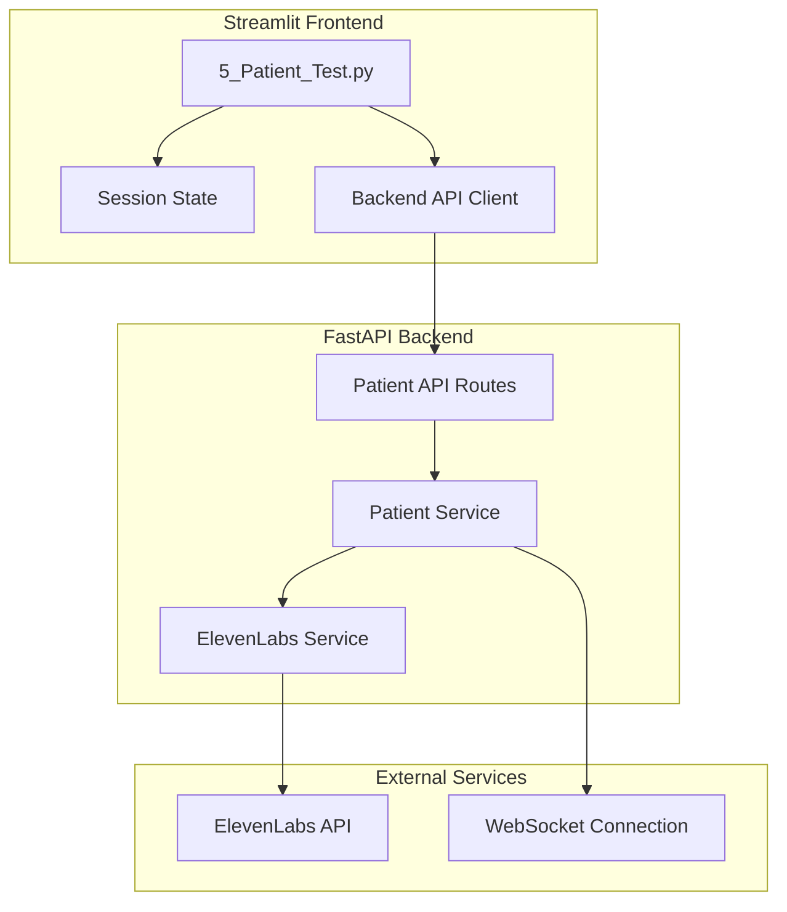
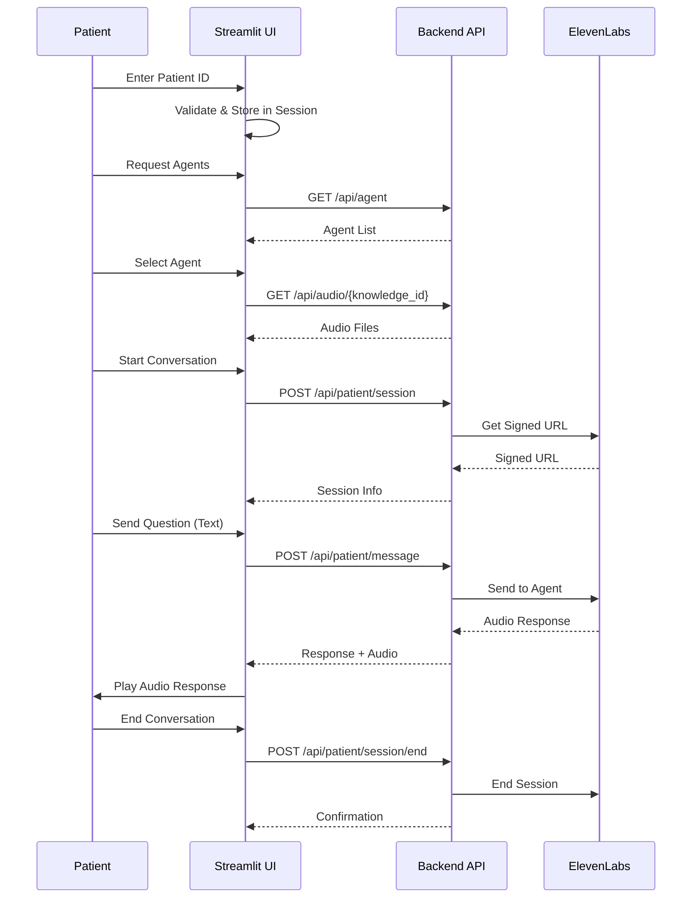

# Design Document: Patient Test Page

## Overview

The Patient Test Page is a Streamlit-based interface that enables patients to interact with AI medical assistants configured in the ElevenDops system. It serves as a validation and testing platform where patients can:

1. Identify themselves with a patient ID for session tracking
2. Select an AI agent specialized in their medical condition
3. Listen to pre-recorded educational audio content
4. Engage in text-based conversations with voice responses (Phase 1)

The page adheres to the system's separation of concerns principle: Streamlit handles UI rendering only, while all ElevenLabs API interactions and business logic are routed through the FastAPI backend.

## Architecture



### Data Flow



## Components and Interfaces

### Frontend Components

#### 1. PatientTestPage (5_Patient_Test.py)

Main Streamlit page component with the following sections:

```python
# Page Structure
- Page Config (title, icon, layout)
- Patient ID Input Section
- Agent Selection Section
- Education Audio Section
- Conversation Section
  - Chat History Display
  - Message Input
  - Audio Response Player
  - End Conversation Button
```

#### 2. Session State Management

```python
# Session State Keys
st.session_state.patient_id: str | None
st.session_state.selected_agent: AgentConfig | None
st.session_state.conversation_active: bool
st.session_state.conversation_history: List[ConversationMessage]
st.session_state.session_id: str | None
st.session_state.last_audio_response: bytes | None
```

### Backend API Endpoints

#### New Endpoints Required

```python
# Patient Session Management
POST /api/patient/session
    Request: { patient_id: str, agent_id: str }
    Response: { session_id: str, signed_url: str }

POST /api/patient/session/{session_id}/message
    Request: { message: str }
    Response: { response_text: str, audio_data: bytes (base64) }

POST /api/patient/session/{session_id}/end
    Request: {}
    Response: { success: bool, conversation_summary: dict }
```

### Backend Services

#### PatientService

```python
class PatientService:
    """Service for managing patient conversation sessions."""
    
    async def create_session(
        self, patient_id: str, agent_id: str
    ) -> PatientSession
    
    async def send_message(
        self, session_id: str, message: str
    ) -> ConversationResponse
    
    async def end_session(
        self, session_id: str
    ) -> SessionSummary
```

## Data Models

### Frontend Models (streamlit_app/services/models.py)

```python
@dataclass
class ConversationMessage:
    """A single message in the conversation."""
    role: str  # "patient" or "agent"
    content: str
    timestamp: datetime
    audio_url: Optional[str] = None

@dataclass
class PatientSession:
    """Active patient conversation session."""
    session_id: str
    patient_id: str
    agent_id: str
    signed_url: str
    created_at: datetime

@dataclass
class ConversationResponse:
    """Response from agent after sending a message."""
    response_text: str
    audio_data: Optional[str]  # Base64 encoded audio
    timestamp: datetime
```

### Backend Models (backend/models/schemas.py)

```python
class PatientSessionCreate(BaseModel):
    """Request to create a patient session."""
    patient_id: str = Field(..., pattern=r'^[a-zA-Z0-9]+$')
    agent_id: str

class PatientSessionResponse(BaseModel):
    """Response after creating a session."""
    session_id: str
    patient_id: str
    agent_id: str
    signed_url: str
    created_at: datetime

class PatientMessageRequest(BaseModel):
    """Request to send a message."""
    message: str = Field(..., min_length=1, max_length=2000)

class PatientMessageResponse(BaseModel):
    """Response after sending a message."""
    response_text: str
    audio_data: Optional[str]  # Base64 encoded
    timestamp: datetime

class SessionEndResponse(BaseModel):
    """Response after ending a session."""
    success: bool
    conversation_summary: Optional[dict]
```

## Correctness Properties

*A property is a characteristic or behavior that should hold true across all valid executions of a system-essentially, a formal statement about what the system should do. Properties serve as the bridge between human-readable specifications and machine-verifiable correctness guarantees.*

### Property 1: Patient ID Validation and Storage

*For any* string input as Patient_ID, if the string contains only alphanumeric characters and is non-empty, it should be accepted and stored in session state; otherwise, it should be rejected with an error message.

**Validates: Requirements 1.2, 1.4**

### Property 2: Agent Display Contains Required Information

*For any* agent returned from the backend, the rendered display should contain the agent's name and at least one piece of information about its associated knowledge area.

**Validates: Requirements 2.2**

### Property 3: Agent Selection Storage

*For any* agent selection action, the selected agent's complete information should be stored in session state and retrievable for subsequent operations.

**Validates: Requirements 2.4**

### Property 4: Audio Files Rendered with Players

*For any* list of audio files returned from the backend, each audio file should be rendered with a playable audio component.

**Validates: Requirements 3.2**

### Property 5: Message Round Trip

*For any* valid patient question submitted during an active conversation, the system should send the message to the backend and receive a response containing both text and audio data.

**Validates: Requirements 4.4**

### Property 6: Conversation History Integrity

*For any* sequence of messages exchanged during a conversation, all messages should be appended to the conversation history in chronological order with correct role attribution (patient vs agent).

**Validates: Requirements 5.2, 5.3**

### Property 7: Session End State Management

*For any* session end action, the conversation state should be cleared while the Patient_ID remains preserved in session state.

**Validates: Requirements 6.4**

### Property 8: Error Logging Without UI Exposure

*For any* error that occurs during API calls, the error details should be logged for debugging, but only a user-friendly message (in Traditional Chinese) should be displayed to the patient.

**Validates: Requirements 7.4**

## Error Handling

### Error Categories

1. **Connection Errors**: Backend API unreachable
   - Display: "無法連接伺服器，請稍後再試" (Cannot connect to server, please try again later)
   - Action: Log error, show retry button

2. **Session Errors**: Failed to create/maintain session
   - Display: "對話連線失敗，請重新開始" (Conversation connection failed, please restart)
   - Action: Log error, reset conversation state, allow retry

3. **Message Errors**: Failed to send/receive message
   - Display: "訊息傳送失敗，請重試" (Message send failed, please retry)
   - Action: Log error, preserve message, show retry button

4. **Validation Errors**: Invalid input
   - Display: Specific validation message in Traditional Chinese
   - Action: Highlight invalid field, prevent submission

### Error Handling Pattern

```python
try:
    result = await api_call()
except APIConnectionError as e:
    logging.error(f"Connection error: {e}")
    st.error("無法連接伺服器，請稍後再試")
except APIError as e:
    logging.error(f"API error: {e.message}")
    st.error("操作失敗，請重試")
except Exception as e:
    logging.error(f"Unexpected error: {e}")
    st.error("發生未預期的錯誤")
```

## Testing Strategy

### Dual Testing Approach

The testing strategy employs both unit tests and property-based tests to ensure comprehensive coverage:

1. **Unit Tests**: Verify specific examples, edge cases, and integration points
2. **Property-Based Tests**: Verify universal properties that should hold across all inputs

### Property-Based Testing Framework

- **Library**: Hypothesis (Python)
- **Minimum Iterations**: 100 per property test
- **Test File**: `tests/test_patient_test_props.py`

### Test Categories

#### 1. Validation Tests (Property-Based)
- Patient ID validation across random alphanumeric and non-alphanumeric strings
- Message length validation

#### 2. State Management Tests (Property-Based)
- Session state consistency after various operations
- Conversation history integrity

#### 3. Integration Tests (Unit)
- Backend API client methods
- Error handling scenarios

#### 4. UI Component Tests (Unit)
- Page rendering with various states
- Component visibility based on session state

### Test Annotation Format

Each property-based test must be annotated with:
```python
# **Feature: patient-test-page, Property {number}: {property_text}**
# **Validates: Requirements X.Y**
```
