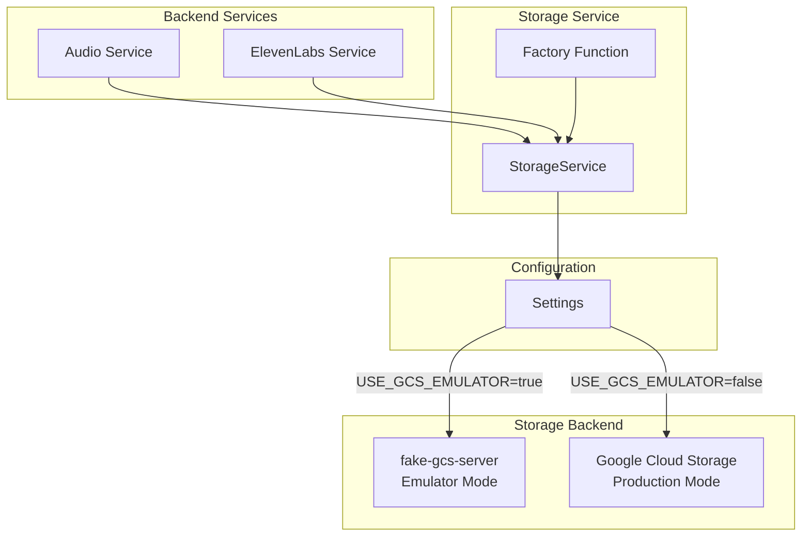
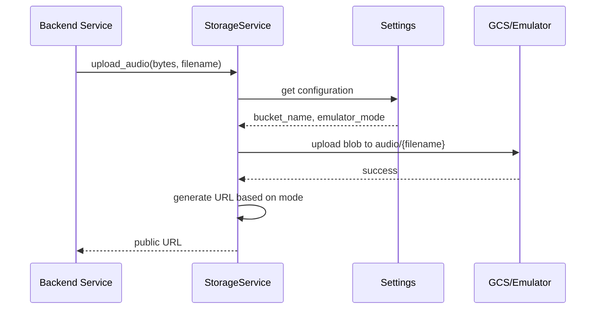

# Design Document: Storage Service

## Overview

The Storage Service provides a unified interface for audio file storage in the ElevenDops medical assistant system. It abstracts the differences between local development (using fake-gcs-server emulator) and production (using Google Cloud Storage), enabling the same application code to work in both environments with only configuration changes.

This service is critical for the Education Audio feature, where doctors generate TTS audio files that patients can stream for health education content.

## Architecture



### Data Flow



## Components and Interfaces

### StorageService Class

```python
class StorageService:
    """GCS client that works with both fake-gcs-server and production."""
    
    def __init__(self) -> None:
        """Initialize storage client based on configuration."""
        ...
    
    def upload_audio(self, audio_data: bytes, filename: str) -> str:
        """Upload audio file and return public URL.
        
        Args:
            audio_data: Raw audio bytes (MP3 format)
            filename: Target filename (without path prefix)
            
        Returns:
            Public URL for accessing the audio file
            
        Raises:
            StorageError: If upload fails
        """
        ...
    
    def delete_audio(self, filename: str) -> bool:
        """Delete audio file from storage.
        
        Args:
            filename: Filename to delete (without path prefix)
            
        Returns:
            True if deletion succeeded, False if file not found
            
        Raises:
            StorageError: If deletion fails for reasons other than file not found
        """
        ...
    
    def upload_file(self, data: bytes, filename: str, content_type: str) -> str:
        """Generic file upload method.
        
        Args:
            data: Raw file bytes
            filename: Full path including prefix
            content_type: MIME type for the file
            
        Returns:
            Public URL for accessing the file
        """
        ...
    
    def health_check(self) -> bool:
        """Check if storage is accessible."""
        ...
```

### Factory Function

```python
def get_storage_service() -> StorageService:
    """Get the Storage service instance.
    
    Returns:
        Initialized StorageService instance
    """
    ...
```

### Configuration Dependencies

The service reads from `backend/config.py`:

| Setting | Type | Default | Description |
|---------|------|---------|-------------|
| `use_gcs_emulator` | bool | True | Use emulator vs production |
| `gcs_emulator_host` | str | "http://localhost:4443" | Emulator endpoint |
| `gcs_bucket_name` | str | "elevenlabs-audio" | Target bucket name |
| `google_cloud_project` | str | None | GCP project ID |

## Data Models

### URL Formats

**Emulator Mode:**
```
{gcs_emulator_host}/storage/v1/b/{bucket_name}/o/audio%2F{filename}?alt=media
```

Example:
```
http://localhost:4443/storage/v1/b/elevenlabs-audio/o/audio%2Feducation_123.mp3?alt=media
```

**Production Mode:**
```
https://storage.googleapis.com/{bucket_name}/audio/{filename}
```

Example:
```
https://storage.googleapis.com/elevenlabs-audio/audio/education_123.mp3
```

### Storage Path Structure

```
{bucket_name}/
└── audio/
    ├── education_001.mp3
    ├── education_002.mp3
    └── ...
```

## Correctness Properties

*A property is a characteristic or behavior that should hold true across all valid executions of a system-essentially, a formal statement about what the system should do. Properties serve as the bridge between human-readable specifications and machine-verifiable correctness guarantees.*

Based on the prework analysis, the following properties have been identified:

### Property 1: Configuration-based initialization
*For any* valid configuration with `USE_GCS_EMULATOR=true`, initializing the StorageService should result in a client that uses AnonymousCredentials and connects to the configured emulator host, with the configured bucket accessible.

**Validates: Requirements 1.1, 1.3, 5.1, 5.2, 5.3, 5.4**

### Property 2: Upload produces correct storage and URL format
*For any* valid audio bytes and filename, uploading via `upload_audio` should store the file at `audio/{filename}` with content type `audio/mpeg`, and return a URL matching the expected format for the current mode (emulator or production).

**Validates: Requirements 2.1, 2.2, 2.3**

### Property 3: Upload then delete round-trip
*For any* valid audio bytes and filename, uploading the file and then deleting it should result in the file no longer being accessible, with the delete operation returning True.

**Validates: Requirements 3.1, 3.2**

### Property 4: Factory function returns functional instance
*For any* number of calls to `get_storage_service()`, each call should return a StorageService instance that can successfully perform upload and delete operations.

**Validates: Requirements 4.1, 4.2**

## Error Handling

### Error Types

| Error Condition | Behavior | HTTP Status (if API) |
|-----------------|----------|---------------------|
| Bucket not found (production) | Raise StorageError | 500 |
| Upload failure | Raise StorageError with reason | 500 |
| Delete file not found | Return False | 404 |
| Delete other failure | Raise StorageError | 500 |
| Connection failure | Raise StorageError | 503 |

### Logging Strategy

- INFO: Successful operations (upload, delete, initialization)
- WARNING: Non-critical issues (file not found on delete)
- ERROR: Operation failures with stack traces

## Testing Strategy

### Property-Based Testing

The service will use **Hypothesis** for property-based testing, as specified in the project's testing standards.

**Test Configuration:**
- Minimum 100 iterations per property test
- Tests annotated with requirement references using format: `**Feature: storage-service, Property {number}: {property_text}**`

### Test Categories

1. **Property Tests** (using Hypothesis):
   - Property 1: Configuration-based initialization
   - Property 2: Upload produces correct storage and URL format
   - Property 3: Upload then delete round-trip
   - Property 4: Factory function returns functional instance

2. **Unit Tests**:
   - URL format generation for emulator mode
   - URL format generation for production mode
   - Content type setting verification

3. **Edge Case Tests**:
   - Bucket creation failure in production mode
   - Upload failure handling
   - Delete non-existent file handling
   - Delete failure handling

### Test Environment

Tests will run against the fake-gcs-server emulator to ensure:
- No production GCS costs during testing
- Consistent, reproducible test environment
- Fast test execution

### Test File Location

```
tests/
└── test_storage_service_props.py
```

### Generator Strategies

For property-based tests, the following generators will be used:

```python
# Audio data generator - valid MP3-like bytes
audio_bytes = st.binary(min_size=100, max_size=10000)

# Filename generator - valid filenames without path separators
valid_filename = st.text(
    alphabet=st.characters(whitelist_categories=('L', 'N'), whitelist_characters='_-'),
    min_size=1,
    max_size=50
).map(lambda s: f"{s}.mp3")
```
