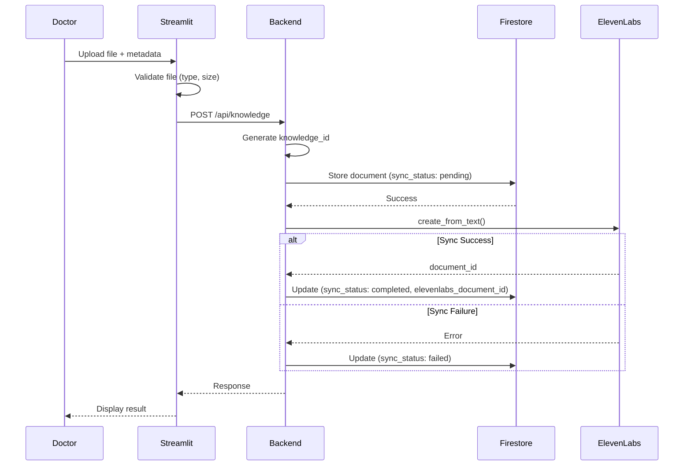

# Design Document: Upload Knowledge Page

## Overview

The Upload Knowledge feature enables doctors to upload medical education documents that are stored in Firestore (primary data source) and synchronized to ElevenLabs Knowledge Base for AI agent retrieval. The system follows a layered architecture where Streamlit handles UI, FastAPI backend handles business logic, and external services (Firestore, ElevenLabs) handle data persistence.

## Architecture

```mermaid
flowchart TB
    subgraph Frontend["Streamlit Frontend"]
        UI[2_Upload_Knowledge.py]
        API_Client[BackendAPIClient]
    end

    subgraph Backend["FastAPI Backend"]
        Router[/api/knowledge Router]
        DataService[DataService]
        ElevenLabsService[ElevenLabsService]
    end

    subgraph External["External Services"]
        Firestore[(Firestore DB)]
        ElevenLabs[ElevenLabs Knowledge Base]
    end

    UI --> API_Client
    API_Client -->|HTTP| Router
    Router --> DataService
    Router --> ElevenLabsService
    DataService --> Firestore
    ElevenLabsService --> ElevenLabs
```

### Data Flow: Document Upload



## Components and Interfaces

### Backend Components

#### 1. Knowledge API Router (`backend/api/knowledge.py`)

```python
# Endpoints
POST   /api/knowledge              # Create and sync document
GET    /api/knowledge              # List all documents
GET    /api/knowledge/{id}         # Get single document
DELETE /api/knowledge/{id}         # Delete document
POST   /api/knowledge/{id}/retry-sync  # Retry failed sync
```

#### 2. ElevenLabs Service (`backend/services/elevenlabs_service.py`)

```python
class ElevenLabsService:
    """Service for ElevenLabs Knowledge Base operations."""

    async def create_document(self, text: str, name: str) -> str:
        """Create document in ElevenLabs Knowledge Base.

        Uses: client.conversational_ai.add_to_knowledge_base()
        Returns: ElevenLabs document ID
        """

    async def delete_document(self, document_id: str) -> bool:
        """Delete document from ElevenLabs Knowledge Base.

        Uses: client.conversational_ai.delete_knowledge_base_document()
        """
```

#### 3. Data Service Extension (`backend/services/data_service.py`)

```python
class DataServiceProtocol(Protocol):
    async def create_knowledge_document(self, doc: KnowledgeDocumentCreate) -> KnowledgeDocumentResponse: ...
    async def get_knowledge_documents(self) -> list[KnowledgeDocumentResponse]: ...
    async def get_knowledge_document(self, knowledge_id: str) -> KnowledgeDocumentResponse | None: ...
    async def update_knowledge_sync_status(self, knowledge_id: str, status: str, elevenlabs_id: str | None) -> bool: ...
    async def delete_knowledge_document(self, knowledge_id: str) -> bool: ...
```

### Frontend Components

#### 1. Streamlit Page (`streamlit_app/pages/2_Upload_Knowledge.py`)

**UI Sections:**

- File uploader (accepts .md, .txt, max 300KB)
- Metadata form (disease name, document type)
- Content preview area
- Save & Sync button
- Document list table with status indicators
- Delete functionality with confirmation

#### 2. Backend API Client Extension (`streamlit_app/services/backend_api.py`)

```python
class BackendAPIClient:
    async def upload_knowledge(
        self,
        content: str,
        disease_name: str,
        document_type: str
    ) -> KnowledgeDocument: ...

    async def get_knowledge_documents(self) -> list[KnowledgeDocument]: ...

    async def delete_knowledge_document(self, knowledge_id: str) -> bool: ...

    async def retry_knowledge_sync(self, knowledge_id: str) -> KnowledgeDocument: ...
```

## Data Models

### Backend Schemas (`backend/models/schemas.py`)

```python
from enum import Enum
from datetime import datetime
from pydantic import BaseModel, Field

class DocumentType(str, Enum):
    FAQ = "faq"
    POST_CARE = "post_care"
    PRECAUTIONS = "precautions"

class SyncStatus(str, Enum):
    PENDING = "pending"
    SYNCING = "syncing"
    COMPLETED = "completed"
    FAILED = "failed"

class KnowledgeDocumentCreate(BaseModel):
    """Request model for creating a knowledge document."""
    disease_name: str = Field(..., min_length=1, max_length=100)
    document_type: DocumentType
    raw_content: str = Field(..., min_length=1, max_length=300000)  # ~300KB
    doctor_id: str = Field(default="default_doctor")  # MVP: hardcoded

class KnowledgeDocumentResponse(BaseModel):
    """Response model for knowledge document."""
    knowledge_id: str
    doctor_id: str
    disease_name: str
    document_type: DocumentType
    raw_content: str
    sync_status: SyncStatus
    elevenlabs_document_id: str | None
    structured_sections: dict | None
    created_at: datetime

class KnowledgeDocumentListResponse(BaseModel):
    """Response model for listing knowledge documents."""
    documents: list[KnowledgeDocumentResponse]
    total_count: int
```

### Frontend Models (`streamlit_app/services/models.py`)

```python
@dataclass
class KnowledgeDocument:
    """Knowledge document data class for frontend."""
    knowledge_id: str
    doctor_id: str
    disease_name: str
    document_type: str
    raw_content: str
    sync_status: str
    elevenlabs_document_id: str | None
    structured_sections: dict[str, str] | None
    created_at: datetime
```

## Correctness Properties

_A property is a characteristic or behavior that should hold true across all valid executions of a system-essentially, a formal statement about what the system should do. Properties serve as the bridge between human-readable specifications and machine-verifiable correctness guarantees._

### Property 1: File Type Validation

_For any_ uploaded file, the system SHALL accept the file if and only if its extension is `.md` or `.txt`
**Validates: Requirements 1.1**

### Property 2: File Size Validation

_For any_ uploaded file, the system SHALL reject the file if and only if its size exceeds 300KB (307,200 bytes)
**Validates: Requirements 1.2**

### Property 3: Required Field Validation

_For any_ document submission, the system SHALL reject the submission if the disease_name field is empty or contains only whitespace
**Validates: Requirements 1.4**

### Property 4: Document Metadata Persistence

_For any_ successfully saved document, querying the document by its knowledge_id SHALL return the same disease_name and document_type that were submitted
**Validates: Requirements 2.3**

### Property 5: Sync Workflow Integrity

_For any_ document where Firestore storage succeeds and ElevenLabs sync succeeds, the document SHALL have sync_status "completed" and a non-null elevenlabs_document_id
**Validates: Requirements 3.2, 3.3**

### Property 6: Sync Failure Handling

_For any_ document where Firestore storage succeeds but ElevenLabs sync fails, the document SHALL exist in Firestore with sync_status "failed" and elevenlabs_document_id as null
**Validates: Requirements 3.4**

### Property 7: Document List Completeness

_For any_ set of stored documents, the document list endpoint SHALL return all documents with their disease_name, document_type, sync_status, and created_at fields populated
**Validates: Requirements 4.1, 4.2**

### Property 8: Unique Knowledge ID Generation

_For any_ set of created documents, all knowledge_id values SHALL be unique
**Validates: Requirements 6.3**

### Property 9: Document Schema Completeness

_For any_ stored document, the document SHALL contain all required fields: knowledge_id, doctor_id, disease_name, document_type, raw_content, sync_status, created_at
**Validates: Requirements 6.4**

### Property 10: Deletion Cascade

_For any_ document with a non-null elevenlabs_document_id, deleting the document SHALL attempt to delete from both Firestore and ElevenLabs Knowledge Base
**Validates: Requirements 5.2, 5.3**

### Property 11: Firestore Deletion Priority

_For any_ document deletion where ElevenLabs deletion fails, the Firestore document SHALL still be deleted
**Validates: Requirements 5.4**

## Error Handling

### ElevenLabs API Errors

```python
class ElevenLabsServiceError(Exception):
    """Base exception for ElevenLabs service errors."""
    pass

class ElevenLabsSyncError(ElevenLabsServiceError):
    """Raised when document sync to ElevenLabs fails."""
    pass

class ElevenLabsDeleteError(ElevenLabsServiceError):
    """Raised when document deletion from ElevenLabs fails."""
    pass
```

### Error Handling Strategy

1. **Sync Failures**:

   - Log error details
   - Set sync_status to "failed"
   - Return success to user (document saved in Firestore)
   - Provide retry option

2. **Delete Failures (ElevenLabs)**:

   - Log error details
   - Continue with Firestore deletion
   - Return success to user

3. **Validation Errors**:
   - Return 400 Bad Request with descriptive message
   - Display user-friendly error in Streamlit

## Testing Strategy

### Property-Based Testing Framework

- **Library**: Hypothesis (already in pyproject.toml)
- **Minimum iterations**: 100 per property test

### Unit Tests

- File validation functions
- API endpoint responses
- Data model serialization/deserialization

### Property-Based Tests

Each correctness property will be implemented as a property-based test:

1. **File Type Validation Property Test**

   - Generate random file extensions
   - Verify only .md and .txt are accepted

2. **File Size Validation Property Test**

   - Generate files of various sizes around 300KB boundary
   - Verify correct acceptance/rejection

3. **Required Field Validation Property Test**

   - Generate strings including empty and whitespace-only
   - Verify rejection of invalid disease names

4. **Document Metadata Persistence Property Test**

   - Generate random valid documents
   - Verify round-trip persistence of metadata

5. **Sync Workflow Property Tests**

   - Mock ElevenLabs responses (success/failure)
   - Verify correct status updates

6. **Unique ID Property Test**

   - Create multiple documents
   - Verify all IDs are unique

7. **Deletion Cascade Property Test**
   - Create documents with/without ElevenLabs sync
   - Verify correct deletion behavior

### Test File Structure

```
tests/
├── test_knowledge_api_props.py      # Property tests for API
├── test_knowledge_validation_props.py  # Property tests for validation
├── test_elevenlabs_service_props.py # Property tests for ElevenLabs service
└── test_knowledge_models_props.py   # Property tests for data models
```

### Test Annotations

Each property-based test MUST include:

```python
# **Feature: upload-knowledge-page, Property {N}: {property_text}**
# **Validates: Requirements X.Y**
```
