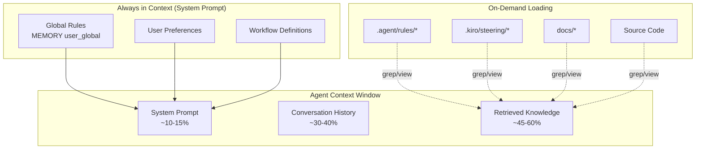
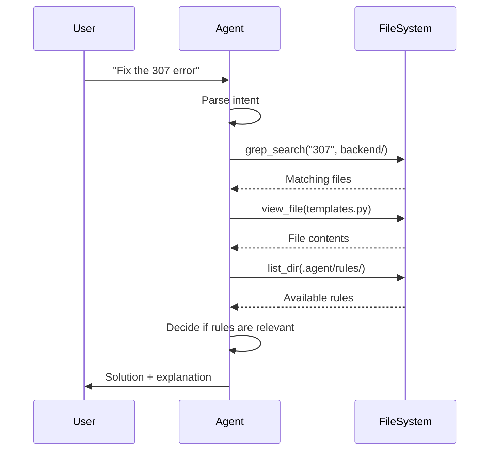
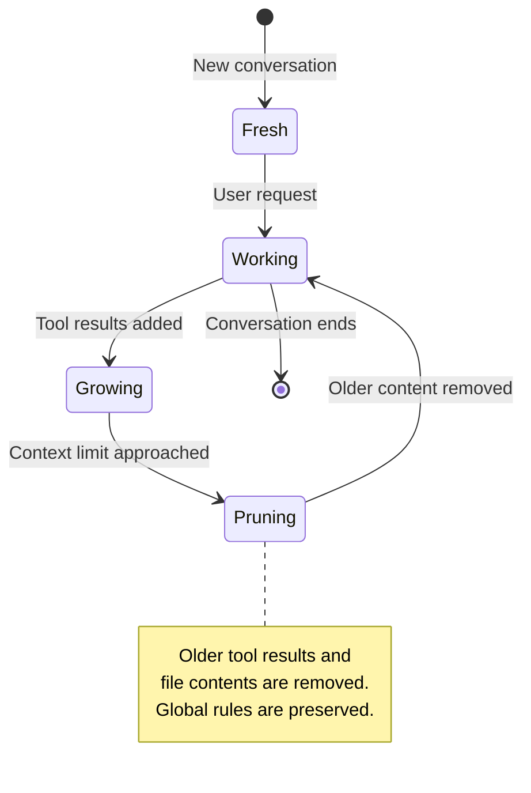
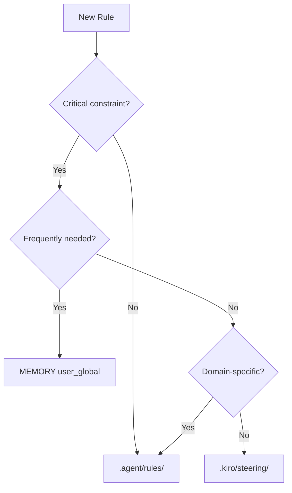

# Antigravity Context Management

This document explains how the Antigravity AI agent manages context and loads project knowledge.

## Overview

Antigravity uses a **two-tier context system** to balance immediate availability with context efficiency.



## Tier 1: Global Constants (Always Loaded)

These are **always present** in the system prompt and occupy a fixed portion of the context window.

| Location              | Purpose                   | Example                                 |
| --------------------- | ------------------------- | --------------------------------------- |
| `MEMORY[user_global]` | Core tech stack rules     | Use `pnpm`, `uv`, TailwindCSS 4         |
| User Rules            | Coding style conventions  | Google docstrings, strict types         |
| Workflows             | Slash command definitions | `/kiro-spec-run`, `/uv-package-manager` |

### Characteristics

- ✅ **Immediate**: No lookup needed
- ✅ **Consistent**: Applied to every request
- ❌ **Fixed Cost**: Always uses context space (~10-15%)

### When to Use

- **Critical constraints** that must never be violated
- **Project-wide conventions** (tech stack, naming)
- **Frequently needed** information

---

## Tier 2: On-Demand Loading

These are **retrieved as needed** based on the current task.

| Location           | Purpose                | Loaded When                         |
| ------------------ | ---------------------- | ----------------------------------- |
| `.agent/rules/*`   | Domain-specific rules  | Agent searches for related patterns |
| `.kiro/steering/*` | Architecture docs      | Starting spec-driven work           |
| `.kiro/specs/*`    | Feature specifications | Implementing specific features      |
| `docs/*`           | Project documentation  | Researching project context         |

### Retrieval Flow



### Characteristics

- ✅ **Efficient**: Only loaded when relevant
- ✅ **Scalable**: Unlimited project docs
- ❌ **Latency**: Requires tool calls to retrieve
- ❌ **Ephemeral**: Pruned as conversation grows

---

## Context Window Lifecycle



### What Gets Pruned First

1. Old file contents (already acted upon)
2. Intermediate search results
3. Earlier conversation turns

### What's Preserved

1. System prompt (global rules)
2. Recent conversation context
3. Currently relevant file contents

---

## Best Practices

### For Global Rules (Tier 1)

```markdown
# Good: Concise, critical constraints

- Use **pnpm** instead of npm
- Use **uv** for Python dependencies
- All API endpoints MUST return StandardResponse
```

### For On-Demand Rules (Tier 2)

```markdown
# Good: Detailed, domain-specific guidance

## API Route Patterns

When defining collection endpoints...
[detailed examples and rationale]
```

### Rule Placement Decision Tree



---

## Summary

| Aspect       | Tier 1 (Global)  | Tier 2 (On-Demand) |
| ------------ | ---------------- | ------------------ |
| Location     | System prompt    | File system        |
| Loading      | Always           | When searched      |
| Context cost | Fixed (~10-15%)  | Variable           |
| Persistence  | Permanent        | Session-based      |
| Best for     | Core constraints | Detailed guidance  |
