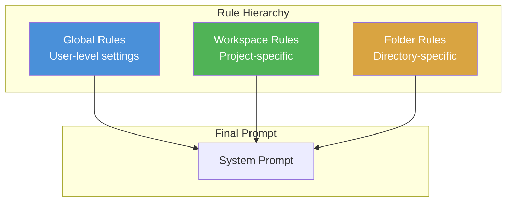
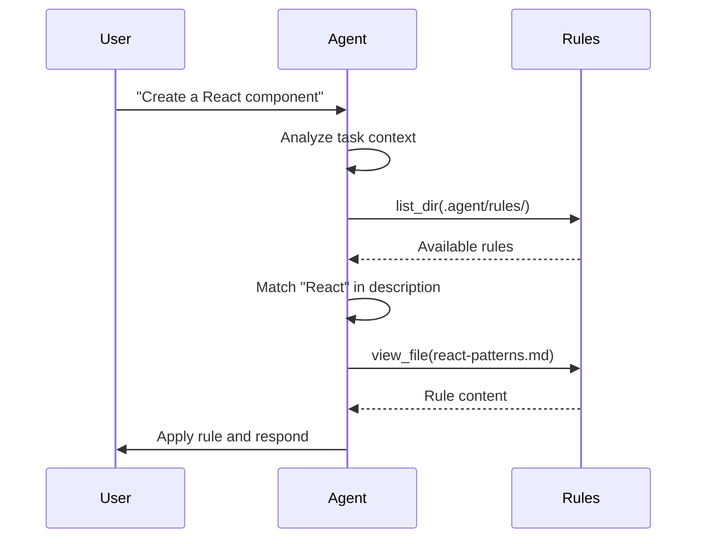
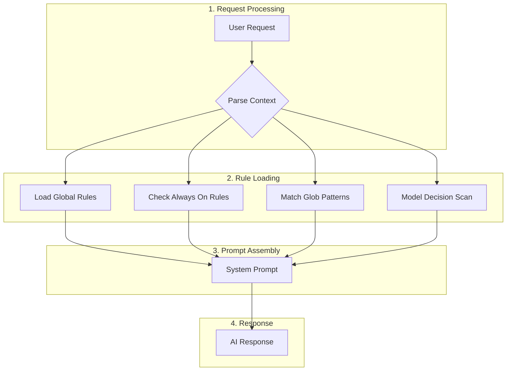

# Antigravity Rules Definition Guide

This document explains how to define and configure rules in Antigravity, including global rules, workspace rules, activation modes, and prompt strategies.

## Overview

Antigravity uses a **hierarchical rule system** to customize AI behavior across different scopes. Rules are injected into the system prompt and guide the AI's responses, coding style, and decision-making.



---

## Rule Scopes

### Global Rules

**Location**: `~/.gemini/GEMINI.md` or configured via IDE settings

**Purpose**: Define user-level preferences that apply to **all workspaces and projects**.

| Characteristic | Description                                                   |
| -------------- | ------------------------------------------------------------- |
| Scope          | All projects and workspaces                                   |
| Persistence    | Permanent across sessions                                     |
| Best for       | Personal coding style, preferred tools, universal constraints |

**Example Global Rules**:

```markdown
# Tech Stack Overrides

- Use **pnpm** instead of npm
- Use **uv** for Python dependency management
- Prefer **TypeScript** over JavaScript

# Coding Style

- Use **Google-style docstrings** for Python
- Enable **strict mode** in TypeScript
- Avoid `any`; prefer `unknown` when type is uncertain
```

---

### Workspace Rules

**Location**: `.agent/rules/*.md` in your project root

**Purpose**: Define **project-specific** conventions and constraints that apply only to the current workspace.

| Characteristic | Description                                               |
| -------------- | --------------------------------------------------------- |
| Scope          | Current workspace only                                    |
| Persistence    | Session-based, loaded on demand                           |
| Best for       | Project architecture, API patterns, domain-specific logic |

**Example Workspace Rules**:

```markdown
# API Standards

- All endpoints MUST return `StandardResponse` model
- Use custom exceptions from `core.exceptions`
- All I/O operations MUST use `async/await`

# Storage Pattern

- Never access databases directly in business logic
- Use repository/storage interface via dependency injection
```

---

## Rule File Format and Structure

Rules are defined as **Markdown files** with a specific frontmatter format.

### File Structure

```
.agent/
└── rules/
    ├── api-patterns.md
    ├── coding-style.md
    └── testing-standards.md
```

### Rule File Format

Each rule file follows this structure:

```yaml
---
title: "Rule Title"
description: "Brief description of what this rule covers"
globs:
  - "**/*.py"
  - "backend/**/*"
alwaysApply: false
---
# Rule Content

Your detailed rule content in Markdown format...
```

### Frontmatter Fields

| Field         | Type    | Required | Description                              |
| ------------- | ------- | -------- | ---------------------------------------- |
| `title`       | string  | Yes      | Human-readable rule name                 |
| `description` | string  | Yes      | Brief explanation of the rule's purpose  |
| `globs`       | array   | No       | File patterns for Glob activation mode   |
| `alwaysApply` | boolean | No       | If `true`, behaves like "Always On" mode |

---

## Activation Modes

Antigravity provides **four activation modes** that control when a rule is applied to the AI's context.


### Mode Comparison

| Mode               | Trigger                 | Use Case                                          |
| ------------------ | ----------------------- | ------------------------------------------------- |
| **Manual**         | User explicitly invokes | Rarely needed rules, specialized workflows        |
| **Always On**      | Every request           | Core constraints, universal standards             |
| **Model Decision** | AI determines relevance | Domain-specific guidance                          |
| **Glob**           | File pattern matching   | Language-specific rules, folder-based conventions |

---

### 1. Manual Mode

```yaml
---
title: "Database Migration Guide"
description: "Step-by-step guide for database migrations"
alwaysApply: false
---
```

**Behavior**: Rule is **only loaded** when the user explicitly references it.

**When to Use**:

- Rarely needed procedures
- Reference documentation
- Complex workflows that aren't triggered automatically

**Invocation**:

```
@rules/database-migration.md How do I add a new column?
```

---

### 2. Always On Mode

```yaml
---
title: "Core API Standards"
description: "Mandatory API conventions"
alwaysApply: true
---
```

**Behavior**: Rule is **always injected** into the system prompt for every request.

**When to Use**:

- Critical constraints that must **never** be violated
- Project-wide conventions (error handling, response formats)
- Security requirements

> [!WARNING]
> Use sparingly! Each "Always On" rule consumes context window space permanently.

---

### 3. Model Decision Mode

```yaml
---
title: "React Component Patterns"
description: "Best practices for React components"
alwaysApply: false
# No globs specified
---
```

**Behavior**: The AI **autonomously decides** whether to load the rule based on contextual relevance.

**When to Use**:

- Domain-specific guidance
- Best practices for specific technologies
- Rules that apply to certain types of tasks

**How It Works**:



---

### 4. Glob Mode

```yaml
---
title: "Python Coding Style"
description: "Python-specific conventions"
globs:
  - "**/*.py"
  - "backend/**/*"
---
```

**Behavior**: Rule is **automatically loaded** when the user is working with files matching the glob patterns.

**When to Use**:

- Language-specific rules
- Folder-based conventions
- File type-specific formatting

**Glob Pattern Examples**:

| Pattern               | Matches                        |
| --------------------- | ------------------------------ |
| `**/*.py`             | All Python files               |
| `backend/**/*`        | All files in backend directory |
| `*.{ts,tsx}`          | TypeScript and TSX files       |
| `tests/**/*.spec.ts`  | Test specification files       |
| `!**/node_modules/**` | Exclude node_modules           |

---

## Prompt Strategy

### Rule Injection Flow



### Prompt Structure

The final prompt assembled by Antigravity follows this structure:

```
┌─────────────────────────────────────────┐
│ 1. Core System Instructions             │
│    - Base AI behavior                   │
│    - Tool definitions                   │
├─────────────────────────────────────────┤
│ 2. Global Rules (MEMORY[user_global])   │
│    - User preferences                   │
│    - Tech stack overrides               │
├─────────────────────────────────────────┤
│ 3. Workspace Rules (Active)             │
│    - Always On rules                    │
│    - Glob-matched rules                 │
│    - Model-selected rules               │
├─────────────────────────────────────────┤
│ 4. Conversation Context                 │
│    - Previous messages                  │
│    - Retrieved file contents            │
├─────────────────────────────────────────┤
│ 5. Current User Request                 │
└─────────────────────────────────────────┘
```

### Context Budget Allocation

| Component            | Approximate Share |
| -------------------- | ----------------- |
| System Instructions  | ~5%               |
| Global Rules         | ~5-10%            |
| Workspace Rules      | ~5-15% (varies)   |
| Conversation History | ~30-40%           |
| Retrieved Content    | ~35-50%           |

> [!IMPORTANT]
> Keep rules concise! Verbose rules reduce available context for file contents and conversation history.

---

## Best Practices

### Rule Design Guidelines

1. **Be Concise**: Write rules that are clear and actionable

   ```markdown
   # Good

   - Use `async/await` for all I/O operations

   # Bad

   - When writing code that involves input/output operations such as
     file reading, network requests, or database queries, you should
     always use the async/await pattern because...
   ```

2. **Be Specific**: Provide concrete examples

   ````markdown
   # Good

   Use `StandardResponse` model:

   ```python
   from models.responses import StandardResponse
   return StandardResponse(data=result, message="Success")
   ```
   ````

   # Bad

   Use the standard response model for API endpoints.

   ```

   ```

3. **Categorize Appropriately**: Choose the right activation mode
   ```mermaid
   flowchart TD
       A[New Rule] --> B{Must always apply?}
       B -->|Yes| C[Always On]
       B -->|No| D{File-type specific?}
       D -->|Yes| E[Glob Mode]
       D -->|No| F{Frequently relevant?}
       F -->|Yes| G[Model Decision]
       F -->|No| H[Manual]
   ```

### Avoiding Common Pitfalls

> [!CAUTION] > **Don't overuse "Always On"**: Each always-on rule permanently consumes context space.

> [!TIP] > **Use glob patterns for language rules**: Rather than making Python style rules "Always On", use `globs: ["**/*.py"]` so they only load when working with Python files.

> [!NOTE] > **Rules cascade**: Global rules apply first, then workspace rules. Workspace rules can override or extend global rules.

---

## Example: Complete Rule File

````yaml
---
title: "FastAPI Route Patterns"
description: "Standards for FastAPI endpoint definitions"
globs:
  - "backend/api/**/*.py"
  - "**/routes/*.py"
---

# FastAPI Route Patterns

## Endpoint Naming

- Use **plural nouns** for collection endpoints: `/users`, `/documents`
- Use **verbs** for action endpoints: `/documents/{id}/compile`

## Request Validation

- Use Pydantic models for all request bodies
- Define response models explicitly

```python
@router.post("/documents", response_model=StandardResponse[DocumentResponse])
async def create_document(
    request: CreateDocumentRequest,
    service: DocumentService = Depends(get_document_service)
) -> StandardResponse[DocumentResponse]:
    ...
````

## Error Handling

- Use custom exceptions from `core.exceptions`
- Never catch generic `Exception`

```python
# Good
raise DocumentNotFoundError(document_id=id)

# Bad
raise HTTPException(status_code=404, detail="Not found")
```

```

---

## Summary

| Concept | Key Points |
|---------|------------|
| **Global Rules** | User-level, apply everywhere, stored in `~/.gemini/` |
| **Workspace Rules** | Project-specific, stored in `.agent/rules/` |
| **Activation Modes** | Manual, Always On, Model Decision, Glob |
| **File Format** | YAML frontmatter + Markdown content |
| **Prompt Strategy** | Hierarchical injection with context budget |

```
