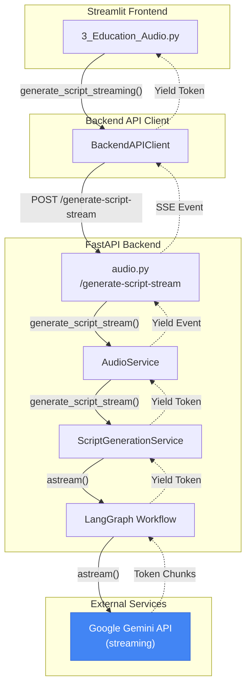
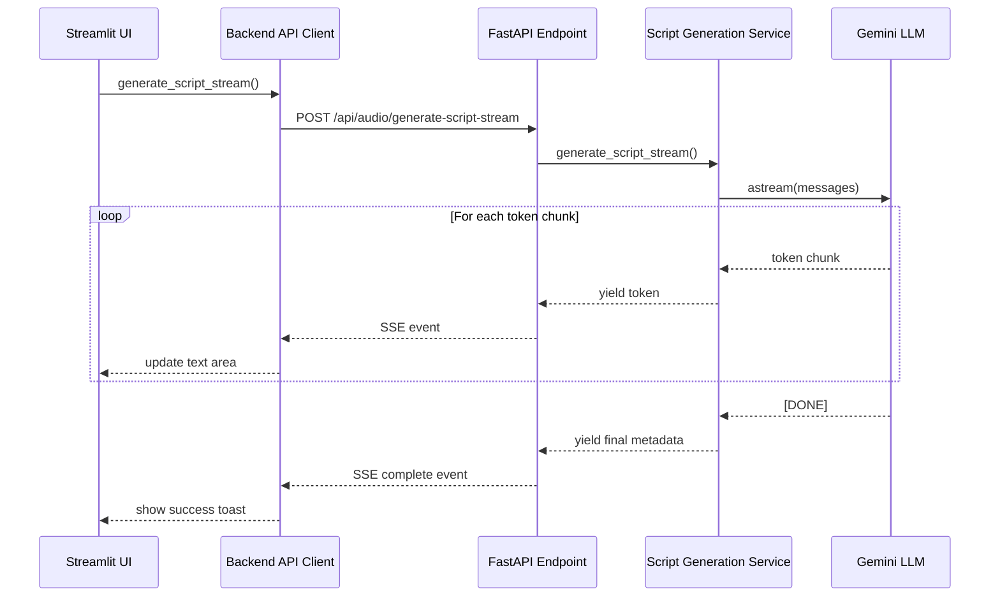
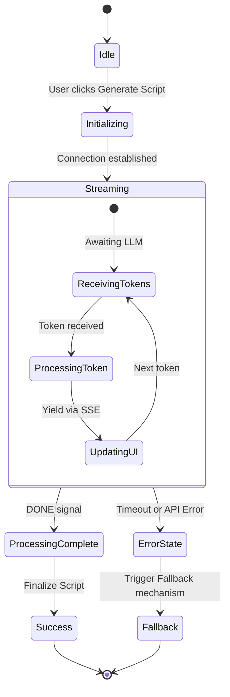

# Streaming LLM Script Generation - Implementation Plan

## Problem Statement

Large documents cause `ReadTimeout` errors because:

1. LLM generation takes 60+ seconds for large content
2. Current implementation waits for complete response before sending any data
3. HTTP connections timeout during this idle wait period

## Solution: End-to-End Streaming

Stream LLM tokens as they are generated, keeping the connection alive and providing real-time feedback to users.

## Architecture Overview

The following diagram illustrates the high-level architecture and component interactions for the LLM Streaming process.



## Process Flow

This sequence diagram details the streaming request flow from the UI to the Gemini LLM.



## Streaming Lifecycle

The following state diagram demonstrates the lifecycle of a script generation request, including streaming states and error handling.



---

## Phase 1: Backend - Streaming LLM Generation

### Task 1.1: Create Streaming Generator in LangGraph Workflow

**File:** [langgraph_workflow.py](file:///c:/Users/Cheney/Documents/Github/ElevenDops/backend/services/langgraph_workflow.py)

**Changes:**

- Add new `generate_script_stream()` async generator function
- Use `llm.astream()` instead of `llm.ainvoke()`
- Yield chunks as they arrive from the LLM

```python
async def generate_script_stream(
    knowledge_content: str,
    prompt: str,
    model_name: str,
) -> AsyncGenerator[dict, None]:
    """Stream script generation tokens.

    Yields:
        dict with either:
        - {"type": "token", "content": "..."}  # Partial content
        - {"type": "complete", "script": "...", "model_used": "..."}  # Final
        - {"type": "error", "message": "..."}  # Error occurred
    """
    settings = get_settings()
    api_key = settings.google_api_key

    if not api_key:
        yield {"type": "error", "message": "Google API key not configured"}
        return

    llm = ChatGoogleGenerativeAI(
        model=model_name,
        google_api_key=api_key,
        temperature=0.7,
        streaming=True,  # Enable streaming
    )

    messages = [
        SystemMessage(content=prompt),
        HumanMessage(content=f"Knowledge document:\n\n{knowledge_content}")
    ]

    full_content = ""
    try:
        async for chunk in llm.astream(messages):
            if chunk.content:
                full_content += chunk.content
                yield {"type": "token", "content": chunk.content}

        # Post-process and yield final result
        processed = post_process_script(full_content)
        yield {
            "type": "complete",
            "script": processed,
            "model_used": model_name
        }
    except Exception as e:
        yield {"type": "error", "message": f"{type(e).__name__}: {str(e)}"}
```

---

### Task 1.2: Add Streaming Method to Script Generation Service

**File:** [script_generation_service.py](file:///c:/Users/Cheney/Documents/Github/ElevenDops/backend/services/script_generation_service.py)

**Changes:**

- Add `generate_script_stream()` method that wraps the workflow streaming

```python
async def generate_script_stream(
    self,
    knowledge_content: str,
    model_name: str,
    prompt: str
) -> AsyncGenerator[dict, None]:
    """Stream script generation.

    Yields dict events: token, complete, or error.
    """
    async for event in generate_script_stream(
        knowledge_content=knowledge_content,
        prompt=prompt,
        model_name=model_name,
    ):
        yield event
```

---

### Task 1.3: Add Streaming Method to Audio Service

**File:** [audio_service.py](file:///c:/Users/Cheney/Documents/Github/ElevenDops/backend/services/audio_service.py)

**Changes:**

- Add `generate_script_stream()` method
- Handle document lookup and prompt preparation
- Delegate to script generation service

```python
async def generate_script_stream(
    self,
    knowledge_id: str,
    model_name: str = "gemini-2.5-flash",
    custom_prompt: Optional[str] = None
) -> AsyncGenerator[dict, None]:
    """Stream script generation from knowledge document."""
    doc = await self.data_service.get_knowledge_document(knowledge_id)
    if not doc:
        yield {"type": "error", "message": f"Document {knowledge_id} not found"}
        return

    prompt = custom_prompt or get_default_script_prompt()
    api_model_name = GEMINI_MODELS.get(model_name, model_name)

    async for event in self.script_service.generate_script_stream(
        knowledge_content=doc.raw_content,
        model_name=api_model_name,
        prompt=prompt
    ):
        yield event
```

---

## Phase 2: Backend - Streaming API Endpoint

### Task 2.1: Create SSE Streaming Endpoint

**File:** [audio.py](file:///c:/Users/Cheney/Documents/Github/ElevenDops/backend/api/routes/audio.py)

**Changes:**

- Add new `/generate-script-stream` endpoint
- Return `StreamingResponse` with `text/event-stream` content type
- Format events as Server-Sent Events (SSE)

```python
from fastapi.responses import StreamingResponse
import json

@router.post("/generate-script-stream")
async def generate_script_stream(
    request: ScriptGenerateRequest,
    service: AudioService = Depends(get_audio_service)
):
    """Stream script generation with SSE."""

    async def event_generator():
        try:
            async for event in service.generate_script_stream(
                knowledge_id=request.knowledge_id,
                model_name=request.model_name,
                custom_prompt=request.custom_prompt
            ):
                # Format as SSE
                yield f"data: {json.dumps(event)}\n\n"
        except Exception as e:
            yield f"data: {json.dumps({'type': 'error', 'message': str(e)})}\n\n"

    return StreamingResponse(
        event_generator(),
        media_type="text/event-stream",
        headers={
            "Cache-Control": "no-cache",
            "Connection": "keep-alive",
        }
    )
```

---

## Phase 3: Frontend - Streaming Client & UI

### Task 3.1: Add Streaming Method to Backend API Client

**File:** [backend_api.py](file:///c:/Users/Cheney/Documents/Github/ElevenDops/streamlit_app/services/backend_api.py)

**Changes:**

- Add `generate_script_stream()` async generator method
- Use `httpx` streaming capabilities
- Parse SSE events

```python
async def generate_script_stream(
    self,
    knowledge_id: str,
    model_name: str = "gemini-2.5-flash",
    custom_prompt: Optional[str] = None
) -> AsyncGenerator[dict, None]:
    """Stream script generation.

    Yields:
        dict events with type: 'token', 'complete', or 'error'
    """
    payload = {
        "knowledge_id": knowledge_id,
        "model_name": model_name,
        "custom_prompt": custom_prompt
    }

    async with self._get_llm_client() as client:
        async with client.stream(
            "POST",
            "/api/audio/generate-script-stream",
            json=payload
        ) as response:
            response.raise_for_status()

            async for line in response.aiter_lines():
                if line.startswith("data: "):
                    data = json.loads(line[6:])
                    yield data
```

---

### Task 3.2: Update Streamlit UI for Streaming

**File:** [3_Education_Audio.py](file:///c:/Users/Cheney/Documents/Github/ElevenDops/streamlit_app/pages/3_Education_Audio.py)

**Changes:**

- Replace [generate_script()](file:///c:/Users/Cheney/Documents/Github/ElevenDops/streamlit_app/services/backend_api.py#362-408) with streaming version
- Use `st.empty()` placeholder for progressive text display
- Show character count updating in real-time

```python
async def generate_script_streaming(knowledge_id: str):
    """Generate script with streaming display."""
    model = st.session_state.selected_llm_model
    prompt = st.session_state.custom_prompt

    # Create placeholder for streaming content
    script_placeholder = st.empty()
    status_placeholder = st.empty()

    full_script = ""

    try:
        async for event in client.generate_script_stream(
            knowledge_id=knowledge_id,
            model_name=model,
            custom_prompt=prompt
        ):
            if event["type"] == "token":
                full_script += event["content"]
                # Update display progressively
                script_placeholder.text_area(
                    "Generating...",
                    value=full_script,
                    height=400,
                    disabled=True
                )
                status_placeholder.caption(f"⏳ Generating... ({len(full_script)} chars)")

            elif event["type"] == "complete":
                st.session_state.generated_script = event["script"]
                status_placeholder.empty()
                st.toast(f"✅ Script generated using {event['model_used']}!", icon="📝")
                st.rerun()

            elif event["type"] == "error":
                status_placeholder.empty()
                st.warning(f"⚠️ Generation failed: {event['message']}")

    except Exception as e:
        st.error(f"Script generation failed: {str(e)}")
```

---

## Phase 4: Error Handling & Fallback

### Task 4.1: Implement Graceful Fallback

**Changes across files:**

- If streaming fails mid-way, save partial content
- Offer user option to retry or use partial content
- Log streaming errors for debugging

---

## Task Summary

| Phase | Task                                 | File                                                                                                                              | Complexity |
| ----- | ------------------------------------ | --------------------------------------------------------------------------------------------------------------------------------- | ---------- |
| 1     | 1.1 Streaming generator in LangGraph | [langgraph_workflow.py](file:///c:/Users/Cheney/Documents/Github/ElevenDops/backend/services/langgraph_workflow.py)               | High       |
| 1     | 1.2 Service streaming method         | [script_generation_service.py](file:///c:/Users/Cheney/Documents/Github/ElevenDops/backend/services/script_generation_service.py) | Medium     |
| 1     | 1.3 Audio service streaming          | [audio_service.py](file:///c:/Users/Cheney/Documents/Github/ElevenDops/backend/services/audio_service.py)                         | Medium     |
| 2     | 2.1 SSE API endpoint                 | [audio.py](file:///c:/Users/Cheney/Documents/Github/ElevenDops/backend/api/routes/audio.py)                                       | Medium     |
| 3     | 3.1 Frontend API client streaming    | [backend_api.py](file:///c:/Users/Cheney/Documents/Github/ElevenDops/streamlit_app/services/backend_api.py)                       | Medium     |
| 3     | 3.2 Streamlit streaming UI           | [3_Education_Audio.py](file:///c:/Users/Cheney/Documents/Github/ElevenDops/streamlit_app/pages/3_Education_Audio.py)              | High       |
| 4     | 4.1 Error handling & fallback        | Multiple                                                                                                                          | Medium     |

---

## Verification Plan

### Unit Tests

- Test streaming generator yields correct event types
- Test SSE endpoint format compliance
- Test client parses SSE events correctly

### Integration Tests

- End-to-end streaming with small document
- End-to-end streaming with large document (60s+ generation)
- Error handling (API key missing, network error mid-stream)

### Manual Testing

- Visual verification of progressive text display
- Verify no timeout errors on large documents
- Test cancellation during streaming

---

## Estimated Effort

| Phase     | Tasks              | Estimated Time |
| --------- | ------------------ | -------------- |
| Phase 1   | Backend streaming  | 2-3 hours      |
| Phase 2   | API endpoint       | 1 hour         |
| Phase 3   | Frontend streaming | 2-3 hours      |
| Phase 4   | Error handling     | 1 hour         |
| **Total** |                    | **6-8 hours**  |

---

## User Review Required

> [!IMPORTANT]
> This is a significant architecture change. Please confirm:
>
> 1. Should we keep the non-streaming endpoint as fallback?
> 2. Any specific UI preferences for the streaming display?
> 3. Priority of phases - implement all at once or incrementally?
