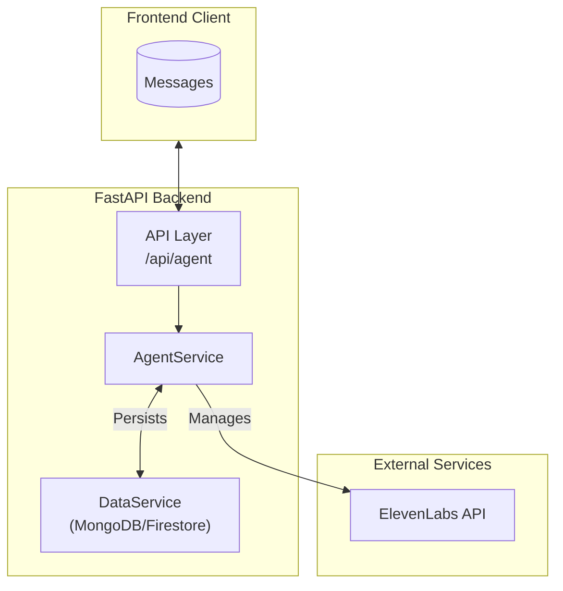
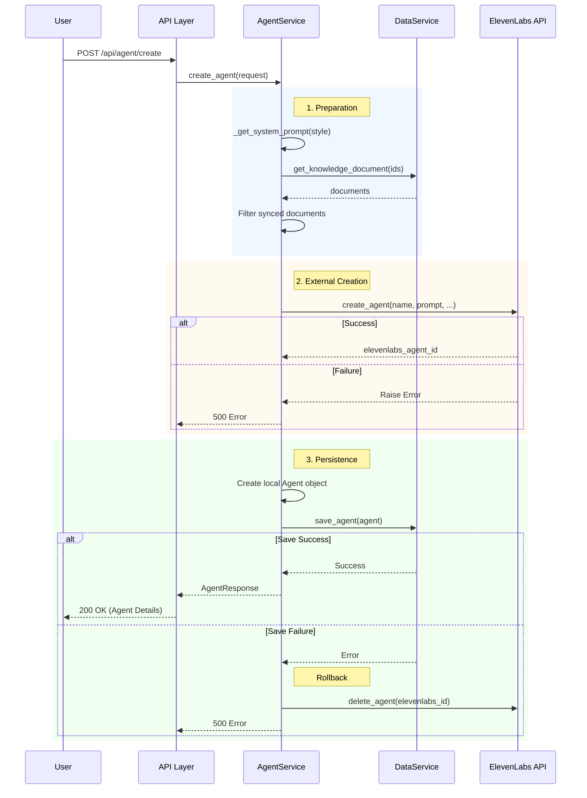

# Agent System Design

## Architecture Overview

The Agent System manages the lifecycle of AI medical assistants, bridging the local application with the ElevenLabs Conversational AI platform.

## Agent Creation Workflow

This sequence diagram illustrates the process of creating a new AI agent. Key steps include generating the system prompt, syncing knowledge base documents, and coordinating with the ElevenLabs API.

## Data Model

The system maintains a local representation of the agent that maps to the external ElevenLabs entity.

### Agent Entity

| Field                 | Type       | Description                                       |
| --------------------- | ---------- | ------------------------------------------------- |
| `agent_id`            | UUID       | Local unique identifier                           |
| `elevenlabs_agent_id` | String     | External ID from ElevenLabs                       |
| `name`                | String     | Display name of the agent                         |
| `voice_id`            | String     | ID of the voice model used                        |
| `answer_style`        | Enum       | Personality (PROFESSIONAL, FRIENDLY, EDUCATIONAL) |
| `knowledge_ids`       | List[UUID] | IDs of associated local knowledge documents       |
| `doctor_id`           | String     | ID of the doctor who owns this agent              |

### System Prompts

The `AgentService` automatically injects a system prompt based on the selected `AnswerStyle`. This ensures consistent persona behavior (Professional, Friendly, or Educational).
