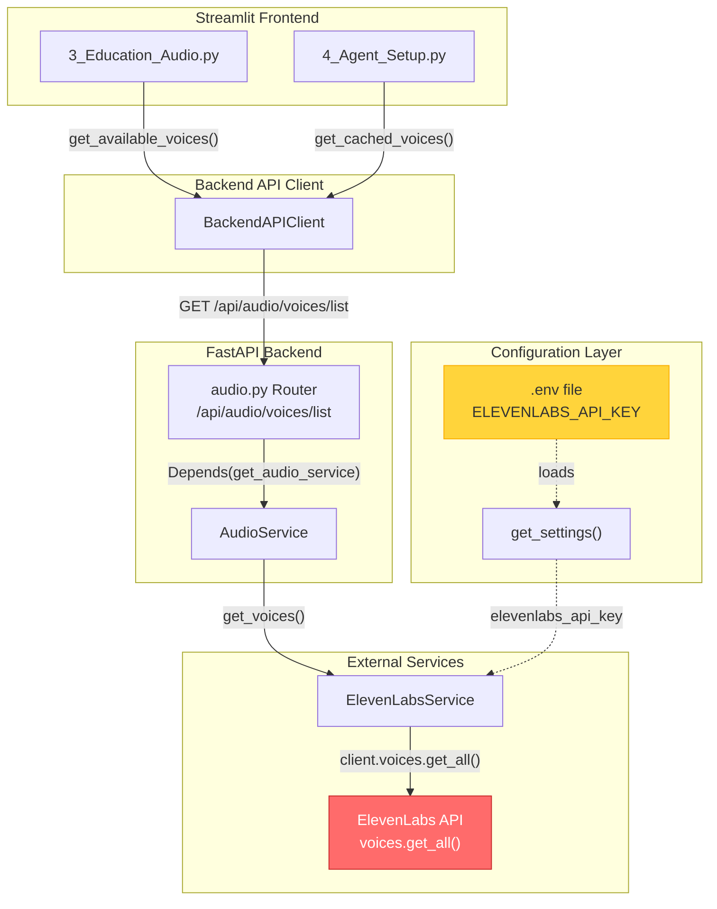
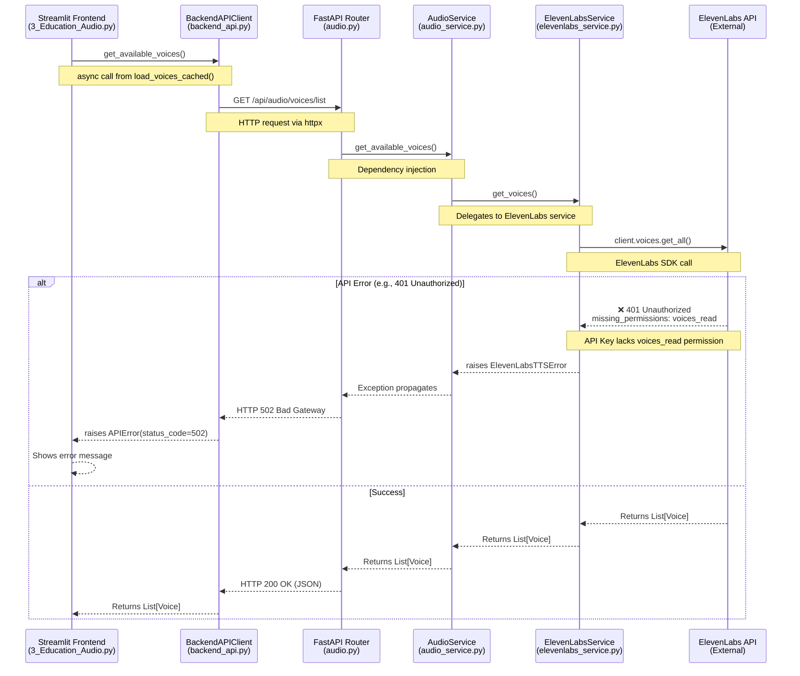

# ElevenLabs Voice API System Architecture

## Architecture Overview

The following diagram illustrates the high-level architecture and component interactions for the ElevenLabs Voice API integration.



## Service Interaction Flow

This sequence diagram details the request flow from the UI to the ElevenLabs API, including error propagation handling.



## Configuration & Security

### Required Permissions

The ElevenLabs API Key requires specific permissions to function correctly with the backend services. Ensure the API key configured in `.env` has the following scopes:

| Feature                  | Required Permission       |
| ------------------------ | ------------------------- |
| List Voices              | `voices_read`             |
| Generate Audio (TTS)     | `audio_generation_create` |
| Sync Knowledge Documents | `knowledge_base_write`    |
| Create Agents            | `agent_create`            |
| Delete Agents            | `agent_delete`            |

### Environment Setup

The application looks for the API key in the `.env` file or environment variables:

```ini
ELEVENLABS_API_KEY=your_api_key_here
```

## Troubleshooting & Diagnostics

Use the following checkpoints to diagnose issues with the Voice API integration.

### Checkpoint 1: Verify API Key Presence

**Purpose**: Confirm the `ELEVENLABS_API_KEY` is loaded from the environment.

**Test Command** (PowerShell):

```powershell
# Check if the key is set in the environment
$env:ELEVENLABS_API_KEY
```

**Expected Result**: A non-empty API key string should be displayed.

### Checkpoint 2: Verify API Key Validity

**Purpose**: Confirm the API key is valid and not expired/revoked.

**Test Command** (PowerShell):

```powershell
# Test the API key directly with ElevenLabs
$headers = @{
    "xi-api-key" = $env:ELEVENLABS_API_KEY
}
Invoke-RestMethod -Uri "https://api.elevenlabs.io/v1/user" -Headers $headers
```

**Expected Result**: Returns user information JSON with subscription details.

### Checkpoint 3: Verify `voices_read` Permission

**Purpose**: Confirm the API key has the required `voices_read` permission.

**Test Command** (PowerShell):

```powershell
# Attempt to fetch voices directly
$headers = @{
    "xi-api-key" = $env:ELEVENLABS_API_KEY
}
try {
    Invoke-RestMethod -Uri "https://api.elevenlabs.io/v1/voices" -Headers $headers
} catch {
    $_.Exception.Response.StatusCode
    $reader = [System.IO.StreamReader]::new($_.Exception.Response.GetResponseStream())
    $reader.ReadToEnd()
}
```

**Expected Result**: Returns a list of available voices. If 401 Unauthorized is returned, check permissions.

### Checkpoint 4: Verify Backend Service Configuration

**Purpose**: Confirm the backend is correctly loading the API key and communicating with ElevenLabs.

**Test Command** (PowerShell):

```powershell
# Call the backend endpoint directly
Invoke-RestMethod -Uri "http://localhost:8000/api/audio/voices/list"
```

**Expected Result**: Returns a list of voice options in JSON format.
