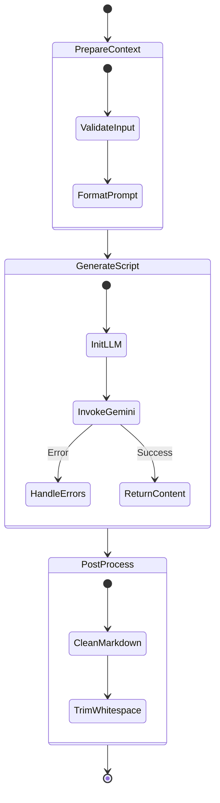
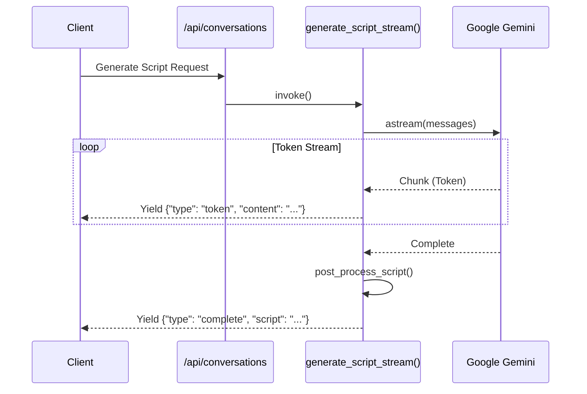
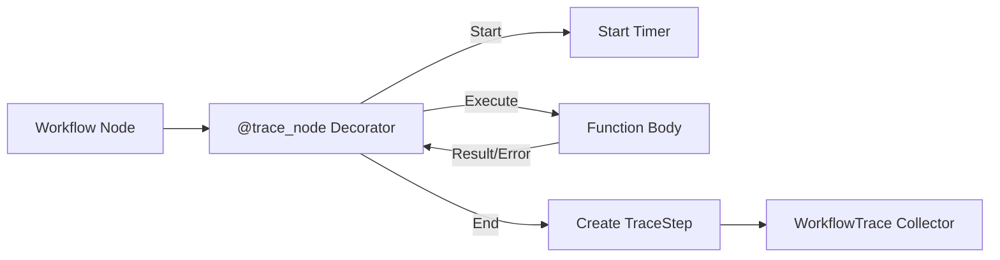

# LangGraph Conversation System Design

## System Overview

The Conversation System uses [LangGraph](https://langchain-ai.github.io/langgraph/) to orchestrate complex LLM workflows. It supports both synchronous execution and real-time streaming of generated content using Google's Gemini models.

## Script Generation Workflow

The script generation process is modeled as a state graph, allowing for structured processing, validation, and error handling.

### LangGraph Implementation

The workflow is defined in `langgraph_workflow.py` with the following nodes:

1.  **`prepare_context`**: Validates inputs and performs any necessary text preprocessing.
2.  **`generate_script`**: Invokes the `ChatGoogleGenerativeAI` model. Handles API keys and timeouts.
3.  **`post_process`**: Cleans up the raw LLM output (e.g., removing Markdown code blocks).

## Streaming Architecture

To support long responses without timeouts, the system implements a streaming generator pattern.

## Tracing and Observability

The system includes a custom tracing layer (`WorkflowTrace`) to monitor workflow execution.

- **Trace Granularity**: Tracks individual node execution time (ms), input/output state, and errors.
- **LangSmith Integration**: Compatible with LangSmith for deep debugging when configured.
- **Error Handling**: Captures full stack traces for failed nodes without crashing the entire workflow.

### Data Flow for Tracing

