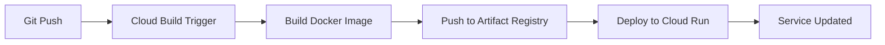

# CI/CD Pipeline Guide

This guide covers setting up and managing the Cloud Build CI/CD pipeline for automated ElevenDops deployments.

## Overview

The CI/CD pipeline automatically:

1. **Builds** the Docker image on code push to main branch
2. **Pushes** the image to Artifact Registry
3. **Deploys** the updated service to Cloud Run



---

## Pipeline Configuration

The pipeline is defined in `cloudbuild.yaml` in the repository root.

### Build Steps

```yaml
steps:
  # Step 1: Build the container image
  - name: "gcr.io/cloud-builders/docker"
    id: "build"
    args:
      - "build"
      - "-t"
      - "${_REGION}-docker.pkg.dev/${PROJECT_ID}/elevendops/app:${SHORT_SHA}"
      - "-t"
      - "${_REGION}-docker.pkg.dev/${PROJECT_ID}/elevendops/app:latest"
      - "-f"
      - "Dockerfile.cloudrun"
      - "."

  # Step 2: Push to Artifact Registry
  - name: "gcr.io/cloud-builders/docker"
    id: "push"
    args:
      - "push"
      - "--all-tags"
      - "${_REGION}-docker.pkg.dev/${PROJECT_ID}/elevendops/app"

  # Step 3: Deploy to Cloud Run
  - name: "gcr.io/google.com/cloudsdktool/cloud-sdk"
    id: "deploy"
    entrypoint: "gcloud"
    args:
      - "run"
      - "deploy"
      - "elevendops"
      - "--image"
      - "${_REGION}-docker.pkg.dev/${PROJECT_ID}/elevendops/app:${SHORT_SHA}"
      # ... additional deployment flags
```

---

## Setting Up the Pipeline

### Step 1: Grant Cloud Build Permissions

Cloud Build needs permissions to deploy to Cloud Run:

```bash
export PROJECT_ID="your-project-id"

# Get Cloud Build service account
CLOUDBUILD_SA=$(gcloud projects describe $PROJECT_ID \
    --format="value(projectNumber)")@cloudbuild.gserviceaccount.com

# Grant Cloud Run Admin role
gcloud projects add-iam-policy-binding $PROJECT_ID \
    --member="serviceAccount:${CLOUDBUILD_SA}" \
    --role="roles/run.admin"

# Grant Service Account User role (to deploy as elevendops-sa)
gcloud iam service-accounts add-iam-policy-binding \
    elevendops-sa@${PROJECT_ID}.iam.gserviceaccount.com \
    --member="serviceAccount:${CLOUDBUILD_SA}" \
    --role="roles/iam.serviceAccountUser"

# Grant Artifact Registry Writer role (to push images)
gcloud projects add-iam-policy-binding $PROJECT_ID \
    --member="serviceAccount:${CLOUDBUILD_SA}" \
    --role="roles/artifactregistry.writer"
```

### Step 2: Create Build Trigger

**For GitHub Repositories:**

```bash
gcloud builds triggers create github \
    --name="elevendops-deploy" \
    --repo-name="ElevenDops" \
    --repo-owner="YOUR_GITHUB_USERNAME" \
    --branch-pattern="^main$" \
    --build-config="cloudbuild.yaml" \
    --substitutions="_REGION=asia-east1"
```

**For Cloud Source Repositories:**

```bash
gcloud builds triggers create cloud-source-repositories \
    --name="elevendops-deploy" \
    --repo="elevendops" \
    --branch-pattern="^main$" \
    --build-config="cloudbuild.yaml" \
    --substitutions="_REGION=asia-east1"
```

### Step 3: Verify Trigger

```bash
# List all triggers
gcloud builds triggers list

# Describe specific trigger
gcloud builds triggers describe elevendops-deploy
```

---

## Using the Pipeline

### Automatic Deployment

Simply push to the main branch:

```bash
# Make your changes
git add .
git commit -m "feat: add new feature"

# Push triggers automatic deployment
git push origin main
```

### Manual Trigger

Trigger a build without pushing code:

```bash
# Using gcloud
gcloud builds submit --config=cloudbuild.yaml \
    --substitutions=_REGION=asia-east1

# Or trigger the existing trigger
gcloud builds triggers run elevendops-deploy \
    --branch=main
```

---

## Monitoring Builds

### View Build History

```bash
# List recent builds
gcloud builds list --limit=10

# List builds by trigger
gcloud builds list --filter="trigger_id=TRIGGER_ID" --limit=5
```

### View Build Logs

```bash
# View logs for a specific build
gcloud builds log BUILD_ID

# Stream logs for in-progress build
gcloud builds log BUILD_ID --stream
```

### Check Build Status

```bash
# Describe a specific build
gcloud builds describe BUILD_ID
```

### Console Access

View builds in the [Cloud Build Console](https://console.cloud.google.com/cloud-build/builds).

---

## Customizing the Pipeline

### Adding Test Steps

Add testing before deployment:

```yaml
steps:
  # Run tests first
  - name: "python:3.11-slim"
    id: "test"
    entrypoint: "bash"
    args:
      - "-c"
      - |
        pip install pytest pytest-asyncio
        pip install -r requirements.txt
        pytest tests/ -v

  # Build (depends on test success)
  - name: "gcr.io/cloud-builders/docker"
    id: "build"
    waitFor: ["test"]
    # ... build args
```

### Multiple Environments

Deploy to different environments based on branch:

```yaml
# cloudbuild-staging.yaml
substitutions:
  _REGION: "asia-east1"
  _SERVICE_NAME: "elevendops-staging"
  _MIN_INSTANCES: "0"
  _MAX_INSTANCES: "2"
```

Create separate triggers for each environment:

```bash
# Staging trigger (develop branch)
gcloud builds triggers create github \
    --name="elevendops-staging" \
    --repo-name="ElevenDops" \
    --repo-owner="YOUR_USERNAME" \
    --branch-pattern="^develop$" \
    --build-config="cloudbuild-staging.yaml"

# Production trigger (main branch)
gcloud builds triggers create github \
    --name="elevendops-production" \
    --repo-name="ElevenDops" \
    --repo-owner="YOUR_USERNAME" \
    --branch-pattern="^main$" \
    --build-config="cloudbuild.yaml"
```

---

## Build Variables

### Substitution Variables

| Variable      | Description               | Default        |
| ------------- | ------------------------- | -------------- |
| `_REGION`     | GCP region for deployment | `asia-east1`   |
| `PROJECT_ID`  | GCP project ID            | Auto-detected  |
| `SHORT_SHA`   | Git commit short SHA      | Auto-generated |
| `BRANCH_NAME` | Git branch name           | Auto-detected  |

### Using Variables

Override during manual build:

```bash
gcloud builds submit \
    --substitutions=_REGION=us-central1,_MAX_INSTANCES=5
```

---

## Build Notifications

### Set Up Slack Notifications

```bash
# Create a Pub/Sub topic for build notifications
gcloud pubsub topics create cloud-builds

# Configure Cloud Build to publish to this topic
# (This is enabled by default)
```

Then create a Cloud Function to send Slack messages when builds complete.

### Email Notifications

Configure email notifications in the Cloud Console under Cloud Build > Settings > Notifications.

---

## Troubleshooting

### Build Failures

**Docker build failed:**

```bash
# Check build logs for the specific step
gcloud builds log BUILD_ID --stream

# Common issues:
# - Missing dependencies in requirements
# - Syntax errors in Dockerfile
# - Network issues pulling base images
```

**Push to Artifact Registry failed:**

```bash
# Verify repository exists
gcloud artifacts repositories list

# Verify Cloud Build has push permissions
gcloud projects get-iam-policy $PROJECT_ID \
    --flatten="bindings[].members" \
    --filter="bindings.members:${CLOUDBUILD_SA}"
```

**Deployment failed:**

```bash
# Check Cloud Run specific errors
gcloud logging read "resource.type=cloud_run_revision AND resource.labels.service_name=elevendops" \
    --limit=50

# Verify service account permissions
gcloud run services get-iam-policy elevendops --region=asia-east1
```

### Trigger Not Firing

1. Verify the branch pattern matches your push
2. Check trigger is not disabled
3. Verify GitHub/Cloud Source Repository connection is active

```bash
# List triggers and check status
gcloud builds triggers list

# Check GitHub connection
gcloud builds connections list
```

---

## Best Practices

1. **Use commit SHA for image tags** - Enables easy rollback and traceability
2. **Keep build steps independent** - Use `waitFor` to control dependencies
3. **Cache Docker layers** - Use Kaniko builder for faster builds
4. **Set appropriate timeouts** - Default is 10 minutes, adjust as needed
5. **Use substitution variables** - Makes the pipeline reusable across environments
6. **Monitor build times** - Set up alerts for unusually long builds

---

## Related Documentation

- [Cloud Build Documentation](https://cloud.google.com/build/docs)
- [Cloud Build Triggers](https://cloud.google.com/build/docs/automating-builds/create-manage-triggers)
- [Upload to Cloud Run Guide](./guide--upload-to-cloud-run.md)
