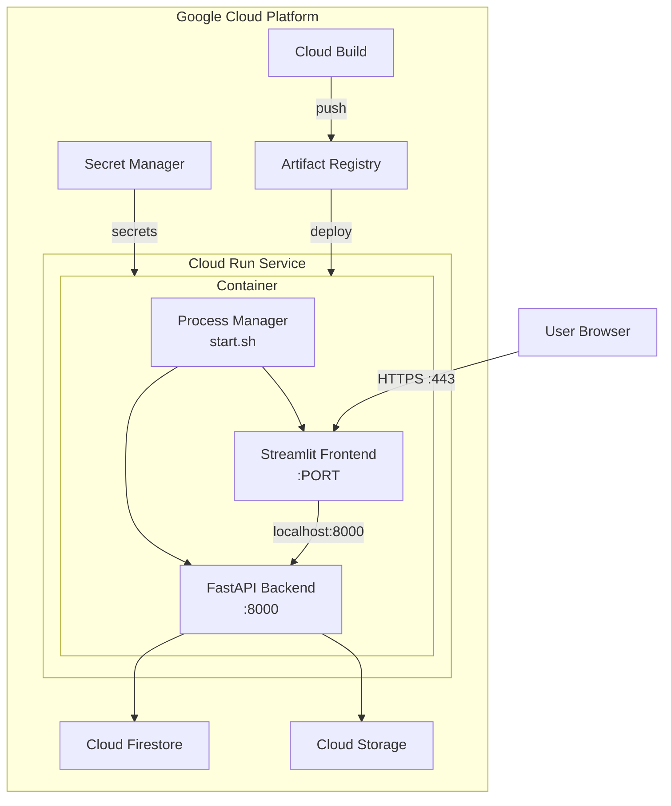

# Cloud Run Deployment Guide

This directory contains comprehensive documentation for deploying ElevenDops to Google Cloud Run.

## Overview

ElevenDops uses a **single-container deployment** approach where both the FastAPI backend and Streamlit frontend run within the same container, managed by a process supervisor script. This simplifies deployment while maintaining the existing application architecture.

## Quick Start

If you're deploying for the first time, follow these guides in order:

1. **[Prerequisites](./guide--prerequisites.md)** - Set up your GCP environment
2. **[Upload to Cloud Run](./guide--upload-to-cloud-run.md)** - Complete step-by-step upload guide
3. **[Troubleshooting](./guide--troubleshooting.md)** - Common issues and solutions

## Documentation Index

### Guides

| Document                                                                            | Description                                        |
| ----------------------------------------------------------------------------------- | -------------------------------------------------- |
| [Prerequisites](./guide--prerequisites.md)                                          | GCP project setup, APIs, and initial configuration |
| [Upload to Cloud Run](./guide--upload-to-cloud-run.md)                              | **Complete guide on how to upload to Cloud Run**   |
| [Secret Management](./guide--secret-management.md)                                  | Setting up Secret Manager for API keys             |
| [CI/CD Pipeline](./guide--cicd-pipeline.md)                                         | Automated deployment with Cloud Build              |
| [Configuration Management](../development-guide/guide--configuration-management.md) | **Cross-stage parameter setup and strategy**       |
| [Troubleshooting](./guide--troubleshooting.md)                                      | Common issues and debugging                        |

### Reference

| Document                                                       | Description                                       |
| -------------------------------------------------------------- | ------------------------------------------------- |
| [Architecture](./reference--architecture.md)                   | System design and component overview              |
| [Environment Variables](./reference--environment-variables.md) | Complete environment configuration reference      |
| [Configuration Files](./reference--configuration-files.md)     | Dockerfile, cloudbuild.yaml, service.yaml details |

## Architecture Overview

## Key Files

| File                  | Location        | Purpose                               |
| --------------------- | --------------- | ------------------------------------- |
| `Dockerfile.cloudrun` | Repository root | Production Docker image configuration |
| `cloudbuild.yaml`     | Repository root | Cloud Build CI/CD pipeline            |
| `scripts/start.sh`    | `scripts/`      | Process manager script                |
| `service.yaml`        | `deploy/`       | Cloud Run service configuration       |
| `README.md`           | `deploy/`       | Original deployment documentation     |

## Requirements Summary

The deployment meets the following key requirements:

- ✅ Single-container deployment with both services
- ✅ Non-root user for security
- ✅ Secret Manager integration for API keys
- ✅ Auto-scaling (0-10 instances)
- ✅ Health check endpoint at `/api/health`
- ✅ Graceful shutdown handling
- ✅ Structured JSON logging for Cloud Logging
- ✅ CI/CD automation with Cloud Build

## Support

For additional support, refer to:

- [Google Cloud Run Documentation](https://cloud.google.com/run/docs)
- [ElevenDops Project Overview](../.kiro/steering/project-overview.md)
- [Original Deploy README](../deploy/README.md)
