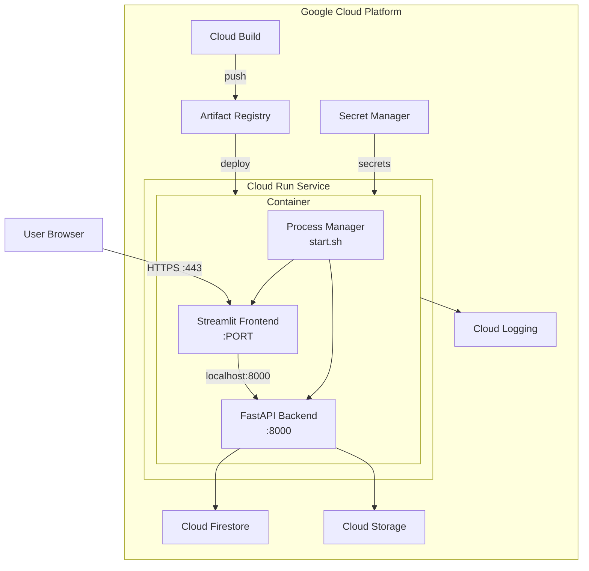
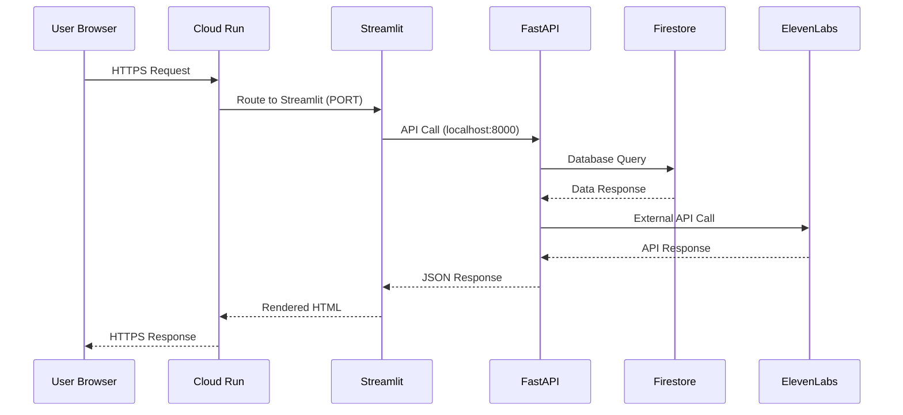
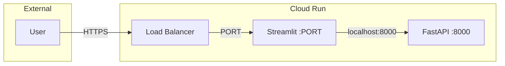
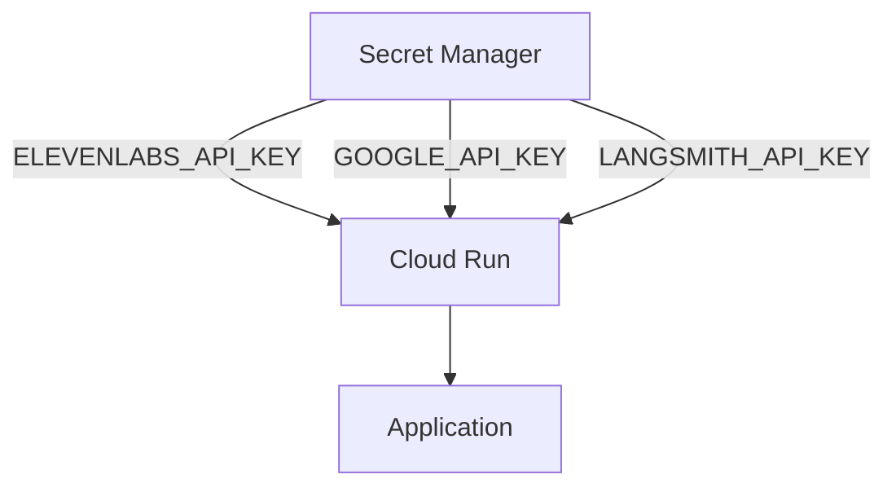
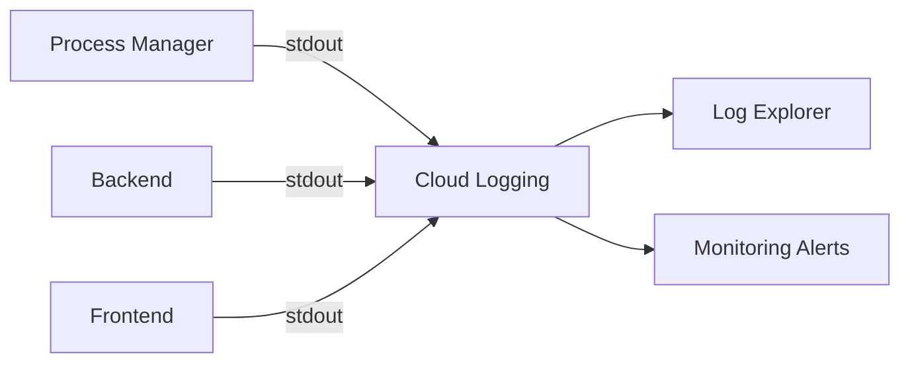
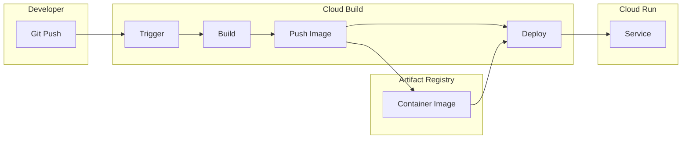

# Architecture Reference

This document describes the deployment architecture for ElevenDops on Google Cloud Run.

## System Overview

ElevenDops uses a **single-container deployment** approach where both the FastAPI backend and Streamlit frontend run within the same container. This simplifies deployment while maintaining clear separation of concerns in the codebase.

## Architecture Diagram



---

## Component Details

### Process Manager (start.sh)

The process manager is a bash script that orchestrates both services within the container.

**Responsibilities:**

- Start FastAPI backend first, wait for health check
- Start Streamlit frontend after backend is ready
- Monitor both processes and restart if they crash
- Handle graceful shutdown on SIGTERM

**Key Features:**

| Feature              | Description                                         |
| -------------------- | --------------------------------------------------- |
| Health Check Waiting | Waits up to 30 seconds for backend to be healthy    |
| Auto-Restart         | Restarts crashed processes up to 3 times            |
| Graceful Shutdown    | Handles SIGTERM/SIGINT for clean container shutdown |
| Structured Logging   | Outputs timestamped logs for Cloud Logging          |

**Location:** `scripts/start.sh`

---

### FastAPI Backend

The backend handles all business logic, API requests, and external service integrations.

**Configuration:**

- **Port:** 8000 (internal only)
- **Host:** 0.0.0.0
- **Health Endpoint:** `/api/health`

**External Integrations:**

| Service        | Purpose                   |
| -------------- | ------------------------- |
| Firestore      | Primary data storage      |
| Cloud Storage  | Audio file storage        |
| ElevenLabs API | Voice AI services         |
| Google Gemini  | LLM for script generation |
| LangSmith      | Tracing and debugging     |

---

### Streamlit Frontend

The frontend provides the user interface for the medical assistant system.

**Configuration:**

- **Port:** Dynamically set by Cloud Run's `PORT` environment variable
- **Mode:** Headless (no browser auto-open)
- **Backend Connection:** `http://localhost:8000`

**Pages:**

1. Doctor Dashboard
2. Upload Knowledge
3. Education Audio
4. Agent Setup
5. Patient Test
6. Conversation Logs

---

## Request Flow



---

## Container Configuration

### Dockerfile Structure

```
┌─────────────────────────────────────┐
│         Builder Stage               │
│  • Python 3.11-slim base           │
│  • Poetry for dependency install    │
│  • Production dependencies only     │
└─────────────────────────────────────┘
              │
              ▼
┌─────────────────────────────────────┐
│       Production Stage              │
│  • Python 3.11-slim base           │
│  • Non-root user (appuser)         │
│  • Curl for health checks          │
│  • Application code                 │
│  • Process manager script          │
└─────────────────────────────────────┘
```

### Image Size Optimization

- Multi-stage build eliminates build tools from final image
- Only production dependencies included
- Base image uses slim variant
- No dev dependencies or test files

---

## Cloud Run Configuration

### Resource Allocation

| Resource    | Value | Rationale                                   |
| ----------- | ----- | ------------------------------------------- |
| CPU         | 2     | Required for running both services          |
| Memory      | 1 GB  | Sufficient for typical workloads            |
| Concurrency | 80    | Balance between utilization and performance |
| Timeout     | 300s  | Allows for long-running audio generation    |

### Scaling Configuration

| Setting           | Value | Purpose                                |
| ----------------- | ----- | -------------------------------------- |
| Min Instances     | 0     | Scale to zero when idle (cost savings) |
| Max Instances     | 10    | Cost control and resource limits       |
| CPU Throttling    | Off   | Better performance during requests     |
| Startup CPU Boost | On    | Faster cold starts                     |

---

## Health Checks

### Startup Probe

```yaml
startupProbe:
  httpGet:
    path: /api/health
    port: 8000
  initialDelaySeconds: 10
  periodSeconds: 5
  failureThreshold: 12
```

- Waits for backend to be ready
- Up to 60 seconds total (12 \* 5s)
- Container marked unhealthy if startup fails

### Liveness Probe

```yaml
livenessProbe:
  httpGet:
    path: /api/health
    port: 8000
  periodSeconds: 30
  failureThreshold: 3
```

- Checks if container is still healthy
- Restarts container if 3 consecutive failures

---

## Security Architecture

### Network Security



- All external traffic uses HTTPS
- Backend only accessible via localhost
- Cloud Run provides automatic TLS termination

### Secret Management



- Secrets stored in Secret Manager
- Mounted as environment variables at runtime
- Service account has minimal required permissions

### Service Account Permissions

| Role                                 | Purpose              |
| ------------------------------------ | -------------------- |
| `roles/datastore.user`               | Firestore read/write |
| `roles/storage.objectAdmin`          | GCS bucket access    |
| `roles/secretmanager.secretAccessor` | Read secrets         |
| `roles/logging.logWriter`            | Write logs           |

---

## Logging Architecture

### Log Flow



### Log Format

All components output structured logs compatible with Cloud Logging:

```
[2024-01-15T10:30:00Z] INFO: Backend started on port 8000
[2024-01-15T10:30:01Z] INFO: Health check passed
[2024-01-15T10:30:02Z] INFO: Frontend started on port 8080
```

---

## Deployment Pipeline



---

## Environment Configuration

### Production Defaults

| Variable                 | Value                   | Description            |
| ------------------------ | ----------------------- | ---------------------- |
| `APP_ENV`                | `production`            | Environment identifier |
| `USE_FIRESTORE_EMULATOR` | `false`                 | Use real Firestore     |
| `USE_GCS_EMULATOR`       | `false`                 | Use real Cloud Storage |
| `USE_MOCK_DATA`          | `false`                 | Use real data          |
| `BACKEND_API_URL`        | `http://localhost:8000` | Internal backend URL   |

See [Environment Variables Reference](./reference--environment-variables.md) for complete list.

---

## Failure Handling

### Container Startup Failures

| Failure                | Handling                                    |
| ---------------------- | ------------------------------------------- |
| Backend fails to start | Process manager retries 3 times, then exits |
| Health check timeout   | Cloud Run marks unhealthy, triggers restart |
| Missing secrets        | Backend raises ConfigurationError           |

### Runtime Failures

| Failure              | Handling                               |
| -------------------- | -------------------------------------- |
| Backend crash        | Process manager restarts automatically |
| Frontend crash       | Process manager restarts automatically |
| Firestore error      | Returns 503 with retry-after header    |
| ElevenLabs API error | Returns appropriate error with details |

---

## Related Documentation

- [Configuration Files Reference](./reference--configuration-files.md)
- [Environment Variables Reference](./reference--environment-variables.md)
- [Upload to Cloud Run Guide](./guide--upload-to-cloud-run.md)
