# Audio Edit Bug Root Cause Analysis

## Summary

The audio edit feature appeared to work (frontend sent correct data, backend saved it), but the **list API dropped the `name` and `description` fields** when returning audio files.

## Data Flow Diagram

```mermaid
sequenceDiagram
    participant UI as Streamlit Frontend
    participant API as FastAPI Backend
    participant SVC as AudioService
    participant DB as Firestore

    Note over UI: User edits audio name/description

    UI->>+API: PUT /api/audio/{id}<br/>{"name": "test-title", "description": "..."}
    API->>+SVC: update_audio_metadata(id, name, desc)
    SVC->>+DB: save_audio_metadata(metadata)
    DB-->>-SVC: ✅ Saved with name & description
    SVC-->>-API: AudioMetadata (with name/desc)
    API-->>-UI: ✅ 200 OK (with name/desc)

    Note over UI: st.rerun() triggers refresh

    UI->>+API: GET /api/audio/list?doctor_id=...
    API->>+SVC: get_audio_files(doctor_id)
    SVC->>+DB: get_audio_files()
    DB-->>-SVC: List[AudioMetadata] ✅ WITH name/desc

    Note over SVC: 🐛 BUG HERE!<br/>When transforming URLs,<br/>new AudioMetadata objects<br/>created WITHOUT name & description

    SVC-->>-API: List[AudioMetadata] ❌ MISSING name/desc
    API-->>-UI: audio_files with name="" desc=""

    Note over UI: Shows "Unnamed Audio" 😢
```



## The Bug Location


## Fix Applied

**File:** `backend/services/audio_service.py`  
**Lines:** 307-316

### Before (Bug)

```python
proxy_audio_files.append(AudioMetadata(
    audio_id=audio.audio_id,
    audio_url=final_url,
    knowledge_id=audio.knowledge_id,
    voice_id=audio.voice_id,
    duration_seconds=audio.duration_seconds,
    script=audio.script,
    created_at=audio.created_at,
    doctor_id=audio.doctor_id
    # ❌ MISSING: name and description
))
```

### After (Fixed)

```python
proxy_audio_files.append(AudioMetadata(
    audio_id=audio.audio_id,
    audio_url=final_url,
    knowledge_id=audio.knowledge_id,
    voice_id=audio.voice_id,
    duration_seconds=audio.duration_seconds,
    script=audio.script,
    created_at=audio.created_at,
    doctor_id=audio.doctor_id,
    name=audio.name,           # ✅ Added
    description=audio.description  # ✅ Added
))
```

## Lesson Learned

When adding new fields to a data model, **search for all places where that model is constructed** to ensure the new fields are included everywhere.
