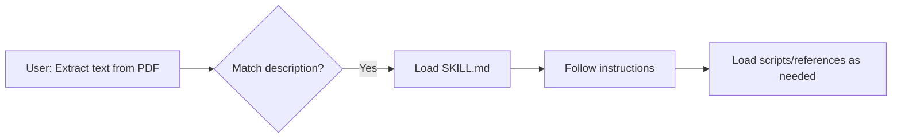
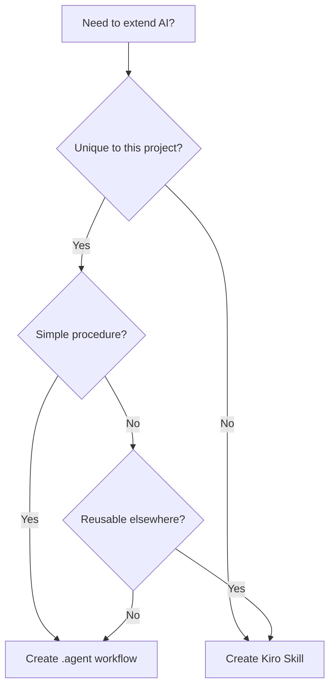

# Agent Workflows vs Kiro Skills: Comparison Guide

This document compares the `.agent` workflow system with Kiro Skills, helping you understand when to use each approach for extending AI agent capabilities.

---

## Quick Comparison Table

| Aspect              | `.agent` Workflows            | Kiro Skills                        |
| :------------------ | :---------------------------- | :--------------------------------- |
| **Primary Purpose** | Project-specific SOPs         | Domain expertise packages          |
| **Trigger**         | Slash commands (`/build`)     | Description-based matching         |
| **Scope**           | Single project                | Portable across projects           |
| **Structure**       | Flat markdown files           | Self-contained folders             |
| **Entry Point**     | `workflows/*.md`              | `SKILL.md` with frontmatter        |
| **Typical Size**    | 1-50 steps                    | Complete domain package            |
| **Best For**        | "How we do X in this project" | "How to work with X format/domain" |

---

## How They Work

### `.agent` Workflows


**Trigger Mechanism:** Explicit slash commands based on filename.

```
.agent/
├── workflows/
│   ├── build.md        → /build
│   ├── deploy.md       → /deploy
│   └── test.md         → /test
├── rules/              # Coding constraints
└── instructions.md     # Global guidance
```

### Kiro Skills



**Trigger Mechanism:** Semantic matching against `description` field in frontmatter.

```
pdf-processor/
├── SKILL.md            # Entry point + metadata
├── scripts/            # Executable tools
├── references/         # Domain knowledge
└── assets/             # Templates, images
```

---

## When to Use Which

### Use `.agent` Workflows When:

- ✅ Defining **project-specific procedures** (deploy this app, run our tests)
- ✅ Standardizing **team SOPs** that should be version-controlled with code
- ✅ Creating **quick shortcuts** for repetitive tasks
- ✅ The procedure is **unique to your project**

**Example Use Cases:**

- `/dev-setup` — Initialize development environment
- `/deploy-staging` — Deploy to staging environment
- `/test` — Run project test suite

### Use Kiro Skills When:

- ✅ Creating **reusable domain expertise** (PDF handling, API integration)
- ✅ Packaging **complex workflows** with scripts and references
- ✅ Building something **portable across projects**
- ✅ The capability is **format or technology specific**

**Example Use Cases:**

- PDF manipulation skill (extract, merge, fill forms)
- Database schema assistant (BigQuery, PostgreSQL)
- API client generator (OpenAPI, GraphQL)

---

## Detailed Comparison

### 1. Activation Model

| `.agent` Workflows                  | Kiro Skills                             |
| :---------------------------------- | :-------------------------------------- |
| **Explicit:** User types `/command` | **Implicit:** Agent matches description |
| Always user-initiated               | Can be proactively suggested            |
| Filename = command name             | Description keywords = triggers         |

### 2. Context Loading

| `.agent` Workflows            | Kiro Skills                               |
| :---------------------------- | :---------------------------------------- |
| Single file loaded on command | 3-level progressive loading               |
| ~500-2000 tokens per workflow | Level 1: ~100 tokens (metadata always)    |
| No bundled resources          | Level 2: ~500-5000 tokens (on activation) |
|                               | Level 3: Unlimited (resources on-demand)  |

### 3. Execution Control

| `.agent` Workflows             | Kiro Skills                    |
| :----------------------------- | :----------------------------- |
| `// turbo` for auto-run        | `allowed-tools` in frontmatter |
| `// turbo-all` for entire file | Script execution modes         |
| User approval by default       | Flexible freedom levels        |

### 4. Portability

| `.agent` Workflows      | Kiro Skills                  |
| :---------------------- | :--------------------------- |
| Project-bound (in repo) | Portable (can share/publish) |
| Git-versioned with code | Independent packages         |
| Team-specific           | Community-shareable          |

---

## Can They Work Together?

**Yes!** They serve complementary purposes:

```
Project/
├── .agent/
│   └── workflows/
│       └── process-docs.md      # "Use pdf-processor skill for PDFs"
└── skills/
    └── pdf-processor/
        └── SKILL.md             # Reusable PDF expertise
```

**Integration patterns:**

1. **Workflow references Skill:** Workflow step says "Use the pdf-processor skill for this step"
2. **Skill installed globally:** Skills in `~/.skills/` available to all projects
3. **Skill via Steering:** Reference skills in `.kiro/steering/*.md` files

---

## Decision Flowchart



---

## Summary

| Choose                | When                                                          |
| :-------------------- | :------------------------------------------------------------ |
| **`.agent` Workflow** | Project-specific, team SOPs, slash-command accessible         |
| **Kiro Skill**        | Reusable expertise, domain-specific tools, shareable packages |

> [!TIP]
> Start with `.agent` workflows for project-specific needs. Graduate to Skills when you find yourself copying the same workflow logic across multiple projects.
