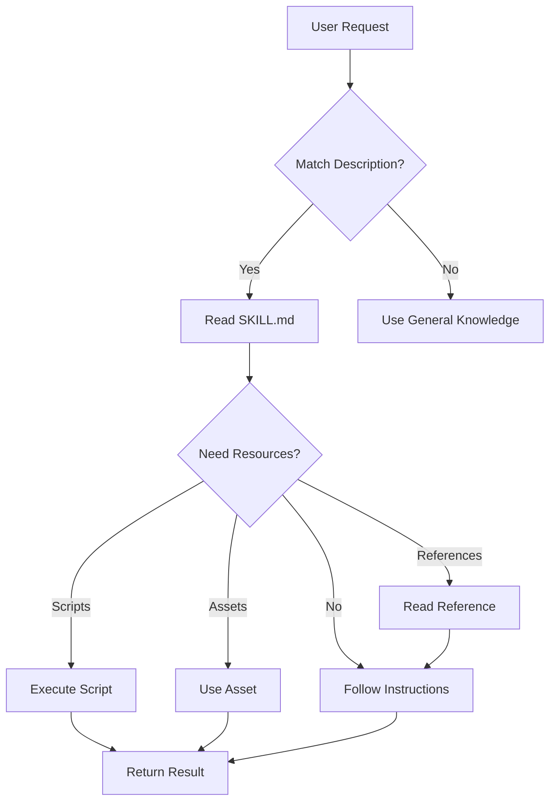

# LLM Execution Guide

How AI agents discover, load, and execute skills.

## Table of Contents

1. [Skill Discovery](#skill-discovery)
2. [Skill Activation](#skill-activation)
3. [Execution Flow](#execution-flow)
4. [Client Integration Types](#client-integration-types)
5. [Implementation for IDE/Agent Developers](#implementation-for-ideagent-developers)

---

## Skill Discovery

### How Agents Find Skills

Skills are discovered through a metadata list in the agent's context. Each entry contains:

```xml
<available_skills>
  <skill>
    <name>pdf-processor</name>
    <description>PDF manipulation for text extraction, form filling...</description>
    <location>/path/to/pdf-processor/SKILL.md</location>
  </skill>
  <skill>
    <name>docx-editor</name>
    <description>Document creation and editing with tracked changes...</description>
    <location>/path/to/docx-editor/SKILL.md</location>
  </skill>
</available_skills>
```

### Trigger Mechanism

The agent matches user requests against skill descriptions:

| User Request | Matched Skill | Trigger Reason |
|--------------|---------------|----------------|
| "Extract text from this PDF" | pdf-processor | "PDF", "text extraction" in description |
| "Create a Word document" | docx-editor | "document creation" in description |
| "Fill out this form" | pdf-processor | "form filling" in description |

**Key insight:** The `description` field is the primary trigger. Write descriptions that include:
- Action verbs (extract, create, fill, merge, analyze)
- File types (.pdf, .docx, .xlsx)
- Use cases (form filling, text extraction, document editing)

---

## Skill Activation

### Three-Level Loading

```
Level 1: Metadata (Always loaded)
├── name + description (~100 tokens)
└── Used for: Skill selection

Level 2: SKILL.md Body (On activation)
├── Instructions + workflows (~500-2000 tokens)
└── Used for: Task execution

Level 3: Bundled Resources (On demand)
├── scripts/, references/, assets/
└── Used for: Specific operations
```

### Activation Process

```
1. User request arrives
2. Agent scans skill descriptions
3. Agent identifies relevant skill(s)
4. Agent reads SKILL.md body
5. Agent follows instructions
6. Agent loads resources as needed
```

---

## Execution Flow

### Standard Execution Pattern



### Script Execution Modes

#### Mode 1: Direct Execution
Agent runs script without reading content.

```
User: "Rotate this PDF 90 degrees"
Agent: python scripts/rotate_pdf.py input.pdf 90 output.pdf
```

#### Mode 2: Read-Then-Execute
Agent reads script for understanding, then executes.

```
User: "Process this data file"
Agent: [reads scripts/process.py to understand parameters]
Agent: python scripts/process.py data.json --format csv
```

#### Mode 3: Patch-Then-Execute
Agent modifies script for environment, then executes.

```
User: "Extract tables from this PDF"
Agent: [reads scripts/extract_tables.py]
Agent: [modifies for local Python version]
Agent: python scripts/extract_tables.py document.pdf
```

### Reference Loading Pattern

```
User: "Query sales data from BigQuery"
Agent: [reads SKILL.md, sees "For sales queries, see references/sales.md"]
Agent: [reads references/sales.md for schema details]
Agent: [constructs query using schema knowledge]
```

---

## Client Integration Types

### Filesystem-Based Clients

Agents with shell access (Claude Code, Cursor, Kiro, etc.)

**Skill Loading:**
```bash
cat /path/to/skill/SKILL.md
```

**Resource Access:**
```bash
cat /path/to/skill/references/api.md
python /path/to/skill/scripts/process.py
```

**Advantages:**
- Full script execution
- Direct file manipulation
- Native asset handling

### Tool-Based Clients

Agents without shell access (API-only, web interfaces)

**Skill Loading:**
```json
{
  "tool": "read_skill",
  "arguments": {"skill_name": "pdf-processor"}
}
```

**Resource Access:**
```json
{
  "tool": "read_skill_resource",
  "arguments": {
    "skill_name": "pdf-processor",
    "resource": "references/forms.md"
  }
}
```

**Limitations:**
- Script execution depends on tool availability
- May need server-side execution environment

---

## Implementation for IDE/Agent Developers

### Adding Skill Support

#### Step 1: Skill Installation

Copy skill folders to a known location:
```
~/.skills/
├── pdf-processor/
├── docx-editor/
└── data-analyzer/
```

#### Step 2: Generate Skill Index

Parse all SKILL.md files and extract metadata:

```python
import yaml
from pathlib import Path

def index_skills(skills_dir):
    skills = []
    for skill_path in Path(skills_dir).iterdir():
        skill_md = skill_path / "SKILL.md"
        if skill_md.exists():
            content = skill_md.read_text()
            # Extract YAML frontmatter
            frontmatter = extract_frontmatter(content)
            skills.append({
                "name": frontmatter["name"],
                "description": frontmatter["description"],
                "location": str(skill_md.absolute())
            })
    return skills
```

#### Step 3: Include in System Prompt

Format skills for agent context:

```python
def format_skills_prompt(skills):
    prompt = "<available_skills>\n"
    for skill in skills:
        prompt += f"""<skill>
<name>{skill['name']}</name>
<description>{skill['description']}</description>
<location>{skill['location']}</location>
</skill>
"""
    prompt += "</available_skills>"
    return prompt
```

#### Step 4: Handle Skill Activation

When agent requests skill content:

```python
def load_skill(skill_path):
    """Load full SKILL.md content when agent activates skill."""
    return Path(skill_path).read_text()

def load_skill_resource(skill_path, resource_path):
    """Load bundled resource when agent requests it."""
    skill_dir = Path(skill_path).parent
    return (skill_dir / resource_path).read_text()
```

### System Prompt Template

```
You have access to specialized skills that extend your capabilities.

{format_skills_prompt(indexed_skills)}

To use a skill:
1. When a user request matches a skill description, read the skill's SKILL.md
2. Follow the instructions in SKILL.md
3. Load additional resources (scripts/, references/) as needed
4. Execute scripts or apply knowledge to complete the task

Skills are located at the paths shown in <location> tags.
Read them with: cat <location>
```

### Kiro-Specific Integration

For Kiro IDE, skills can be integrated via:

1. **Steering files** - Reference skills in `.kiro/steering/*.md`
2. **Powers** - Package skills as Kiro Powers with MCP servers
3. **Direct inclusion** - Add skill folders to workspace

Example steering file:
```markdown
---
inclusion: manual
---

# PDF Processing Skill

When working with PDF files, use the pdf-processor skill.

Location: docs/skills/pdf-processor/SKILL.md

Read the skill file for detailed instructions on:
- Text extraction
- Form filling
- Document merging
```

---

## Best Practices for Skill Authors

### Optimize for LLM Execution

1. **Clear triggers** - Write descriptions that match natural language requests
2. **Explicit paths** - Use relative paths: `[Guide](references/guide.md)`
3. **Actionable instructions** - "Run `script.py`" not "You might want to run..."
4. **Error guidance** - Include troubleshooting for common failures

### Test with Multiple Agents

Skills should work across:
- Claude (claude.ai, API)
- Claude Code
- Cursor
- Kiro
- Other MCP-compatible clients

### Document Execution Requirements

```markdown
## Requirements

- Python 3.9+
- Dependencies: `pip install pypdf pdfplumber`
- Shell access for script execution
```
