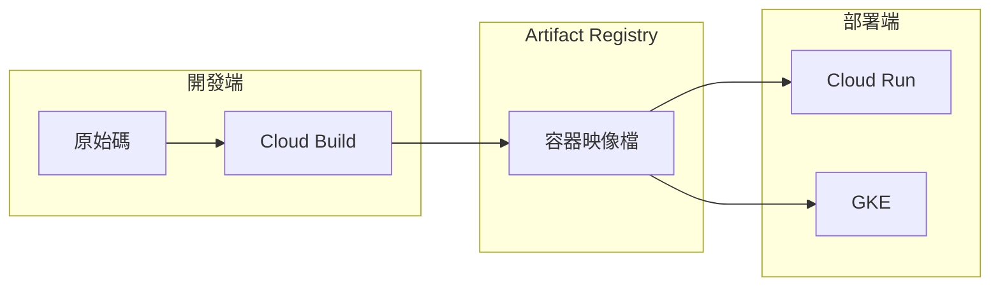

# Artifact Registry 基礎概念

## 關鍵字

- **Artifact Registry**：Google Cloud 的通用產物管理服務，支援容器映像檔、語言套件等多種格式。
- **Container Registry (gcr.io)**：舊版 Google 容器儲存庫服務，已被 Artifact Registry 取代。
- **Repository (儲存庫)**：用於存放相關產物的邏輯群組，類似於資料夾。
- **Docker Image (容器映像檔)**：包含應用程式及其執行環境的可移植封裝。
- **Image Tag (映像標籤)**：用於識別特定版本映像檔的標識符，如 `latest` 或 `v1.0.0`。
- **Image Digest (映像摘要)**：映像檔內容的 SHA256 雜湊值，提供不可變的版本識別。

## 學習目標

完成本章節後，您將能夠：

1. 說明 Artifact Registry 在 CI/CD 流程中的角色。
2. 區分 Artifact Registry 與 Container Registry 的差異。
3. 理解映像檔命名格式與各組成部分的意義。

## 什麼是 Artifact Registry？

### 我們在做什麼？

Artifact Registry 是一個儲存和管理軟體產物的服務。在容器化應用開發中，它用來儲存 Docker 映像檔，讓 Cloud Run、GKE 等服務可以從中拉取映像檔進行部署。

### 為什麼需要這樣做？

在 CI/CD 流程中，我們需要一個安全、可靠的地方來儲存建置產物：

1. **版本控制**：追蹤每次建置產出的映像檔版本。
2. **安全性**：透過 IAM 控制誰可以推送或拉取映像檔。
3. **整合性**：與 Cloud Build、Cloud Run 等 GCP 服務緊密整合。
4. **區域性**：將映像檔存放在靠近部署目標的區域，減少拉取延遲。

### 核心流程圖



## Artifact Registry vs Container Registry

> [!IMPORTANT]
> Google 已宣布 Container Registry (gcr.io) 進入維護模式，建議所有新專案使用 Artifact Registry。

### 比較表

| 特性         | Container Registry (gcr.io) | Artifact Registry (pkg.dev)   |
| ------------ | --------------------------- | ----------------------------- |
| **狀態**     | 維護模式                    | 主動開發                      |
| **支援格式** | 僅 Docker                   | Docker、npm、Maven、Python 等 |
| **區域選擇** | 有限 (us, eu, asia)         | 所有 GCP 區域                 |
| **IAM 控制** | 儲存桶層級                  | 儲存庫層級                    |
| **弱點掃描** | 基本支援                    | 進階整合                      |
| **價格模式** | Cloud Storage 定價          | 專屬定價                      |

### 映像檔 URL 格式差異

```bash
# Container Registry (舊版)
gcr.io/PROJECT_ID/IMAGE_NAME:TAG

# Artifact Registry (新版)
REGION-docker.pkg.dev/PROJECT_ID/REPOSITORY/IMAGE_NAME:TAG
```

## 映像檔命名規則

### ElevenDops 專案的命名格式

本專案使用以下格式存放映像檔：

```
us-central1-docker.pkg.dev/PROJECT_ID/elevendops/app:TAG
```

### 各部分說明

| 組成部分     | 說明                         | 範例             |
| ------------ | ---------------------------- | ---------------- |
| `REGION`     | 儲存庫所在區域               | `us-central1`    |
| `-docker`    | 表示這是 Docker 格式的儲存庫 | `-docker`        |
| `.pkg.dev`   | Artifact Registry 的網域     | `.pkg.dev`       |
| `PROJECT_ID` | GCP 專案 ID                  | `your-project`   |
| `REPOSITORY` | 儲存庫名稱                   | `elevendops`     |
| `IMAGE_NAME` | 映像檔名稱                   | `app`            |
| `TAG`        | 版本標籤                     | `latest`, `v1.0` |

### 標籤策略

本專案採用雙標籤策略：

```yaml
# 來自 cloudbuild.yaml
images:
  - "${_REGION}-docker.pkg.dev/${PROJECT_ID}/elevendops/app:${SHORT_SHA}"
  - "${_REGION}-docker.pkg.dev/${PROJECT_ID}/elevendops/app:latest"
```

- **`SHORT_SHA`**：Git commit 的前 7 個字元，用於精確追蹤版本。
- **`latest`**：始終指向最新建置的映像檔，方便快速部署。

## 常見問題 Q&A

### Q1：為什麼要從 Container Registry 遷移到 Artifact Registry？

**答：** Container Registry 已進入維護模式，不再有新功能開發。Artifact Registry 提供更細緻的 IAM 控制、更多區域選擇、支援多種產物格式，並且與 Cloud Build 整合更完善。長期來看，遷移是必要的。

### Q2：Artifact Registry 的定價方式是什麼？

**答：** 主要依據兩個維度計費：

1. **儲存空間**：每 GB 每月約 $0.10 USD（依區域有所不同）。
2. **網路流量**：同區域免費，跨區域依標準網路費率計費。

每月有 0.5 GB 的免費儲存額度。

### Q3：如何查看儲存庫中有哪些映像檔？

**答：** 可以使用 gcloud CLI 或 Console：

```bash
# 列出儲存庫中的映像檔
gcloud artifacts docker images list \
    us-central1-docker.pkg.dev/PROJECT_ID/elevendops

# 列出特定映像檔的所有標籤
gcloud artifacts docker tags list \
    us-central1-docker.pkg.dev/PROJECT_ID/elevendops/app
```

## 重點整理

| 概念              | 說明               | 使用時機                 |
| ----------------- | ------------------ | ------------------------ |
| Artifact Registry | GCP 產物管理服務   | 儲存 Docker 映像檔       |
| Repository        | 儲存產物的邏輯群組 | 依專案或環境分類映像檔   |
| Image Tag         | 可變的版本標識符   | 標記 `latest` 或語意版本 |
| Image Digest      | 不可變的內容雜湊值 | 需要精確版本控制時       |

## 延伸閱讀

- [02--repository-management.md](./02--repository-management.md) - 儲存庫管理與權限設定
- [03--cleanup-policies.md](./03--cleanup-policies.md) - 清理策略設定
- [Google Cloud Build 學習教材](../google-cloud-build/index.md) - 了解如何建置並推送映像檔

---

## 參考程式碼來源

本文件中的程式碼範例參考自以下專案檔案：

| 檔案路徑          | 說明                                 |
| ----------------- | ------------------------------------ |
| `cloudbuild.yaml` | Cloud Build 設定，包含映像檔推送步驟 |

---

[⬅️ 返回 Artifact Registry 索引](./index.md)
