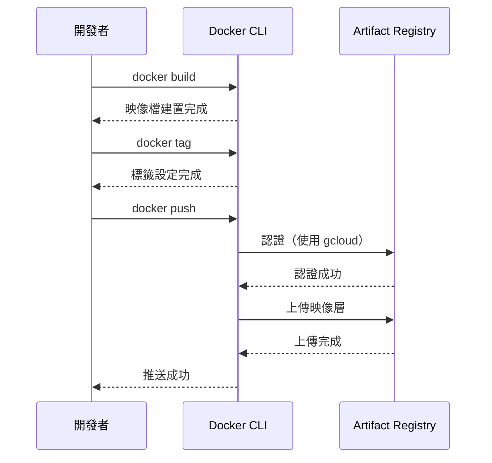

# 儲存庫管理與權限設定

## 關鍵字

- **Docker Repository**：專門用於儲存 Docker 映像檔的儲存庫類型。
- **IAM Policy**：Google Cloud 的身分與存取管理政策，控制誰可以存取資源。
- **Artifact Registry Reader**：可以拉取映像檔的角色 (`roles/artifactregistry.reader`)。
- **Artifact Registry Writer**：可以推送映像檔的角色 (`roles/artifactregistry.writer`)。
- **Docker Credential Helper**：讓 Docker CLI 自動使用 gcloud 憑證的輔助工具。

## 學習目標

完成本章節後，您將能夠：

1. 建立符合專案需求的 Artifact Registry 儲存庫。
2. 設定適當的 IAM 權限控制存取。
3. 使用 Docker CLI 推送和拉取映像檔。
4. 管理儲存庫中的映像檔與標籤。

## 步驟 1：建立儲存庫

### 我們在做什麼？

在 Artifact Registry 中建立一個 Docker 格式的儲存庫，用於存放專案的容器映像檔。

### 為什麼需要這樣做？

儲存庫是組織產物的基本單位。建立專屬的儲存庫可以：

- 隔離不同專案或環境的映像檔
- 對特定儲存庫設定精細的存取控制
- 獨立設定清理策略

### 程式碼範例

```bash
# 設定環境變數
export PROJECT_ID="your-project-id"
export REGION="us-central1"
export REPOSITORY="elevendops"

# 建立 Docker 格式的儲存庫
gcloud artifacts repositories create $REPOSITORY \
    --repository-format=docker \
    --location=$REGION \
    --description="ElevenDops container images"
```

### 參數說明

| 參數                  | 說明                                   |
| --------------------- | -------------------------------------- |
| `--repository-format` | 儲存庫格式，Docker 映像檔使用 `docker` |
| `--location`          | 區域，建議與 Cloud Run 服務相同區域    |
| `--description`       | 儲存庫說明，方便辨識用途               |

### 驗證儲存庫

```bash
# 列出所有儲存庫
gcloud artifacts repositories list --location=$REGION

# 查看特定儲存庫詳細資訊
gcloud artifacts repositories describe $REPOSITORY --location=$REGION
```

---

## 步驟 2：設定 Docker 認證

### 我們在做什麼？

設定 Docker CLI 使用 gcloud 憑證來存取 Artifact Registry。

### 為什麼需要這樣做？

Docker 預設無法存取私有的 Artifact Registry。透過設定認證助手，Docker 可以自動使用您的 GCP 憑證進行驗證。

### 程式碼範例

```bash
# 設定 Docker 認證助手
gcloud auth configure-docker ${REGION}-docker.pkg.dev

# 上述指令會修改 ~/.docker/config.json，新增以下設定：
# {
#   "credHelpers": {
#     "us-central1-docker.pkg.dev": "gcloud"
#   }
# }
```

### 驗證認證設定

```bash
# 確認設定已生效
cat ~/.docker/config.json | grep -A5 "credHelpers"
```

> [!NOTE]
> 如果您使用多個區域的儲存庫，需要為每個區域分別執行 `configure-docker` 指令。

---

## 步驟 3：推送映像檔

### 我們在做什麼？

將本地建置的 Docker 映像檔推送到 Artifact Registry。

### 為什麼需要這樣做？

Cloud Run 需要從 Artifact Registry 拉取映像檔來執行應用程式。推送映像檔是部署流程的關鍵步驟。

### 流程圖



### 程式碼範例

```bash
# 建置映像檔
docker build -t elevendops-app:local -f Dockerfile.cloudrun .

# 為映像檔加上 Artifact Registry 標籤
docker tag elevendops-app:local \
    ${REGION}-docker.pkg.dev/${PROJECT_ID}/${REPOSITORY}/app:latest

# 推送到 Artifact Registry
docker push ${REGION}-docker.pkg.dev/${PROJECT_ID}/${REPOSITORY}/app:latest
```

### 使用 Cloud Build 自動推送

在 `cloudbuild.yaml` 中定義自動推送步驟：

```yaml
steps:
  # 建置映像檔
  - name: "gcr.io/cloud-builders/docker"
    id: "build"
    args:
      - "build"
      - "-t"
      - "${_REGION}-docker.pkg.dev/${PROJECT_ID}/elevendops/app:${SHORT_SHA}"
      - "-f"
      - "Dockerfile.cloudrun"
      - "."

  # 推送映像檔
  - name: "gcr.io/cloud-builders/docker"
    id: "push"
    args:
      - "push"
      - "--all-tags"
      - "${_REGION}-docker.pkg.dev/${PROJECT_ID}/elevendops/app"
```

---

## 步驟 4：設定 IAM 權限

### 我們在做什麼？

設定誰可以推送或拉取儲存庫中的映像檔。

### 為什麼需要這樣做？

不同的服務帳戶和使用者需要不同層級的存取權限：

- **Cloud Build**：需要推送權限
- **Cloud Run**：需要拉取權限
- **開發者**：依角色可能需要不同權限

### 常用角色

| 角色                               | 權限             | 適用對象           |
| ---------------------------------- | ---------------- | ------------------ |
| `roles/artifactregistry.reader`    | 拉取映像檔       | Cloud Run 服務帳戶 |
| `roles/artifactregistry.writer`    | 推送與拉取映像檔 | Cloud Build        |
| `roles/artifactregistry.admin`     | 完整管理權限     | 管理員             |
| `roles/artifactregistry.repoAdmin` | 儲存庫層級管理   | 專案負責人         |

### 程式碼範例

```bash
# 授予 Cloud Build 推送權限
CLOUDBUILD_SA=$(gcloud projects describe $PROJECT_ID \
    --format="value(projectNumber)")@cloudbuild.gserviceaccount.com

gcloud artifacts repositories add-iam-policy-binding $REPOSITORY \
    --location=$REGION \
    --member="serviceAccount:${CLOUDBUILD_SA}" \
    --role="roles/artifactregistry.writer"

# 授予 Cloud Run 服務帳戶拉取權限
gcloud artifacts repositories add-iam-policy-binding $REPOSITORY \
    --location=$REGION \
    --member="serviceAccount:elevendops-sa@${PROJECT_ID}.iam.gserviceaccount.com" \
    --role="roles/artifactregistry.reader"
```

> [!TIP]
> 如果在專案層級已授予 `roles/artifactregistry.reader`，則不需要在儲存庫層級重複授予。

---

## 步驟 5：管理映像檔

### 我們在做什麼？

查看、刪除和管理儲存庫中的映像檔與標籤。

### 為什麼需要這樣做？

隨著時間推移，儲存庫會累積大量舊版映像檔。適當清理可以：

- 減少儲存成本
- 保持儲存庫整潔
- 避免誤用過舊的映像檔

### 程式碼範例

```bash
# 列出所有映像檔
gcloud artifacts docker images list \
    ${REGION}-docker.pkg.dev/${PROJECT_ID}/${REPOSITORY}

# 列出特定映像檔的所有版本（包含標籤與摘要）
gcloud artifacts docker images list \
    ${REGION}-docker.pkg.dev/${PROJECT_ID}/${REPOSITORY}/app \
    --include-tags

# 刪除特定標籤的映像檔
gcloud artifacts docker images delete \
    ${REGION}-docker.pkg.dev/${PROJECT_ID}/${REPOSITORY}/app:old-tag \
    --quiet

# 刪除未標記的映像檔（dangling images）
gcloud artifacts docker images list \
    ${REGION}-docker.pkg.dev/${PROJECT_ID}/${REPOSITORY}/app \
    --filter="tags=''" \
    --format="get(package)" | \
    xargs -I {} gcloud artifacts docker images delete {} --quiet
```

---

## 常見問題 Q&A

### Q1：推送映像檔時出現「Permission denied」錯誤？

**答：** 請確認以下事項：

1. 已執行 `gcloud auth configure-docker ${REGION}-docker.pkg.dev`
2. 目前登入的帳號有 `artifactregistry.writer` 權限
3. 映像檔標籤格式正確，包含正確的區域和專案 ID

### Q2：Cloud Run 無法拉取映像檔？

**答：** 檢查 Cloud Run 使用的服務帳戶是否有 `artifactregistry.reader` 權限。可以在專案層級或儲存庫層級授予此權限。

### Q3：如何在不同專案間共用映像檔？

**答：** 在儲存庫的 IAM 設定中，新增其他專案的服務帳戶為 reader：

```bash
# 授予其他專案的服務帳戶拉取權限
gcloud artifacts repositories add-iam-policy-binding $REPOSITORY \
    --location=$REGION \
    --member="serviceAccount:SERVICE_ACCOUNT@OTHER_PROJECT.iam.gserviceaccount.com" \
    --role="roles/artifactregistry.reader"
```

## 重點整理

| 概念        | 說明                                        | 使用時機               |
| ----------- | ------------------------------------------- | ---------------------- |
| 建立儲存庫  | 使用 `gcloud artifacts repositories create` | 專案初始設定           |
| Docker 認證 | 使用 `gcloud auth configure-docker`         | 本地推送前必須設定     |
| IAM 權限    | reader/writer/admin 角色                    | 依服務需求授予適當權限 |
| 映像檔管理  | 列出、刪除、清理映像檔                      | 定期維護或儲存空間管理 |

## 延伸閱讀

- [01--introduction.md](./01--introduction.md) - 基礎概念回顧
- [03--cleanup-policies.md](./03--cleanup-policies.md) - 自動化清理策略
- [Google IAM 官方文件](https://cloud.google.com/iam/docs)

---

## 參考程式碼來源

本文件中的程式碼範例參考自以下專案檔案：

| 檔案路徑                                            | 說明                 |
| --------------------------------------------------- | -------------------- |
| `cloudbuild.yaml`                                   | 自動推送映像檔的設定 |
| `deploy/README.md`                                  | 手動部署指南         |
| `docs/cloud-run-deployment/guide--prerequisites.md` | 前置需求設定指南     |

---

[⬅️ 返回 Artifact Registry 索引](./index.md)
