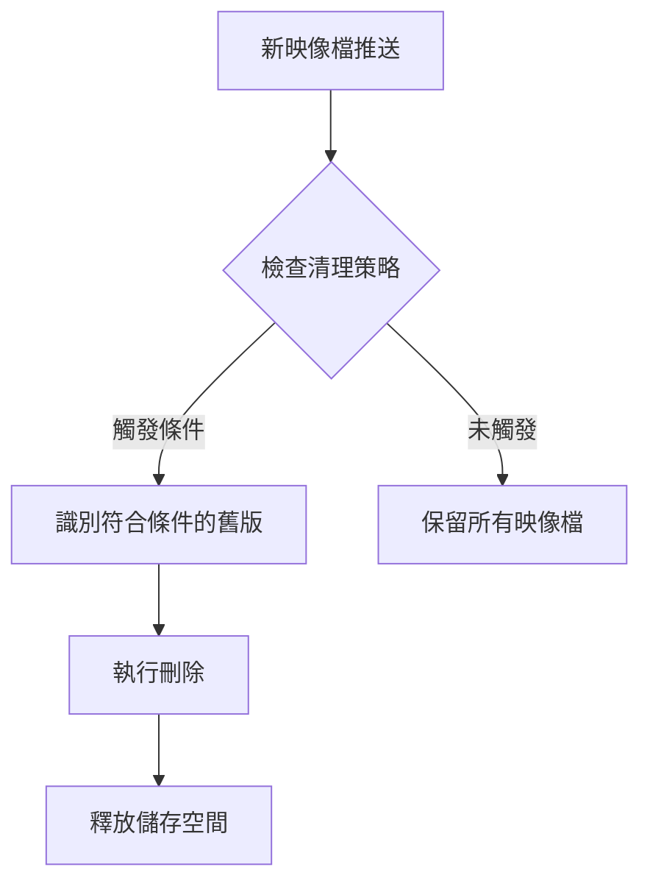

# 清理策略設定

## 關鍵字

- **Cleanup Policy (清理策略)**：自動刪除符合條件的舊版映像檔的規則。
- **Retention Period (保留期限)**：映像檔在被自動刪除前保留的時間。
- **Keep Count (保留數量)**：特定標籤模式下保留的最新版本數量。
- **Tag Filter (標籤過濾)**：用於匹配特定標籤模式的規則。
- **Dry Run (模擬執行)**：在不實際刪除的情況下預覽清理策略的影響。

## 學習目標

完成本章節後，您將能夠：

1. 理解清理策略的運作原理與使用場景。
2. 設定符合專案需求的清理規則。
3. 使用 dry-run 模式安全地測試策略。
4. 平衡儲存成本與版本追溯需求。

## 為什麼需要清理策略？

### 問題背景

每次 CI/CD 建置都會產生新的映像檔。隨著時間推移：

- 儲存庫會累積數百甚至數千個舊版映像檔
- 儲存成本持續增加
- 難以找到需要的特定版本
- 舊版映像檔可能包含已知的安全漏洞

### 解決方案

清理策略可以自動化刪除不再需要的映像檔，同時保留重要版本。



---

## 步驟 1：瞭解清理策略類型

### 我們在做什麼？

認識 Artifact Registry 提供的兩種主要清理策略類型。

### 策略類型比較

| 策略類型         | 說明                          | 適用場景                 |
| ---------------- | ----------------------------- | ------------------------ |
| **保留數量策略** | 保留最新的 N 個版本，刪除其餘 | 開發環境、Feature Branch |
| **保留期限策略** | 刪除超過指定天數的映像檔      | 生產環境、合規要求       |

### 策略可以組合使用

您可以同時設定多個策略，Artifact Registry 會按照以下優先順序處理：

1. **保護規則 (Keep rules)**：符合條件的映像檔不會被刪除
2. **刪除規則 (Delete rules)**：符合條件的映像檔會被刪除

---

## 步驟 2：建立清理策略

### 我們在做什麼？

為專案的 Artifact Registry 儲存庫設定自動清理策略。

### 為什麼需要這樣做？

自動化清理可以：

- 減少手動維護工作
- 確保一致性的版本保留政策
- 控制儲存成本在可預測範圍內

### 策略設定檔範例

建立一個 JSON 策略檔案 `cleanup-policy.json`：

```json
[
  {
    "name": "keep-production-releases",
    "action": { "type": "Keep" },
    "condition": {
      "tagState": "TAGGED",
      "tagPrefixes": ["v", "release-"],
      "olderThan": "0s"
    }
  },
  {
    "name": "keep-recent-builds",
    "action": { "type": "Keep" },
    "mostRecentVersions": {
      "keepCount": 10
    }
  },
  {
    "name": "delete-old-untagged",
    "action": { "type": "Delete" },
    "condition": {
      "tagState": "UNTAGGED",
      "olderThan": "604800s"
    }
  },
  {
    "name": "delete-old-dev-builds",
    "action": { "type": "Delete" },
    "condition": {
      "tagState": "TAGGED",
      "tagPrefixes": ["dev-", "test-"],
      "olderThan": "2592000s"
    }
  }
]
```

### 策略說明

| 策略名稱                   | 類型   | 條件                                | 效果                 |
| -------------------------- | ------ | ----------------------------------- | -------------------- |
| `keep-production-releases` | Keep   | 標籤以 `v` 或 `release-` 開頭       | 永久保留正式版本     |
| `keep-recent-builds`       | Keep   | 最新的 10 個版本                    | 保留近期建置         |
| `delete-old-untagged`      | Delete | 未標記 + 超過 7 天                  | 清理無標籤的舊映像檔 |
| `delete-old-dev-builds`    | Delete | `dev-` 或 `test-` 開頭 + 超過 30 天 | 清理過期的開發建置   |

### 時間參數格式

Artifact Registry 使用秒數表示時間：

| 時間  | 秒數        |
| ----- | ----------- |
| 1 天  | `86400s`    |
| 7 天  | `604800s`   |
| 30 天 | `2592000s`  |
| 90 天 | `7776000s`  |
| 1 年  | `31536000s` |

---

## 步驟 3：套用清理策略

### 我們在做什麼？

將策略檔案套用到儲存庫。

### 程式碼範例

```bash
# 設定環境變數
export PROJECT_ID="your-project-id"
export REGION="us-central1"
export REPOSITORY="elevendops"

# 套用清理策略
gcloud artifacts repositories set-cleanup-policies $REPOSITORY \
    --location=$REGION \
    --policy=cleanup-policy.json

# 驗證策略已套用
gcloud artifacts repositories describe $REPOSITORY \
    --location=$REGION \
    --format="yaml(cleanupPolicies)"
```

> [!IMPORTANT]
> 清理策略套用後，Artifact Registry 會在背景定期執行清理作業。首次執行可能需要數小時。

---

## 步驟 4：使用 Dry Run 測試策略

### 我們在做什麼？

在不實際刪除映像檔的情況下，預覽清理策略的影響。

### 為什麼需要這樣做？

Dry run 可以讓您：

- 確認策略設定正確
- 了解哪些映像檔會被刪除
- 避免意外刪除重要版本

### 程式碼範例

```bash
# 執行 dry run（模擬清理）
gcloud artifacts repositories set-cleanup-policies $REPOSITORY \
    --location=$REGION \
    --policy=cleanup-policy.json \
    --dry-run

# 查看 dry run 結果
gcloud artifacts operations list \
    --location=$REGION \
    --filter="metadata.@type:CleanupPolicyDryRunMetadata"
```

---

## 步驟 5：監控清理作業

### 我們在做什麼？

追蹤清理策略的執行狀態與結果。

### 程式碼範例

```bash
# 列出最近的清理作業
gcloud artifacts operations list \
    --location=$REGION \
    --filter="metadata.@type:CleanupArtifactsMetadata"

# 查看特定作業詳情
gcloud artifacts operations describe OPERATION_ID \
    --location=$REGION
```

### 使用 Cloud Logging 查看清理記錄

```bash
# 查詢清理相關的日誌
gcloud logging read \
    'resource.type="artifactregistry.googleapis.com/Repository" AND protoPayload.methodName:"CleanupArtifacts"' \
    --project=$PROJECT_ID \
    --limit=20
```

---

## ElevenDops 專案建議策略

針對本專案的 CI/CD 流程，建議採用以下清理策略：

```json
[
  {
    "name": "keep-latest-releases",
    "action": { "type": "Keep" },
    "condition": {
      "tagState": "TAGGED",
      "tagPrefixes": ["latest"],
      "olderThan": "0s"
    }
  },
  {
    "name": "keep-recent-sha-builds",
    "action": { "type": "Keep" },
    "mostRecentVersions": {
      "packageNamePrefixes": ["app"],
      "keepCount": 20
    }
  },
  {
    "name": "delete-old-sha-builds",
    "action": { "type": "Delete" },
    "condition": {
      "tagState": "TAGGED",
      "olderThan": "5184000s"
    }
  },
  {
    "name": "delete-untagged",
    "action": { "type": "Delete" },
    "condition": {
      "tagState": "UNTAGGED",
      "olderThan": "259200s"
    }
  }
]
```

### 策略說明

| 規則                     | 效果                          |
| ------------------------ | ----------------------------- |
| `keep-latest-releases`   | 永遠保留 `latest` 標籤        |
| `keep-recent-sha-builds` | 保留最新 20 個 SHA 建置       |
| `delete-old-sha-builds`  | 刪除超過 60 天的 SHA 標籤建置 |
| `delete-untagged`        | 刪除超過 3 天的未標記映像檔   |

---

## 常見問題 Q&A

### Q1：清理策略多久執行一次？

**答：** Artifact Registry 的清理作業是非同步執行的，通常每天執行一次。您無法手動觸發清理，但可以使用 `gcloud artifacts docker images delete` 手動刪除特定映像檔。

### Q2：被刪除的映像檔可以恢復嗎？

**答：** 不可以。一旦映像檔被清理策略刪除，就無法恢復。這就是為什麼建議先使用 dry-run 模式測試策略。

### Q3：清理策略會影響正在使用的映像檔嗎？

**答：** 清理策略不會檢查映像檔是否正在被 Cloud Run 等服務使用。建議使用 `Keep` 規則保護重要版本，並確保 Cloud Run 服務使用的映像檔標籤被保護。

### Q4：如何完全停用清理策略？

**答：** 使用以下指令移除所有清理策略：

```bash
gcloud artifacts repositories delete-cleanup-policies $REPOSITORY \
    --location=$REGION \
    --policy-names="policy-name-1,policy-name-2"
```

## 重點整理

| 概念                 | 說明                         | 使用時機                |
| -------------------- | ---------------------------- | ----------------------- |
| Keep 規則            | 保護符合條件的映像檔不被刪除 | 保護重要版本如 `latest` |
| Delete 規則          | 刪除符合條件的舊版映像檔     | 清理過期的開發建置      |
| `mostRecentVersions` | 保留最新的 N 個版本          | 確保近期建置可用        |
| `olderThan`          | 以時間為條件的過濾           | 控制映像檔保留期限      |
| Dry Run              | 預覽策略效果而不實際刪除     | 測試新策略前必用        |

## 延伸閱讀

- [01--introduction.md](./01--introduction.md) - Artifact Registry 基礎概念
- [02--repository-management.md](./02--repository-management.md) - 儲存庫管理
- [Artifact Registry 清理策略官方文件](https://cloud.google.com/artifact-registry/docs/manage-artifacts#cleanup-policies)
- [GCP 定價計算機](https://cloud.google.com/products/calculator)

---

[⬅️ 返回 Artifact Registry 索引](./index.md)
