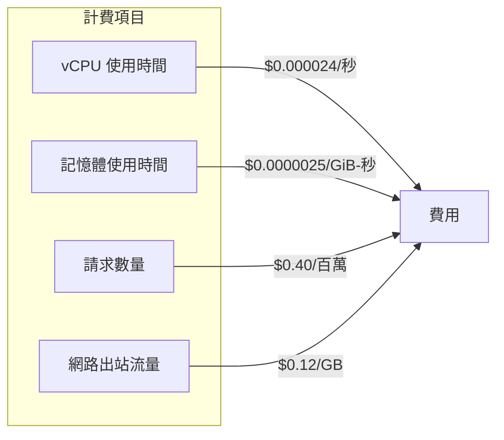

# GCP 服務成本概覽

## 關鍵字

- **Pay-as-you-go**：按使用量付費的計費模式
- **Free Tier**：GCP 提供的免費額度，每月自動重置
- **vCPU-second**：CPU 使用時間的計量單位
- **GiB-second**：記憶體使用時間的計量單位
- **Egress**：從 GCP 傳出資料的流量費用

## 學習目標

完成本章節後，您將能夠：

1. 了解 ElevenDops 專案中各項 GCP 服務的計費方式
2. 估算每月可能產生的 GCP 費用
3. 識別哪些操作會產生費用

---

## Cloud Run

### 我們在做什麼？

Cloud Run 是專案的主要應用程式部署平台，運行 FastAPI 後端和 Streamlit 前端。

### 計費項目



### 定價詳情（Tier 1 區域）

| 項目     | 免費額度/月     | 超出費用          |
| -------- | --------------- | ----------------- |
| vCPU     | 180,000 vCPU-秒 | $0.000024/vCPU-秒 |
| 記憶體   | 360,000 GiB-秒  | $0.0000025/GiB-秒 |
| 請求數   | 2,000,000 次    | $0.40/百萬請求    |
| 網路出站 | 1 GiB           | $0.12/GiB         |

### 費用估算範例

假設每月有 10,000 次 API 呼叫，每次呼叫平均執行 2 秒：

```
# 假設配置：2 vCPU、1 GiB 記憶體

vCPU 使用量 = 10,000 × 2秒 × 2vCPU = 40,000 vCPU-秒
記憶體使用量 = 10,000 × 2秒 × 1GiB = 20,000 GiB-秒

# 兩者都在免費額度內，費用 = $0
```

### 成本控制關鍵

> [!IMPORTANT]
> 專案設定 `min-instances: 0`，這意味著：
>
> - ✅ 沒有請求時不收費
> - ⚠️ 冷啟動延遲較高
> - 💡 適合開發和低流量場景

---

## Cloud Build

### 我們在做什麼？

Cloud Build 負責 CI/CD 流程，每次推送到 main 分支時自動建置和部署容器映像。

### 定價詳情

| 機器類型      | 免費額度/月 | 超出費用    |
| ------------- | ----------- | ----------- |
| e2-standard-2 | 2,500 分鐘  | $0.006/分鐘 |
| e2-highcpu-8  | -           | $0.016/分鐘 |

### 專案配置分析

從 `cloudbuild.yaml` 可見：

```yaml
options:
  machineType: "E2_HIGHCPU_8" # 使用較快的機器
timeout: "900s" # 最長 15 分鐘
```

### 費用估算範例

```
# 假設每週部署 5 次，每次建置約 5 分鐘

每月建置分鐘 = 5次/週 × 4週 × 5分鐘 = 100 分鐘
費用 = 100 × $0.016 = $1.60/月
```

> [!TIP]
> 如果建置時間允許，改用 `e2-standard-2` 可享受免費額度。

---

## Artifact Registry

### 我們在做什麼？

Artifact Registry 儲存 Docker 容器映像，每次建置產生新的映像版本。

### 定價詳情

| 項目     | 免費額度 | 超出費用    |
| -------- | -------- | ----------- |
| 儲存空間 | 0.5 GB   | $0.10/GB/月 |

### 費用風險

> [!CAUTION]
> Docker 映像很容易超過 0.5 GB！典型的 Python 應用映像約 500MB - 1GB。如果保留多個版本，儲存費用會快速累積。

### 費用估算範例

```
# 假設每個映像 800 MB，保留最近 10 個版本

總儲存 = 0.8 GB × 10 = 8 GB
超出免費額度 = 8 - 0.5 = 7.5 GB
費用 = 7.5 × $0.10 = $0.75/月
```

### 成本控制策略

參考 [Artifact Registry 清理策略](../artifact-registry/03--cleanup-policies.md) 設定自動清理舊映像。

---

## Cloud Storage (GCS)

### 我們在做什麼？

GCS 儲存 ElevenLabs 生成的音訊檔案（MP3 格式）。

### 定價詳情（Standard Storage）

| 項目                 | 免費額度  | 費用（美國區域） |
| -------------------- | --------- | ---------------- |
| 儲存空間             | 5 GB      | $0.020/GB/月     |
| Class A 操作（寫入） | 5,000 次  | $0.05/10,000 次  |
| Class B 操作（讀取） | 50,000 次 | $0.004/10,000 次 |
| 網路出站             | 1 GB      | $0.12/GB         |

### 費用估算範例

```
# 假設每月生成 500 個音訊檔案，每個約 500 KB

儲存量 = 500 × 0.5 MB = 250 MB = 0.25 GB
寫入操作 = 500 次
讀取操作 = 假設 1,500 次

# 全部在免費額度內，費用 = $0
```

> [!NOTE]
> 音訊檔案通常較小（1-5 MB），對於小型專案，GCS 成本可忽略不計。

---

## Firestore

### 我們在做什麼？

Firestore 儲存所有應用程式資料，包括：

- 知識庫文件 (`knowledge_documents`)
- 音訊檔案元資料 (`audio_files`)
- AI 代理配置 (`agents`)
- 對話記錄 (`conversations`)
- 病患會話 (`patient_sessions`)

### 定價詳情（Native Mode）

| 操作類型 | 免費額度/天 | 超出費用         |
| -------- | ----------- | ---------------- |
| 文件讀取 | 50,000 次   | $0.03/100,000 次 |
| 文件寫入 | 20,000 次   | $0.09/100,000 次 |
| 文件刪除 | 20,000 次   | $0.01/100,000 次 |
| 儲存空間 | 1 GiB       | $0.15/GiB/月     |

### 計費注意事項

> [!WARNING] > **讀取費用按 4 KB 計算**
>
> 如果文件大於 4 KB，每 4 KB 會計為一次讀取操作。
> 例如：讀取一個 10 KB 文件 = 3 次讀取操作（10/4 = 2.5，進位為 3）

### 費用估算範例

```
# 假設每天：
# - 讀取 10,000 次儀表板資料
# - 寫入 1,000 次使用者操作
# - 儲存 500 MB 資料

讀取：10,000/天 < 50,000 免費額度 ✅
寫入：1,000/天 < 20,000 免費額度 ✅
儲存：500 MB < 1 GiB 免費額度 ✅

費用 = $0
```

---

## Secret Manager

### 我們在做什麼？

Secret Manager 安全儲存敏感資訊：

- `elevenlabs-api-key`
- `google-api-key`
- `langsmith-api-key`

### 定價詳情

| 項目         | 免費額度/月 | 超出費用        |
| ------------ | ----------- | --------------- |
| 活躍密鑰版本 | 6 個        | $0.06/版本/月   |
| 存取操作     | 10,000 次   | $0.03/10,000 次 |

### 費用估算範例

```
# 專案有 3 個密鑰，每個 1 個版本

活躍版本 = 3 < 6 免費額度 ✅

# 假設每次 Cloud Run 冷啟動讀取 3 個密鑰
# 每月 1,000 次冷啟動

存取次數 = 1,000 × 3 = 3,000 < 10,000 免費額度 ✅

費用 = $0
```

> [!TIP]
> Secret Manager 對於小型專案幾乎免費，是管理 API 金鑰的理想選擇。

---

## 常見問題 Q&A

### Q1：哪個 GCP 服務最可能產生費用？

**答：** 對於 ElevenDops 專案，最可能產生費用的是：

1. **Cloud Run** - 如果流量增加或設定 `min-instances > 0`
2. **Artifact Registry** - 如果沒有設定清理策略，映像會持續累積
3. **Cloud Storage** - 如果音訊檔案大量累積且沒有清理

### Q2：如何查看目前的 GCP 費用？

**答：** 在 GCP Console 中：

1. 前往 **Billing** > **Reports**
2. 選擇專案和時間範圍
3. 按服務分組查看費用細項

### Q3：免費額度是每個專案還是每個帳戶？

**答：** 大部分 GCP 服務的免費額度是**按計費帳戶（Billing Account）計算**，而非按專案。如果多個專案共用同一個計費帳戶，免費額度會共享。

---

## 重點整理

| GCP 服務          | 主要計費項目       | 小型專案預估 | 成本風險等級 |
| ----------------- | ------------------ | ------------ | ------------ |
| Cloud Run         | vCPU、記憶體、請求 | 免費額度內   | ⭐⭐ 中      |
| Cloud Build       | 建置分鐘           | $0-5/月      | ⭐ 低        |
| Artifact Registry | 儲存空間           | $0-5/月      | ⭐⭐ 中      |
| Cloud Storage     | 儲存、流量         | 免費額度內   | ⭐ 低        |
| Firestore         | 讀/寫操作、儲存    | 免費額度內   | ⭐⭐ 中      |
| Secret Manager    | 版本、存取次數     | 免費         | ⭐ 極低      |

---

## 延伸閱讀

- [Cloud Run Pricing](https://cloud.google.com/run/pricing)
- [Cloud Build Pricing](https://cloud.google.com/build/pricing)
- [Artifact Registry Pricing](https://cloud.google.com/artifact-registry/pricing)
- [Cloud Storage Pricing](https://cloud.google.com/storage/pricing)
- [Firestore Pricing](https://cloud.google.com/firestore/pricing)
- [Secret Manager Pricing](https://cloud.google.com/secret-manager/pricing)

---

## 參考程式碼來源

本文件中的分析參考自以下專案檔案：

| 檔案路徑                                     | 說明                                       |
| -------------------------------------------- | ------------------------------------------ |
| `cloudbuild.yaml`                            | Cloud Build 配置，包含機器類型和建置步驟   |
| `backend/config.py`                          | 應用程式配置，包含 Secret Manager 密鑰名稱 |
| `backend/services/storage_service.py`        | GCS 儲存服務實作                           |
| `backend/services/firestore_data_service.py` | Firestore 資料存取服務                     |

---

[⬅️ 返回 雲端成本管控 索引](./index.md)
