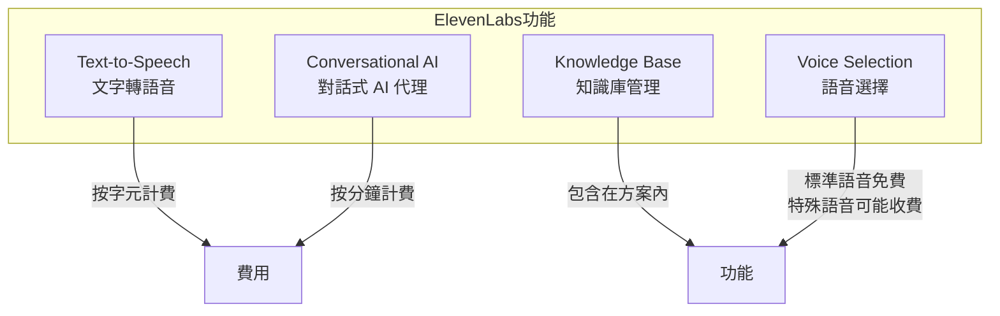
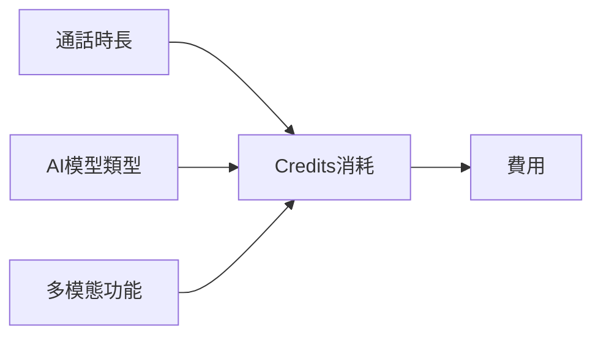

# ElevenLabs 成本分析

## 關鍵字

- **Credits**：ElevenLabs 的計費單位，不同功能消耗不同數量的 credits
- **TTS (Text-to-Speech)**：文字轉語音服務，按字元數計費
- **Conversational AI**：對話式 AI 代理，按分鐘計費
- **Voice Cloning**：語音克隆功能，需要較高等級的方案
- **Knowledge Base**：知識庫功能，用於增強 AI 代理的回答能力

## 學習目標

完成本章節後，您將能夠：

1. 了解 ElevenLabs 的 credit 計費系統
2. 估算 TTS 和對話式 AI 的使用成本
3. 選擇適合專案需求的 ElevenLabs 方案

---

## ElevenLabs 在專案中的使用

### 功能使用分析

從 `backend/services/elevenlabs_service.py` 可知，專案使用以下 ElevenLabs 功能：



---

## ElevenLabs 方案定價

### 方案比較

| 方案     | 月費   | Credits/月 | 約等於 TTS 字元  | 適用場景 |
| -------- | ------ | ---------- | ---------------- | -------- |
| Free     | $0     | 10,000     | ~10,000 字元     | 測試評估 |
| Starter  | $5     | 30,000     | ~30,000 字元     | 原型開發 |
| Creator  | $22    | 100,000    | ~100,000 字元    | 小型生產 |
| Pro      | $99    | 500,000    | ~500,000 字元    | 中型應用 |
| Scale    | $330   | 2,000,000  | ~2,000,000 字元  | 大型應用 |
| Business | $1,320 | 11,000,000 | ~11,000,000 字元 | 企業級   |

> [!NOTE]
> 免費方案有使用限制：
>
> - 僅限非商業用途
> - 需要標註使用 ElevenLabs

---

## Text-to-Speech 成本分析

### 計費方式

| 語音模型        | Credits/字元 | 說明           |
| --------------- | ------------ | -------------- |
| Multilingual v2 | 1 credit     | 標準模型       |
| Turbo 模型      | 0.5 credit   | 較快但品質稍低 |

### 費用計算公式

```
TTS 費用 ≈ 字元數 × $0.0002 ~ $0.0004

# 依方案不同，每 1,000 字元約 $0.20 ~ $0.40
```

### 專案使用估算

假設專案用於生成醫療衛教腳本：

```
# 一篇衛教腳本
- 平均長度：2,000 字元
- 每篇費用：2,000 × $0.0003 = $0.60

# 每月假設生成 50 篇腳本
- 月總字元：100,000 字元
- 建議方案：Creator ($22/月，100,000 credits)
```

### 成本試算表

| 使用量/月 | 建議方案 | 月費 | 平均每篇成本 |
| --------- | -------- | ---- | ------------ |
| 10 篇     | Starter  | $5   | $0.50        |
| 50 篇     | Creator  | $22  | $0.44        |
| 200 篇    | Pro      | $99  | ~$0.50       |
| 800 篇    | Scale    | $330 | ~$0.41       |

---

## Conversational AI 成本分析

### 計費方式

對話式 AI 按**通話分鐘數**計費，而非字元數。



### 費用估算

| 對話類型   | Credits 消耗         | 說明         |
| ---------- | -------------------- | ------------ |
| 純語音對話 | ~670 credits/分鐘    | 標準語音對話 |
| 多模態對話 | ~1,000+ credits/分鐘 | 包含視覺輸入 |
| 純文字對話 | ~300 credits/分鐘    | 最省 credits |

> [!WARNING] > **LLM 附加成本**
>
> 對話式 AI 使用的底層 LLM 可能產生額外費用，約佔總費用的 10-30%。

### 專案使用估算

假設用於病患模擬對話測試：

```
# 每次模擬對話
- 平均時長：5 分鐘
- Credits 消耗：5 × 670 = 3,350 credits

# 每月 20 次對話
- 月 Credits：20 × 3,350 = 67,000 credits
- 建議方案：Creator ($22/月，100,000 credits)
```

---

## 知識庫功能

### 功能說明

知識庫 (Knowledge Base) 用於：

- 上傳衛教文件讓 AI 代理參考
- 提升 AI 回答的準確性
- 支援多種文件格式

### 費用影響

> [!TIP]
> 知識庫功能**包含在方案內**，不額外收費！
>
> 但需要注意：
>
> - 文件大小有限制
> - 文件數量依方案不同

---

## 常見問題 Q&A

### Q1：ElevenLabs 的 Credits 會過期嗎？

**答：** Credits 可以滾動累積最多兩個月。例如：

- 1 月份未使用的 credits → 可延至 3 月底前使用
- 建議定期檢查 credits 使用情況，避免浪費

### Q2：如何估算專案每月需要多少 Credits？

**答：** 使用以下公式：

```
TTS 需求 = 預計文件數 × 平均字元數 × 1 credit
對話 AI 需求 = 預計對話數 × 平均分鐘數 × 670 credits
總需求 = TTS 需求 + 對話 AI 需求
```

### Q3：API 呼叫失敗會扣 Credits 嗎？

**答：** 不會。只有成功生成的內容才會扣除 credits。如果 API 回傳錯誤，不會產生費用。

### Q4：如何選擇適合的方案？

**答：**

| 使用情境          | 建議方案      |
| ----------------- | ------------- |
| 個人測試/學習     | Free          |
| MVP 開發階段      | Starter ($5)  |
| 小型團隊/穩定使用 | Creator ($22) |
| 生產環境/頻繁使用 | Pro ($99+)    |

---

## Google AI Gemini 成本分析

### 在專案中的使用

從 `backend/config.py` 可見，專案使用 Gemini 模型來生成腳本：

```python
GEMINI_MODELS = {
    "gemini-2.5-flash-lite": "gemini-2.5-flash-lite",
    "gemini-3-flash-preview": "gemini-3-flash-preview",
    "gemini-3-pro-preview": "gemini-3-pro-preview"
}
```

### Gemini API 定價

| 模型             | 輸入成本          | 輸出成本           |
| ---------------- | ----------------- | ------------------ |
| Gemini 2.5 Flash | $0.15/百萬 tokens | $0.60/百萬 tokens  |
| Gemini 2.5 Pro   | $1.25/百萬 tokens | $10.00/百萬 tokens |
| Gemini 3 Pro     | $2.00/百萬 tokens | $12.00/百萬 tokens |

### 免費額度

Gemini API 提供免費額度：

- 每分鐘 5-15 次請求
- 每分鐘 250,000 tokens 容量
- 支援商業使用（有限制）

### 費用估算

```
# 假設每次腳本生成
- 輸入 prompt：2,000 tokens
- 輸出腳本：1,500 tokens
- 使用 Gemini 2.5 Flash

每次費用 = (2,000 / 1,000,000 × $0.15) + (1,500 / 1,000,000 × $0.60)
         = $0.0003 + $0.0009
         = $0.0012

# 每月 100 次生成
月費 = 100 × $0.0012 = $0.12
```

> [!TIP]
> Gemini API 對於小型專案幾乎免費，是非常經濟的 LLM 選擇！

---

## 重點整理

| 服務                | 計費單位 | 約略成本          | 成本風險  |
| ------------------- | -------- | ----------------- | --------- |
| ElevenLabs TTS      | 字元     | $0.20-0.40/千字元 | ⭐⭐⭐ 高 |
| ElevenLabs AI Agent | 分鐘     | ~$0.50-1.00/分鐘  | ⭐⭐⭐ 高 |
| Gemini API          | Tokens   | ~$0.001/千 tokens | ⭐ 低     |

---

## 延伸閱讀

- [ElevenLabs Pricing](https://elevenlabs.io/pricing)
- [ElevenLabs API Documentation](https://elevenlabs.io/docs)
- [Google AI Gemini Pricing](https://ai.google.dev/pricing)
- [Gemini API Documentation](https://ai.google.dev/gemini-api/docs)

---

## 參考程式碼來源

| 檔案路徑                                 | 說明                    |
| ---------------------------------------- | ----------------------- |
| `backend/services/elevenlabs_service.py` | ElevenLabs API 服務實作 |
| `backend/config.py`                      | Gemini 模型配置         |
| `.env.example`                           | API 金鑰設定範例        |

---

[⬅️ 返回 雲端成本管控 索引](./index.md)
