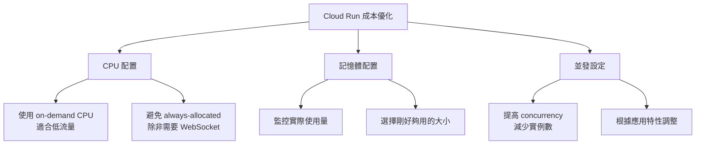
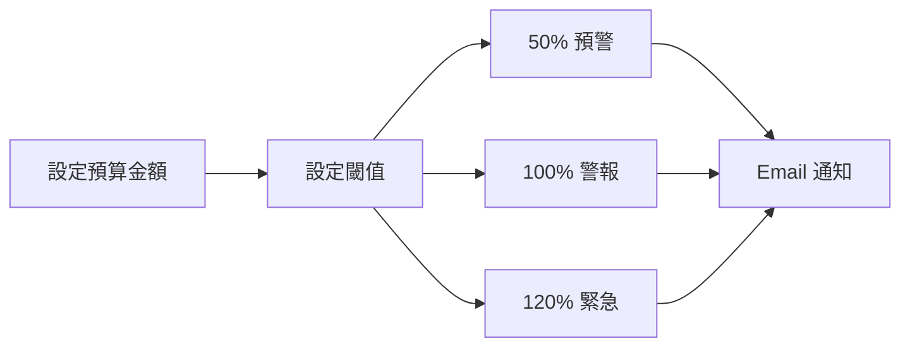
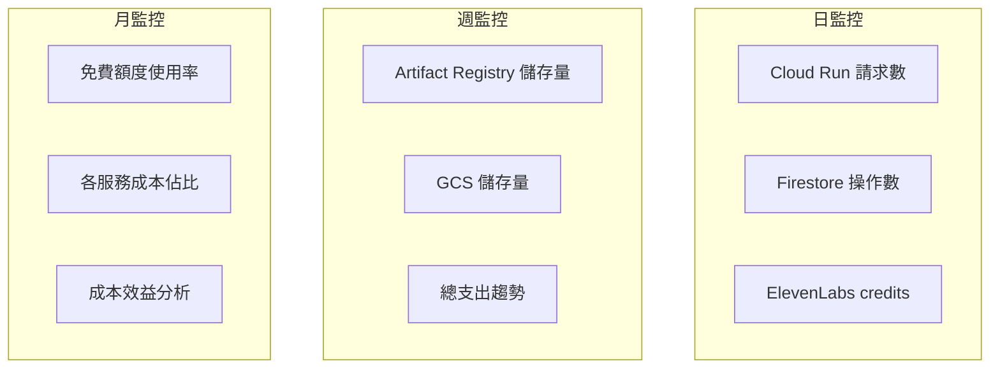

# 成本優化策略

## 關鍵字

- **Cost Optimization**：透過架構設計和配置調整降低雲端費用
- **Budget Alert**：預算警報，當費用超過閾值時通知
- **Lifecycle Policy**：生命週期策略，自動清理過期資源
- **Reserved Capacity**：預留容量，透過承諾使用量獲得折扣
- **Right-sizing**：正確規模調整，避免資源過度配置

## 學習目標

完成本章節後，您將能夠：

1. 實施有效的成本優化策略
2. 設定預算警報和監控
3. 識別並消除不必要的費用

---

## GCP 成本優化策略

### 1. Cloud Run 優化

#### 使用 on-demand CPU

專案目前配置：

```yaml
# cloudbuild.yaml
--min-instances=0      # ✅ 正確：沒有流量時不收費
--max-instances=10     # ✅ 正確：限制最大規模
--concurrency=80       # ✅ 正確：提高單實例並發處理
```

#### 成本優化建議



> [!TIP] > **並發數調整**
>
> 對於 FastAPI + Streamlit 應用，可以安全地設定較高並發數（50-100）。
> 這減少了需要的實例數量，直接降低成本。

---

### 2. Cloud Build 優化

#### 目前配置分析

```yaml
options:
  machineType: "E2_HIGHCPU_8" # 較快但費用較高
```

#### 優化建議

| 策略               | 節省幅度 | 說明                    |
| ------------------ | -------- | ----------------------- |
| 使用 e2-standard-2 | 100%     | 享受 2,500 分鐘免費額度 |
| 減少建置頻率       | 可變     | 合併多次小更新          |
| 使用快取           | 30-50%   | Docker layer caching    |

#### Docker 快取優化

```dockerfile
# Dockerfile 優化範例
# 將不常變動的安裝放在前面

# 1. 基礎依賴（很少變動）
FROM python:3.10-slim
RUN pip install --no-cache-dir poetry

# 2. 專案依賴（偶爾變動）
COPY pyproject.toml poetry.lock ./
RUN poetry install --no-dev

# 3. 應用程式碼（經常變動）
COPY . .
```

---

### 3. Artifact Registry 優化

#### 設定清理策略

> [!IMPORTANT] > **這是最容易忽略的成本來源！**
>
> 沒有設定清理策略的話，每次部署都會累積新映像，儲存費用會不斷增加。

參考教材：[Artifact Registry 清理策略](../artifact-registry/03--cleanup-policies.md)

#### 建議策略

```
# 清理策略範例
- 保留最近 5 個版本
- 刪除超過 30 天的未使用映像
- 保留 production tag 的映像
```

---

### 4. Cloud Storage 優化

#### 生命週期策略

```json
{
  "lifecycle": {
    "rule": [
      {
        "action": { "type": "Delete" },
        "condition": {
          "age": 90,
          "matchesPrefix": ["audio/"]
        }
      }
    ]
  }
}
```

#### 儲存類別選擇

| 儲存類別 | 適用場景   | 成本       |
| -------- | ---------- | ---------- |
| Standard | 頻繁存取   | $0.020/GB  |
| Nearline | 月存取一次 | $0.010/GB  |
| Coldline | 季存取一次 | $0.004/GB  |
| Archive  | 年存取一次 | $0.0012/GB |

> [!TIP]
> 對於舊的音訊檔案，考慮轉移到較便宜的儲存類別。

---

### 5. Firestore 優化

#### 減少讀取次數

```python
# ❌ 不佳：每次都查詢
def get_document(doc_id):
    return firestore.get(doc_id)

# ✅ 較佳：使用快取
from functools import lru_cache

@lru_cache(maxsize=100, ttl=300)
def get_document(doc_id):
    return firestore.get(doc_id)
```

#### 批次操作

```python
# ❌ 不佳：逐一寫入
for doc in documents:
    firestore.set(doc)  # 每次都是一個寫入操作

# ✅ 較佳：批次寫入
batch = firestore.batch()
for doc in documents:
    batch.set(doc)
batch.commit()  # 一次批次操作
```

#### 索引優化

```
# 刪除不需要的複合索引
# 每個索引都會增加儲存成本
```

---

## ElevenLabs 成本優化

### 1. 使用較便宜的模型

| 模型     | Credits/字元 | 適用場景                 |
| -------- | ------------ | ------------------------ |
| Turbo    | 0.5          | 草稿預覽，對品質要求較低 |
| Standard | 1.0          | 最終版本，正式發布       |

### 2. 文字優化

```python
# ❌ 冗長的文字
text = "Dear patient, I would like to kindly inform you that..."

# ✅ 簡潔的文字
text = "Your test results are ready..."
```

> [!NOTE]
> 每減少 1,000 個字元，約可節省 $0.20-0.40

### 3. 快取音訊

```python
# 相同內容不重複生成
def get_or_generate_audio(text_hash):
    cached = storage.get(f"audio/{text_hash}.mp3")
    if cached:
        return cached

    audio = elevenlabs.text_to_speech(text)
    storage.save(f"audio/{text_hash}.mp3", audio)
    return audio
```

---

## 設定預算警報

### GCP 預算警報

1. 前往 GCP Console > Billing > Budgets & alerts
2. 建立新預算



### 建議預算設定

| 專案階段 | 月預算 | 50% 閾值 | 100% 閾值 |
| -------- | ------ | -------- | --------- |
| 開發階段 | $20    | $10      | $20       |
| 小型生產 | $50    | $25      | $50       |
| 正式生產 | $200+  | $100+    | $200+     |

### ElevenLabs 使用量監控

ElevenLabs Dashboard 提供：

- 即時 credits 使用量
- 歷史使用趨勢
- 按功能分類的消耗

---

## 成本監控 Dashboard

### 建議監控指標



---

## 常見問題 Q&A

### Q1：如何快速降低已經過高的費用？

**答：** 立即執行以下步驟：

1. **檢查 Artifact Registry** - 刪除舊的 Docker 映像
2. **檢查 Cloud Storage** - 清理不需要的音訊檔案
3. **檢查 Cloud Run** - 確認 min-instances 設為 0
4. **檢查 ElevenLabs** - 降級方案或暫停使用

### Q2：開發階段如何避免產生費用？

**答：**

1. 使用本地模擬器（Firestore、GCS）
2. 使用 Mock 服務（ElevenLabs）
3. 不要啟用生產環境的 Cloud Build trigger
4. 將 min-instances 設為 0

### Q3：如何估算進入生產環境的費用？

**答：** 使用以下公式估算：

```
月費估算 =
  (預計用戶數 × 平均請求數/用戶 × Cloud Run 成本) +
  (預計音訊生成量 × ElevenLabs 成本) +
  (儲存成長量 × 儲存成本) +
  (建置次數 × Cloud Build 成本)
```

---

## 成本優化檢查清單

### 基礎設施

- [ ] Cloud Run min-instances 設為 0（開發/低流量）
- [ ] Cloud Run concurrency 設為適當值（50-100）
- [ ] Artifact Registry 設定清理策略
- [ ] Cloud Storage 設定生命週期策略
- [ ] Firestore 使用適當的索引

### 應用程式

- [ ] 實作適當的快取機制
- [ ] 使用批次操作減少 API 呼叫
- [ ] 避免不必要的 Firestore 讀取
- [ ] ElevenLabs 音訊快取避免重複生成

### 監控

- [ ] 設定 GCP 預算警報
- [ ] 定期檢查各服務使用量
- [ ] 監控 ElevenLabs credits 消耗
- [ ] 每月檢視帳單並分析異常

---

## 重點整理

| 優化領域          | 關鍵策略               | 預期節省     |
| ----------------- | ---------------------- | ------------ |
| Cloud Run         | on-demand CPU + 高並發 | 50-90%       |
| Cloud Build       | 使用 e2-standard-2     | 100%（免費） |
| Artifact Registry | 清理策略               | 80-95%       |
| Cloud Storage     | 生命週期策略           | 50-80%       |
| Firestore         | 快取 + 批次            | 30-50%       |
| ElevenLabs        | Turbo 模型 + 快取      | 30-50%       |

---

## 延伸閱讀

- [GCP Cost Management Best Practices](https://cloud.google.com/architecture/framework/cost-optimization)
- [Cloud Run Pricing Calculator](https://cloud.google.com/products/calculator)
- [Firestore Best Practices](https://firebase.google.com/docs/firestore/best-practices)
- [ElevenLabs Usage Tips](https://elevenlabs.io/docs/usage)

---

## 參考程式碼來源

| 檔案路徑                                     | 說明                          |
| -------------------------------------------- | ----------------------------- |
| `cloudbuild.yaml`                            | Cloud Build 和 Cloud Run 配置 |
| `Dockerfile.cloudrun`                        | Docker 建置配置               |
| `backend/services/storage_service.py`        | GCS 儲存服務                  |
| `backend/services/firestore_data_service.py` | Firestore 資料服務            |
| `backend/services/elevenlabs_service.py`     | ElevenLabs 服務               |

---

[⬅️ 返回 雲端成本管控 索引](./index.md)
