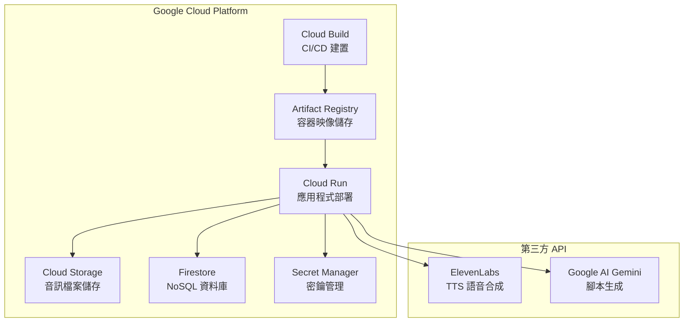

# 雲端成本管控 學習教材

## 概述

本教材涵蓋 ElevenDops 專案使用的所有雲端服務成本分析，包括 Google Cloud Platform (GCP) 服務和第三方 API。從成本管控角度出發，幫助開發者了解費用產生的來源、估算方法，以及如何優化成本。

## 本專案使用的雲端服務

## 文件目錄

| 文件                                                                         | 說明                                                                                                                                          |
| ---------------------------------------------------------------------------- | --------------------------------------------------------------------------------------------------------------------------------------------- |
| [01--gcp-cost-overview.md](./01--gcp-cost-overview.md)                       | 詳細介紹 GCP 服務的定價模型、免費額度和計費方式，包含 Cloud Run、Cloud Build、Artifact Registry、Cloud Storage、Firestore 和 Secret Manager。 |
| [02--elevenlabs-cost-analysis.md](./02--elevenlabs-cost-analysis.md)         | 深入分析 ElevenLabs API 的定價結構，包含 TTS 語音合成和對話式 AI 的成本評估。                                                                 |
| [03--cost-optimization-strategies.md](./03--cost-optimization-strategies.md) | 提供實用的成本優化策略，包含架構設計、資源配置和監控警報設定。                                                                                |

## 學習路徑建議

1. 首先閱讀 [01--gcp-cost-overview.md](./01--gcp-cost-overview.md) 了解各項 GCP 服務的計費方式
2. 接著參考 [02--elevenlabs-cost-analysis.md](./02--elevenlabs-cost-analysis.md) 了解第三方 API 成本
3. 最後學習 [03--cost-optimization-strategies.md](./03--cost-optimization-strategies.md) 掌握成本優化技巧

## 成本速查表

| 服務              | 主要計費項目         | 免費額度        | 預估月費範圍 |
| ----------------- | -------------------- | --------------- | ------------ |
| Cloud Run         | vCPU、記憶體、請求數 | 180K vCPU-秒/月 | $0 - $50+    |
| Cloud Build       | 建置分鐘             | 2,500 分鐘/月   | $0 - $20     |
| Artifact Registry | 儲存空間             | 0.5 GB          | $0 - $10     |
| Cloud Storage     | 儲存、出站流量       | 5 GB 儲存       | $0 - $20     |
| Firestore         | 讀/寫/刪除、儲存     | 50K 讀/天       | $0 - $30     |
| Secret Manager    | 活躍版本、存取次數   | 6 版本/月       | $0 - $5      |
| ElevenLabs        | 字元數、對話分鐘     | 依方案          | $5 - $330+   |
| Gemini API        | Token 數量           | 有免費額度      | $0 - $50+    |

> [!TIP]
> 對於小型專案或開發階段，善用各項服務的免費額度，月費可能接近 $0。

## 相關資源

- [GCP 定價計算器](https://cloud.google.com/products/calculator)
- [ElevenLabs 定價頁面](https://elevenlabs.io/pricing)
- [Gemini API 定價](https://ai.google.dev/pricing)

---

[⬅️ 返回學習教材總覽](../index.md)
