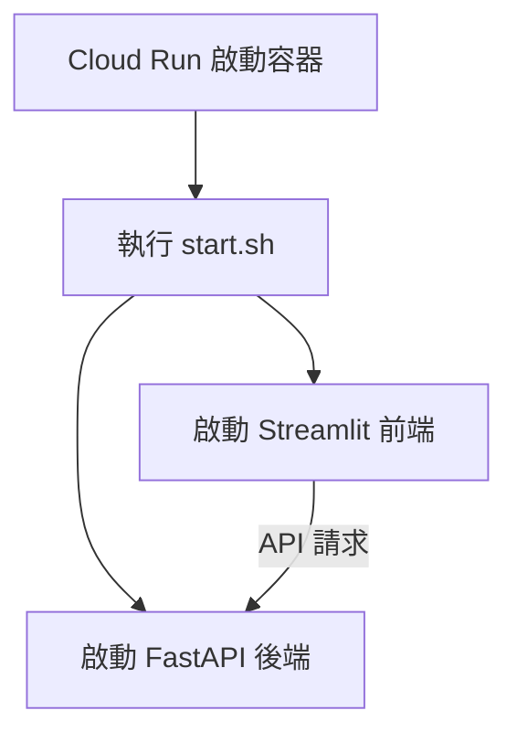

# 單一容器架構 (Single-Container Architecture)

## 關鍵字

- **Single Container**：在同一個 Docker 容器中執行多個服務（FastAPI 與 Streamlit）。
- **Start Script**：用於協調與管理容器內多個進程的啟動腳本。
- **FastAPI**：作為後端 API 服務。
- **Streamlit**：作為前端使用者介面。

## 學習目標

完成本章節後，您將能夠：

1. 理解為何 ElevenDops 選擇單一容器架構。
2. 了解如何在 Dockerfile 中配置多服務環境。
3. 掌握啟動腳本（start.sh）的角色與實作方式。

## 步驟說明

### 步驟 1：配置 Dockerfile.cloudrun

#### 我們在做什麼？

建立一個生產環境專用的 Dockerfile，將後端與前端程式碼打包，並準備啟動腳本。

#### 為什麼需要這樣做？

Cloud Run 預設每個服務對應一個容器。為了簡化管理並降低成本，我們將功能高度相關的前後端封裝在一起，這在小型到中型應用中非常有效。

#### 程式碼範例

```dockerfile
# 複製應用程式程式碼
COPY --chown=appuser:appuser backend/ ./backend/
COPY --chown=appuser:appuser streamlit_app/ ./streamlit_app/
COPY --chown=appuser:appuser .streamlit/ ./.streamlit/
COPY --chown=appuser:appuser scripts/start.sh ./start.sh

# 設定啟動命令
CMD ["./start.sh"]
```

#### 流程圖



### 步驟 2：實作啟動腳本 start.sh

#### 我們在做什麼？

編寫一個 Bash 腳本，負責在背景啟動 FastAPI，並在前景啟動 Streamlit 以保持容器運行。

#### 為什麼需要這樣做？

Docker 容器在主進程結束時會停止。啟動腳本確保所有必要的服務都已啟動，並處理服務間的依賴關係（例如確保後端先啟動）。

#### 程式碼範例

```bash
#!/bin/bash
# 啟動 FastAPI 後端 (背景)
uvicorn backend.main:app --host 0.0.0.0 --port 8000 &

# 啟動 Streamlit 前端 (前景)
streamlit run streamlit_app/main.py --server.port $PORT --server.address 0.0.0.0
```

## 常見問題 Q&A

### Q1：為什麼不分開部署前後端？

**答：** 分開部署雖然更符合微服務架構，但會增加跨域 (CORS) 設定的複雜度與運維成本。對於 ElevenDops，單一容器能確保前後端版本始終同步，且簡化了網路通訊。

### Q2：一個容器跑兩個服務會不會互相影響效能？

**答：** 在低到中負載下影響不大。我們透過 Cloud Run 的自動縮放 (Auto-scaling) 來處理突發流量，確保分配足夠的 CPU 與記憶體。

## 重點整理

| 概念     | 說明                      | 使用時機               |
| -------- | ------------------------- | ---------------------- |
| 共享宿主 | 前後端都在 localhost 溝通 | 內部通訊快速且安全     |
| start.sh | 容器的主進程              | 需要同時啟動多個服務時 |
| 統一版本 | 前後端代碼一起打包        | 確保版本一致性         |

## 延伸閱讀

- [GCP Cloud Run 官方文件](https://cloud.google.com/run/docs)
- [ElevenDops 架構參考](../../docs/cloud-run-deployment/reference--architecture.md)

---

## 參考程式碼來源

本文件中的程式碼範例參考自以下專案檔案：

| 檔案路徑              | 說明                 |
| --------------------- | -------------------- |
| `Dockerfile.cloudrun` | 生產環境 Docker 配置 |
| `scripts/start.sh`    | 服務啟動管理腳本     |
