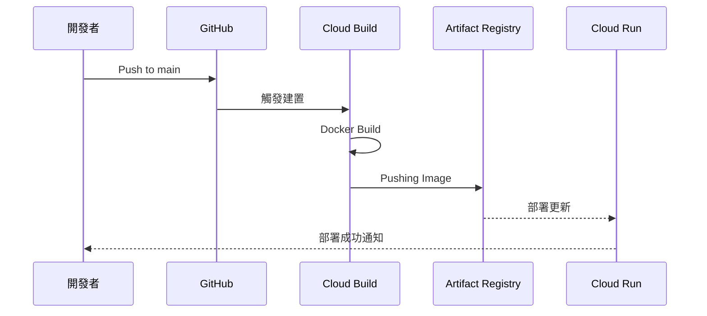

# CI/CD 流程自動化 (CI/CD Pipeline Automation)

## 關鍵字

- **Cloud Build**：GCP 的託管建置服務。
- **Artifact Registry**：用於儲存與管理 Docker 映像檔的倉庫。
- **GitHub Trigger**：當程式碼推送至特定分支時觸發自動建置。
- **cloudbuild.yaml**：定義 CI/CD 步驟的配置檔案。

## 學習目標

完成本章節後，您將能夠：

1. 理解 ElevenDops 的自動化部署模型。
2. 解析 `cloudbuild.yaml` 中的各個步驟。
3. 掌握從程式碼推送至服務更新的完整流程。

## 步驟說明

### 步驟 1：定義自動化建置步驟

#### 我們在做什麼？

透過 `cloudbuild.yaml` 定義映像檔建置、上傳與部署的三部曲。

#### 為什麼需要這樣做？

手動部署容易出錯且耗時。自動化流程確保每次發布都經過相同的步驟，並能輕鬆追蹤版本異動（透過 Commit SHA）。

#### 流程圖



### 步驟 2：解析 cloudbuild.yaml

#### 我們在做什麼？

了解建置配置中的 `build`、`push` 與 `deploy` 核心 ID。

#### 為什麼需要這樣做？

這是 CI/CD 的核心邏輯。正確配置 `args` 與環境變數是確保部署成功的關鍵。

#### 程式碼範例

```yaml
steps:
  # 步驟 1: 建置映像檔
  - name: "gcr.io/cloud-builders/docker"
    id: "build"
    args:
      ["build", "-t", "my-image:${SHORT_SHA}", "-f", "Dockerfile.cloudrun", "."]

  # 步驟 3: 部署至 Cloud Run
  - name: "gcr.io/google.com/cloudsdktool/cloud-sdk"
    id: "deploy"
    entrypoint: "gcloud"
    args:
      - "run"
      - "deploy"
      - "elevendops"
      - "--image"
      - "my-image:${SHORT_SHA}"
      - "--region"
      - "us-central1"
```

## 常見問題 Q&A

### Q1：`SHORT_SHA` 是什麼？在哪裡可以找到？

**答：** 這是 Cloud Build 自動提供的變數，代表該次 Git 提交的短雜湊值（7 位）。用於幫映像檔打上唯一標籤，方便日後回滾。

您可以在以下位置找到 `SHORT_SHA`：

| 位置                      | 說明                                    |
| ------------------------- | --------------------------------------- |
| **Cloud Build → History** | 建置紀錄的 Commit 欄位                  |
| **Artifact Registry**     | 映像標籤，如 `app:a1b2c3d`              |
| **Cloud Run → Revisions** | 版本名稱，如 `elevendops-00042-a1b2c3d` |
| **本地 Git**              | 執行 `git rev-parse --short HEAD`       |

其他常用內建變數：`${COMMIT_SHA}`（完整 40 位）、`${BRANCH_NAME}`、`${PROJECT_ID}`。

### Q2：建置失敗怎麼辦？

**答：** 您可以前往 GCP 控制台的 Cloud Build 歷史紀錄查看詳細日誌。常見原因包括 Dockerfile 語法錯誤或虛擬機器記憶體不足。

### Q3：Docker Build 和 Pushing Image 的差別是什麼？

**答：** 這是兩個不同的步驟：

| 步驟              | 動作       | 說明                                                                                     |
| ----------------- | ---------- | ---------------------------------------------------------------------------------------- |
| **Docker Build**  | 建置映像檔 | 在 Cloud Build 虛擬機器上執行 `docker build`，根據 Dockerfile 產生映像檔（暫存在記憶體） |
| **Pushing Image** | 推送映像檔 | 執行 `docker push`，將映像檔上傳到 **Artifact Registry** 永久儲存                        |

簡單來說：Build 是「製作」映像檔，Push 是「上傳」到儲存庫。Cloud Run 會從 Artifact Registry 拉取映像檔來部署。

### Q4：有了 cloudbuild.yaml 就會自動在 GitHub push 時建置嗎？

**答：** 不是！僅有 `cloudbuild.yaml` 還不夠，您還需要在 GCP 中設定 **Cloud Build Trigger（觸發器）**。

| 項目                    | 說明                                   | 設定位置         |
| ----------------------- | -------------------------------------- | ---------------- |
| **cloudbuild.yaml**     | 定義「怎麼建置」（步驟、命令）         | 專案程式碼根目錄 |
| **Cloud Build Trigger** | 定義「何時建置」（哪個分支、哪個事件） | GCP Console      |

設定步驟：GCP Console → Cloud Build → Triggers → Create Trigger，然後連接 GitHub 倉庫並指定 `^main$` 分支。觸發器會在每次 push 時自動注入 `${PROJECT_ID}`、`${SHORT_SHA}` 等變數。

### Q5：可以暫時停用 Trigger 或手動觸發特定版本嗎？

**答：** 可以！有以下幾種方式控制建置：

| 方法             | 操作方式                                           | 適用場景     |
| ---------------- | -------------------------------------------------- | ------------ |
| **停用 Trigger** | GCP Console → Triggers → 選擇 → Disable            | 暫停自動部署 |
| **手動觸發**     | Triggers → Run → 選擇 Branch 或 Commit SHA         | 部署特定版本 |
| **gcloud CLI**   | `gcloud builds triggers run <name> --sha=<commit>` | 命令列操作   |

停用後觸發器設定仍保留，可隨時重新啟用。

### Q6：什麼是 Tag Trigger？如何只在特定版本才建置？

**答：** Tag Trigger 讓您只在 push Git Tag 時才觸發建置，而非每次 push 都部署。

**設定方式：** 建立新 Trigger，Event 選擇 `Push new tag`，Tag pattern 設為 `^v[0-9]+\.[0-9]+\.[0-9]+$`（匹配 v1.0.0 格式）。

**使用流程：**

```bash
# 一般 push 不會觸發
git push origin main  # ❌ 不觸發

# 打 Tag 並 push 才會觸發
git tag v1.0.0
git push origin v1.0.0  # ✅ 觸發建置
```

Tag 的好處：精確控制發布版本、方便回滾、支援語義化版本號。

### Q7：如何回滾到前一個版本？

**答：** Cloud Run 保留所有 Revision，回滾非常快速：

| 方法         | 操作                                                                          | 速度      |
| ------------ | ----------------------------------------------------------------------------- | --------- |
| **Console**  | Cloud Run → Revisions → 選擇舊版 → Manage Traffic → 100%                      | ⚡ 秒級   |
| **gcloud**   | `gcloud run services update-traffic elevendops --to-revisions=<revision>=100` | ⚡ 秒級   |
| **重新部署** | `gcloud run deploy --image=...app:<舊版SHORT_SHA>`                            | 🕐 分鐘級 |

也可以用流量分配做漸進式回滾：`--to-revisions=新版=90,舊版=10`。

## 重點整理

| 工具              | 用途       | 優點                      |
| ----------------- | ---------- | ------------------------- |
| GitHub            | 原始碼管理 | 易於協作、觸發工作流      |
| Cloud Build       | 執行建置   | 託管環境、免配置伺服器    |
| Artifact Registry | 映像檔管理 | 安全可靠、與 GCP 整合度高 |

## 延伸閱讀

- [Cloud Build 使用指南](../../docs/cloud-run-deployment/guide--cicd-pipeline.md)
- [GCP Artifact Registry 說明](https://cloud.google.com/artifact-registry/docs)

---

## 參考程式碼來源

本文件中的程式碼範例參考自以下專案檔案：

| 檔案路徑          | 說明                   |
| ----------------- | ---------------------- |
| `cloudbuild.yaml` | 通用的建置與部署設定檔 |

---

[⬅️ 返回 Cloud Run 部署策略索引](./index.md)
