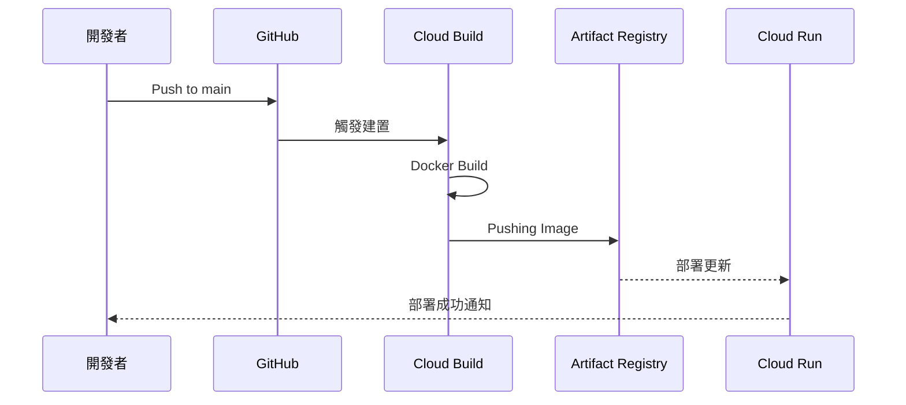

# CI/CD 流程自動化 (CI/CD Pipeline Automation)

## 關鍵字

- **Cloud Build**：GCP 的託管建置服務。
- **Artifact Registry**：用於儲存與管理 Docker 映像檔的倉庫。
- **GitHub Trigger**：當程式碼推送至特定分支時觸發自動建置。
- **cloudbuild.yaml**：定義 CI/CD 步驟的配置檔案。

## 學習目標

完成本章節後，您將能夠：

1. 理解 ElevenDops 的自動化部署模型。
2. 解析 `cloudbuild.yaml` 中的各個步驟。
3. 掌握從程式碼推送至服務更新的完整流程。

## 步驟說明

### 步驟 1：定義自動化建置步驟

#### 我們在做什麼？

透過 `cloudbuild.yaml` 定義映像檔建置、上傳與部署的三部曲。

#### 為什麼需要這樣做？

手動部署容易出錯且耗時。自動化流程確保每次發布都經過相同的步驟，並能輕鬆追蹤版本異動（透過 Commit SHA）。

#### 流程圖



### 步驟 2：解析 cloudbuild.yaml

#### 我們在做什麼？

了解建置配置中的 `build`、`push` 與 `deploy` 核心 ID。

#### 為什麼需要這樣做？

這是 CI/CD 的核心邏輯。正確配置 `args` 與環境變數是確保部署成功的關鍵。

#### 程式碼範例

```yaml
steps:
  # 步驟 1: 建置映像檔
  - name: "gcr.io/cloud-builders/docker"
    id: "build"
    args:
      ["build", "-t", "my-image:${SHORT_SHA}", "-f", "Dockerfile.cloudrun", "."]

  # 步驟 3: 部署至 Cloud Run
  - name: "gcr.io/google.com/cloudsdktool/cloud-sdk"
    id: "deploy"
    entrypoint: "gcloud"
    args:
      - "run"
      - "deploy"
      - "elevendops"
      - "--image"
      - "my-image:${SHORT_SHA}"
      - "--region"
      - "asia-east1"
```

## 常見問題 Q&A

### Q1：`SHORT_SHA` 是什麼？

**答：** 這是 Cloud Build 自動提供的變數，代表該次 Git 提交的短網址雜湊值。用於幫映像檔打上唯一標籤，方便日後回滾 (Rollback)。

### Q2：建置失敗怎麼辦？

**答：** 您可以前往 GCP 控制台的 Cloud Build 歷史紀錄查看詳細日誌。常見原因包括 Dockerfile 語法錯誤或虛擬機器記憶體不足。

## 重點整理

| 工具              | 用途       | 優點                      |
| ----------------- | ---------- | ------------------------- |
| GitHub            | 原始碼管理 | 易於協作、觸發工作流      |
| Cloud Build       | 執行建置   | 託管環境、免配置伺服器    |
| Artifact Registry | 映像檔管理 | 安全可靠、與 GCP 整合度高 |

## 延伸閱讀

- [Cloud Build 使用指南](../../docs/cloud-run-deployment/guide--cicd-pipeline.md)
- [GCP Artifact Registry 說明](https://cloud.google.com/artifact-registry/docs)

---

## 參考程式碼來源

本文件中的程式碼範例參考自以下專案檔案：

| 檔案路徑          | 說明                   |
| ----------------- | ---------------------- |
| `cloudbuild.yaml` | 通用的建置與部署設定檔 |
