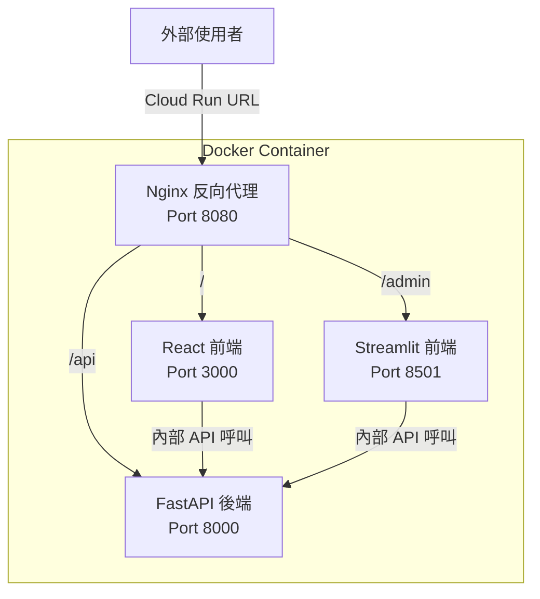

# 多前端架構 (Multi-Frontend Architecture)

## 關鍵字

- **Multi-Frontend**：在同一個 Docker 容器中運行多個前端應用程式
- **Nginx Reverse Proxy**：使用 Nginx 作為反向代理，路由不同的前端請求
- **Path-based Routing**：基於 URL 路徑的路由策略
- **WebSocket**：Streamlit 所需的即時通訊協定

## 學習目標

完成本章節後，您將能夠：

1. 理解如何在單一 Docker 容器中運行多個前端（React + Streamlit）
2. 使用 Nginx 反向代理實現路徑路由
3. 正確配置 Streamlit 的 WebSocket 支援

---

## 步驟說明

### 步驟 1：理解多前端架構

#### 我們在做什麼？

將 React（一般使用者介面）和 Streamlit（管理者介面）放在同一個 Docker 容器中運行。

#### 為什麼需要這樣做？

- **成本優化**：只需部署一個 Cloud Run 服務
- **版本一致**：前後端代碼同步更新
- **簡化配置**：內部通訊使用 localhost，無需設定 CORS

#### 架構圖



---

### 步驟 2：配置 Nginx 反向代理

#### 我們在做什麼？

建立 `nginx.conf` 設定檔，定義如何將外部請求路由到不同的內部服務。

#### 為什麼需要這樣做？

Cloud Run 只暴露一個 Port（透過 `$PORT` 環境變數）。我們需要 Nginx 接收所有請求，再根據 URL 路徑分發到正確的前端。

#### 程式碼範例

```nginx
# nginx.conf
events {
    worker_connections 1024;
}

http {
    include       /etc/nginx/mime.types;
    default_type  application/octet-stream;

    server {
        listen 8080;  # Cloud Run 的 $PORT

        # React 前端 - 主要路徑
        location / {
            proxy_pass http://127.0.0.1:3000;
            proxy_http_version 1.1;
            proxy_set_header Host $host;
            proxy_set_header X-Real-IP $remote_addr;
        }

        # Streamlit 管理介面 - /admin 路徑
        location /admin/ {
            proxy_pass http://127.0.0.1:8501/;
            proxy_http_version 1.1;

            # WebSocket 支援（Streamlit 必需）
            proxy_set_header Upgrade $http_upgrade;
            proxy_set_header Connection "upgrade";
            proxy_set_header Host $host;
            proxy_set_header X-Real-IP $remote_addr;
            proxy_set_header X-Forwarded-For $proxy_add_x_forwarded_for;
            proxy_set_header X-Forwarded-Proto $scheme;

            # 增加 timeout 避免 WebSocket 斷線
            proxy_read_timeout 86400;
        }

        # Streamlit 靜態資源
        location /admin/_stcore/ {
            proxy_pass http://127.0.0.1:8501/_stcore/;
            proxy_http_version 1.1;
            proxy_set_header Upgrade $http_upgrade;
            proxy_set_header Connection "upgrade";
        }

        # FastAPI 後端 API
        location /api/ {
            proxy_pass http://127.0.0.1:8000/api/;
            proxy_http_version 1.1;
            proxy_set_header Host $host;
            proxy_set_header X-Real-IP $remote_addr;
        }
    }
}
```

---

### 步驟 2.5：強化 Nginx 安全設定

#### 我們在做什麼？

在 Nginx 配置中加入安全相關的 Headers 和限制設定。

#### 為什麼需要這樣做？

預設的 Nginx 配置缺乏必要的安全防護。攻擊者可能利用以下漏洞：

- **資訊洩漏**：Nginx 版本號暴露可能幫助攻擊者找到已知漏洞
- **點擊劫持 (Clickjacking)**：惡意網站可將您的頁面嵌入 iframe
- **跨站腳本攻擊 (XSS)**：缺乏適當的內容類型檢查
- **阻斷服務攻擊 (DoS)**：無限制的請求可能耗盡資源

#### 程式碼範例

```nginx
# nginx.conf - 安全強化版
events {
    worker_connections 1024;
}

http {
    include       /etc/nginx/mime.types;
    default_type  application/octet-stream;

    # ========================================
    # 安全強化設定
    # ========================================

    # 1. 隱藏 Nginx 版本號（防止資訊洩漏）
    server_tokens off;

    # 2. 限制請求大小（防止 DoS 攻擊）
    client_max_body_size 10M;  # 依據上傳需求調整

    # 3. 速率限制（防止暴力破解和 DoS）
    limit_req_zone $binary_remote_addr zone=api_limit:10m rate=10r/s;
    limit_req_zone $binary_remote_addr zone=admin_limit:10m rate=5r/s;

    server {
        listen 8080;

        # 4. 安全 Headers
        add_header X-Frame-Options "SAMEORIGIN" always;
        add_header X-Content-Type-Options "nosniff" always;
        add_header X-XSS-Protection "1; mode=block" always;
        add_header Referrer-Policy "strict-origin-when-cross-origin" always;

        # React 前端
        location / {
            proxy_pass http://127.0.0.1:3000;
            proxy_http_version 1.1;
            proxy_set_header Host $host;
            proxy_set_header X-Real-IP $remote_addr;
        }

        # Streamlit 管理介面 - 加入速率限制
        location /admin/ {
            limit_req zone=admin_limit burst=10 nodelay;

            proxy_pass http://127.0.0.1:8501/;
            proxy_http_version 1.1;
            proxy_set_header Upgrade $http_upgrade;
            proxy_set_header Connection "upgrade";
            proxy_set_header Host $host;
            proxy_set_header X-Real-IP $remote_addr;
            proxy_set_header X-Forwarded-For $proxy_add_x_forwarded_for;
            proxy_set_header X-Forwarded-Proto $scheme;
            proxy_read_timeout 86400;
        }

        # API - 加入速率限制
        location /api/ {
            limit_req zone=api_limit burst=20 nodelay;

            proxy_pass http://127.0.0.1:8000/api/;
            proxy_http_version 1.1;
            proxy_set_header Host $host;
            proxy_set_header X-Real-IP $remote_addr;
        }
    }
}
```

#### 安全設定說明

| 設定項                   | 說明                       | 建議值                            |
| ------------------------ | -------------------------- | --------------------------------- |
| `server_tokens off`      | 隱藏 Nginx 版本            | 永遠開啟                          |
| `client_max_body_size`   | 限制請求 body 大小         | 依據上傳需求（如 10M）            |
| `limit_req`              | 速率限制                   | API 10r/s, Admin 5r/s             |
| `X-Frame-Options`        | 防止頁面被嵌入惡意 iframe  | `SAMEORIGIN` 或 `DENY`            |
| `X-Content-Type-Options` | 防止瀏覽器 MIME 類型嗅探   | `nosniff`                         |
| `X-XSS-Protection`       | 啟用瀏覽器 XSS 過濾器      | `1; mode=block`                   |
| `Referrer-Policy`        | 控制 Referer header 的傳送 | `strict-origin-when-cross-origin` |

> [!CAUTION] > **速率限制注意事項**
>
> 速率限制可能影響正常用戶體驗。請根據實際流量調整 `rate` 和 `burst` 參數。建議先在測試環境驗證後再部署到生產環境。

---

### 步驟 3：修改 Dockerfile

#### 我們在做什麼？

更新 Dockerfile 以包含 Nginx、React 建置產物和 Streamlit。

#### 程式碼範例

```dockerfile
# Dockerfile.cloudrun
FROM python:3.11-slim

# 安裝 Nginx 和 Node.js
RUN apt-get update && apt-get install -y \
    nginx \
    curl \
    && curl -fsSL https://deb.nodesource.com/setup_20.x | bash - \
    && apt-get install -y nodejs \
    && rm -rf /var/lib/apt/lists/*

WORKDIR /app

# 安裝 Python 依賴
COPY pyproject.toml poetry.lock ./
RUN pip install poetry && poetry install --no-dev

# 建置 React 前端
COPY frontend/ ./frontend/
RUN cd frontend && npm install && npm run build

# 安裝 serve 用於靜態文件服務
RUN npm install -g serve

# 複製後端和 Streamlit
COPY backend/ ./backend/
COPY streamlit_app/ ./streamlit_app/

# 複製 Nginx 配置
COPY nginx.conf /etc/nginx/nginx.conf

# 複製啟動腳本
COPY scripts/start-multi-frontend.sh ./start.sh
RUN chmod +x ./start.sh

EXPOSE 8080

CMD ["./start.sh"]
```

---

### 步驟 4：編寫啟動腳本

#### 我們在做什麼？

建立啟動腳本，依序啟動所有服務，並使用 Nginx 作為主進程。

#### 程式碼範例

```bash
#!/bin/bash
# scripts/start-multi-frontend.sh

set -e

echo "🚀 啟動多前端架構..."

# 1. 啟動 FastAPI 後端 (背景)
echo "📦 啟動 FastAPI 後端..."
uvicorn backend.main:app --host 127.0.0.1 --port 8000 &
FASTAPI_PID=$!

# 2. 啟動 React 前端 (背景) - 使用 serve 提供靜態文件
echo "⚛️ 啟動 React 前端..."
serve -s /app/frontend/build -l 3000 &
REACT_PID=$!

# 3. 啟動 Streamlit (背景)
echo "📊 啟動 Streamlit 管理介面..."
streamlit run streamlit_app/app.py \
    --server.port 8501 \
    --server.address 127.0.0.1 \
    --server.baseUrlPath /admin \
    --server.enableCORS false \
    --server.enableXsrfProtection false &
STREAMLIT_PID=$!

# 等待服務啟動
sleep 3

# 4. 啟動 Nginx (前景) - 作為主進程
echo "🌐 啟動 Nginx 反向代理..."
nginx -g "daemon off;"
```

> [!IMPORTANT] > **Streamlit 關鍵設定**
>
> - `--server.baseUrlPath /admin`：指定 Streamlit 運行在 `/admin` 子路徑
> - `--server.enableCORS false`：因為使用反向代理，不需要 CORS
> - `--server.enableXsrfProtection false`：透過反向代理時需要停用

---

## 常見問題 Q&A

### Q1：為什麼選擇 Nginx 而不是其他反向代理？

**答：**

- Nginx 輕量、穩定，是業界標準
- 原生支援 WebSocket（Streamlit 必需）
- Docker 映像體積小
- 豐富的文件和社群支援

### Q2：Streamlit 的 WebSocket 連線常斷線怎麼辦？

**答：** 確保以下設定：

```nginx
proxy_read_timeout 86400;  # 24 小時
proxy_set_header Upgrade $http_upgrade;
proxy_set_header Connection "upgrade";
```

### Q3：如何讓不同前端有不同的存取權限？

**答：** 可以在 Nginx 層級加入基本驗證：

```nginx
location /admin/ {
    auth_basic "Admin Area";
    auth_basic_user_file /etc/nginx/.htpasswd;
    proxy_pass http://127.0.0.1:8501/;
    # ... 其他設定
}
```

### Q4：這種架構適合大流量場景嗎？

**答：**

- **小到中流量**：運作良好，成本低
- **大流量**：建議拆分為獨立的 Cloud Run 服務，各自獨立擴展

---

## 重點整理

| 概念               | 說明                          | 使用時機                          |
| ------------------ | ----------------------------- | --------------------------------- |
| Nginx 反向代理     | 統一入口，路由到不同服務      | 多前端單容器架構                  |
| Path-based Routing | 根據 URL 路徑分發請求         | `/` → React, `/admin` → Streamlit |
| WebSocket 設定     | Upgrade 和 Connection headers | Streamlit 必需                    |
| baseUrlPath        | Streamlit 子路徑設定          | 非根路徑部署時                    |

---

## 替代方案比較

| 方案                          | 優點               | 缺點                   | 適用場景              |
| ----------------------------- | ------------------ | ---------------------- | --------------------- |
| **單容器 + Nginx**            | 成本低、版本一致   | 複雜度高、資源共享     | MVP、小團隊、開發階段 |
| **多 Cloud Run 服務**         | 獨立擴展、故障隔離 | 成本較高、需跨服務通訊 | 正式生產、大流量      |
| **Cloud Run + Load Balancer** | 彈性路由、CDN 整合 | 設定複雜、成本最高     | 企業級應用            |

---

## 延伸閱讀

- [Nginx 官方文件 - Reverse Proxy](https://nginx.org/en/docs/http/ngx_http_proxy_module.html)
- [Streamlit 部署指南](https://docs.streamlit.io/deploy)
- [Cloud Run 多容器支援 (Sidecar)](https://cloud.google.com/run/docs/deploying#sidecars)

---

## 參考程式碼來源

| 檔案路徑                 | 說明                 |
| ------------------------ | -------------------- |
| `Dockerfile.cloudrun`    | 生產環境 Docker 配置 |
| `scripts/start.sh`       | 現有的服務啟動腳本   |
| `nginx.conf`（建議新增） | Nginx 反向代理配置   |

---

[⬅️ 返回 Cloud Run 部署策略索引](./index.md)
