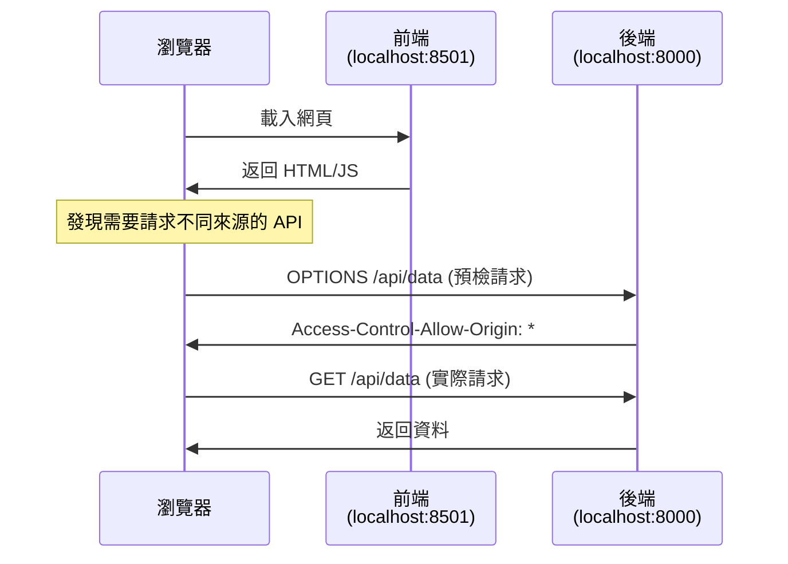

# CORS 跨域設定與安全配置

## 關鍵字

- **CORS (Cross-Origin Resource Sharing)**：跨域資源共享，瀏覽器安全機制
- **Origin**：來源，由協定 + 網域 + 端口組成
- **Preflight Request**：預檢請求，瀏覽器先發送 OPTIONS 請求確認權限
- **Access-Control-Allow-Origin**：回應標頭，指定允許的來源

## 學習目標

完成本章節後，您將能夠：

1. 理解 CORS 的運作原理
2. 在 FastAPI 中正確配置 CORS
3. 避免常見的 CORS 安全漏洞

---

## 步驟說明

### 步驟 1：理解 CORS 運作原理

#### 我們在做什麼？

CORS 是瀏覽器的安全機制，用於控制網頁是否可以請求不同來源的資源。

#### 流程圖



#### 什麼是「跨域」？

| 情境                                      | 是否跨域  | 說明         |
| ----------------------------------------- | --------- | ------------ |
| `http://a.com` → `http://a.com/api`       | ❌ 不跨域 | 相同來源     |
| `http://a.com` → `http://api.a.com`       | ✅ 跨域   | 子網域不同   |
| `http://a.com` → `https://a.com`          | ✅ 跨域   | 協定不同     |
| `http://a.com:8501` → `http://a.com:8000` | ✅ 跨域   | **端口不同** |

> [!NOTE]
> ElevenDops 本地開發時，Streamlit (8501) 呼叫 FastAPI (8000) 就是跨域請求！

---

### 步驟 2：FastAPI CORS 設定

#### 專案目前的設定

**`backend/main.py`**

```python
from fastapi.middleware.cors import CORSMiddleware

app.add_middleware(
    CORSMiddleware,
    allow_origins=CORS_ORIGINS,      # 允許的來源列表
    allow_credentials=True,           # 允許攜帶 Cookie
    allow_methods=["*"],              # 允許所有 HTTP 方法
    allow_headers=["*"],              # 允許所有 Headers
)
```

**`backend/config.py`**

```python
cors_origins: str = Field(
    default="http://localhost:8501,http://127.0.0.1:8501",
    description="Comma-separated list of allowed CORS origins",
)
```

---

### 步驟 3：安全性最佳實踐

#### 🔴 危險設定（避免使用）

```python
# ❌ 允許所有來源 + 攜帶憑證 = 嚴重安全漏洞！
app.add_middleware(
    CORSMiddleware,
    allow_origins=["*"],           # 危險！
    allow_credentials=True,         # 與 * 搭配時極度危險
)
```

> [!CAUTION] > **`allow_origins=["*"]` 搭配 `allow_credentials=True` 是重大安全漏洞！**
>
> 攻擊者可以從任何網站發起帶有使用者 Cookie 的請求，導致 CSRF 攻擊。

#### 🟢 安全設定（推薦）

```python
# ✅ 明確指定來源
ALLOWED_ORIGINS = [
    "https://your-app-name.run.app",      # Cloud Run 網址
    "https://your-custom-domain.com",     # 自訂網域
]

# ✅ 開發環境額外加入 localhost
if settings.app_env == "development":
    ALLOWED_ORIGINS.extend([
        "http://localhost:8501",
        "http://127.0.0.1:8501",
    ])

app.add_middleware(
    CORSMiddleware,
    allow_origins=ALLOWED_ORIGINS,
    allow_credentials=True,
    allow_methods=["GET", "POST", "PUT", "DELETE"],  # 明確指定
    allow_headers=["Authorization", "Content-Type"], # 明確指定
)
```

---

### 步驟 4：各架構的 CORS 需求

| 架構                     | CORS 需求 | 說明                                |
| ------------------------ | --------- | ----------------------------------- |
| **單容器 + localhost**   | 不需要    | 前後端同一容器，使用 localhost 通訊 |
| **單容器 + Nginx 代理**  | 不需要    | Nginx 統一入口，內部轉發            |
| **分開部署的前後端**     | **需要**  | 不同網域，必須設定 CORS             |
| **本地開發（分開運行）** | **需要**  | 不同端口視為跨域                    |

---

## 常見問題 Q&A

### Q1：為什麼我的 CORS 設定沒有生效？

**答：** 常見原因：

1. **快取問題**：瀏覽器會快取 CORS 回應，請嘗試：

   - 清除瀏覽器快取
   - 使用無痕模式
   - 重啟後端服務

2. **路徑不匹配**：確認 API 路徑是否正確

   ```python
   # 注意：結尾斜線很重要！
   allow_origins=["http://localhost:8501"]   # ✅
   allow_origins=["http://localhost:8501/"]  # ❌ 不要加斜線
   ```

3. **Middleware 順序**：CORS Middleware 應該最先加入

### Q2：Preflight (OPTIONS) 請求是什麼？

**答：** 當請求符合以下條件時，瀏覽器會先發送 OPTIONS 請求：

- 使用 `PUT`, `DELETE`, `PATCH` 等方法
- 帶有自訂 Headers（如 `Authorization`）
- `Content-Type` 不是 `text/plain`, `multipart/form-data`, `application/x-www-form-urlencoded`

```
瀏覽器 → 後端: OPTIONS /api/data (我可以發 POST 請求嗎？)
後端 → 瀏覽器: 200 OK + CORS Headers (可以)
瀏覽器 → 後端: POST /api/data (實際請求)
```

### Q3：如何在生產環境完全禁用 CORS？

**答：** 如果不需要跨域存取，最安全的做法是**不設定 CORS Middleware**：

```python
# 只在需要時才加入 CORS
if settings.needs_cors:
    app.add_middleware(CORSMiddleware, ...)
```

### Q4：`allow_credentials=True` 什麼時候需要？

**答：** 當前端需要傳送以下資訊時：

- Cookies
- HTTP 認證資訊
- TLS 客戶端憑證

```javascript
// 前端需要這樣設定
fetch("/api/data", {
  credentials: "include", // 攜帶 Cookie
});
```

### Q5：單容器架構為什麼不需要 CORS？

**答：** 因為 Streamlit 透過 `localhost:8000` 呼叫 FastAPI：

```
Streamlit (容器內) → localhost:8000 → FastAPI (同一容器)
```

這不是「瀏覽器發起的跨域請求」，而是「後端對後端的請求」，不受 CORS 限制。

但本地開發時，Streamlit 和 FastAPI 分開運行，**瀏覽器**會發起跨域請求，因此需要 CORS。

### Q6：如何除錯 CORS 問題？

**答：** 使用瀏覽器開發者工具：

1. 開啟 **Network** 標籤
2. 找到失敗的請求
3. 檢查 **Response Headers** 是否包含：
   ```
   Access-Control-Allow-Origin: http://localhost:8501
   Access-Control-Allow-Credentials: true
   ```
4. 錯誤通常會顯示在 **Console** 標籤

---

## 重點整理

| 設定項目            | 開發環境                 | 生產環境                 |
| ------------------- | ------------------------ | ------------------------ |
| `allow_origins`     | `["http://localhost:*"]` | 明確列出允許的網域       |
| `allow_credentials` | `True`（如需要）         | 依需求，搭配具體 origins |
| `allow_methods`     | `["*"]` 可接受           | 建議明確指定             |
| `allow_headers`     | `["*"]` 可接受           | 建議明確指定             |

---

## 安全檢查清單

- [ ] 生產環境不使用 `allow_origins=["*"]`
- [ ] 若使用 `allow_credentials=True`，必須指定具體來源
- [ ] 定期檢視允許的來源列表
- [ ] 使用環境變數管理 CORS 設定
- [ ] 單容器架構確認是否真的需要 CORS

---

## 延伸閱讀

- [MDN Web Docs - CORS](https://developer.mozilla.org/en-US/docs/Web/HTTP/CORS)
- [FastAPI CORS 官方文件](https://fastapi.tiangolo.com/tutorial/cors/)
- [OWASP CORS Security](https://owasp.org/www-community/attacks/CORS_OriginHeaderScrutiny)

---

## 參考程式碼來源

| 檔案路徑            | 說明                 |
| ------------------- | -------------------- |
| `backend/main.py`   | CORS Middleware 設定 |
| `backend/config.py` | CORS 來源設定與驗證  |

---

[⬅️ 返回 Cloud Run 部署策略索引](./index.md)
