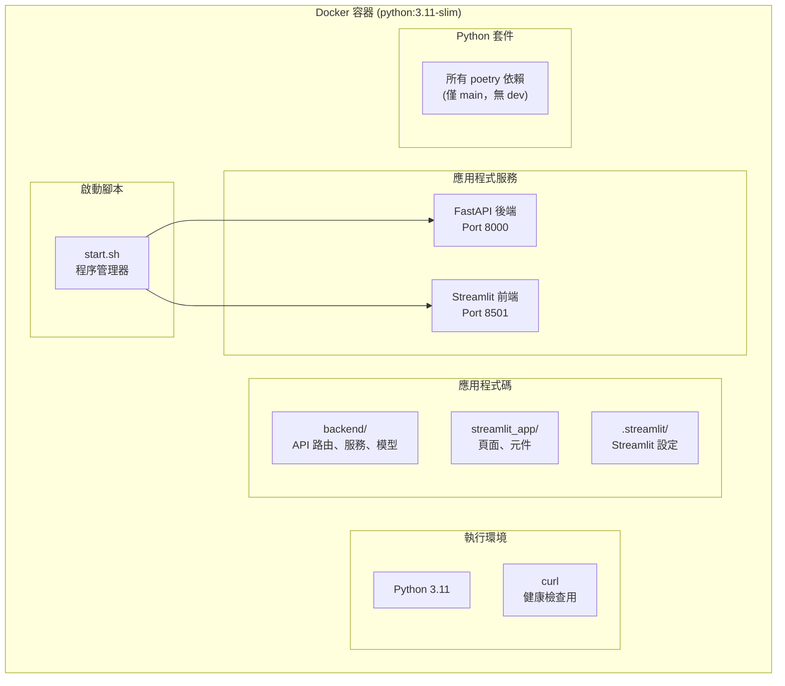

# Docker 容器內部結構分析 (Docker Container Internals)

## 關鍵字

- **Multi-stage Build**：多階段建置，分離建置環境與執行環境
- **Process Manager**：行程管理器（如 `start.sh`），負責管理容器內的多個服務
- **Non-root User**：非特權使用者，提升容器安全性
- **Slim Image**：精簡版基礎映像，減少攻擊面與體積

## 學習目標

完成本章節後，您將能夠：

1. 清楚了解生產環境 Docker 容器內部到底包含了什麼
2. 理解 `start.sh` 如何作為容器的 ENTRYPOINT 管理服務
3. 認識容器的安全性設計（非 root 用戶、無模擬器）

---

## 步驟說明

### 步驟 1：容器內部結構透視

#### 我們在做什麼？

剖析由 `Dockerfile.cloudrun` 建置出來的最終生產映像檔（Production Image）。

#### 為什麼需要這樣做？

了解容器內部結構有助於除錯、優化效能，並確保沒有將不必要的檔案（如 secrets 或測試代碼）打包進去。

#### 結構分層圖



---

### 步驟 2：詳細內容清單

#### ✅ 包含的內容

這些是運行服務所必需的組件：

| 類別               | 內容               | 來源/說明                                                 |
| ------------------ | ------------------ | --------------------------------------------------------- |
| **基礎映像**       | Python 3.11 slim   | `python:3.11-slim`，Debian 基礎的精簡版                   |
| **系統工具**       | `curl`             | 用於 `HEALTHCHECK` 指令檢查後端狀態                       |
| **後端程式碼**     | `backend/`         | 包含 `main.py`、API 路由、資料模型與服務邏輯              |
| **前端程式碼**     | `streamlit_app/`   | 包含 `app.py`、頁面 (pages) 與 UI 元件                    |
| **Streamlit 設定** | `.streamlit/`      | `config.toml` (主題設定)、`secrets.toml` (雖不建議但若有) |
| **啟動腳本**       | `scripts/start.sh` | 複製到容器根目錄 `./start.sh`，作為 CMD 執行              |
| **Python 依賴**    | `site-packages`    | 從 Builder 階段複製來的已安裝套件 (不含 Poetry 本身)      |
| **用戶**           | `appuser`          | 專用的非 root 使用者                                      |

#### ❌ 排除的內容

這些內容**不會**也不應該出現在生產容器中：

| 不包含               | 原因                                                               |
| -------------------- | ------------------------------------------------------------------ |
| `tests/`             | 生產環境不需要測試檔案，減少體積                                   |
| `docs/`              | 文件僅供開發參考，不需要打包                                       |
| `.env`               | **敏感資訊！** 生產環境由 Secret Manager 或環境變數注入            |
| `dev` 依賴           | `poetry install --only=main` 確保沒有 `pytest`、`black` 等開發工具 |
| `docker-compose.yml` | 這是本地開發用的編排檔                                             |
| 模擬器資料           | `emulator-data/` 體積龐大且僅用於本地測試                          |

---

### 步驟 3：容器啟動流程解析

當 Cloud Run 啟動這個容器時，會執行 `start.sh`，流程如下：

1. **初始化**：設定環境變數，定義埠號 (Backend: 8000, Frontend: 8501)。
2. **啟動後端**：在背景啟動 `uvicorn backend.main:app`。
3. **健康檢查**：腳本進入迴圈，每秒 `curl` 一次 `http://localhost:8000/api/health`。
   - ⚠️ **關鍵點**：前端必須等待後端準備好才能啟動，否則可能會因為連不到 API 而報錯。
4. **啟動前端**：後端健康檢查通過後，啟動 `streamlit run`。
5. **進程監控**：腳本進入無窮迴圈，持續監控前後端 PID。
   - 如果任一服務意外終止，腳本會嘗試重啟它（最多 3 次）。
   - 如果收到 `SIGTERM` (Cloud Run 關閉訊號)，會優雅地關閉兩個服務。

---

### 步驟 4：安全性特性

#### 1. 非 root 使用者 (Non-root User)

Dockerfile 中建立了 `appuser` 並切換使用者：

```dockerfile
RUN useradd --create-home --shell /bin/bash appuser
USER appuser
```

即使容器被攻破，攻擊者也只擁有受限的權限，無法修改系統檔案。

#### 2. 禁用模擬器

生產環境變數強制關閉所有模擬器，確保連接的是真實的 GCP 服務：

```dockerfile
ENV USE_FIRESTORE_EMULATOR=false \
    USE_GCS_EMULATOR=false \
    USE_MOCK_DATA=false
```

#### 3. 最小權限依賴

使用 `poetry install --only=main` 確保像 `pytest` 或 `pylint` 這樣可能包含漏洞或額外工具的開發依賴不會進入生產環境。

---

## 常見問題 Q&A

### Q1：為什麼我看不到 `.env` 檔案？

**答：** 這是正常的！`.env` 檔案通常包含敏感密鑰，**絕對不應該** COPY 到 Docker 映像中。生產環境的環境變數是透過 Cloud Run 的設定或 Secret Manager 在「執行時 (Runtime)」注入的。

### Q2：`curl` 是必須的嗎？

**答：** 是的，在這個架構中是必須的。雖然 Python 也可以發送請求，但在 Dockerfile 的 `HEALTHCHECK` 指令和 `start.sh` 的 Shell 腳本中，`curl` 是最輕量且標準的 HTTP 檢查工具。

### Q3：為什麼要用 Multi-stage Build？

**答：**

- **Builder 階段**：包含編譯工具 (gcc)、Poetry、完整依賴。體積大。
- **Production 階段**：只包含 Python Runtime 和從 Builder 複製過來的 `site-packages`。
- **結果**：最終映像檔體積大幅縮小，且不包含建置工具，安全性更高。

---

## 重點整理

| 組件          | 角色     | 關鍵特性                             |
| ------------- | -------- | ------------------------------------ |
| **start.sh**  | 指揮官   | 協調啟動順序、監控健康狀態           |
| **appuser**   | 守門員   | 限制執行權限，提升安全性             |
| **FastAPI**   | 後勤支援 | 提供 API，隱藏在容器內部 (Port 8000) |
| **Streamlit** | 前線戰士 | 提供 UI，對外服務 (Port 8080/8501)   |

---

## 延伸閱讀

- [Docker Multi-stage Builds 官方文件](https://docs.docker.com/build/building/multi-stage/)
- [GCP Cloud Run Container Contract](https://cloud.google.com/run/docs/reference/container-contract)

---

## 參考程式碼來源

| 檔案路徑              | 說明                           |
| --------------------- | ------------------------------ |
| `Dockerfile.cloudrun` | 定義了多階段建置與內容複製規則 |
| `scripts/start.sh`    | 定義了啟動邏輯與進程管理       |

---

[⬅️ 返回 Cloud Run 部署策略索引](./index.md)
