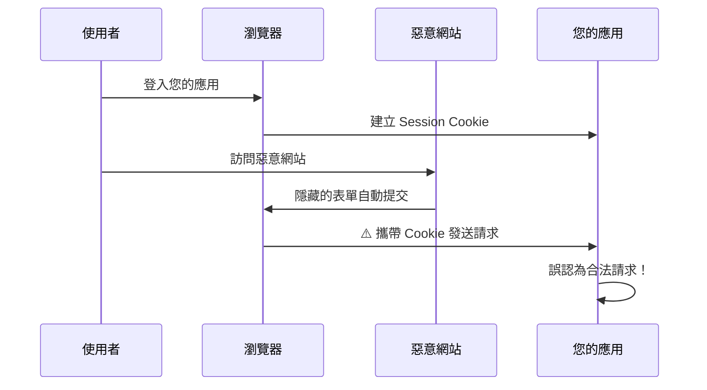
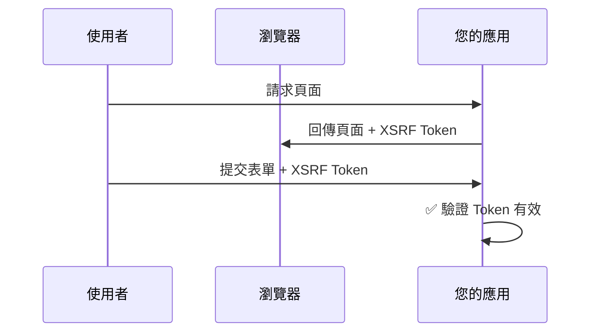

# 應用程式安全 Headers (Application Security Headers)

## 關鍵字

- **Security Headers**：HTTP Response 中的安全性標頭
- **XSRF/CSRF**：跨站請求偽造攻擊
- **Middleware**：中介軟體，攔截並處理請求/回應
- **Rate Limiting**：速率限制，防止濫用

## 學習目標

完成本章節後，您將能夠：

1. 理解常見 HTTP 安全 Headers 的用途
2. 了解 XSRF 攻擊原理與防護方法
3. 在 FastAPI 中實作安全 Headers Middleware

---

## 步驟說明

### 步驟 1：理解安全 Headers

#### 我們在做什麼？

在每個 HTTP Response 中加入安全相關的 Headers，讓瀏覽器啟用額外的安全機制。

#### 為什麼需要這樣做？

現代瀏覽器內建多種安全防護機制，但需要伺服器透過 Headers 來啟用。沒有這些 Headers，攻擊者可能利用以下漏洞：

| Header 名稱              | 防護目標              | 攻擊類型                |
| ------------------------ | --------------------- | ----------------------- |
| `X-Frame-Options`        | 防止頁面被嵌入 iframe | 點擊劫持 (Clickjacking) |
| `X-Content-Type-Options` | 防止 MIME 類型嗅探    | 惡意檔案執行            |
| `X-XSS-Protection`       | 啟用 XSS 過濾器       | 跨站腳本攻擊 (XSS)      |
| `Referrer-Policy`        | 控制 Referer 傳送     | 隱私洩漏                |

#### 程式碼範例

```python
# backend/main.py - 安全 Headers Middleware
from starlette.middleware.base import BaseHTTPMiddleware
from starlette.requests import Request
from starlette.responses import Response

class SecurityHeadersMiddleware(BaseHTTPMiddleware):
    """為所有回應加入安全 Headers."""

    async def dispatch(self, request: Request, call_next):
        response: Response = await call_next(request)

        # 防止點擊劫持：禁止被嵌入任何 iframe
        response.headers["X-Frame-Options"] = "DENY"

        # 防止 MIME 類型嗅探
        response.headers["X-Content-Type-Options"] = "nosniff"

        # 控制 Referer 傳送策略
        response.headers["Referrer-Policy"] = "strict-origin-when-cross-origin"

        return response

# 在 app 初始化後加入
app.add_middleware(SecurityHeadersMiddleware)
```

---

### 步驟 2：理解 XSRF 防護

#### 我們在做什麼？

啟用 Streamlit 的 XSRF（跨站請求偽造）保護機制。

#### 為什麼需要這樣做？

XSRF 攻擊利用使用者已登入的身份，在使用者不知情的情況下發送惡意請求。



#### XSRF Token 防護原理



#### 程式碼範例

```toml
# .streamlit/config.toml
[server]
headless = true
enableCORS = false
enableXsrfProtection = true  # 啟用 XSRF 保護
```

> [!WARNING] > **Cloud Run 相容性**
>
> 在某些反向代理配置下，XSRF 保護可能導致 WebSocket 連線問題。請在部署前進行測試。

---

### 步驟 3：理解速率限制（選用）

#### 我們在做什麼？

限制單一 IP 在特定時間內的請求次數。

#### 為什麼需要這樣做？

防止以下攻擊：

- **暴力破解**：攻擊者嘗試大量密碼組合
- **DoS 攻擊**：大量請求耗盡伺服器資源
- **API 濫用**：惡意爬蟲或自動化腳本

#### 程式碼範例

```python
# 使用 slowapi 實作速率限制
from slowapi import Limiter
from slowapi.util import get_remote_address

limiter = Limiter(key_func=get_remote_address)
app.state.limiter = limiter

@app.get("/api/sensitive")
@limiter.limit("10/minute")  # 每分鐘最多 10 次請求
async def sensitive_endpoint():
    return {"data": "sensitive"}
```

---

## 常見問題 Q&A

### Q1：為什麼 `X-XSS-Protection` 不建議使用？

**答：** 現代瀏覽器（Chrome 78+）已移除對此 Header 的支援，因為它可能被繞過，反而引入新的安全問題。建議使用 Content-Security-Policy (CSP) 取代。

### Q2：`X-Frame-Options` 應該設為 `DENY` 還是 `SAMEORIGIN`？

**答：**

- `DENY`：完全禁止被嵌入 iframe（最安全）
- `SAMEORIGIN`：只允許同源網站嵌入（如果您需要在自己的網站中使用 iframe）

### Q3：沒有 Nginx 時如何實現速率限制？

**答：** 可以使用 Python 套件如 `slowapi`（基於 `limits`），直接在 FastAPI 層實現。但效能不如 Nginx 層的實現。

---

## 重點整理

| 概念             | 說明                       | 實作位置              |
| ---------------- | -------------------------- | --------------------- |
| Security Headers | 瀏覽器安全機制的啟用開關   | FastAPI Middleware    |
| XSRF Protection  | 驗證請求來源，防止跨站偽造 | Streamlit config.toml |
| Rate Limiting    | 限制請求頻率，防止濫用     | FastAPI + slowapi     |

---

## 延伸閱讀

- [OWASP Security Headers](https://owasp.org/www-project-secure-headers/)
- [MDN Web Docs - HTTP Headers](https://developer.mozilla.org/en-US/docs/Web/HTTP/Headers)
- [Starlette Middleware](https://www.starlette.io/middleware/)

---

## 參考程式碼來源

| 檔案路徑                 | 說明             |
| ------------------------ | ---------------- |
| `backend/main.py`        | FastAPI 入口點   |
| `.streamlit/config.toml` | Streamlit 配置檔 |

---

[⬅️ 返回 Cloud Run 部署策略索引](./index.md)
