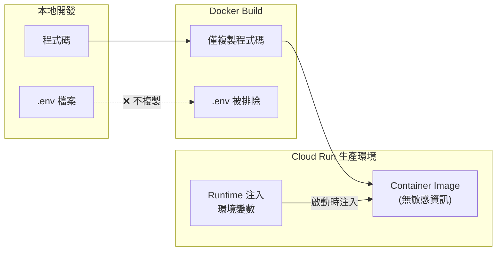
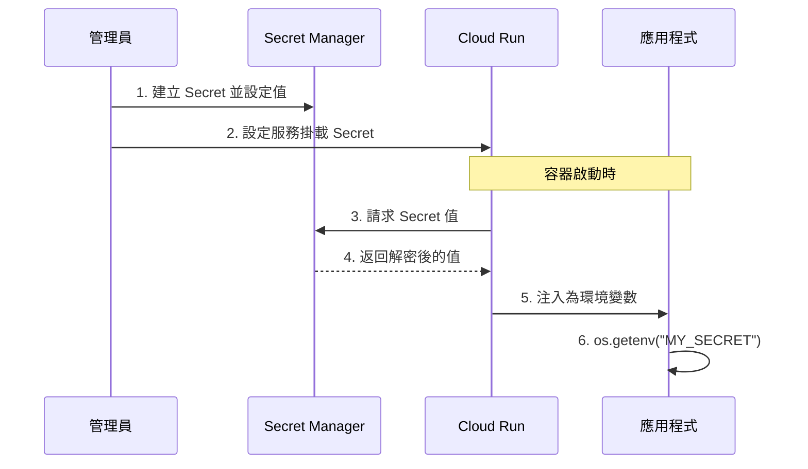
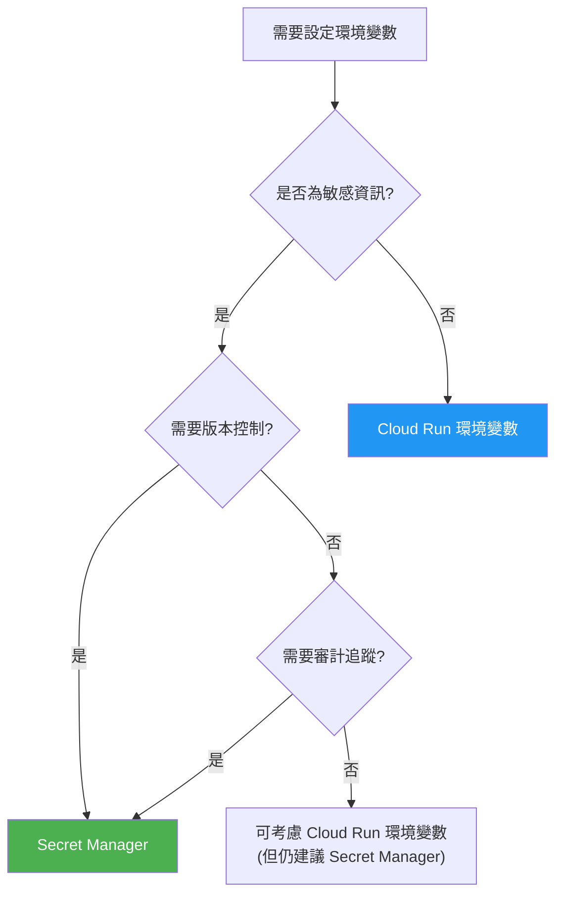

# 環境變數注入機制 (Environment Variable Injection)

## 關鍵字

- **Runtime Injection**：執行時注入，在容器啟動時才將環境變數注入
- **Secret Manager**：GCP 的機密管理服務，安全儲存 API 金鑰等敏感資訊
- **Twelve-Factor App**：十二要素應用方法論，強調設定與程式碼分離

## 學習目標

完成本章節後，您將能夠：

1. 理解為什麼 `.env` 檔案不應該進入 Docker 映像
2. 掌握 Cloud Run 三種環境變數注入方式
3. 為不同敏感程度的設定選擇適當的注入策略

---

## 核心概念

### 為什麼看不到 `.env` 檔案？

在生產環境的 Docker 容器中，你**不會也不應該**看到 `.env` 檔案。這是刻意設計的安全措施：



### 安全理由

| 風險         | 說明                                                               |
| ------------ | ------------------------------------------------------------------ |
| **映像外洩** | Docker Image 可能被推送到 Registry，任何有權限者都能下載並檢視內容 |
| **版本控制** | 不小心將 `.env` commit 到 Git，歷史紀錄永遠留存                    |
| **環境耦合** | 同一份映像應能部署到 dev/staging/prod，靠外部設定區分環境          |

---

## 三種注入方式

### 方式 1：Cloud Run 環境變數設定 (基本)

最直接的方式，適合**非敏感**的設定值。

#### 使用 gcloud CLI

```bash
# 部署時設定環境變數
gcloud run deploy my-service \
  --image gcr.io/PROJECT_ID/my-image \
  --set-env-vars="APP_ENV=production,LOG_LEVEL=info"

# 更新現有服務的環境變數
gcloud run services update my-service \
  --update-env-vars="LOG_LEVEL=debug"
```

#### 使用 Cloud Console

1. 前往 **Cloud Run** → 選擇服務
2. 點擊 **Edit & Deploy New Revision**
3. 展開 **Variables & Secrets** 區塊
4. 點擊 **Add Variable** 新增環境變數

#### 特性

| 優點        | 缺點                         |
| ----------- | ---------------------------- |
| ✅ 簡單直觀 | ⚠️ 值會顯示在 Console 中     |
| ✅ 立即生效 | ⚠️ 不適合 API 金鑰等敏感資訊 |
| ✅ 易於除錯 | ⚠️ 無版本控制                |

---

### 方式 2：Secret Manager (推薦用於敏感資訊)

GCP Secret Manager 專為儲存敏感資訊設計，提供加密、版本控制與存取審計。

#### 運作流程



#### 實作步驟

```bash
# 步驟 1：建立 Secret
gcloud secrets create ELEVENLABS_API_KEY \
  --replication-policy="automatic"

# 步驟 2：新增 Secret 版本 (實際的值)
echo -n "sk-your-actual-api-key" | \
  gcloud secrets versions add ELEVENLABS_API_KEY --data-file=-

# 步驟 3：授權 Cloud Run 存取 Secret
gcloud secrets add-iam-policy-binding ELEVENLABS_API_KEY \
  --member="serviceAccount:YOUR_SERVICE_ACCOUNT@PROJECT_ID.iam.gserviceaccount.com" \
  --role="roles/secretmanager.secretAccessor"

# 步驟 4：部署時掛載 Secret 為環境變數
gcloud run deploy my-service \
  --image gcr.io/PROJECT_ID/my-image \
  --set-secrets="ELEVENLABS_API_KEY=ELEVENLABS_API_KEY:latest"
```

#### 掛載為環境變數 vs 檔案

```bash
# 掛載為環境變數 (推薦)
--set-secrets="ENV_VAR_NAME=SECRET_NAME:VERSION"

# 掛載為檔案 (適合憑證檔)
--set-secrets="/path/to/file=SECRET_NAME:VERSION"
```

#### 特性

| 優點                  | 缺點                                               |
| --------------------- | -------------------------------------------------- |
| ✅ 值不顯示在 Console | ⚠️ 需要額外設定 IAM 權限                           |
| ✅ 版本控制與回滾     | ⚠️ 有額外費用 (每月免費額度：6 個活躍 Secret 版本) |
| ✅ 存取審計日誌       |                                                    |
| ✅ 自動輪換支援       |                                                    |

---

### 方式 3：Cloud Build Substitutions (CI/CD 整合)

在 CI/CD 流程中動態注入，適合自動化部署。

#### cloudbuild.yaml 範例

```yaml
steps:
  # 建置 Docker Image
  - name: "gcr.io/cloud-builders/docker"
    args:
      - "build"
      - "-t"
      - "gcr.io/${PROJECT_ID}/my-app:${SHORT_SHA}"
      - "."

  # 部署到 Cloud Run，掛載 Secrets
  - name: "gcr.io/google.com/cloudsdktool/cloud-sdk"
    entrypoint: "gcloud"
    args:
      - "run"
      - "deploy"
      - "my-service"
      - "--image=gcr.io/${PROJECT_ID}/my-app:${SHORT_SHA}"
      - "--region=${_REGION}"
      - "--set-env-vars=APP_ENV=${_APP_ENV}"
      - "--set-secrets=ELEVENLABS_API_KEY=ELEVENLABS_API_KEY:latest"

substitutions:
  _REGION: asia-east1
  _APP_ENV: production
```

#### 使用 Trigger 設定替換變數

```bash
gcloud builds triggers create github \
  --repo-name="my-repo" \
  --branch-pattern="^main$" \
  --build-config="cloudbuild.yaml" \
  --substitutions="_APP_ENV=production,_REGION=asia-east1"
```

---

## 應用程式讀取方式

無論使用哪種注入方式，Python 程式碼的讀取方式都相同：

```python
import os

# 讀取環境變數
api_key = os.getenv("ELEVENLABS_API_KEY")
app_env = os.getenv("APP_ENV", "development")  # 可設定預設值

# 驗證必要的環境變數
required_vars = ["ELEVENLABS_API_KEY", "GCP_PROJECT_ID"]
missing = [var for var in required_vars if not os.getenv(var)]

if missing:
    raise EnvironmentError(f"Missing required environment variables: {missing}")
```

### 本地開發 vs 生產環境

```python
# config.py
import os
from dotenv import load_dotenv

# 本地開發時載入 .env 檔案
# 生產環境中 .env 不存在，這行不會有任何效果
load_dotenv()

# 統一的讀取方式
class Settings:
    ELEVENLABS_API_KEY: str = os.getenv("ELEVENLABS_API_KEY", "")
    APP_ENV: str = os.getenv("APP_ENV", "development")
    LOG_LEVEL: str = os.getenv("LOG_LEVEL", "INFO")
```

---

## 選擇策略指南



### 快速對照表

| 設定類型     | 範例                  | 建議方式                       |
| ------------ | --------------------- | ------------------------------ |
| API 金鑰     | `ELEVENLABS_API_KEY`  | ✅ Secret Manager              |
| 資料庫密碼   | `DATABASE_PASSWORD`   | ✅ Secret Manager              |
| 服務帳號金鑰 | `SERVICE_ACCOUNT_KEY` | ✅ Secret Manager (掛載為檔案) |
| 應用環境     | `APP_ENV=production`  | Cloud Run 環境變數             |
| 日誌等級     | `LOG_LEVEL=info`      | Cloud Run 環境變數             |
| 功能開關     | `FEATURE_FLAG=true`   | Cloud Run 環境變數             |

---

## 常見問題 Q&A

### Q1：本地開發時如何模擬生產環境的環境變數？

**答：** 使用 `.env` 檔案配合 `python-dotenv` 套件：

```bash
# .env (本地開發用，已加入 .gitignore)
ELEVENLABS_API_KEY=sk-local-dev-key
APP_ENV=development
```

```python
from dotenv import load_dotenv
load_dotenv()  # 載入 .env 到環境變數
```

### Q2：Secret 值更新後，Cloud Run 會自動取得新值嗎？

**答：** 不會自動更新。你需要：

1. 部署新的 Revision：`gcloud run deploy ...`
2. 或使用 `latest` 版本並重啟服務

> [!TIP]
> 使用 `:latest` 版本標籤時，每次部署新 Revision 都會取得最新的 Secret 值。

### Q3：如何避免 `.env` 不小心被 commit？

**答：** 確保 `.gitignore` 包含：

```gitignore
# 環境變數
.env
.env.local
.env.*.local
*.env

# 但允許範例檔
!.env.example
```

並建立 `.env.example` 作為團隊參考。

---

## 重點整理

| 概念                      | 說明                                      |
| ------------------------- | ----------------------------------------- |
| **Build Time vs Runtime** | 敏感資訊應在 Runtime 注入，不進入映像     |
| **Secret Manager**        | 敏感資訊的最佳存放位置，提供加密與審計    |
| **統一程式碼**            | 無論注入方式，都用 `os.getenv()` 讀取     |
| **環境分離**              | 同一份映像靠外部設定區分 dev/staging/prod |

---

## 延伸閱讀

- [Cloud Run 環境變數文件](https://cloud.google.com/run/docs/configuring/environment-variables)
- [Secret Manager 快速入門](https://cloud.google.com/secret-manager/docs/quickstart)
- [Twelve-Factor App: Config](https://12factor.net/config)

---

## 相關學習資源

| 主題                | 連結                                                                         |
| ------------------- | ---------------------------------------------------------------------------- |
| Docker 容器內部結構 | [06--docker-container-structure.md](./06--docker-container-structure.md)     |
| 應用程式安全標頭    | [07--application-security-headers.md](./07--application-security-headers.md) |
| CI/CD 自動化部署    | [02--cicd-pipeline-automation.md](./02--cicd-pipeline-automation.md)         |

---

[⬅️ 返回 Cloud Run 部署策略索引](./index.md)
