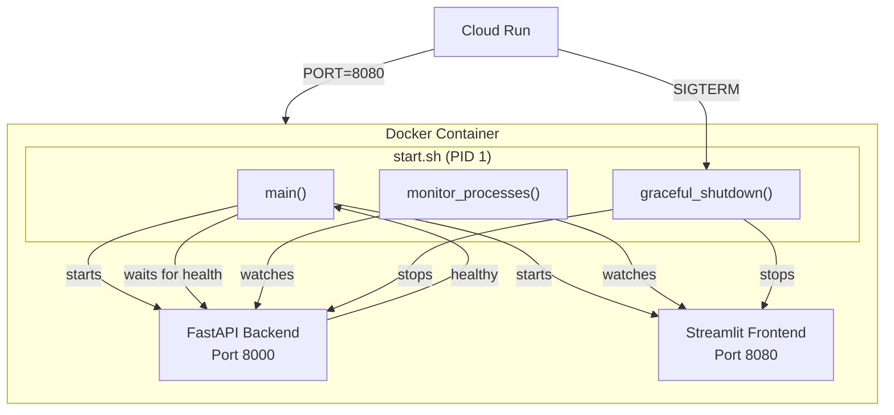
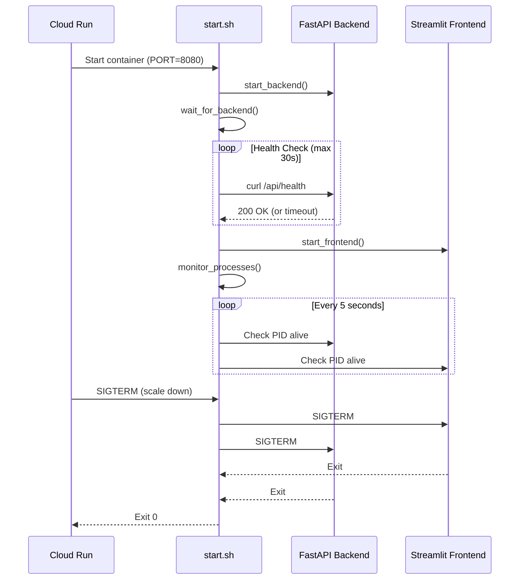

# Entrypoint Script Explained

This document provides a detailed breakdown of the `scripts/start.sh` entrypoint script, which is the main process manager for running ElevenDops in a Cloud Run container.

---

## What Is an Entrypoint Script?

An **entrypoint script** is the first command that runs when a Docker container starts. In Cloud Run, this script is responsible for:

1. Starting all required services (backend + frontend)
2. Health checking to ensure services are ready
3. Process monitoring and automatic restarts
4. Graceful shutdown handling

> [!NOTE]
> Cloud Run expects a **single process** to handle the container's lifecycle. Our entrypoint script manages multiple internal processes while presenting as one unified process to Cloud Run.

---

## Architecture Overview



---

## Script Breakdown

### 1. Configuration Variables

```bash
BACKEND_PORT=8000
FRONTEND_PORT=${PORT:-8501}
HEALTH_CHECK_TIMEOUT=30
HEALTH_CHECK_INTERVAL=1
MONITOR_INTERVAL=5
MAX_RESTART_ATTEMPTS=3
```

| Variable                | Default         | Description                                        |
| ----------------------- | --------------- | -------------------------------------------------- |
| `BACKEND_PORT`          | 8000            | Internal port for FastAPI (not exposed externally) |
| `FRONTEND_PORT`         | `$PORT` or 8501 | Cloud Run injects `PORT` env var (usually 8080)    |
| `HEALTH_CHECK_TIMEOUT`  | 30s             | Max time to wait for backend startup               |
| `HEALTH_CHECK_INTERVAL` | 1s              | Time between health check attempts                 |
| `MONITOR_INTERVAL`      | 5s              | Time between process liveness checks               |
| `MAX_RESTART_ATTEMPTS`  | 3               | Max restarts before giving up                      |

> [!IMPORTANT]
> Cloud Run injects the `PORT` environment variable. The script uses `${PORT:-8501}` to default to 8501 for local testing but uses Cloud Run's port in production.

---

### 2. Starting the Backend

```bash
start_backend() {
    log_info "Starting FastAPI backend on port $BACKEND_PORT..."
    uvicorn backend.main:app --host 0.0.0.0 --port $BACKEND_PORT &
    BACKEND_PID=$!
    log_info "Backend started with PID $BACKEND_PID"
}
```

**Key points:**

- Uses `&` to run in background (non-blocking)
- Captures PID with `$!` for later monitoring
- Binds to `0.0.0.0` (all interfaces) for container networking

---

### 3. Health Check Before Frontend

```bash
wait_for_backend() {
    log_info "Waiting for backend to be ready..."
    local attempts=0

    while [ $attempts -lt $HEALTH_CHECK_TIMEOUT ]; do
        if curl -s http://localhost:$BACKEND_PORT/api/health > /dev/null 2>&1; then
            log_info "Backend is ready and healthy"
            return 0
        fi
        attempts=$((attempts + 1))
        sleep $HEALTH_CHECK_INTERVAL
    done

    log_error "Backend failed to start within $HEALTH_CHECK_TIMEOUT seconds"
    return 1
}
```

**Why is this important?**

The Streamlit frontend needs to communicate with the FastAPI backend. Starting the frontend before the backend is ready would cause:

- Connection refused errors
- Poor user experience (blank pages)
- Health check failures

> [!TIP]
> The `/api/health` endpoint is specifically designed for this purpose. It returns a quick response indicating whether the backend and its dependencies (Firestore, GCS) are ready.

---

### 4. Starting the Frontend

```bash
start_frontend() {
    log_info "Starting Streamlit frontend on port $FRONTEND_PORT..."
    streamlit run streamlit_app/app.py \
        --server.port=$FRONTEND_PORT \
        --server.address=0.0.0.0 \
        --server.headless=true \
        --browser.gatherUsageStats=false &
    FRONTEND_PID=$!
    log_info "Frontend started with PID $FRONTEND_PID"
}
```

**Streamlit flags explained:**

| Flag                               | Purpose                                   |
| ---------------------------------- | ----------------------------------------- |
| `--server.port`                    | Listen on the Cloud Run `PORT`            |
| `--server.address=0.0.0.0`         | Accept connections from any IP            |
| `--server.headless=true`           | Don't try to open a browser (server mode) |
| `--browser.gatherUsageStats=false` | Disable telemetry                         |

---

### 5. Process Monitoring

```bash
monitor_processes() {
    while [ "$SHUTDOWN_REQUESTED" = false ]; do
        # Check backend
        if ! is_process_running $BACKEND_PID; then
            if [ $BACKEND_RESTART_COUNT -lt $MAX_RESTART_ATTEMPTS ]; then
                log_warn "Backend died, restarting..."
                BACKEND_RESTART_COUNT=$((BACKEND_RESTART_COUNT + 1))
                start_backend
                wait_for_backend
            else
                log_error "Backend exceeded max restarts, exiting..."
                graceful_shutdown
            fi
        fi

        # Check frontend (similar logic)
        # ...

        sleep $MONITOR_INTERVAL
    done
}
```

**Self-healing behavior:**

1. Every 5 seconds, check if processes are alive
2. If a process dies, restart it (up to 3 times)
3. If restarts exhausted, trigger graceful shutdown
4. Cloud Run will then restart the entire container

---

### 6. Graceful Shutdown

```bash
graceful_shutdown() {
    log_info "Received shutdown signal, initiating graceful shutdown..."
    SHUTDOWN_REQUESTED=true

    # Send SIGTERM to both processes
    if [ -n "$FRONTEND_PID" ] && kill -0 $FRONTEND_PID 2>/dev/null; then
        kill -TERM $FRONTEND_PID 2>/dev/null || true
    fi

    if [ -n "$BACKEND_PID" ] && kill -0 $BACKEND_PID 2>/dev/null; then
        kill -TERM $BACKEND_PID 2>/dev/null || true
    fi

    # Wait up to 10 seconds, then force kill
    # ...

    log_info "Shutdown complete"
    exit 0
}

# Register signal handlers
trap graceful_shutdown SIGTERM SIGINT SIGQUIT
```

**Why graceful shutdown matters:**

| Signal    | Source                 | Action                          |
| --------- | ---------------------- | ------------------------------- |
| `SIGTERM` | Cloud Run scaling down | Graceful shutdown (10s timeout) |
| `SIGINT`  | Ctrl+C in terminal     | Graceful shutdown               |
| `SIGQUIT` | System request         | Graceful shutdown               |

> [!CAUTION]
> Cloud Run gives containers **10 seconds** to shut down after sending SIGTERM. If the container doesn't exit in time, it receives SIGKILL (forced termination). Our script handles this by waiting up to 10 seconds, then force-killing remaining processes.

---

### 7. Main Execution Flow

```bash
main() {
    log_info "ElevenDops Cloud Run Process Manager"

    # 1. Start backend first
    start_backend

    # 2. Wait for backend to be healthy
    if ! wait_for_backend; then
        log_error "Backend failed to start, exiting..."
        exit 1
    fi

    # 3. Start frontend after backend is ready
    start_frontend

    log_info "All services started successfully"

    # 4. Enter monitoring loop (runs forever until shutdown)
    monitor_processes
}

main
```

---

## Environment Variables

The script itself doesn't read database configuration. Instead, it starts `uvicorn` which loads the Python application, which then reads environment variables:

```
Cloud Run (--set-env-vars)
    ↓
Container Environment
    ↓
start.sh (starts uvicorn)
    ↓
Python (backend/config.py reads env vars)
    ↓
Firestore/GCS services use configuration
```

| Environment Variable    | Read By       | Purpose                       |
| ----------------------- | ------------- | ----------------------------- |
| `PORT`                  | start.sh      | Cloud Run's required port     |
| `GOOGLE_CLOUD_PROJECT`  | Python config | GCP Project ID                |
| `FIRESTORE_DATABASE_ID` | Python config | Firestore database name       |
| `GCS_BUCKET_NAME`       | Python config | Cloud Storage bucket          |
| `ELEVENLABS_API_KEY`    | Python config | API key (from Secret Manager) |

---

## Sequence Diagram



---

## Local Testing

You can test the entrypoint script locally (on Linux/WSL):

```bash
# Set required environment variables
export PORT=8080
export GOOGLE_CLOUD_PROJECT=elevendops-dev
export FIRESTORE_DATABASE_ID=elevendops-db
export GCS_BUCKET_NAME=elevendops-bucket

# Run the script
./scripts/start.sh
```

> [!NOTE]
> On Windows, use WSL or run the services separately with the PowerShell scripts (`start_server.ps1`).

---

## Related Documents

- [Docker Container Structure](./06--docker-container-structure.md)
- [Environment Variable Injection](./08--environment-variable-injection.md)
- [Deploy to Cloud Run](../../development-guide/guide--04-deploy-to-cloud-run.md)

---

[← Back to Cloud Run Deployment Strategy](./index.md)
