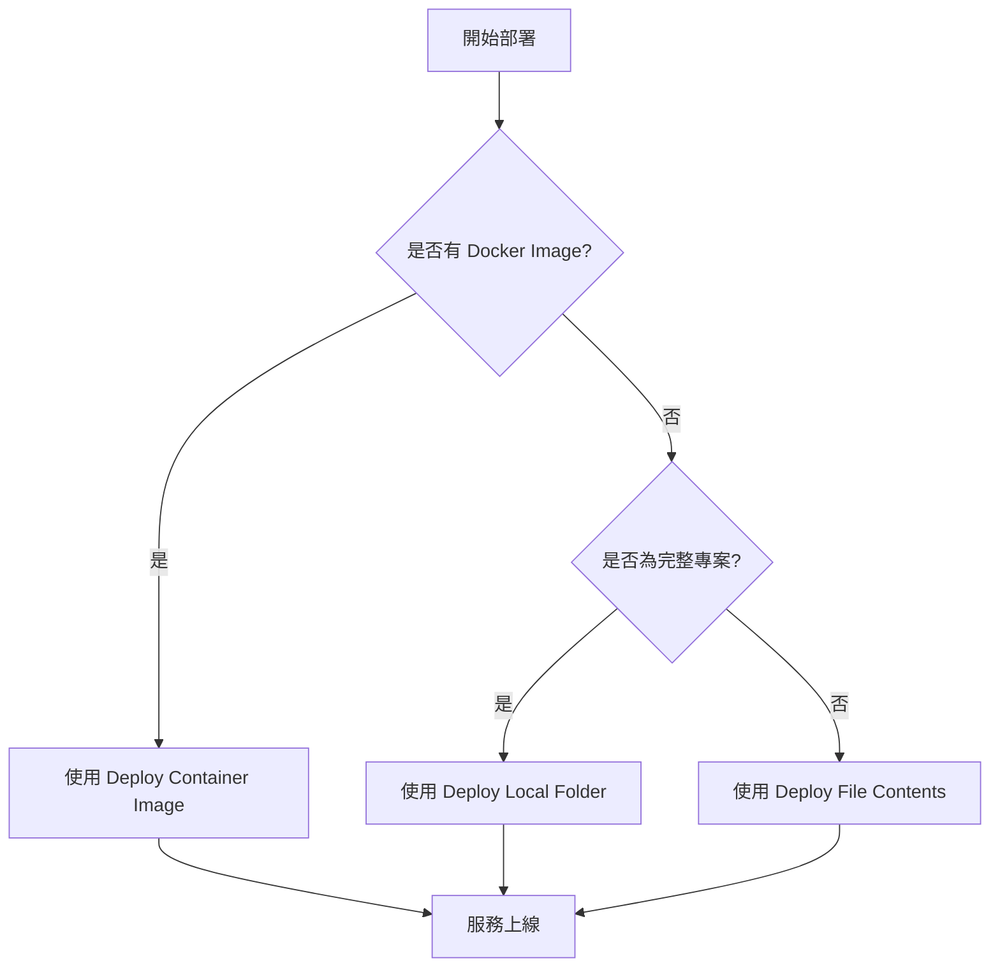

# 部署工作流程

## 關鍵字

- **Container Deployment**：直接部署既有的 Docker Image。
- **Source Deployment**：從原始碼直接構建並部署。
- **Rapid Prototyping**：快速部署單一檔案或腳本進行驗證。

## 學習目標

完成本章節後，您將能夠：

1. 了解三種不同的部署模式。
2. 使用 MCP 將本地資料夾部署到 Cloud Run。
3. 快速部署單一檔案應用程式。

## 步驟說明

### 步驟 1：標準容器部署 (Deploy Container Image)

#### 我們在做什麼？

使用 `cloudrun_deploy_container_image` 工具，將已經存在於 Artifact Registry 或 Docker Hub (需公開) 的映像檔部署到 Cloud Run。

#### 為什麼需要這樣做？

這是最標準的生產環境部署方式。通常 CI/CD 流程會先建立 Image，開發者或 Agent 再觸發部署。

#### 應用範例

> "將 `gcr.io/my-project/my-app:v1` 部署到 `us-central1`"

### 步驟 2：原始碼資料夾部署 (Deploy Local Folder)

#### 我們在做什麼？

使用 `cloudrun_deploy_local_folder` 工具，將本地工作目錄直接打包上傳並部署。

#### 為什麼需要這樣做？

適合開發階段的快速迭代。您不需要手動寫 Dockerfile (Cloud Buildpack 會自動偵測)，也不用自己執行 docker build 和 push。

#### 注意事項

- 確保目錄中有 `requirements.txt` (Python) 或 `package.json` (Node.js) 等依賴文件，以便 Buildpack 識別。
- 專案根目錄最好設定好 `.gcloudignore` 避免上傳不必要的檔案。

### 步驟 3：極速單檔部署 (Deploy File Contents)

#### 我們在做什麼？

使用 `cloudrun_deploy_file_contents` 工具，直接提供檔案內容（例如一個簡單的 `main.py`）進行部署。

#### 為什麼需要這樣做？

這是 MCP 獨有的便捷功能，非常適合 LLM 生成的小工具或測試腳本。您甚至不需要在本地存檔，Agent 可以直接將記憶體中的程式碼部署上雲。

#### 應用範例

> "寫一個簡單的回顯 (Echo) Server 並直接部署到 Cloud Run 讓我測試"

## 流程圖：選擇部署策略

## 常見問題 Q&A

### Q1：直接從原始碼部署會比較慢嗎？

**答：** 會。因為 Cloud Run 需要先透過 Cloud Build 將原始碼構建為 Container。第一次部署會花費較多時間，後續若是增量構建則會快一點。

### Q2：我怎麼知道部署成功了？

**答：** MCP 工具會在部署完成後回傳服務的 URL。您也可以使用 `get_service` 來再次確認狀態。

## 重點整理

| 方法                | 適用場景        | 優點                             |
| ------------------- | --------------- | -------------------------------- |
| **Container Image** | 正式環境、CI/CD | 穩定、可預測、版本控制明確       |
| **Local Folder**    | 開發測試、Demo  | 無需手動 Docker 流程，快速上手   |
| **File Contents**   | 概念驗證 (PoC)  | 極致快速，完全不需要本地檔案管理 |

---

[⬅️ 返回 Cloud Run MCP 索引](./index.md)
