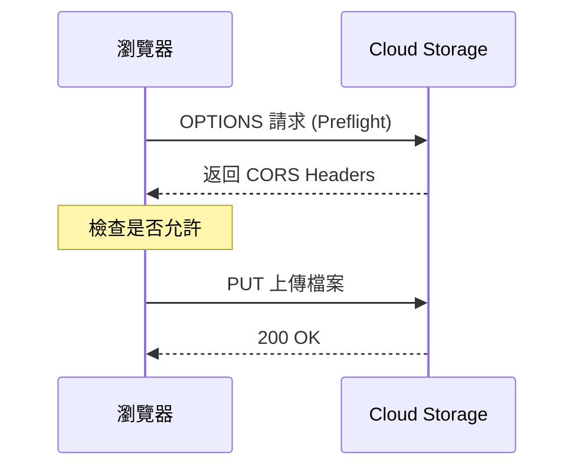

# Bucket 配置與管理

## 關鍵字

- **Bucket**：GCS 中儲存物件 (Object) 的容器，類似資料夾。
- **Lifecycle Rule (生命週期規則)**：自動管理物件的規則（如自動刪除或變更 Storage Class）。
- **CORS (Cross-Origin Resource Sharing)**：允許網頁跨網域存取資源的安全機制。

## 學習目標

完成本章節後，您將能夠：

1. 建立並配置 GCS Bucket
2. 設定生命週期規則自動管理物件
3. 配置 CORS 讓前端可直接上傳檔案

## 步驟說明

### 步驟 1：建立 Bucket

#### 我們在做什麼？

使用 GCP Console 或 `gsutil` 建立儲存空間。

#### 為什麼需要這樣做？

Bucket 是所有物件的容器，名稱必須**全球唯一**。

#### 命令列範例

```bash
# 建立 Bucket (區域為 us-central1)
gsutil mb -l us-central1 gs://elevendops-audio-dev-yourname

# 查看 Bucket 列表
gsutil ls

# 查看特定 Bucket 內容
gsutil ls gs://elevendops-audio-dev-yourname
```

### 步驟 2：設定生命週期規則

#### 我們在做什麼？

自動化物件管理，例如：30 天後自動刪除暫存檔案。

#### 為什麼需要這樣做？

避免儲存成本無限增長，特別是 Log 或暫存檔案。

#### 配置範例 (JSON)

```json
{
  "lifecycle": {
    "rule": [
      {
        "action": { "type": "Delete" },
        "condition": {
          "age": 30,
          "matchesPrefix": ["temp/", "logs/"]
        }
      },
      {
        "action": { "type": "SetStorageClass", "storageClass": "NEARLINE" },
        "condition": {
          "age": 90,
          "matchesPrefix": ["archive/"]
        }
      }
    ]
  }
}
```

```bash
# 套用生命週期規則
gsutil lifecycle set lifecycle.json gs://your-bucket-name
```

### 步驟 3：配置 CORS

#### 我們在做什麼？

允許前端網頁直接上傳檔案到 GCS Bucket。

#### 為什麼需要這樣做？

瀏覽器的同源政策 (Same-Origin Policy) 預設會阻擋跨網域請求。CORS 配置告訴瀏覽器「允許這些來源存取」。

#### CORS 配置範例 (JSON)

```json
[
  {
    "origin": ["http://localhost:8501", "https://your-app.web.app"],
    "method": ["GET", "PUT", "POST", "DELETE"],
    "responseHeader": ["Content-Type", "Authorization"],
    "maxAgeSeconds": 3600
  }
]
```

```bash
# 套用 CORS 配置
gsutil cors set cors.json gs://your-bucket-name

# 查看目前 CORS 設定
gsutil cors get gs://your-bucket-name
```

#### 流程圖



## 常見問題 Q&A

### Q1：Bucket 名稱有什麼限制？

**答：** 必須全球唯一、只能包含小寫字母、數字、連字號 (-)，長度 3-63 字元。

### Q2：刪除 Bucket 前需要清空嗎？

**答：** 是的。Bucket 必須為空才能刪除。可用 `gsutil rm -r gs://bucket-name/**` 先清空。

## GCS 底層冷知識 (Critical GCS Facts)

### 1. 物件不可變性 (Object Immutability)

在 GCS 中，物件一旦寫入就**不能修改**。

- **「修改」檔案**：實際上是直接**覆蓋 (Overwrite)**，產生一個全新的物件。
- **Versioning 如何運作**：當你開啟 Versioning 後，不論是「刪除」還是「覆蓋」，舊的版本都會被保留下來（標記為 Noncurrent）。這就是為什麼開啟 Versioning 會讓儲存成本在頻繁更新時快速上升的原因。

### 2. 區域鎖定 (Region Lock)

Bucket 的**地區 (Location) 一旦建立就無法修改**。

- **如果選錯了怎麼辦？**：你必須建立一個新區域的 Bucket，將資料搬移過去，然後刪除舊的。因此在建立時務必確認區域（如美國選 `us-central1`）。

## 重點整理

| 概念          | 說明           | 注意事項         |
| ------------- | -------------- | ---------------- |
| **Bucket**    | 物件容器       | 名稱全球唯一     |
| **Lifecycle** | 自動化物件管理 | 可節省成本       |
| **CORS**      | 跨網域存取配置 | 前端直傳必須設定 |

---

## 參考程式碼來源

| 檔案路徑                              | 說明                |
| ------------------------------------- | ------------------- |
| `backend/services/storage_service.py` | Bucket 初始化與操作 |

---

[⬅️ 返回 Cloud Storage (GCS) 深度解析索引](./index.md)
