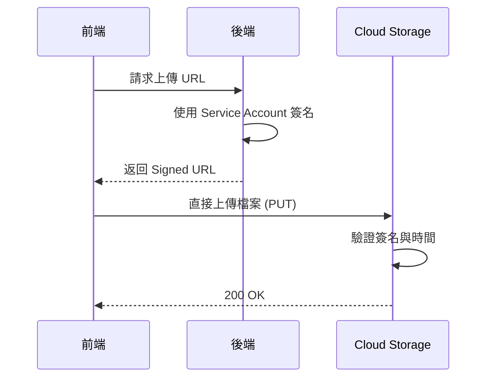

# Signed URLs 與安全存取

## 關鍵字

- **Signed URL**：帶有簽名驗證的臨時 URL，允許無需登入即可存取私有物件。
- **Expiration (過期時間)**：Signed URL 的有效期限。
- **IAM vs Signed URL**：IAM 用於永久權限，Signed URL 用於臨時分享。

## 學習目標

完成本章節後，您將能夠：

1. 理解 Signed URL 的運作原理與安全性
2. 使用 Python 產生 Signed URL
3. 區分 Upload 與 Download Signed URL

## 步驟說明

### 步驟 1：理解 Signed URL 原理

#### 我們在做什麼？

Signed URL 是一種「限時通行證」，讓沒有 GCP 帳號的人也能存取 Bucket 中的私有物件。

#### 為什麼需要這樣做？

- **安全**：Bucket 可保持私有 (非公開)
- **靈活**：可控制過期時間與允許的操作 (GET/PUT)
- **無需後端代理**：前端可直接上傳/下載，減少伺服器負擔

#### 運作流程圖



### 步驟 2：產生 Download Signed URL

#### 我們在做什麼？

讓使用者可以下載私有檔案，但不需要給予永久權限。

#### 程式碼範例

```python
from google.cloud import storage
from datetime import timedelta

def generate_download_url(bucket_name: str, blob_name: str) -> str:
    """
    產生下載用的 Signed URL

    Args:
        bucket_name: Bucket 名稱
        blob_name: 物件路徑 (如 audio/file.mp3)

    Returns:
        有效期 1 小時的 Signed URL
    """
    client = storage.Client()
    bucket = client.bucket(bucket_name)
    blob = bucket.blob(blob_name)

    url = blob.generate_signed_url(
        version="v4",
        expiration=timedelta(hours=1),  # 過期時間
        method="GET"  # 僅允許下載
    )

    return url
```

### 步驟 3：產生 Upload Signed URL

#### 我們在做什麼？

讓前端可以直接上傳檔案到 GCS，無需經過後端伺服器。

#### 程式碼範例

```python
from google.cloud import storage
from datetime import timedelta

def generate_upload_url(bucket_name: str, blob_name: str, content_type: str = "audio/mpeg") -> str:
    """
    產生上傳用的 Signed URL

    Args:
        bucket_name: Bucket 名稱
        blob_name: 目標路徑
        content_type: 檔案 MIME 類型

    Returns:
        有效期 15 分鐘的 Signed URL
    """
    client = storage.Client()
    bucket = client.bucket(bucket_name)
    blob = bucket.blob(blob_name)

    url = blob.generate_signed_url(
        version="v4",
        expiration=timedelta(minutes=15),  # 上傳 URL 有效期應較短
        method="PUT",
        content_type=content_type  # 必須指定，否則上傳時會驗證失敗
    )

    return url
```

### 步驟 4：前端使用 Signed URL 上傳

#### 程式碼範例

```typescript
// 前端 TypeScript 範例
async function uploadToGCS(signedUrl: string, file: File) {
  const response = await fetch(signedUrl, {
    method: "PUT",
    headers: {
      "Content-Type": file.type, // 必須與後端指定的相同
    },
    body: file,
  });

  if (!response.ok) {
    throw new Error(`上傳失敗: ${response.status}`);
  }

  console.log("上傳成功！");
}
```

## 常見問題 Q&A

### Q1：Signed URL 洩漏怎麼辦？

**答：** 只要 URL 未過期，任何人都可以使用。因此：

1. 過期時間應設短（下載 1 小時、上傳 15 分鐘）
2. 敏感操作可加入額外驗證（如要求特定 Headers）

### Q2：在 Emulator 環境可以使用 Signed URL 嗎？

**答：** `fake-gcs-server` 支援有限的 Signed URL。本專案在 Emulator 環境改用直接存取。

## 重點整理

| 類型               | 用途         | 建議過期時間 |
| ------------------ | ------------ | ------------ |
| **GET Signed URL** | 下載私有檔案 | 1-24 小時    |
| **PUT Signed URL** | 前端直接上傳 | 5-15 分鐘    |

## 延伸閱讀

- [Signed URLs 官方文件](https://cloud.google.com/storage/docs/access-control/signed-urls)

---

## 參考程式碼來源

| 檔案路徑                                 | 說明                                  |
| ---------------------------------------- | ------------------------------------- |
| `backend/services/storage_service.py`    | 可擴展加入 `generate_signed_url` 方法 |
| `backend/services/elevenlabs_service.py` | 若有音訊分享功能可參考                |
