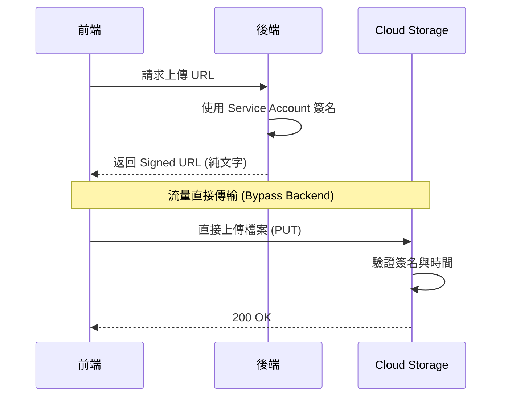
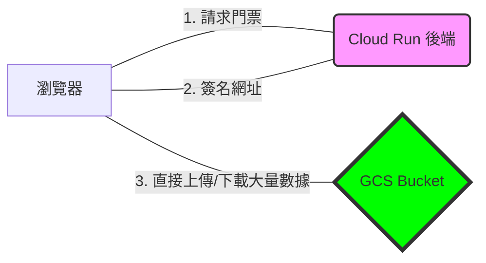

# Signed URLs 與安全存取

## 關鍵字

- **Signed URL**：帶有簽名驗證的臨時 URL，允許無需登入即可存取私有物件。
- **Expiration (過期時間)**：Signed URL 的有效期限。
- **IAM vs Signed URL**：IAM 用於永久權限，Signed URL 用於臨時分享。

## 學習目標

完成本章節後，您將能夠：

1. 理解 Signed URL 的運作原理與安全性
2. 使用 Python 產生 Signed URL
3. 區分 Upload 與 Download Signed URL

## 步驟說明

### 步驟 1：理解 Signed URL 原理

#### 我們在做什麼？

Signed URL 是一種「限時通行證」，讓沒有 GCP 帳號的人也能存取 Bucket 中的私有物件。

#### 為什麼需要這樣做？

- **安全**：Bucket 可保持私有 (非公開)
- **靈活**：可控制過期時間與允許的操作 (GET/PUT)
- **無需後端代理**：前端可直接上傳/下載，減少伺服器負擔

#### 運作流程圖



#### 流量管理 (Traffic Isolation)

下面的流程圖展示了為何使用 Signed URL 可以顯著降低後端伺服器的壓力：



### 步驟 2：產生 Download Signed URL

#### 我們在做什麼？

讓使用者可以下載私有檔案，但不需要給予永久權限。

#### 程式碼範例

```python
from google.cloud import storage
from datetime import timedelta

def generate_download_url(bucket_name: str, blob_name: str) -> str:
    """
    產生下載用的 Signed URL

    Args:
        bucket_name: Bucket 名稱
        blob_name: 物件路徑 (如 audio/file.mp3)

    Returns:
        有效期 1 小時的 Signed URL
    """
    client = storage.Client()
    bucket = client.bucket(bucket_name)
    blob = bucket.blob(blob_name)

    url = blob.generate_signed_url(
        version="v4",
        expiration=timedelta(hours=1),  # 過期時間
        method="GET"  # 僅允許下載
    )

    return url
```

### 步驟 3：產生 Upload Signed URL

#### 我們在做什麼？

讓前端可以直接上傳檔案到 GCS，無需經過後端伺服器。

#### 程式碼範例

```python
from google.cloud import storage
from datetime import timedelta

def generate_upload_url(bucket_name: str, blob_name: str, content_type: str = "audio/mpeg") -> str:
    """
    產生上傳用的 Signed URL

    Args:
        bucket_name: Bucket 名稱
        blob_name: 目標路徑
        content_type: 檔案 MIME 類型

    Returns:
        有效期 15 分鐘的 Signed URL
    """
    client = storage.Client()
    bucket = client.bucket(bucket_name)
    blob = bucket.blob(blob_name)

    url = blob.generate_signed_url(
        version="v4",
        expiration=timedelta(minutes=15),  # 上傳 URL 有效期應較短
        method="PUT",
        content_type=content_type  # 必須指定，否則上傳時會驗證失敗
    )

    return url
```

### 步驟 4：前端使用 Signed URL 上傳

#### 程式碼範例

```typescript
// 前端 TypeScript 範例
async function uploadToGCS(signedUrl: string, file: File) {
  const response = await fetch(signedUrl, {
    method: "PUT",
    headers: {
      "Content-Type": file.type, // 必須與後端指定的相同
    },
    body: file,
  });

  if (!response.ok) {
    throw new Error(`上傳失敗: ${response.status}`);
  }

  console.log("上傳成功！");
}
```

### 步驟 5：本地開發環境測試 Signed URL

#### 我們在做什麼？

在本地環境 (Localhost) 模擬生產環境的簽章行為，以確保 Signed URL 產生邏輯正確。

#### 為什麼需要這樣做？

預設的 `gcloud auth application-default login` 僅提供使用者憑證 (User Credentials)，**不包含私鑰 (Private Key)**，因此無法在本地產生 Signed URL。我們需要手動掛載 Service Account Key。

#### 操作步驟

1.  **下載 Key**：前往 [GCP 控制台 > IAM > 服務帳號](https://console.cloud.google.com/iam-admin/serviceaccounts)，點擊進入您的服務帳號並建立一把 JSON 金鑰。
2.  **設定環境變數**：

    ```bash
    # .env
    # 指向您的 JSON Key 路徑
    GOOGLE_APPLICATION_CREDENTIALS="C:\path\to\your\service-account-key.json"
    ```

3.  **驗證**：重啟後端，程式碼中的 `blob.generate_signed_url()` 將會自動抓取該 Key 並成功簽章。

詳細的服務帳號建立流程，請參考：[服務帳號設定指南](../../development-guide/guide--service-account-setup.md)。

> [!WARNING] > **安全提醒**：請務必將 JSON Key 檔案加入 `.gitignore`，**絕對不要**提交到 Git Repo 中！

## 常見問題 Q&A

### Q1：Signed URL 洩漏怎麼辦？

**答：** 只要 URL 未過期，任何人都可以使用。因此：

1. 過期時間應設短（下載 1 小時、上傳 15 分鐘）
2. 敏感操作可加入額外驗證（如要求特定 Headers）

### Q3：使用 Signed URL 會增加 Cloud Run 的流量費用嗎？

**答：** **不會。** 這是 Signed URL 的核心價值：

- **後端 (Cloud Run)**：只負責簽發「門票（純文字網址）」，大小僅為幾百個 Bytes。
- **數據傳輸**：實際的檔案數據（大流量）是直接在 **瀏覽器** 與 **GCS** 之間流動的。
- **結論**：Cloud Run 的 Data Egress（數據流出）費率完全不會因為檔案傳輸而增加。

### Q2：在 Emulator 環境可以使用 Signed URL 嗎？

**答：** `fake-gcs-server` 支援有限的 Signed URL。本專案在 Emulator 環境改用直接存取。

### Q4：其他雲端平台也有 Signed URL 嗎？

**答：有**，Signed URL 是雲端存儲的通用模式，只是名稱略有不同：

| 平台              | 名稱          | API 相容性               | 特色                           |
| :---------------- | :------------ | :----------------------- | :----------------------------- |
| **GCP**           | Signed URL    | Google Cloud Storage API | 整合 IAM，支援 V4 簽章         |
| **AWS**           | Presigned URL | S3 API                   | 行業標準，生態系最豐富         |
| **Cloudflare R2** | Presigned URL | **S3 API 相容**          | 無流量費，使用 AWS SDK 即可    |
| **Azure**         | SAS Token     | Azure Storage API        | 權限控制粒度最細 (IP/Protocol) |

因此，您在這裡學到的架構模式是可以跨平台遷移的。

### Q5：如果後端在 GCP 但檔案在 Cloudflare R2，Signed URL 怎麼運作？

**答：這就是強大的「多雲架構 (Multi-cloud)」應用。**

當您在 GCP (Cloud Run) 簽署 R2 的網址後：

1. **流量繞過 GCP (Bypass)**：音訊大流量直接從 **Cloudflare R2 → 使用者瀏覽器**。
2. **節省成本**：利用 Cloudflare R2 的 **0 流量費 (Zero Egress)** 特性，徹底免除 GCP 昂貴的出站流量費用。
3. **分工明確**：GCP 負責運算與邏輯，Cloudflare 負責廉價且高效的儲存分發。

```mermaid
    User->>GCP: 1. 請求音訊
    GCP->>GCP: 2. 簽署 R2 URL
    GCP-->>User: 3. 回傳 Signed URL
    User->>R2: 4. 直接請求檔案 (GET)
    R2-->>User: 5. 傳送數據 (0 流量費)
```

### Q6：Cloud Run 上也需要上傳 JSON Key 嗎？

**答：不需要，且不應該這樣做。**

在 Cloud Run 等 GCP 環境，應使用 **Managed Identity (託管識別)**，也就是直接指派服務帳號給 Cloud Run 服務。

#### 設定步驟：

1.  前往 **[Google Cloud Console > Cloud Run](https://console.cloud.google.com/run)**。
2.  點擊您的服務名稱（例如 `elevendops-backend`）進入詳情頁。
3.  點擊上方的 **「EDIT & DEPLOY NEW REVISION (編輯並部署新版本)」**。
4.  捲動到頁面底部，找到並展開 **「Security (安全性)」** 區塊。
5.  在 **「Service account (服務帳號)」** 下拉選單中：
    - 預設可能是 `Compute Engine default service account`。
    - **請改選您剛剛建立的那個服務帳號** (例如 `elevendops-dev@...`)。
6.  點擊底部的 **「DEPLOY (部署)」**。

部署完成後，您的 Cloud Run 就會自動擁有該服務帳號的所有權限（讀寫 Firestore 與 GCS），完全不需另外設定 Key！

本地開發使用 JSON Key 是為了「模擬」雲端環境的權限；真正上雲後，請讓雲端環境接手管理。

## 重點整理

| 類型               | 用途         | 建議過期時間 |
| ------------------ | ------------ | ------------ |
| **GET Signed URL** | 下載私有檔案 | 1-24 小時    |
| **PUT Signed URL** | 前端直接上傳 | 5-15 分鐘    |

## 延伸閱讀

- [Signed URLs 官方文件](https://cloud.google.com/storage/docs/access-control/signed-urls)
- [服務帳號設定指南](../../development-guide/guide--service-account-setup.md)
- [GCS 儲存瀏覽器 (Console)](https://console.cloud.google.com/storage/browser)
- [Firestore 資料庫 (Console)](https://console.cloud.google.com/firestore)

---

## 參考程式碼來源

| 檔案路徑                                 | 說明                                  |
| ---------------------------------------- | ------------------------------------- |
| `backend/services/storage_service.py`    | 可擴展加入 `generate_signed_url` 方法 |
| `backend/services/elevenlabs_service.py` | 若有音訊分享功能可參考                |

---

[⬅️ 返回 Cloud Storage (GCS) 深度解析索引](./index.md)
