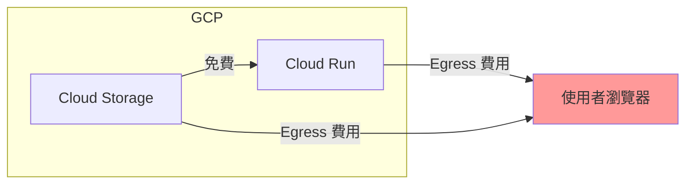

# 儲存成本優化

## 關鍵字

- **Storage Class**：GCS 提供的不同儲存等級，效能與成本各異。
- **Egress (出口流量)**：從 GCS 下載資料到外部網路的流量費用。
- **Object Versioning (版本控制)**：保留物件的歷史版本。

## 學習目標

完成本章節後，您將能夠：

1. 選擇適合的 Storage Class
2. 理解跨區域流量成本
3. 實施成本優化策略

## 步驟說明

### 步驟 1：理解 Storage Class

#### 我們在做什麼？

Storage Class 決定了資料的存取速度與儲存成本。

#### 為什麼需要這樣做？

不同資料有不同的存取頻率。熱資料用 Standard，冷資料用 Archive，可節省大量成本。

#### 比較表

| Storage Class | 儲存成本 | 存取成本 | 適用情境           |
| ------------- | -------- | -------- | ------------------ |
| **Standard**  | 最高     | 最低     | 頻繁存取的熱資料   |
| **Nearline**  | 中低     | 中       | 每月存取少於 1 次  |
| **Coldline**  | 低       | 高       | 每季存取少於 1 次  |
| **Archive**   | 最低     | 最高     | 年度備份、合規保存 |

### 步驟 2：理解 Egress 費用

#### 我們在做什麼？

下載資料到 GCP 外部會產生「出口流量費」，這通常是最大的成本來源。

#### 成本結構圖



#### 優化策略

1. **使用 CDN**：透過 Cloud CDN 快取靜態資源，減少 GCS 出口
2. **選擇近使用者的區域**：如台灣使用者優先選 `asia-east1`
3. **壓縮資料**：上傳前壓縮音訊/圖片

### 步驟 3：設定生命週期降級

#### 我們在做什麼？

自動將老舊資料從 Standard 降級為 Nearline/Coldline。

#### 程式碼範例

```json
{
  "lifecycle": {
    "rule": [
      {
        "action": {
          "type": "SetStorageClass",
          "storageClass": "NEARLINE"
        },
        "condition": {
          "age": 30,
          "matchesPrefix": ["audio/"]
        }
      },
      {
        "action": {
          "type": "SetStorageClass",
          "storageClass": "COLDLINE"
        },
        "condition": {
          "age": 180,
          "matchesPrefix": ["audio/"]
        }
      }
    ]
  }
}
```

## 常見問題 Q&A

### Q1：Archive Class 有最低保存期嗎？

**答：** 是的。Archive 有 365 天最低保存期，提早刪除會收取提前刪除費。

### Q2：如何估算月費用？

**答：** 使用 [GCP Pricing Calculator](https://cloud.google.com/products/calculator)，輸入儲存量、存取頻率和出口流量。

### Q3：GCS 有免費額度嗎？

**答：** 有，但有**區域限制**：

- **額度**：每月 5 GB 的標準儲存量 (Standard Storage)。
- **限制區域**：僅限 `us-central1`、`us-east1`、`us-west1`。
- **注意**：如果您選擇 `asia-east1` (台灣)，則**不適用**免費額度，但費用非常低（約每 GB $0.02 USD/月）。

### Q4：Versioning (版本控制) 什麼時候會啟動？

**答：** 只有在建立 Bucket 時手動勾選，或事後在設定中開啟才會啟動。

- **副作用**：一旦啟動，每次覆蓋或刪除檔案都會保留舊版本並「加倍計費」。
- **建議**：開發環境強烈建議**不啟動**。

## 重點整理

| 策略                       | 節省來源    | 實施難度 |
| -------------------------- | ----------- | -------- |
| **選擇正確 Storage Class** | 儲存費用    | 低       |
| **生命週期自動降級**       | 儲存費用    | 中       |
| **使用 CDN**               | Egress 費用 | 中       |
| **區域選擇**               | Egress 費用 | 低       |

## 延伸閱讀

- [Cloud Storage Pricing](https://cloud.google.com/storage/pricing)
- [本專案 Firestore 區域成本分析](../firestore-editions/04--cost-optimization.md)

---

## 參考程式碼來源

| 檔案路徑            | 說明                                |
| ------------------- | ----------------------------------- |
| `backend/config.py` | 可查看 `GCS_BUCKET_NAME` 等環境變數 |

---

[⬅️ 返回 Cloud Storage (GCS) 深度解析索引](./index.md)
