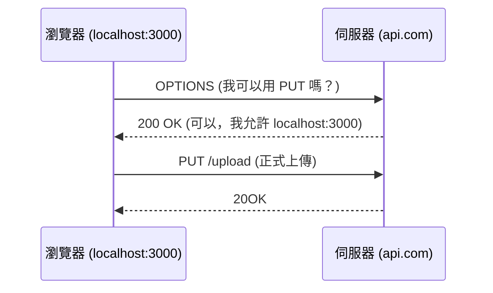

# CORS (Cross-Origin Resource Sharing) 與同源政策

## 關鍵字

- **SOP (Same-Origin Policy)**：瀏覽器的安全性基礎，限制不同來源的存取。
- **Origin (來源)**：協定 + 網域 + 埠號 的組合。
- **Preflight Request (預檢請求)**：送出真正請求前的 `OPTIONS` 詢問。
- **Access-Control-Allow-Origin**：伺服器用來告訴瀏覽器「誰可以存取」的回應表頭。

## 什麼是同源政策 (SOP)？

同源政策是瀏覽器的核心安全機制。它規定一個來源的腳本（如 JavaScript）預設只能存取與自己**同源**的資源。

**何謂同源？**

- `https://app.com/a` 與 `https://app.com/b` -> **同源** ✅
- `http://app.com` 與 `https://app.com` -> **不同源**（協定不同） ❌
- `https://app.com` 與 `https://api.app.com` -> **不同源**（子網域不同） ❌
- `http://localhost:3000` 與 `http://localhost:8000` -> **不同源**（埠號不同） ❌

---

## CORS 如何解決跨來源問題？

CORS 允許伺服器「放寬」同源政策。當瀏覽器發現跨來源請求時，它會先檢查伺服器是否允許該請求。

### 1. 簡單請求 (Simple Request)

直接發送請求，並檢查回應中的 `Access-Control-Allow-Origin`。

### 2. 預檢請求 (Preflight Request)

對於具備副作用（如 `PUT`, `DELETE`）或包含特殊表頭（如 `application/json`）的請求，瀏覽器會先送出 **OPTIONS** 請求。



---

## 實作：如何配置 CORS？

在我們的專案中，主要有兩個地方需要設定：

### A. Cloud Storage (GCS)

當前端使用 JavaScript 直接上傳或下載 GCS 物件時，必須設定 Bucket 的 CORS。

**1. 建立 `cors-json-file.json`:**

```json
[
  {
    "origin": ["http://localhost:3000", "https://your-domain.com"],
    "method": ["GET", "PUT", "POST", "DELETE", "HEAD"],
    "responseHeader": ["Content-Type", "x-goog-resumable"],
    "maxAgeSeconds": 3600
  }
]
```

**2. 使用 gsutil 套用:**

```bash
gsutil cors set cors-json-file.json gs://your-bucket-name
```

### B. FastAPI 後端

如果前端 (React/Vite) 呼叫後端 API，需在 FastAPI 中配置 `CORSMiddleware`。

```python
from fastapi.middleware.cors import CORSMiddleware

app.add_middleware(
    CORSMiddleware,
    allow_origins=["http://localhost:3000"],
    allow_credentials=True,
    allow_methods=["*"],
    allow_headers=["*"],
)
```

---

## ElevenDops 系統目前設計分析

本專案已實作了自動化且集中的 CORS 管理機制，主要分布在以下檔案：

### 1. 後端 API 層 (`backend/main.py`)

在 `main.py` 中，我們使用了 FastAPI 的 `CORSMiddleware` 並配合中心化的配置：

```python
# CORS configuration - managed by centralized config
CORS_ORIGINS = settings.get_cors_origins_list()

app.add_middleware(
    CORSMiddleware,
    allow_origins=CORS_ORIGINS,
    allow_credentials=True,
    allow_methods=["*"],
    allow_headers=["*"],
)
```

### 2. 配置管理 (`backend/config.py`)

CORS 來源由環境變數 `CORS_ORIGINS` 控制，並具備自動修正機制：

- **預設來源**：`http://localhost:8501` (Streamlit 預設埠號)。
- **自動補充**：系統會自動確保 `localhost:8000` 被包含在內，以支援 Cloud Run 內部的服務間通訊。

### 3. 儲存服務層 (`backend/services/storage_service.py`)

- **開發環境**：使用 Mock Storage 或 Emulator，直接透過後端 Proxy 存取檔案，避免了跨域問題。
- **生產環境**：產生 **V4 Signed URLs**。雖然簽名網址解決了權限問題，但瀏覽器端的跨域讀取仍需依賴 GCS Bucket 上的 CORS 設定。

---

## 重要安全建議

### 風險評估

| 觀察點                             | 嚴重性 | 需立即修改? | 理由                                                                                                         |
| :--------------------------------- | :----: | :---------: | :----------------------------------------------------------------------------------------------------------- |
| **GCS CORS 自動化**                | 🟡 中  |    ❌ 否    | 這是「部署便利性」問題，不是安全漏洞。目前只需在部署 GCS Bucket 時手動設定一次即可。建議納入部署 Checklist。 |
| **生產環境 `allow_methods=["*"]`** | 🟢 低  |    ❌ 否    | FastAPI 的 CORS 是白名單機制（只允許 `allow_origins` 中的來源），實際風險很低。屬於「最佳實務」層級的優化。  |
| **Streamlit 埠號依賴**             | 🟢 低  |    ❌ 否    | **已處理！** `config.py` 的 `CORS_ORIGINS` 支援逗號分隔的多來源。未來新增前端只需更新環境變數即可。          |

### 建議實務

| 觀察點               | 建議實務                                                                                   |
| :------------------- | :----------------------------------------------------------------------------------------- |
| **GCS CORS 自動化**  | 將 GCS Bucket 的 CORS 設定步驟加入部署文件（如 `guide--migrate-to-real-gcp.md`）。         |
| **生產環境起源限制** | 未來若需強化，可在生產環境中將 `allow_methods` 限制為 `["GET", "POST", "PUT", "DELETE"]`。 |
| **多前端支援**       | 若新增 React 前端，只需在 `.env` 中更新 `CORS_ORIGINS` 為逗號分隔的多個來源即可。          |

> [!TIP]
> 這些建議屬於「未來優化項目」，而非必須立即修復的問題。可作為擴展時的參考。

---

## 重點筆記

| 概念          | 說明                     | 解決方案                 |
| ------------- | ------------------------ | ------------------------ |
| **SOP**       | 瀏覽器預設阻擋跨來源請求 | 無，這是安全機制         |
| **CORS**      | 伺服器主動標示允許來源   | 設定回應表頭             |
| **Preflight** | OPTIONS 請求             | 伺服器需正確處理 OPTIONS |

---

## 相關聯結

- [01--bucket-configuration.md](./01--bucket-configuration.md)
- [02--signed-urls-and-security.md](./02--signed-urls-and-security.md)

---

[⬅️ 返回 Cloud Storage (GCS) 深度解析索引](./index.md)
