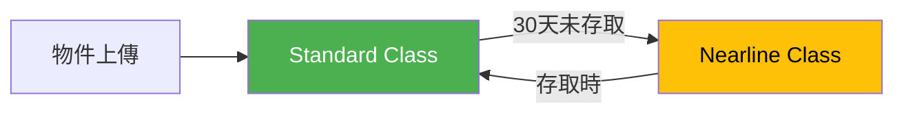
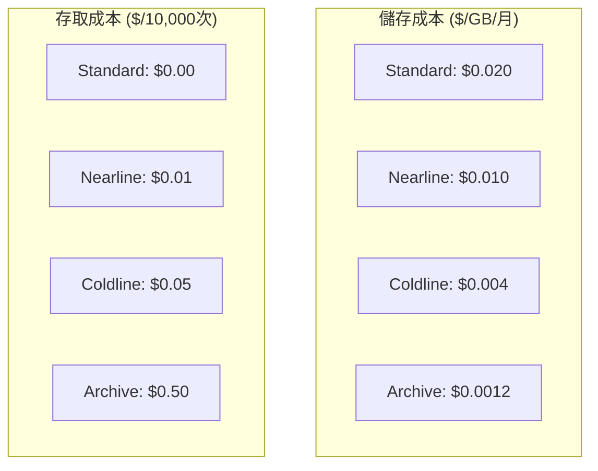
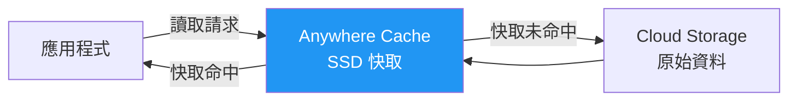
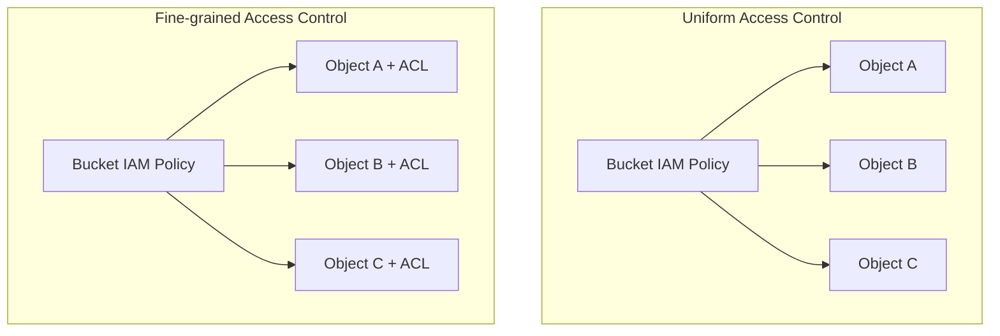
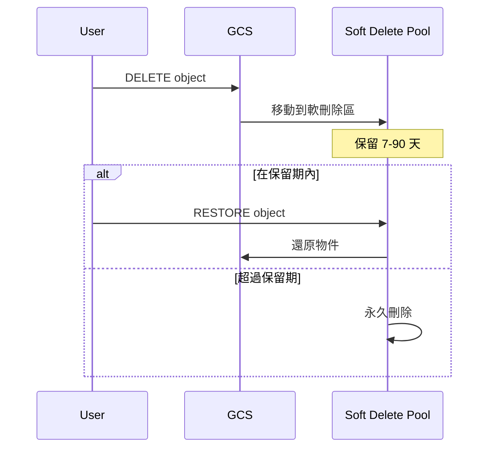
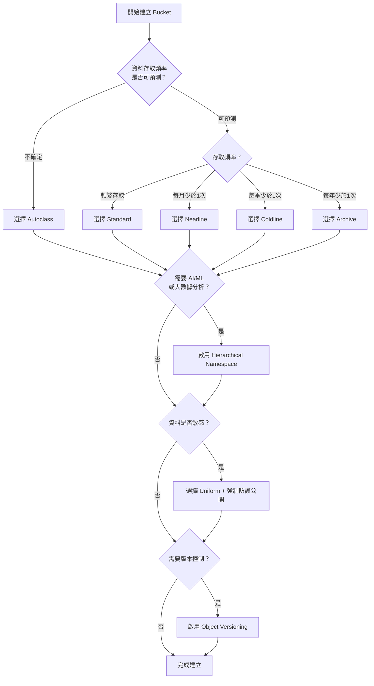

# GCP Bucket 建立選項完整指南

## 關鍵字

- **Storage Class (儲存類別)**：決定物件存取頻率與成本的分類。
- **Autoclass**：自動根據物件存取頻率調整 Storage Class 的功能。
- **Hierarchical Namespace**：檔案系統式的資料夾結構，支援原子性資料夾操作。
- **Anywhere Cache**：在特定區域內提供 SSD 快取，加速讀取效能。
- **IAM**：Google Cloud 的身分存取管理系統。
- **ACL (Access Control List)**：物件層級的存取控制清單。
- **Soft Delete**：軟刪除，刪除後仍可在指定期間內復原。
- **Object Versioning**：物件版本控制，保留物件的歷史版本。
- **Retention Policy**：保留政策，防止物件在指定期間內被刪除或修改。

## 學習目標

完成本章節後，您將能夠：

1. 理解 GCP Console 中建立 Bucket 時各選項的意義
2. 根據使用情境選擇最適合的 Storage Class
3. 了解進階功能（Hierarchical Namespace、Anywhere Cache）的適用場景
4. 正確配置存取控制與資料保護選項

---

## 1. 基本資訊設定

### Bucket 名稱

```
Name: elevendops-bucket
```

**意義：**

- Bucket 名稱在**全球必須唯一**（跨所有 GCP 專案）
- 只能使用小寫字母、數字、連字號 (-)
- 長度限制：3-63 個字元
- 建立後**無法修改**

> [!TIP]
> 建議使用專案名稱加上用途作為前綴，例如：`myproject-uploads-prod`

### 區域設定 (Location)

```
Location: us-central1 (Iowa)
Location type: Region
```

**Location Type 選項：**

| 類型             | 說明                   | 適用場景       | 成本 |
| ---------------- | ---------------------- | -------------- | ---- |
| **Region**       | 單一地理區域           | 延遲敏感型應用 | 最低 |
| **Dual-region**  | 兩個特定區域的高可用性 | 區域容錯需求   | 中等 |
| **Multi-region** | 洲際級別高可用性       | 全球分布式應用 | 最高 |

> [!IMPORTANT] > **區域一旦建立無法修改！** 如需變更，必須建立新 Bucket 並搬移資料。

---

## 2. 儲存類別 (Storage Class) 選擇

Storage Class 決定儲存成本、存取成本與服務等級。GCP 提供兩種管理方式：

### 2.1 Autoclass（自動儲存類別）

```
✓ Autoclass
Automatically transitions each object to Standard or Nearline class based on
object-level activity, to optimize for cost and latency.
```

**運作原理：**



**Autoclass 特點：**

| 優點                   | 缺點                        |
| ---------------------- | --------------------------- |
| 無需手動管理           | 僅支援 Standard ↔ Nearline  |
| 自動優化成本           | 有額外的 Autoclass 管理費用 |
| 適合存取頻率不可預測時 | 不支援 Coldline 或 Archive  |

> [!NOTE]
> Autoclass 可以隨時關閉並切換為預設類別，但反向操作（預設類別 → Autoclass）有限制。

### 2.2 手動設定預設類別 (Set a default class)

當存取模式可預測時，手動選擇更經濟：

| Storage Class | 最低儲存期限 | 適用場景                   | 儲存成本 | 存取成本 |
| ------------- | ------------ | -------------------------- | -------- | -------- |
| **Standard**  | 無           | 頻繁存取（短期儲存）       | 最高     | 最低     |
| **Nearline**  | 30 天        | 每月存取少於一次的備份     | 中等     | 中等     |
| **Coldline**  | 90 天        | 每季存取少於一次的災難復原 | 低       | 較高     |
| **Archive**   | 365 天       | 每年存取少於一次的長期保存 | 最低     | 最高     |

**成本示意圖：**



> [!WARNING] > **提前刪除收費**：若物件在最低儲存期限內被刪除，仍會收取剩餘期間的儲存費用。例如：Nearline 物件在第 10 天刪除，仍收取 30 天的儲存費。

---

## 3. 進階儲存選項

### 3.1 Hierarchical Namespace（階層式命名空間）

```
☐ Enable Hierarchical namespace on this bucket
Optimize for AI/ML and analytics with a filesystem-like hierarchical structure.
```

**傳統 Flat Namespace vs Hierarchical Namespace：**

| 特性           | Flat Namespace（傳統）     | Hierarchical Namespace     |
| -------------- | -------------------------- | -------------------------- |
| 資料夾結構     | 模擬（透過物件名稱前綴）   | 真實資料夾結構             |
| 資料夾重新命名 | 需複製所有物件後刪除原物件 | **原子性操作**（即時完成） |
| 資料夾列表效能 | 較慢（需掃描所有物件）     | **最佳化效能**             |
| 適用場景       | 一般網頁應用               | AI/ML、大數據分析          |

> [!CAUTION] > **此選項為永久設定，建立後無法關閉！** 請謹慎評估需求。

**何時需要 Hierarchical Namespace？**

- 大規模機器學習訓練（需頻繁移動資料夾）
- 資料湖 (Data Lake) 架構
- 需要與 HDFS 相容的工作流程

### 3.2 Anywhere Cache（區域快取）

```
☐ Enable Anywhere Cache
Optimize for workloads where infrequently changed data is frequently read.
```

**運作原理：**



**Anywhere Cache 特點：**

| 優點                         | 注意事項                     |
| ---------------------------- | ---------------------------- |
| 減少跨區域資料傳輸費用       | 需額外支付快取儲存費用       |
| 提升讀取延遲                 | 僅適合**讀多寫少**的工作負載 |
| 適合 ML 模型訓練、分析工作流 | 資料變更頻繁時效益降低       |

---

## 4. 存取控制設定

### 4.1 公開存取防護

```
✓ Prevent public access
☐ Enforce public access prevention on this bucket
```

**兩層防護機制：**

| 選項                                 | 說明                                    |
| ------------------------------------ | --------------------------------------- |
| **Prevent public access**            | 防止此 Bucket 被設為公開（可被覆寫）    |
| **Enforce public access prevention** | **強制**執行防護（無法被 IAM 政策覆寫） |

> [!TIP]
> 對於儲存敏感資料的 Bucket，建議啟用 **Enforce** 選項，確保即使錯誤配置 IAM 也無法公開。

### 4.2 存取控制模式

```
○ Uniform
○ Fine-grained
```

| 模式             | 說明                          | 適用場景               |
| ---------------- | ----------------------------- | ---------------------- |
| **Uniform**      | 僅使用 Bucket 層級的 IAM 權限 | 大多數現代應用（推薦） |
| **Fine-grained** | 可設定物件層級的 ACL          | 需要個別物件不同權限時 |

**Uniform vs Fine-grained 比較圖：**



> [!IMPORTANT]
> 選擇 **Uniform** 後，90 天後將**永久鎖定**，無法切換回 Fine-grained。

---

## 5. 資料保護選項

GCP 提供多層資料保護機制：

### 5.1 Soft Delete（軟刪除）

```
☐ Soft delete policy (For data recovery)
When enabled, deleted objects will be kept for a specified period and can be restored.
```

**運作方式：**



**注意：** 軟刪除的物件仍會佔用儲存空間並計費。

### 5.2 Object Versioning（版本控制）

```
☐ Object versioning (For version control)
For restoring deleted or overwritten objects.
```

**版本控制運作：**

| 操作       | 結果                                      |
| ---------- | ----------------------------------------- |
| 上傳新版本 | 舊版本標記為 Noncurrent，保留在 Bucket 中 |
| 刪除物件   | 最新版本標記為 Deleted，舊版本仍存在      |
| 還原       | 可指定特定版本還原為最新版                |

> [!WARNING]
> 版本控制會**顯著增加儲存成本**！建議搭配生命週期規則限制 Noncurrent 版本數量。

**建議的生命週期規則：**

```json
{
  "lifecycle": {
    "rule": [
      {
        "action": { "type": "Delete" },
        "condition": {
          "numNewerVersions": 3,
          "isLive": false
        }
      }
    ]
  }
}
```

### 5.3 Retention Policy（保留政策）

```
☐ Retention (For compliance)
For preventing the deletion or modification of objects for a specified period.
```

**保留政策特點：**

| 功能            | 說明                                     |
| --------------- | ---------------------------------------- |
| **防止刪除**    | 在保留期內無法刪除物件                   |
| **防止覆寫**    | 在保留期內無法修改物件                   |
| **法規遵循**    | 滿足 HIPAA、SEC 等法規的資料保留要求     |
| **Bucket Lock** | 可選擇鎖定政策，使其無法被移除（不可逆） |

> [!CAUTION]
> 啟用 **Bucket Lock** 後，保留政策**無法移除**，物件將在保留期內無法刪除。請確保符合業務需求。

---

## 6. 選項決策流程圖



---

## 7. 本專案建議配置

根據 ElevenDops 專案需求，建議配置如下：

| 選項                       | 建議值              | 理由                      |
| -------------------------- | ------------------- | ------------------------- |
| **Location**               | `asia-east1` (台灣) | 減少延遲                  |
| **Storage Class**          | Standard            | 頻繁存取音訊檔案          |
| **Hierarchical Namespace** | 停用                | 非 AI/ML 密集型工作負載   |
| **Anywhere Cache**         | 停用                | 初期不需要                |
| **Public Access**          | 啟用防護            | 使用 Signed URLs 安全存取 |
| **Access Control**         | Uniform             | 簡化權限管理              |
| **Soft Delete**            | 啟用 (7 天)         | 允許誤刪恢復              |
| **Object Versioning**      | 停用                | 音訊檔案不需版本控制      |
| **Retention**              | 停用                | 無法規遵循需求            |

---

## 重點整理

| 類別              | 重點                                                 |
| ----------------- | ---------------------------------------------------- |
| **基本設定**      | Region 和 Bucket 名稱建立後無法修改                  |
| **Storage Class** | Autoclass 適合不確定存取模式；手動選擇適合可預測場景 |
| **進階選項**      | HNS 和 Anywhere Cache 適合特殊工作負載               |
| **存取控制**      | Uniform 是現代應用的推薦選擇                         |
| **資料保護**      | 根據成本與需求平衡選擇保護機制                       |

---

## 參考資源

- [Cloud Storage 儲存類別官方文件](https://cloud.google.com/storage/docs/storage-classes)
- [Autoclass 說明](https://cloud.google.com/storage/docs/autoclass)
- [Hierarchical Namespace 說明](https://cloud.google.com/storage/docs/hierarchical-namespace)
- [存取控制最佳實務](https://cloud.google.com/storage/docs/best-practices#security)

---

[⬅️ 返回 Cloud Storage (GCS) 深度解析索引](./index.md)
